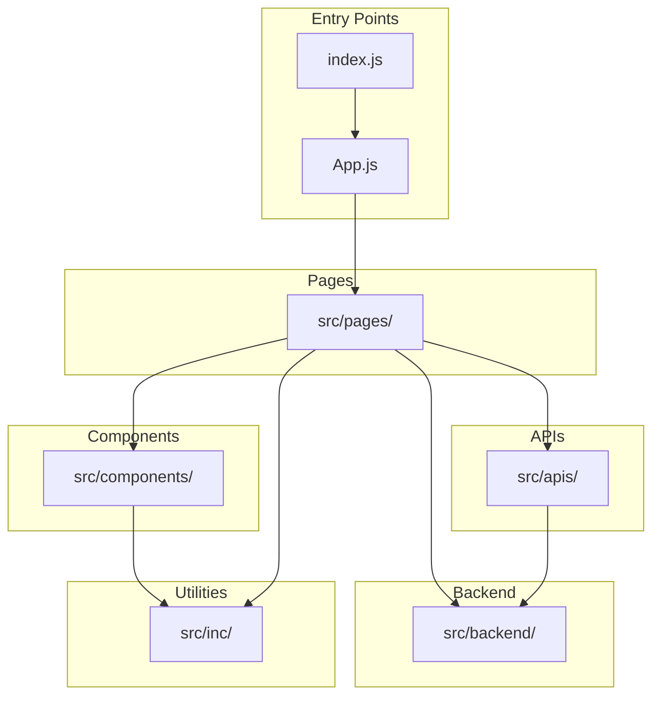

# Awesome Weather Application

(Probably the best, free, and open-source weather app out there)

## A React application built with modern technologies

### Application Features

1. Track the atmospheric conditions of any country or city.
2. Automatically track the weather of any saved location.
3. Customize settings to fit your preferences.
4. Works offline.
5. Predicts the weather for any geographical area up to 5 days ahead with 3-hour intervals.
6. Free and open-source.
7. Built using modern UI technologies.
8. Cross-platform compatibility.
9. Built on PWA technology.

---

## Project Structure

```
react-weather-app/
├── public/                    # PWA configuration and static assets
│   ├── index.html             # SPA shell and React mount point
│   ├── manifest.json          # PWA web app manifest
│   └── robots.txt             # Search engine crawler directives
├── scripts/                   # Development and deployment shell scripts
│   ├── deliver-for-development.sh
│   ├── deploy-for-production.sh
│   ├── kill.sh
│   └── test.sh
├── src/                       # Source code
│   ├── apis/                  # Weather API integration layer
│   │   ├── getCurrentWeather.js
│   │   ├── getGeolocation.js
│   │   └── getWeatherForecast.js
│   ├── assets/                # Images and icon assets
│   │   └── static/            # Weather condition icons (SVG)
│   ├── backend/               # LocalStorage persistence layer
│   │   ├── app_backend.js
│   │   ├── database.js
│   │   └── settings.js
│   ├── components/            # Reusable React UI components
│   │   ├── button.jsx
│   │   ├── footer.jsx
│   │   ├── footerNav.jsx
│   │   ├── spinner.jsx
│   │   └── ...                # Additional components
│   ├── fonts/                 # Custom font files
│   ├── inc/                   # Static scripts and styles
│   │   ├── scripts/           # Utility JavaScript
│   │   └── styles/            # CSS stylesheets
│   ├── pages/                 # Route-level page components
│   │   ├── 404.jsx
│   │   ├── ForecastWeather.jsx
│   │   ├── Home.jsx
│   │   ├── Settings.jsx
│   │   ├── Support.jsx
│   │   ├── Weather.jsx
│   │   └── WeatherMain.jsx
│   ├── App.js                 # Root component with routing
│   ├── index.js               # Application entry point
│   ├── service-worker.js      # Workbox PWA service worker
│   └── serviceWorkerRegistration.js
├── package.json               # Project dependencies and scripts
└── README.md                  # This file
```

---

## Module Documentation

Detailed documentation for each module is available in the respective directories:

| Module | Path | Description |
|--------|------|-------------|
test corrupt PR
| APIs | [src/apis/](src/apis/README.md) | Weather API integration layer (OpenWeatherMap, API Ninjas) |
| Backend | [src/backend/](src/backend/README.md) | LocalStorage persistence layer and Database class |
| Components | [src/components/](src/components/README.md) | Reusable React UI components library |
| Pages | [src/pages/](src/pages/README.md) | Route-level page components |
| Inc | [src/inc/](src/inc/README.md) | Static utility scripts and CSS stylesheets |
| Assets | [src/assets/](src/assets/README.md) | Images, icons, and weather condition SVGs |
| Scripts | [scripts/](scripts/README.md) | Shell helper scripts for development and deployment |
| Public | [public/](public/README.md) | PWA configuration and static HTML shell |

---

## Installation & Setup

### Prerequisites

- Node.js (v14 or higher recommended)
- npm (v6 or higher)

### Install Dependencies

```bash
npm install --legacy-peer-deps
```

> **Note**: The `--legacy-peer-deps` flag is required due to peer dependency conflicts in some packages.

### Development Server

Start the development server with hot-reload:

```bash
npm run start
```

The application will be available at `http://localhost:3000`.

### Production Build

Create an optimized production build:

```bash
npm run build
```

The build output will be in the `build/` directory.

### Run Tests

Execute the test suite:

```bash
npm run test
```

---

## Development

### Available Commands

| Command | Description |
|---------|-------------|
| `npm run start` | Start development server with hot-reload |
| `npm run build` | Create production-optimized build |
| `npm run test` | Run Jest test suite |
| `npm run eject` | Eject from Create React App (one-way operation) |

### Development Scripts

Shell scripts are available in the `scripts/` directory for common workflows:

```bash
# Development build with xtrace output
./scripts/deliver-for-development.sh

# Production deployment (builds and starts serve on port 5000)
./scripts/deploy-for-production.sh

# Stop the running server
./scripts/kill.sh
```

See [scripts/README.md](scripts/README.md) for detailed script documentation.

---

## Architecture

### Module Dependency Diagram



### Data Flow

1. **Entry Point**: `index.js` bootstraps the React application and registers the service worker
2. **Routing**: `App.js` configures React Router routes and determines initial landing page
3. **Pages**: Route components fetch data from APIs and manage page-level state
4. **APIs**: Integration layer handles weather data fetching from OpenWeatherMap
5. **Backend**: Database class provides localStorage persistence for offline access
6. **Components**: Reusable UI elements render weather data and handle user interactions

---

## Environment Configuration

### API Keys

⚠️ **Security Warning**: API keys are currently hard-coded in source files for development convenience. This is not recommended for production deployments.

**Current hard-coded keys:**
- OpenWeatherMap API key in `src/apis/getCurrentWeather.js` and `src/apis/getWeatherForecast.js`
- API Ninjas key in `src/apis/getCurrentWeather.js` (findCity function)

**Recommended Production Setup:**

1. Create a `.env` file in the project root:
   ```env
   REACT_APP_OPENWEATHER_API_KEY=your_openweathermap_api_key
   REACT_APP_API_NINJAS_KEY=your_api_ninjas_key
   ```

2. Access environment variables in code:
   ```javascript
   const API_KEY = process.env.REACT_APP_OPENWEATHER_API_KEY;
   ```

3. Add `.env` to `.gitignore` to prevent committing secrets:
   ```
   # Environment variables
   .env
   .env.local
   ```

> **Note**: Create React App automatically loads environment variables prefixed with `REACT_APP_`.

---

## Technologies Used

- **React JS** [User Interface, Application Logic]
- **Bootstrap** [User Interface]
- **jQuery AJAX** [API Requests]
- **Workbox** [Service Worker, PWA Caching]
- **SweetAlert2** [Toast Notifications]
- **Framer Motion** [Animations]

---

## Contributing

Contributions are welcome! Here's how you can help:

1. **Fork** the repository
2. **Create** a feature branch (`git checkout -b feature/amazing-feature`)
3. **Commit** your changes (`git commit -m 'Add some amazing feature'`)
4. **Push** to the branch (`git push origin feature/amazing-feature`)
5. **Open** a Pull Request

### Guidelines

- Follow existing code style and conventions
- Add comments for complex logic
- Update documentation for new features
- Test your changes before submitting

---

### Live Link

[Visit the live application](https://zedd-weather.vercel.app)

---

### Support

Please support by starring this project. Follow me for more cool open-source projects.

[GitHub - adedoyin-emmanuel](https://github.com/adedoyin-emmanuel/)
