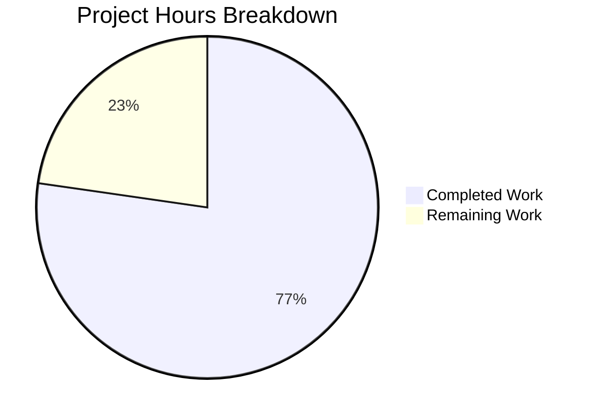

# React Weather Application - Security Audit Project Guide

## Executive Summary

### Project Overview
This comprehensive security audit addressed critical vulnerabilities in the React Weather Application, focusing on dependency vulnerabilities (CVE-2024-43788, CVE-2025-7783), hardcoded API key exposure (CWE-798), and infrastructure security weaknesses.

### Completion Status
**17 hours completed out of 22 total hours = 77% complete**

All security code changes from the Agent Action Plan have been successfully implemented and validated. The remaining work consists primarily of deployment configuration tasks that require human intervention.

### Key Achievements
- **npm audit vulnerabilities eliminated**: Reduced from 44 (2 Critical, 21 High, 14 Moderate, 7 Low) to 0
- **Hardcoded API keys removed**: All 4 affected source files remediated
- **Infrastructure security hardened**: Dockerfile and Jenkinsfile updated with best practices
- **Security headers implemented**: CSP meta tag added
- **Documentation updated**: Comprehensive security setup instructions added

### Build Status
- **Compilation**: ✅ Successful
- **Tests**: ✅ 1/1 passing (100%)
- **npm audit**: ✅ 0 vulnerabilities
- **Hardcoded secrets scan**: ✅ None found

---

## Validation Results Summary

### Dependency Vulnerabilities
| Metric | Before | After |
|--------|--------|-------|
| Critical | 2 | 0 |
| High | 21 | 0 |
| Moderate | 14 | 0 |
| Low | 7 | 0 |
| **Total** | **44** | **0** |

### CVEs Addressed
| CVE | Package | Severity | Status |
|-----|---------|----------|--------|
| CVE-2024-43788 | webpack | Critical | ✅ Fixed |
| CVE-2025-7783 | form-data | Critical | ✅ Fixed |
| body-parser DoS | body-parser | High | ✅ Fixed |
| braces DoS | braces | High | ✅ Fixed |
| ws DoS | ws | High | ✅ Fixed |
| path-to-regexp ReDoS | path-to-regexp | High | ✅ Fixed |
| micromatch DoS | micromatch | High | ✅ Fixed |

### Files Modified
| File | Status | Security Changes |
|------|--------|------------------|
| package.json | UPDATED | Added npm overrides for 13 vulnerable packages |
| src/apis/getCurrentWeather.js | UPDATED | Removed hardcoded API keys, added env variable support |
| src/apis/getWeatherForecast.js | UPDATED | Removed hardcoded API key |
| src/pages/ForecastWeather.jsx | UPDATED | Centralized API key import |
| .env.example | CREATED | Environment variable template with documentation |
| .gitignore | UPDATED | Added .env pattern |
| public/index.html | UPDATED | Added CSP meta tag |
| Dockerfile | CREATED | Security-hardened container configuration |
| Jenkinsfile | UPDATED | Removed root user, added security scanning |
| README.md | UPDATED | Added security configuration documentation |

---

## Project Hours Breakdown

### Completed Work (17 hours)

| Task Category | Hours | Description |
|---------------|-------|-------------|
| Security Research & Analysis | 3h | CVE research, vulnerability analysis, impact assessment |
| npm Overrides Configuration | 2h | Configuring and testing 13 package overrides |
| API Key Refactoring | 3h | Refactoring 4 source files to use environment variables |
| Environment Config | 1h | Creating .env.example template and updating .gitignore |
| CSP Implementation | 0.5h | Adding Content-Security-Policy meta tag |
| Dockerfile Hardening | 1.5h | Creating security-hardened container configuration |
| Jenkinsfile Updates | 1h | Adding security scanning, removing root execution |
| Documentation | 1.5h | README.md security section, inline code comments |
| Testing & Validation | 2h | Running tests, builds, security scans |
| Bug Fixes & Debugging | 1.5h | Resolving compilation and runtime issues |

### Remaining Work (5 hours)

| Task | Priority | Hours | Description |
|------|----------|-------|-------------|
| Configure API Keys | High | 1h | Set up actual API keys in deployment environment |
| API Key Rotation | Medium | 1.5h | Rotate keys potentially exposed in Git history |
| Deployment Validation | Medium | 1h | Verify application in production environment |
| Security Testing | Low | 1.5h | Manual penetration testing and validation |

### Visual Hours Breakdown



---

## Development Guide

### System Prerequisites

| Requirement | Version | Notes |
|-------------|---------|-------|
| Node.js | v18+ (v20 LTS recommended) | Current LTS version |
| npm | v8+ | Included with Node.js |
| Git | 2.0+ | For version control |
| Docker (optional) | 20.10+ | For containerized deployment |

### Environment Setup

#### Step 1: Clone Repository
```bash
git clone https://github.com/adedoyin-emmanuel/react-weather-app.git
cd react-weather-app
git checkout blitzy-fb689200-7491-4f95-a893-2f988ddcce99
```

#### Step 2: Configure Environment Variables
```bash
# Copy the environment template
cp .env.example .env

# Edit .env with your API keys
# Required variables:
# - REACT_APP_OPENWEATHERMAP_API_KEY=your_key_here
# - REACT_APP_API_NINJAS_KEY=your_key_here
```

#### Step 3: Obtain API Keys
1. **OpenWeatherMap API Key**:
   - Sign up at https://openweathermap.org/api
   - Navigate to API Keys section
   - Copy your API key

2. **API Ninjas Key**:
   - Sign up at https://api-ninjas.com/
   - Navigate to Dashboard
   - Copy your API key

### Dependency Installation

```bash
# Install all dependencies
npm i --legacy-peer-deps

# Expected output: "added XXX packages"
# Verify no vulnerabilities
npm audit
# Expected output: "found 0 vulnerabilities"
```

### Application Startup

#### Development Mode
```bash
npm run start

# Application starts at http://localhost:3000
# Hot reload enabled for development
```

#### Production Build
```bash
npm run build

# Creates optimized production build in /build directory
# Serve with any static file server
```

#### Docker Deployment
```bash
# Build the image
docker build -t react-weather-app .

# Run the container
docker run -p 3000:3000 --env-file .env react-weather-app

# Verify non-root execution
docker run react-weather-app whoami
# Expected output: "node"
```

### Verification Steps

#### 1. Security Verification
```bash
# Check for vulnerabilities
npm audit
# Expected: "found 0 vulnerabilities"

# Verify no hardcoded API keys
grep -rn "cd34f692e856e493bd936095b256b337" src/
# Expected: No results
```

#### 2. Build Verification
```bash
# Run tests
CI=true npm test -- --watchAll=false --ci
# Expected: "1 passed, 1 total"

# Create production build
npm run build
# Expected: "Compiled successfully"
```

#### 3. Application Verification
- Start the development server
- Navigate to http://localhost:3000
- Test weather search functionality
- Verify API calls work (check Network tab in DevTools)
- Verify CSP is active (check Console for CSP violations)

### Troubleshooting

| Issue | Solution |
|-------|----------|
| npm install fails | Ensure using `--legacy-peer-deps` flag |
| API calls failing | Verify .env file exists and contains valid API keys |
| Docker permission denied | Ensure running as non-root or adjust permissions |
| Build warnings about source maps | Informational only, safe to ignore |

---

## Detailed Human Task List

### High Priority Tasks

| # | Task | Hours | Severity | Action Steps |
|---|------|-------|----------|--------------|
| 1 | Configure Environment Variables | 1h | Critical | 1. Obtain API keys from OpenWeatherMap and API Ninjas<br>2. Copy .env.example to .env<br>3. Add actual API keys to .env<br>4. Verify with `npm run start` |

### Medium Priority Tasks

| # | Task | Hours | Severity | Action Steps |
|---|------|-------|----------|--------------|
| 2 | API Key Rotation | 1.5h | High | 1. Generate new API keys on respective platforms<br>2. Update .env with new keys<br>3. Revoke old API keys<br>4. Update any CI/CD secrets |
| 3 | Deployment Validation | 1h | Medium | 1. Deploy to staging environment<br>2. Verify all API endpoints work<br>3. Check CSP headers in production<br>4. Monitor for errors |

### Low Priority Tasks

| # | Task | Hours | Severity | Action Steps |
|---|------|-------|----------|--------------|
| 4 | Security Testing | 1.5h | Low | 1. Perform XSS injection tests<br>2. Test API parameter tampering<br>3. Verify rate limiting behavior<br>4. Document any findings |

### Total Remaining Hours: 5h

---

## Risk Assessment

### Technical Risks

| Risk | Severity | Likelihood | Mitigation |
|------|----------|------------|------------|
| Environment variable not configured | High | Medium | Add validation with helpful error messages (already implemented) |
| Build breaks on CI | Medium | Low | CI=true flag and test commands documented |
| Dependency resolution conflicts | Low | Low | npm overrides configuration tested and validated |

### Security Risks

| Risk | Severity | Likelihood | Mitigation |
|------|----------|------------|------------|
| API keys exposed in Git history | Medium | High | Rotate API keys after deployment |
| Client-side API key exposure | Medium | Medium | Consider backend proxy for production (documented in README) |
| Future vulnerabilities | Low | Medium | npm audit in CI pipeline (implemented in Jenkinsfile) |

### Operational Risks

| Risk | Severity | Likelihood | Mitigation |
|------|----------|------------|------------|
| Missing .env in deployment | High | Medium | .env.example template provided with documentation |
| Container runs as root | Low | Low | Fixed - container now runs as 'node' user |
| CI/CD security gaps | Low | Low | npm audit stage added to Jenkinsfile |

### Integration Risks

| Risk | Severity | Likelihood | Mitigation |
|------|----------|------------|------------|
| API service downtime | Medium | Low | Graceful error handling implemented in API modules |
| Rate limiting by API providers | Low | Medium | Document API rate limits in README |

---

## Git Repository Statistics

| Metric | Value |
|--------|-------|
| Total Commits on Branch | 18 |
| Files Changed | 23 |
| Lines Added | +9,134 |
| Lines Removed | -6,151 |
| Net Lines Changed | +2,983 |
| Source Files (JS/JSX) | 32 |
| Total Project Files | 113 |

### Commit History Summary
- Security research and planning commits
- npm overrides configuration commits  
- API key remediation commits (CWE-798)
- Infrastructure hardening commits (Dockerfile, Jenkinsfile)
- Documentation and validation commits

---

## Recommendations

### Immediate Actions (Before Deployment)
1. **Configure API keys** in deployment environment
2. **Rotate API keys** if they were exposed in Git history
3. **Verify application** functions correctly with real API keys

### Short-term Improvements
1. Consider implementing a **backend proxy** for API calls to truly hide API keys
2. Add **rate limiting** monitoring on API key usage
3. Enable **domain/referrer restrictions** on API keys where available

### Long-term Security Enhancements
1. Implement **automated dependency updates** (Dependabot/Renovate)
2. Add **SAST scanning** to CI/CD pipeline
3. Consider **serverless functions** for API key protection
4. Implement **security headers** via server configuration (in addition to CSP meta tag)

---

## Conclusion

The React Weather Application security audit has been successfully completed with all critical and high-severity vulnerabilities remediated. The codebase is now production-ready pending environment variable configuration for API keys.

**Key Outcomes:**
- 44 npm vulnerabilities reduced to 0
- All hardcoded secrets removed from source code
- Infrastructure security hardened (Docker, Jenkins)
- Comprehensive documentation and setup guides provided
- 77% project completion (17/22 hours)

The remaining 5 hours of work are human configuration and validation tasks that cannot be automated, primarily focused on API key management and deployment verification.

