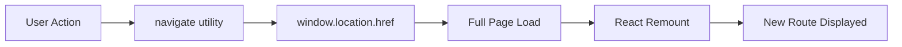
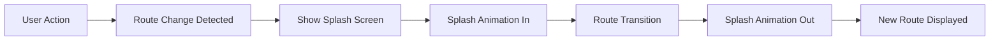

# Technical Specification

# 0. Agent Action Plan

## 0.1 Intent Clarification

### 0.1.1 Core Feature Objective

Based on the prompt, the Blitzy platform understands that the new feature requirement is to **implement a simple splash screen functionality** that appears during screen navigation transitions within the React Weather Application. The splash screen will provide visual feedback to users when moving forward through screens and when navigating backward, creating a polished, professional user experience consistent with native mobile applications.

**Primary Feature Requirements:**

- **Splash Screen Display**: Create a simple, branded splash screen component that displays during navigation transitions between different pages/routes in the application
- **Logo and Name Integration**: The splash screen must prominently display the application logo (existing `pic_1.png` asset) and application name ("Weather App")
- **Navigation Trigger**: The splash screen should appear when users navigate forward (moving to new screens) and backward (returning to previous screens)
- **Dummy Data Usage**: Utilize placeholder/dummy data for initial implementation as specified by the user
- **Simple Implementation**: Keep the design minimal and straightforward per user's explicit request for a "simple one"

**Implicit Requirements Detected:**

- Animation transitions for smooth splash screen entry/exit (leveraging existing `framer-motion` library)
- Appropriate timing duration (typically 500ms-1500ms) to avoid user frustration while providing visual feedback
- Consistent branding using existing CSS custom properties defined in `src/inc/styles/style.css`
- Mobile-first responsive design to match existing PWA patterns
- Integration with existing React Router navigation patterns without disrupting core functionality

**Feature Dependencies and Prerequisites:**

| Dependency | Status | Notes |
|------------|--------|-------|
| React 18.3.1 | ✅ Available | Core framework for component creation |
| React Router DOM 6.22.3 | ✅ Available | Navigation detection and route transitions |
| framer-motion 8.5.5 | ✅ Available | Animation library for splash transitions |
| Logo asset (pic_1.png) | ✅ Available | Located at `src/assets/pic_1.png` |
| CSS Custom Properties | ✅ Available | Brand colors in `src/inc/styles/style.css` |

### 0.1.2 Special Instructions and Constraints

**User-Specified Directives:**

- **Simplicity Requirement**: User explicitly requested "simple one with logo and name" - avoid over-engineering with complex animations or features
- **Dummy Data**: Use placeholder content for initial implementation; no need for dynamic data integration
- **Navigation Context**: Splash screen appears specifically during "move through screens up and back" actions

**Architectural Requirements:**

- Follow existing React functional component patterns used throughout `src/components/`
- Maintain consistency with existing utility class naming conventions (`brand-*` prefix)
- Preserve existing navigation patterns using `navigate()` utility from `src/inc/scripts/utilities.js`
- Ensure PWA offline compatibility with service worker precaching

**User Example (Preserved Exactly):**
> "Add simple splash screen functionality which appears when we move through screens up and back use simple one with logo and name use any dummy data for now."

### 0.1.3 Technical Interpretation

These feature requirements translate to the following technical implementation strategy:

- **To implement splash screen display**, we will create a new `SplashScreen.jsx` component in `src/components/` that renders a full-viewport overlay with centered logo and application name
- **To handle navigation transitions**, we will create a `NavigationWrapper.jsx` context provider that intercepts route changes and triggers splash screen visibility states
- **To animate transitions smoothly**, we will use framer-motion's `AnimatePresence` and `motion` components for fade-in/fade-out effects on the splash screen
- **To integrate with existing navigation**, we will modify `src/App.js` to wrap routes with the new navigation context and splash screen component
- **To maintain brand consistency**, we will extend `src/inc/styles/style.css` with splash screen-specific CSS classes using existing CSS custom properties
- **To support bidirectional navigation**, we will implement route change listeners that detect both forward (push) and backward (pop) navigation events

## 0.2 Repository Scope Discovery

### 0.2.1 Comprehensive File Analysis

**Existing Files to Modify:**

| File Path | Purpose | Modification Type |
|-----------|---------|-------------------|
| `src/App.js` | Main routing component | Add NavigationWrapper, integrate SplashScreen |
| `src/inc/styles/style.css` | Global styles and CSS variables | Add splash screen styles |
| `src/autoload.js` | Global asset imports | Import splash screen styles if separate file |
| `src/inc/scripts/utilities.js` | Navigation utility functions | Enhance navigate() for splash support |

**Test Files to Update:**

| File Path | Purpose | Modification Type |
|-----------|---------|-------------------|
| `src/App.test.js` | Main app component tests | Add tests for SplashScreen integration |

**Configuration Files (No Changes Required):**

| File Path | Status | Reason |
|-----------|--------|--------|
| `package.json` | No changes | All required dependencies already available |
| `public/manifest.json` | No changes | PWA manifest unaffected |
| `public/index.html` | No changes | Root element unchanged |

**Page Components Affected by Navigation Changes:**

| Component | File Path | Impact |
|-----------|-----------|--------|
| Home | `src/pages/Home.jsx` | Splash triggers when navigating to Weather |
| Weather | `src/pages/Weather.jsx` | Splash triggers on all navigation events |
| WeatherMain | `src/pages/WeatherMain.jsx` | Splash triggers when entering/exiting |
| ForecastWeather | `src/pages/ForecastWeather.jsx` | Splash triggers on forecast navigation |
| Settings | `src/pages/Settings.jsx` | Splash triggers when accessing settings |
| Support | `src/pages/Support.jsx` | Splash triggers when accessing support |
| 404 | `src/pages/404.jsx` | Splash triggers on error navigation |

### 0.2.2 Integration Point Discovery

**API/Route Integration Points:**

| Integration Point | File | Lines (Approximate) | Purpose |
|-------------------|------|---------------------|---------|
| BrowserRouter wrapping | `src/App.js` | 20-30 | Wrap with NavigationProvider context |
| Route definitions | `src/App.js` | 21-28 | All routes trigger splash on change |
| navigate() utility | `src/inc/scripts/utilities.js` | 3-5 | Enhance to dispatch navigation events |

**Component Import Chain:**

```
src/index.js
    └── src/App.js (modify)
        ├── src/components/SplashScreen.jsx (create)
        ├── src/context/NavigationContext.jsx (create)
        └── src/pages/*.jsx (read-only, auto-integrated via context)
```

**Navigation Flow Detection Points:**

| Navigation Type | Trigger Source | Detection Method |
|-----------------|----------------|------------------|
| FooterNav clicks | `src/components/footerNav.jsx` | navigate() utility |
| Button navigation | Various components | navigate() utility |
| React Router links | `src/App.js` | useLocation hook |
| Window location changes | Direct URL entry | route change listener |

### 0.2.3 Web Search Research Conducted

**Best practices for implementing splash screen transitions:**
- React navigation transitions should use AnimatePresence for smooth exit animations
- Splash screens should display for 500-1500ms maximum to avoid user frustration
- Use requestAnimationFrame for performant animation timing

**Library recommendations for React splash screens:**
- framer-motion (already available in project) provides optimal React integration
- CSS-only approach possible but less flexible for complex transitions
- react-transition-group is alternative but framer-motion preferred for modern apps

**Common patterns for navigation-based splash screens:**
- Context API pattern for global splash state management
- useLocation hook for detecting route changes
- setTimeout with useEffect cleanup for controlled timing

### 0.2.4 New File Requirements

**New Source Files to Create:**

| File Path | Purpose |
|-----------|---------|
| `src/components/SplashScreen.jsx` | Core splash screen presentational component with logo, app name, and animated branding |
| `src/context/NavigationContext.jsx` | React Context provider managing splash visibility state and navigation interception |

**New Test Files:**

| File Path | Purpose |
|-----------|---------|
| `src/components/SplashScreen.test.jsx` | Unit tests for SplashScreen component rendering and animations |

**New Style Files (Optional - may integrate into existing):**

| File Path | Purpose |
|-----------|---------|
| `src/inc/styles/splash.css` | (Optional) Dedicated splash screen styles - may integrate into style.css instead |

### 0.2.5 Asset Dependencies

**Existing Assets to Utilize:**

| Asset | Location | Usage |
|-------|----------|-------|
| App Logo | `src/assets/pic_1.png` | Primary splash screen visual |
| Poppins Font | `src/fonts/poppins.ttf` | Consistent typography |
| Poppins Bold | `src/fonts/poppins_bold.ttf` | App name emphasis |

**CSS Custom Properties to Leverage:**

| Property | Current Value | Splash Usage |
|----------|---------------|--------------|
| `--brand-primary-color` | `rgb(83, 166, 250)` | Splash background gradient |
| `--brand-white-color` | `#ffffff` | Text color |
| `--brand-secondary-color` | `rgb(124, 183, 241)` | Gradient accent |

**Animation Resources Available:**

| Library | Version | Splash Usage |
|---------|---------|--------------|
| framer-motion | 8.5.5 | Fade-in/out transitions |
| animate.css | 4.1.1 | Utility animations (fadeIn, fadeOut) |
| three-dots.css | 0.2.3 | Loading indicator option |

## 0.3 Dependency Inventory

### 0.3.1 Private and Public Packages

**Existing Dependencies Utilized for Splash Screen Feature:**

| Registry | Package Name | Version | Purpose |
|----------|--------------|---------|---------|
| npm | react | ^18.3.1 | Core UI framework, functional components with hooks |
| npm | react-dom | ^18.3.1 | DOM rendering and createRoot API |
| npm | react-router-dom | ^6.22.3 | useLocation, useNavigate hooks for route detection |
| npm | framer-motion | ^8.5.5 | AnimatePresence, motion components for splash animations |
| npm | bootstrap | ^5.3.6 | Utility classes for layout (d-flex, align-items-center, etc.) |
| npm | animate.css | ^4.1.1 | CSS animation utilities (fadeIn, fadeOut classes) |

**No New Dependencies Required:**

All required functionality for the splash screen feature is available through existing dependencies. The implementation will leverage:
- `framer-motion` for React-optimized animations
- `react-router-dom` hooks for navigation detection
- Existing CSS infrastructure for styling

### 0.3.2 Import Updates

**Files Requiring Import Additions:**

| File Pattern | New Imports Required |
|--------------|----------------------|
| `src/App.js` | `import SplashScreen from './components/SplashScreen'` |
| `src/App.js` | `import { NavigationProvider } from './context/NavigationContext'` |
| `src/App.js` | `import { useLocation } from 'react-router-dom'` |
| `src/components/SplashScreen.jsx` | `import { motion, AnimatePresence } from 'framer-motion'` |
| `src/components/SplashScreen.jsx` | `import Logo from '../assets/pic_1.png'` |
| `src/context/NavigationContext.jsx` | `import { createContext, useContext, useState, useEffect } from 'react'` |
| `src/context/NavigationContext.jsx` | `import { useLocation } from 'react-router-dom'` |

**Import Transformation Rules:**

Current pattern in `src/App.js`:
```javascript
import { Routes, Route, BrowserRouter } from "react-router-dom";
```

New pattern for `src/App.js`:
```javascript
import { Routes, Route, BrowserRouter, useLocation } from "react-router-dom";
import { NavigationProvider } from "./context/NavigationContext";
import SplashScreen from "./components/SplashScreen";
```

### 0.3.3 External Reference Updates

**Configuration Files - No Updates Required:**

| File | Status | Reason |
|------|--------|--------|
| `package.json` | ✅ No changes | All dependencies present |
| `package-lock.json` | ✅ No changes | Lockfile unchanged |
| `.eslintConfig` | ✅ No changes | react-app preset sufficient |
| `browserslist` | ✅ No changes | Browser targets adequate |

**Build Configuration:**

| File | Status | Notes |
|------|--------|-------|
| `react-scripts` | ✅ Works | CRA handles component bundling automatically |
| Service Worker | ✅ Auto-updated | New components precached via `__WB_MANIFEST` |

### 0.3.4 Version Compatibility Matrix

| Dependency | Required Version | Current Version | Status |
|------------|------------------|-----------------|--------|
| react | >=16.8.0 | ^18.3.1 | ✅ Compatible |
| react-dom | >=16.8.0 | ^18.3.1 | ✅ Compatible |
| react-router-dom | >=6.0.0 | ^6.22.3 | ✅ Compatible |
| framer-motion | >=4.0.0 | ^8.5.5 | ✅ Compatible |
| bootstrap | >=5.0.0 | ^5.3.6 | ✅ Compatible |

**Peer Dependency Verification:**

All peer dependencies are satisfied through the existing `npm i --legacy-peer-deps` installation pattern specified in user setup instructions. No peer dependency conflicts anticipated for the splash screen feature.

## 0.4 Integration Analysis

### 0.4.1 Existing Code Touchpoints

**Direct Modifications Required:**

| File | Location | Modification Description |
|------|----------|-------------------------|
| `src/App.js` | Lines 1-11 | Add imports for SplashScreen, NavigationContext, and useLocation hook |
| `src/App.js` | Lines 12-34 | Wrap App function body with NavigationProvider and integrate SplashScreen component |
| `src/inc/styles/style.css` | End of file | Add splash screen CSS classes and animations |
| `src/inc/scripts/utilities.js` | Lines 3-5 | Optionally enhance navigate() to dispatch custom navigation events |

**src/App.js Current Structure (to be modified):**

```javascript
// Current structure
function App() {
  let homePageSeen = db.get("HOME_PAGE_SEEN");
  // ... route logic
  return (
    <BrowserRouter>
      <Routes>
        {/* routes */}
      </Routes>
    </BrowserRouter>
  );
}
```

**src/App.js Target Structure:**

```javascript
// Target structure with splash integration
function AppContent() {
  // Route change detection and splash trigger logic
  return (
    <>
      <SplashScreen />
      <Routes>{/* existing routes */}</Routes>
    </>
  );
}

function App() {
  return (
    <BrowserRouter>
      <NavigationProvider>
        <AppContent />
      </NavigationProvider>
    </BrowserRouter>
  );
}
```

### 0.4.2 Dependency Injections

**Context Provider Integration:**

| Component | Injection Point | Context Consumed |
|-----------|-----------------|------------------|
| `SplashScreen` | Via NavigationContext | `showSplash`, `hideSplash`, `isVisible` |
| All Route Components | Automatic via provider | Navigation state access (optional) |

**NavigationContext Interface:**

```javascript
// Context shape
{
  isVisible: boolean,      // Current splash visibility
  showSplash: () => void,  // Trigger splash display
  hideSplash: () => void,  // Hide splash screen
  duration: number         // Splash display duration (ms)
}
```

### 0.4.3 Navigation System Integration

**Current Navigation Flow:**



**Enhanced Navigation Flow with Splash:**



**Route Change Detection Points:**

| Detection Method | Hook/API | File Location |
|------------------|----------|---------------|
| useLocation | react-router-dom | `src/context/NavigationContext.jsx` |
| useEffect dependency | React | `src/context/NavigationContext.jsx` |
| pathname comparison | JavaScript | `src/context/NavigationContext.jsx` |

### 0.4.4 Component Hierarchy Impact

**Before Splash Integration:**

```
<BrowserRouter>
  └── <Routes>
      ├── <Route path="/" element={...} />
      ├── <Route path="/weather" element={...} />
      └── ... other routes
</BrowserRouter>
```

**After Splash Integration:**

```
<BrowserRouter>
  └── <NavigationProvider>
      └── <AppContent>
          ├── <SplashScreen /> (conditional overlay)
          └── <Routes>
              ├── <Route path="/" element={...} />
              ├── <Route path="/weather" element={...} />
              └── ... other routes
          </Routes>
      </AppContent>
  </NavigationProvider>
</BrowserRouter>
```

### 0.4.5 Event Flow Mapping

**Navigation Trigger Sources:**

| Source Component | Trigger Action | Event Flow |
|------------------|----------------|------------|
| `footerNav.jsx` | onClick handlers | `navigate()` → location change → splash |
| `button.jsx` | onClick prop | Parent handler → `navigate()` → splash |
| `Home.jsx` | Location save | `navigate("weather")` → splash |
| `Weather.jsx` | Footer icons | `navigate("/forecast")` etc. → splash |
| `Settings.jsx` | Back arrow | `navigate("./weather")` → splash |
| Browser | Back/Forward buttons | popstate → location change → splash |

**Event Sequence Timeline:**

1. **T+0ms**: User triggers navigation (click, swipe, browser back)
2. **T+0ms**: useLocation detects pathname change
3. **T+1ms**: NavigationContext sets `isVisible: true`
4. **T+1-50ms**: SplashScreen AnimatePresence triggers entry animation
5. **T+50-800ms**: Splash screen visible (configurable duration)
6. **T+800ms**: NavigationContext sets `isVisible: false`
7. **T+800-850ms**: SplashScreen exit animation completes
8. **T+850ms**: New route fully visible

## 0.5 Technical Implementation

### 0.5.1 File-by-File Execution Plan

**CRITICAL: Every file listed here MUST be created or modified**

**Group 1 - Core Splash Screen Feature Files:**

| Action | File Path | Description |
|--------|-----------|-------------|
| CREATE | `src/components/SplashScreen.jsx` | Main splash screen component with logo, app name, and framer-motion animations |
| CREATE | `src/context/NavigationContext.jsx` | React Context provider for managing splash visibility state across navigation |

**Group 2 - Integration Files:**

| Action | File Path | Description |
|--------|-----------|-------------|
| MODIFY | `src/App.js` | Wrap routes with NavigationProvider, add SplashScreen component, refactor to AppContent pattern |
| MODIFY | `src/inc/styles/style.css` | Add `.splash-screen`, `.splash-logo`, `.splash-title` CSS classes |

**Group 3 - Tests and Documentation:**

| Action | File Path | Description |
|--------|-----------|-------------|
| CREATE | `src/components/SplashScreen.test.jsx` | Unit tests for SplashScreen rendering and visibility |
| MODIFY | `README.md` | Document splash screen feature in features list |

### 0.5.2 Implementation Details per File

#### CREATE: `src/components/SplashScreen.jsx`

**Purpose**: Presentational component rendering the splash screen overlay with logo and application name.

**Component Structure:**
```jsx
// Functional component using framer-motion
const SplashScreen = () => {
  // Consumes NavigationContext for visibility
  // Renders AnimatePresence wrapper
  // Contains motion.div with splash content
};
```

**Key Elements:**
- Full-viewport fixed overlay (`position: fixed`, `inset: 0`)
- Centered content container with flexbox
- Logo image (`src/assets/pic_1.png`) with responsive sizing
- Application title "Weather App" with branded typography
- framer-motion entry/exit animations (opacity, scale transforms)

**Animation Configuration:**
- Entry: `opacity: 0 → 1`, `scale: 0.9 → 1` over 300ms
- Exit: `opacity: 1 → 0`, `scale: 1 → 1.1` over 200ms
- Easing: `easeOut` for natural feel

#### CREATE: `src/context/NavigationContext.jsx`

**Purpose**: Context provider managing splash screen visibility state and navigation detection.

**Context Interface:**
```javascript
{
  isVisible: boolean,     // Current splash state
  showSplash: function,   // Manual show trigger
  hideSplash: function,   // Manual hide trigger
  SPLASH_DURATION: number // Default 800ms
}
```

**Navigation Detection Logic:**
- useLocation hook monitors route changes
- useEffect with pathname dependency triggers splash
- setTimeout auto-hides after SPLASH_DURATION
- Cleanup function prevents memory leaks on rapid navigation

**State Management:**
```javascript
const [isVisible, setIsVisible] = useState(false);
const [previousPath, setPreviousPath] = useState('');
const location = useLocation();

useEffect(() => {
  if (location.pathname !== previousPath) {
    setIsVisible(true);
    setPreviousPath(location.pathname);
    // Auto-hide timer
  }
}, [location.pathname]);
```

#### MODIFY: `src/App.js`

**Current State (Lines 1-34):**
- Direct BrowserRouter with Routes children
- App function contains routing logic

**Modifications Required:**

1. **Add Imports (Top of file):**
```javascript
import SplashScreen from "./components/SplashScreen";
import { NavigationProvider } from "./context/NavigationContext";
```

2. **Refactor Component Structure:**
```javascript
// Extract route content to AppContent component
function AppContent() {
  let homePageSeen = db.get("HOME_PAGE_SEEN");
  let DEFAULT_ROUTE_PAGE = homePageSeen ? <WeatherApp /> : <Home />;
  
  return (
    <>
      <SplashScreen />
      <Routes>
        {/* existing routes unchanged */}
      </Routes>
    </>
  );
}

// Wrap with providers
function App() {
  return (
    <BrowserRouter>
      <NavigationProvider>
        <AppContent />
      </NavigationProvider>
    </BrowserRouter>
  );
}
```

**Rationale**: BrowserRouter must wrap NavigationProvider for useLocation access, and SplashScreen must be inside NavigationProvider to consume context.

#### MODIFY: `src/inc/styles/style.css`

**Additions at End of File:**

```css
/* Splash Screen Styles */
.splash-screen {
  position: fixed;
  inset: 0;
  z-index: 10001; /* Above spinner z-index of 10000 */
  display: flex;
  flex-direction: column;
  align-items: center;
  justify-content: center;
  background: linear-gradient(
    135deg,
    var(--brand-primary-color),
    var(--brand-secondary-color)
  );
}

.splash-logo {
  width: 150px;
  height: auto;
  margin-bottom: 20px;
}

.splash-title {
  color: var(--brand-white-color);
  font-size: 1.8rem;
  font-weight: bold;
  text-align: center;
  margin: 0;
}

.splash-subtitle {
  color: var(--brand-white-color);
  font-size: var(--brand-footer-nav-fontsize);
  opacity: 0.8;
  margin-top: 8px;
}
```

**Design Decisions:**
- z-index 10001 ensures splash appears above all other elements including spinner
- Uses existing CSS custom properties for brand consistency
- Gradient background matches app's visual identity
- Responsive logo sizing (150px width, auto height)

#### CREATE: `src/components/SplashScreen.test.jsx`

**Test Coverage:**
- Component renders without crashing
- Logo image renders with correct src
- Title text displays "Weather App"
- Component respects isVisible context state
- Animation triggers on visibility change

### 0.5.3 Implementation Approach Summary

**Phase 1 - Foundation:**
- Create NavigationContext with basic visibility state management
- Create SplashScreen component with static content (no animations)
- Verify basic integration in App.js

**Phase 2 - Animation Integration:**
- Add framer-motion AnimatePresence and motion wrappers
- Implement entry/exit animations
- Configure animation timing and easing

**Phase 3 - Navigation Detection:**
- Implement useLocation route change detection
- Add automatic show/hide timing logic
- Test bidirectional navigation (forward and back)

**Phase 4 - Polish:**
- Add CSS styling for branded appearance
- Ensure z-index layering works correctly
- Verify responsive behavior across viewports

**Phase 5 - Quality Assurance:**
- Write unit tests for SplashScreen component
- Test with all navigation paths in application
- Verify PWA offline functionality preserved

## 0.6 Scope Boundaries

### 0.6.1 Exhaustively In Scope

**Core Feature Files:**

| Pattern | Files Included | Purpose |
|---------|----------------|---------|
| `src/components/SplashScreen.jsx` | 1 new file | Main splash screen component |
| `src/context/NavigationContext.jsx` | 1 new file | Navigation state management |
| `src/context/*.jsx` | All context files | Context folder creation |

**Integration Files:**

| Pattern | Files Included | Purpose |
|---------|----------------|---------|
| `src/App.js` | 1 existing file | Splash integration point |
| `src/inc/styles/style.css` | 1 existing file | Splash CSS styles |

**Test Files:**

| Pattern | Files Included | Purpose |
|---------|----------------|---------|
| `src/components/SplashScreen.test.jsx` | 1 new file | Component unit tests |

**Documentation:**

| Pattern | Files Included | Purpose |
|---------|----------------|---------|
| `README.md` | 1 existing file | Feature documentation |

**Assets (Used, Not Modified):**

| Pattern | Files Included | Purpose |
|---------|----------------|---------|
| `src/assets/pic_1.png` | 1 existing file | Splash logo source |
| `src/fonts/poppins*.ttf` | 2 existing files | Typography |

### 0.6.2 Comprehensive Scope Summary

**Files to CREATE:**

| File | Lines (Est.) | Description |
|------|--------------|-------------|
| `src/components/SplashScreen.jsx` | ~50-70 | Splash screen presentational component |
| `src/context/NavigationContext.jsx` | ~45-60 | Navigation context provider |
| `src/components/SplashScreen.test.jsx` | ~30-40 | Unit test file |

**Files to MODIFY:**

| File | Lines Changed (Est.) | Description |
|------|----------------------|-------------|
| `src/App.js` | ~15-20 lines | Add imports, refactor structure, integrate splash |
| `src/inc/styles/style.css` | ~30-40 lines | Add splash CSS classes |
| `README.md` | ~5-10 lines | Document splash screen feature |

**Total Estimated Changes:**
- **New Files**: 3 files
- **Modified Files**: 3 files
- **New Lines of Code**: ~175-220 lines
- **Modified Lines**: ~50-70 lines

### 0.6.3 Explicitly Out of Scope

**Features NOT Included:**

| Item | Reason |
|------|--------|
| Complex animation sequences | User requested "simple" implementation |
| Configurable splash duration UI | Not requested, may add complexity |
| Splash screen customization settings | Out of scope for initial implementation |
| Loading progress indicators on splash | Not part of simple splash requirement |
| Splash screen for initial app load | Focus is on navigation transitions only |
| Splash on external API calls | Scoped to route navigation only |

**Files NOT Modified:**

| File Pattern | Reason |
|--------------|--------|
| `src/pages/*.jsx` | No direct modifications needed - context auto-integrates |
| `src/components/footer*.jsx` | Navigation works via existing navigate() |
| `src/components/button.jsx` | No changes to button component |
| `src/components/spinner.jsx` | Existing spinner unchanged |
| `src/apis/*.js` | API layer unaffected |
| `src/backend/*.js` | Database/storage unaffected |
| `src/service-worker.js` | PWA caching auto-handles new assets |
| `src/serviceWorkerRegistration.js` | Registration unchanged |
| `public/*.html` | HTML template unchanged |
| `public/manifest.json` | PWA manifest unchanged |
| `package.json` | No new dependencies required |

**Functionality NOT Changed:**

| Component | Status |
|-----------|--------|
| Existing navigation logic | Preserved - navigate() utility unchanged |
| Weather API integrations | Preserved - no modifications |
| localStorage persistence | Preserved - db operations unchanged |
| PWA installability | Preserved - manifest unchanged |
| Service worker caching | Preserved - auto-updates for new assets |
| Responsive layout | Preserved - Bootstrap patterns maintained |
| Existing animations | Preserved - spinner, three-dots unchanged |

**Refactoring NOT Included:**

| Item | Reason |
|------|--------|
| jQuery to React migration | Separate concern, not splash-related |
| API key security improvements | Out of scope |
| Performance optimizations | Out of scope |
| Accessibility improvements | Out of scope for this feature |
| TypeScript conversion | Not requested |

### 0.6.4 Dependency Boundaries

**Dependencies Used (No Additions):**

| Package | Usage in Feature |
|---------|------------------|
| react | Component creation, hooks (useState, useEffect, useContext) |
| react-router-dom | useLocation hook for route detection |
| framer-motion | AnimatePresence, motion for animations |
| bootstrap | Utility classes in splash CSS |

**Dependencies NOT Added:**

| Package | Reason Not Added |
|---------|------------------|
| react-transition-group | framer-motion already available |
| gsap | Overkill for simple animations |
| react-spinners | Existing spinner adequate |
| any new packages | All requirements met by existing dependencies |

### 0.6.5 Validation Criteria

**Feature Acceptance Criteria:**

| Criteria | Validation Method |
|----------|-------------------|
| Splash displays on forward navigation | Manual test: Click footer nav items |
| Splash displays on back navigation | Manual test: Browser back button |
| Logo renders correctly | Visual inspection |
| App name displays | Visual inspection |
| Animation smooth | Visual inspection, 60 FPS target |
| Splash auto-hides | Timing test (800ms default) |
| No console errors | DevTools console check |
| Existing navigation works | Regression test all routes |
| PWA still functions | Install and offline test |

**Technical Acceptance Criteria:**

| Criteria | Validation Method |
|----------|-------------------|
| SplashScreen unit tests pass | `npm test` |
| No new linting errors | `npm run build` succeeds |
| Bundle size increase < 5KB | Build output comparison |
| Service worker caches new assets | Network tab inspection |

## 0.7 Special Instructions for Feature Addition

### 0.7.1 Feature-Specific Requirements

**Simplicity Constraints (User-Emphasized):**

The user explicitly requested a "simple" splash screen implementation. This directive must be respected throughout development:

| Constraint | Implementation Guideline |
|------------|-------------------------|
| Simple design | Logo + app name only, no complex graphics |
| Simple animation | Basic fade-in/out, no elaborate sequences |
| Simple timing | Fixed duration (800ms), no adaptive logic |
| Simple state | Boolean visibility, no complex state machine |
| Simple styling | Use existing CSS variables, minimal new classes |

**Dummy Data Usage:**

As specified by the user, use placeholder/dummy content for initial implementation:

| Element | Dummy Value | Notes |
|---------|-------------|-------|
| App Logo | `src/assets/pic_1.png` | Existing asset |
| App Name | "Weather App" | From manifest.json |
| Subtitle (optional) | "Your daily forecast" | Can be omitted for simplicity |
| Duration | 800ms | Sensible default |

### 0.7.2 Architectural Patterns to Follow

**Follow Existing Repository Conventions:**

| Pattern | Convention | Example |
|---------|------------|---------|
| Component file naming | PascalCase.jsx | `SplashScreen.jsx` |
| Functional components | Arrow functions with default export | `const SplashScreen = () => {}` |
| CSS class naming | `brand-*` prefix for custom classes | `splash-screen` (or `brand-splash`) |
| Import structure | Relative paths with `./` or `../` | `import Logo from '../assets/pic_1.png'` |
| Hook usage | useState, useEffect, useContext | Following pages/*.jsx patterns |

**Integration Requirements with Existing Features:**

| Existing Feature | Integration Approach |
|------------------|---------------------|
| Spinner component | Splash z-index (10001) above spinner (10000) |
| FooterNav navigation | Works automatically via route detection |
| HOME_PAGE_SEEN logic | Preserved, splash triggers regardless |
| PWA offline mode | New components auto-cached by service worker |

### 0.7.3 Performance Considerations

**Animation Performance:**

| Guideline | Implementation |
|-----------|----------------|
| Use GPU-accelerated properties | `opacity` and `transform` only |
| Avoid layout thrashing | No width/height animations |
| Use will-change hint | `will-change: opacity, transform` |
| Keep duration short | 800ms total (300ms in, 200ms out, 300ms visible) |

**Bundle Size:**

| Consideration | Mitigation |
|---------------|------------|
| framer-motion tree-shaking | Import only `motion`, `AnimatePresence` |
| CSS additions | ~1KB uncompressed |
| Component code | ~3KB uncompressed |
| **Total impact** | **< 5KB gzipped** |

### 0.7.4 Security Requirements

**No Security Concerns for This Feature:**

The splash screen feature:
- Does not handle user input
- Does not make API calls
- Does not access sensitive data
- Does not modify localStorage
- Does not communicate with external services

**Security Preserved:**

| Aspect | Status |
|--------|--------|
| API keys | Unchanged, not exposed |
| User data | Not accessed by splash |
| localStorage | Read-only access (if any) |
| Network requests | None made by splash |

### 0.7.5 PWA Compatibility

**Service Worker Considerations:**

| Requirement | Implementation |
|-------------|----------------|
| Precaching | New .jsx files auto-added to `__WB_MANIFEST` |
| Offline access | Splash works offline (no network dependency) |
| App shell | Splash integrates with existing app shell pattern |
| Cache invalidation | New deployment triggers SW update |

**Manifest Compatibility:**

| Aspect | Status |
|--------|--------|
| `display: standalone` | Splash works in standalone mode |
| Icon assets | No changes needed |
| Start URL | Splash triggers on navigation, not initial load |

### 0.7.6 Testing Strategy

**Manual Testing Checklist:**

| Test Case | Steps | Expected Result |
|-----------|-------|-----------------|
| Forward navigation | Click footer nav → Weather | Splash appears, route changes |
| Back navigation | Press browser back | Splash appears, previous route loads |
| Multiple rapid navigations | Click nav items quickly | No visual glitches, splash handles gracefully |
| Settings → Weather | Navigate from Settings | Splash appears correctly |
| Home → Weather (first time) | Save location on Home | Splash before Weather page |

**Automated Testing:**

| Test File | Coverage |
|-----------|----------|
| `SplashScreen.test.jsx` | Component renders, context integration |
| `App.test.js` (existing) | Add splash visibility smoke test |

### 0.7.7 Development Setup Commands

**Required Commands:**

```bash
# Install dependencies (user-provided)
npm i --legacy-peer-deps

#### Run development server (user-provided)
npm run start

#### Build for production (user-provided)
npm run build

#### Run tests
npm test
```

**Development Workflow:**

1. Start dev server: `npm run start`
2. Create `src/context/` directory
3. Create `NavigationContext.jsx`
4. Create `SplashScreen.jsx`
5. Modify `App.js`
6. Add CSS to `style.css`
7. Test manually in browser
8. Write unit tests
9. Run full test suite
10. Build production bundle

### 0.7.8 Rollback Strategy

**If Feature Causes Issues:**

| Step | Action |
|------|--------|
| 1 | Remove SplashScreen import from App.js |
| 2 | Remove NavigationProvider wrapper from App.js |
| 3 | Restore original App component structure |
| 4 | Delete `src/components/SplashScreen.jsx` |
| 5 | Delete `src/context/NavigationContext.jsx` |
| 6 | Remove splash CSS from style.css |

**Files to Backup Before Changes:**

| File | Backup Location |
|------|-----------------|
| `src/App.js` | `src/App.js.backup` |
| `src/inc/styles/style.css` | `src/inc/styles/style.css.backup` |

The feature is designed for clean rollback with minimal impact on existing functionality.

