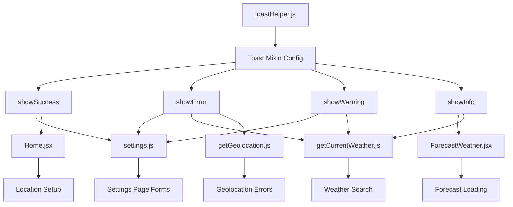
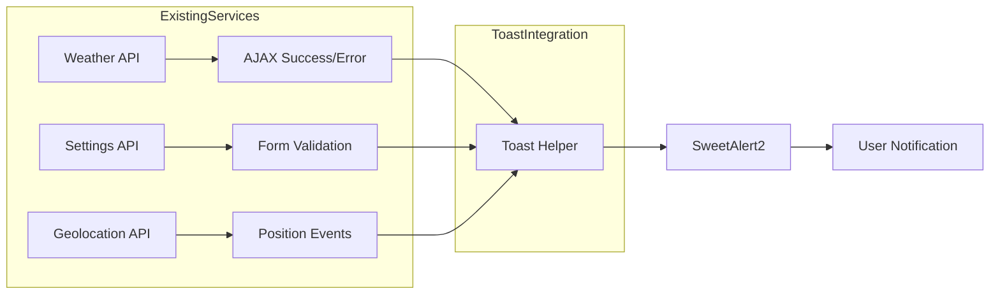

# Technical Specification

# 0. Agent Action Plan

## 0.1 Intent Clarification

### 0.1.1 Core Feature Objective

Based on the prompt, the Blitzy platform understands that the new feature requirement is to **add small, lightweight toast notifications and alerts to the existing React Weather Application** with the following specifications:

- **Minimal Footprint**: Implement toast/alert functionality with minimal code changes to the existing codebase
- **UI Consistency**: Ensure the new alerts and toasts blend seamlessly with the existing Bootstrap-based UI design
- **Non-Intrusive**: Keep notifications small, brief, and dismissible
- **Reuse Existing Library**: Leverage the already-installed SweetAlert2 library (v11.12.1) for implementation
- **Form Validation Feedback**: Based on the attached images showing form validation errors (red borders on input fields with messages like "Enter valid Exp Date" and "Enter valid Code"), provide enhanced toast notifications for validation states

**Implicit Requirements Detected**:
- Create a centralized toast utility module to standardize notification patterns across the application
- Maintain consistency with existing Swal patterns (position: "top", toast: true, timer-based dismissal)
- Support for validation feedback on form inputs (success, warning, error states)
- Match the brand color scheme: primary color `rgb(83, 166, 250)`, white `#ffffff`

**Feature Dependencies and Prerequisites**:
- SweetAlert2 v11.12.1 (already installed and configured)
- Bootstrap 5.3.6 (already present for styling)
- Existing toast patterns in `src/apis/*.js` and `src/backend/settings.js`

### 0.1.2 Special Instructions and Constraints

**Critical Directives from User**:
- "minimal details and minimal code change" - Keep modifications to absolute minimum
- "no larger changes" - Avoid architectural refactoring
- "something which fits with UI" - Match existing visual language

**Architectural Requirements**:
- Follow existing SweetAlert2 usage patterns found in the codebase
- Use the established toast configuration: `{ toast: true, position: "top", showConfirmButton: false, timer: 2000-3000 }`
- Integrate with existing jQuery-based DOM manipulation patterns where applicable

**User Example - Form Validation Scenario**:
The attached image shows credit card form validation with:
- Input fields with red borders (`border-color: red`)
- Error text displayed below: "Enter valid Exp Date", "Enter valid Code"
- This indicates the need for validation toast notifications that complement inline error messages

### 0.1.3 Technical Interpretation

These feature requirements translate to the following technical implementation strategy:

- **To standardize toast notifications**, we will create a lightweight toast utility module at `src/utils/toastHelper.js` that exports pre-configured toast functions
- **To provide validation feedback**, we will add toast notifications to existing form handlers in `src/backend/settings.js` and `src/pages/*.jsx`
- **To maintain minimal code changes**, we will create a reusable `Swal.mixin()` configuration that can be imported and used with one-liner calls
- **To ensure UI consistency**, we will use the existing brand colors (`--brand-primary-color`, `--brand-white-color`) and Bootstrap utility classes
- **To enhance user experience**, we will add toasts for: successful operations, validation errors, network errors, and informational messages

| Requirement | Technical Action | Target Files |
|-------------|------------------|--------------|
| Centralized toast system | Create `toastHelper.js` utility module | `src/utils/toastHelper.js` (new) |
| Validation feedback | Add toast calls to form handlers | `src/backend/settings.js`, `src/pages/Home.jsx` |
| Consistent styling | Use existing CSS variables and patterns | `src/inc/styles/style.css` |
| Minimal changes | Leverage existing SweetAlert2 setup | No new dependencies required |


## 0.2 Repository Scope Discovery

## 0.2 Repository Scope Discovery

### 0.2.1 Comprehensive File Analysis

**Existing Modules Requiring Modification**:

| File Path | Purpose | Modification Type |
|-----------|---------|-------------------|
| `src/backend/settings.js` | Settings form handlers with existing Swal usage | MODIFY - Import and use new toast helper |
| `src/apis/getCurrentWeather.js` | Weather API with existing toast patterns | MODIFY - Refactor to use centralized toast helper |
| `src/apis/getGeolocation.js` | Geolocation with toast error handling | MODIFY - Refactor to use centralized toast helper |
| `src/pages/Home.jsx` | Home page with location modal | MODIFY - Add validation toasts |
| `src/pages/Settings.jsx` | Settings page forms | MODIFY - Enhanced form validation toasts |
| `src/pages/ForecastWeather.jsx` | Forecast page with existing toasts | MODIFY - Use centralized toast helper |

**Configuration and Styling Files**:

| File Path | Purpose | Modification Type |
|-----------|---------|-------------------|
| `src/inc/styles/style.css` | Main application styles | MODIFY - Add minimal toast customization classes (optional) |
| `src/autoload.js` | Asset autoloader | NO CHANGE - SweetAlert2 already imported per-file |

**Integration Point Discovery**:

- **API Error Handling**: `src/apis/getCurrentWeather.js` (lines 67-77, 114-158, 247-292)
- **Settings Validation**: `src/backend/settings.js` (lines 16-24, 27-34, 57-64)
- **Home Page Modal**: `src/pages/Home.jsx` (lines 36-53)
- **Forecast Errors**: `src/pages/ForecastWeather.jsx` (lines 51-60, 81-100)
- **Geolocation Errors**: `src/apis/getGeolocation.js` (lines 14-26, 48-59, 69-80)

### 0.2.2 New File Requirements

**New Source Files to Create**:

| File Path | Purpose | Content Description |
|-----------|---------|---------------------|
| `src/utils/toastHelper.js` | Centralized toast utility | Pre-configured Swal.mixin() exports for success, error, warning, info toasts |

**File Structure for Toast Helper**:
```javascript
// src/utils/toastHelper.js
import Swal from "sweetalert2";
export const Toast = Swal.mixin({...});
export const showSuccess = (msg) => {...};
export const showError = (msg) => {...};
```

### 0.2.3 Existing Toast Pattern Analysis

The codebase already implements consistent toast patterns that the new utility will standardize:

**Current Pattern in `src/backend/settings.js`**:
```javascript
Swal.fire({
  text: "Location updated successfully!",
  icon: "success",
  toast: true,
  position: "top",
  showConfirmButton: false,
  timer: 3000,
});
```

**Current Pattern in `src/apis/getCurrentWeather.js`**:
```javascript
Swal.fire({
  toast: true,
  text: "Network Error!",
  icon: "info",
  timer: 1000,
  position: "top",
  showConfirmButton: false,
});
```

### 0.2.4 Files Explicitly Unchanged

The following files will **NOT** be modified (out of scope):

| File Path | Reason |
|-----------|--------|
| `src/components/*.jsx` | No toast-related functionality |
| `src/App.js` | Routing only, no notifications |
| `src/index.js` | Bootstrap only |
| `src/service-worker.js` | PWA service worker |
| `package.json` | No new dependencies needed |
| `public/*` | Static assets only |
| `scripts/*` | Deployment scripts |


## 0.3 Dependency Inventory

## 0.3 Dependency Inventory

### 0.3.1 Private and Public Packages

The implementation leverages **existing dependencies only** - no new packages are required, aligning with the user's request for minimal changes.

| Package Registry | Name | Version | Purpose |
|-----------------|------|---------|---------|
| npm (public) | sweetalert2 | ^11.12.1 | Toast/alert notifications - **ALREADY INSTALLED** |
| npm (public) | bootstrap | ^5.3.6 | UI styling for toast customization - **ALREADY INSTALLED** |
| npm (public) | jquery | ^3.7.1 | DOM manipulation in existing handlers - **ALREADY INSTALLED** |
| npm (public) | react | ^18.3.1 | React framework - **ALREADY INSTALLED** |
| npm (public) | react-dom | ^18.3.1 | React DOM - **ALREADY INSTALLED** |

### 0.3.2 SweetAlert2 Verification

SweetAlert2 is confirmed installed and functional:

```bash
$ npm list sweetalert2
react-weather-app@0.1.0
└── sweetalert2@11.12.1
```

**SweetAlert2 Features to Utilize**:
- `Swal.mixin()` - Create reusable toast configurations
- `Swal.fire()` - Display toast notifications
- Toast positioning: `top`, `top-end`, `bottom`, `bottom-end`
- Built-in icons: `success`, `error`, `warning`, `info`, `question`
- Timer-based auto-dismiss
- Progress bar option via `timerProgressBar: true`

### 0.3.3 Dependency Updates (Not Required)

**Import Updates**: No import changes are necessary for dependencies. The new toast helper module will use the same import patterns already established in the codebase.

**Existing Import Pattern** (to be maintained):
```javascript
import Swal from "sweetalert2";
```

**New Import Pattern** (to be added in consuming files):
```javascript
import { showSuccess, showError, showWarning } from "../utils/toastHelper";
```

### 0.3.4 External Reference Updates

No external reference updates are required:

| File Category | Status | Reason |
|--------------|--------|--------|
| `package.json` | NO CHANGE | No new dependencies |
| `package-lock.json` | NO CHANGE | No package modifications |
| `README.md` | OPTIONAL | May document toast usage |
| `.github/workflows/*` | NO CHANGE | No CI/CD changes needed |

### 0.3.5 Browser Compatibility

SweetAlert2 v11.x is compatible with the project's browserslist configuration:

```json
"browserslist": {
  "production": [">0.2%", "not dead", "not op_mini all"],
  "development": ["last 1 chrome version", "last 1 firefox version", "last 1 safari version"]
}
```

SweetAlert2 supports all major browsers including Chrome, Firefox, Safari, and Edge with no polyfills required.


## 0.4 Integration Analysis

## 0.4 Integration Analysis

### 0.4.1 Existing Code Touchpoints

**Direct Modifications Required**:

| File | Integration Point | Current State | Proposed Change |
|------|-------------------|---------------|-----------------|
| `src/backend/settings.js` | `saveLocation()` function (lines 16-36) | Inline Swal.fire() calls | Import and use `showError()`, `showSuccess()` |
| `src/backend/settings.js` | `trackSavedLocationWeather()` (lines 48-89) | Multiple inline Swal calls | Use `showSuccess()`, `showInfo()`, `showWarning()` |
| `src/backend/settings.js` | `changeWeatherUnit()` (lines 101-152) | Inline Swal.fire() calls | Use centralized toast helpers |
| `src/apis/getCurrentWeather.js` | `handleWeatherForm()` (lines 67-77) | Inline Swal.fire() | Use `showInfo()` helper |
| `src/apis/getCurrentWeather.js` | `findCity()` (lines 114-158) | Multiple error toasts | Use `showError()`, `showWarning()` |
| `src/apis/getCurrentWeather.js` | `getCurrentWeather()` (lines 247-295) | Network error toasts | Use centralized helpers |
| `src/apis/getGeolocation.js` | Error handlers (lines 14-26, 48-80) | Inline Swal.fire() | Use toast helpers |
| `src/pages/Home.jsx` | `click()` function (lines 21-64) | Modal + validation toast | Use `showSuccess()`, `showError()` |
| `src/pages/ForecastWeather.jsx` | `useEffect` error handling (lines 51-100) | Inline Swal.fire() | Use toast helpers |

### 0.4.2 Integration Flow Diagram



### 0.4.3 Existing Toast Configuration Pattern

The codebase uses a consistent configuration that the new helper will encapsulate:

| Property | Current Value | Purpose |
|----------|---------------|---------|
| `toast` | `true` | Enables toast mode |
| `position` | `"top"` | Top center positioning |
| `showConfirmButton` | `false` | No confirmation required |
| `timer` | `1000-3000` | Auto-dismiss timing |
| `icon` | Varies | Visual indicator type |

### 0.4.4 No Database/Schema Updates Required

This feature does not modify any data persistence:

| Aspect | Status |
|--------|--------|
| localStorage keys | NO CHANGE |
| Database class | NO CHANGE |
| Migrations | NOT APPLICABLE |

### 0.4.5 Service Integration Points

The toast helper will integrate with existing service patterns without modifying service architecture:




## 0.5 Technical Implementation

## 0.5 Technical Implementation

### 0.5.1 File-by-File Execution Plan

**CRITICAL**: Every file listed below MUST be created or modified as specified.

#### Group 1 - Core Toast Utility (Priority: Highest)

| Action | File Path | Description |
|--------|-----------|-------------|
| CREATE | `src/utils/toastHelper.js` | Centralized toast notification utility with pre-configured Swal.mixin |

**Toast Helper Implementation Approach**:
```javascript
// Core toast mixin configuration
const Toast = Swal.mixin({
  toast: true,
  position: "top",
  showConfirmButton: false,
  timerProgressBar: true,
});
```

#### Group 2 - Backend Integration (Priority: High)

| Action | File Path | Description |
|--------|-----------|-------------|
| MODIFY | `src/backend/settings.js` | Replace inline Swal.fire() with toast helper imports |

**Modification Points**:
- Line 3: Add import for toast helpers
- Lines 16-24: Replace `saveLocation()` Swal calls with `showError()` / `showSuccess()`
- Lines 57-64, 67-74, 79-86: Replace tracking toasts with helper functions
- Lines 118-126, 132-138, 142-148: Replace unit change toasts

#### Group 3 - API Layer (Priority: High)

| Action | File Path | Description |
|--------|-----------|-------------|
| MODIFY | `src/apis/getCurrentWeather.js` | Refactor toast calls to use centralized helper |
| MODIFY | `src/apis/getGeolocation.js` | Refactor error toasts to use helper |

**Modification Points for getCurrentWeather.js**:
- Line 4: Add toast helper import
- Lines 67-76: Replace info toast in `handleWeatherForm()`
- Lines 114-121, 135-145, 147-157: Replace error toasts in `findCity()`
- Lines 247-254, 269-279, 281-291: Replace error toasts in `getCurrentWeather()`

**Modification Points for getGeolocation.js**:
- Line 3: Add toast helper import
- Lines 14-25: Replace warning toast in error handler
- Lines 48-59, 69-80: Replace error toasts in AJAX handlers
- Lines 90-97: Replace geolocation not supported toast

#### Group 4 - Page Components (Priority: Medium)

| Action | File Path | Description |
|--------|-----------|-------------|
| MODIFY | `src/pages/Home.jsx` | Refactor modal validation toasts |
| MODIFY | `src/pages/ForecastWeather.jsx` | Refactor forecast error toasts |

**Modification Points for Home.jsx**:
- Line 7: Add toast helper import
- Lines 46-52: Replace success toast with `showSuccess()`
- Lines 36-44: Replace error handling with `showError()`

**Modification Points for ForecastWeather.jsx**:
- Line 14: Add toast helper import
- Lines 51-60: Replace "No saved location" toast with `showError()`
- Lines 81-91, 93-100: Replace network error toasts

### 0.5.2 Implementation Approach per File

| Phase | Action | Expected Outcome |
|-------|--------|------------------|
| 1 | Create toast helper utility | Centralized, reusable toast functions available |
| 2 | Update backend settings.js | Form validation toasts standardized |
| 3 | Update API modules | Network error toasts consistent |
| 4 | Update page components | Page-level notifications unified |
| 5 | Test all toast scenarios | Verified visual consistency |

### 0.5.3 Toast Helper Function Signatures

```javascript
// Function signatures for toastHelper.js
showSuccess(message, timer?)  // Success toast, default 2000ms
showError(message, timer?)    // Error toast, default 3000ms
showWarning(message, timer?)  // Warning toast, default 2500ms
showInfo(message, timer?)     // Info toast, default 2000ms
```

### 0.5.4 Refactoring Pattern

**Before (Current Implementation)**:
```javascript
Swal.fire({
  text: "Location saved!",
  icon: "success",
  toast: true,
  position: "top",
  showConfirmButton: false,
  timer: 3000,
});
```

**After (With Toast Helper)**:
```javascript
showSuccess("Location saved!", 3000);
```

This reduces toast implementation from 8 lines to 1 line per occurrence, achieving the user's goal of minimal code while maintaining full functionality.


## 0.6 Scope Boundaries

## 0.6 Scope Boundaries

### 0.6.1 Exhaustively In Scope

**New Files to Create**:
- `src/utils/toastHelper.js` - Central toast utility module

**Source Files to Modify** (using trailing wildcards where patterns apply):
- `src/backend/settings.js` - Settings form validation toasts
- `src/apis/getCurrentWeather.js` - Weather API error/info toasts
- `src/apis/getGeolocation.js` - Geolocation error toasts
- `src/pages/Home.jsx` - Home page modal validation toasts
- `src/pages/ForecastWeather.jsx` - Forecast loading error toasts

**Integration Points**:
| File | Lines | Purpose |
|------|-------|---------|
| `src/backend/settings.js` | 1-5 | Import statement addition |
| `src/backend/settings.js` | 16-36 | saveLocation() toast refactor |
| `src/backend/settings.js` | 48-90 | trackSavedLocationWeather() refactor |
| `src/backend/settings.js` | 101-152 | changeWeatherUnit() refactor |
| `src/apis/getCurrentWeather.js` | 1-5 | Import statement addition |
| `src/apis/getCurrentWeather.js` | 67-77 | handleWeatherForm() toast |
| `src/apis/getCurrentWeather.js` | 114-162 | findCity() error toasts |
| `src/apis/getCurrentWeather.js` | 247-295 | getCurrentWeather() error toasts |
| `src/apis/getGeolocation.js` | 1-5 | Import statement addition |
| `src/apis/getGeolocation.js` | 14-26 | Error handler toast |
| `src/apis/getGeolocation.js` | 48-80 | AJAX error toasts |
| `src/apis/getGeolocation.js` | 90-98 | Geolocation unsupported toast |
| `src/pages/Home.jsx` | 1-8 | Import statement addition |
| `src/pages/Home.jsx` | 36-53 | Location validation toasts |
| `src/pages/ForecastWeather.jsx` | 1-15 | Import statement addition |
| `src/pages/ForecastWeather.jsx` | 51-100 | Error handling toasts |

**Configuration Files**: 
- NONE - No configuration changes required

**Documentation**:
- `README.md` (optional) - Document toast utility usage

### 0.6.2 Explicitly Out of Scope

The following are **NOT** part of this implementation:

| Category | Items | Reason |
|----------|-------|--------|
| **Unrelated Features** | Weather data fetching logic | Not toast-related |
| **Unrelated Features** | PWA service worker | Not notification-related |
| **Unrelated Features** | Router configuration | No navigation changes |
| **Components** | `src/components/*.jsx` | No toast functionality needed |
| **Pages** | `src/pages/404.jsx` | No form validation |
| **Pages** | `src/pages/Settings.jsx` (JSX structure) | Only handler imports change |
| **Pages** | `src/pages/Support.jsx` | No toast requirements |
| **Pages** | `src/pages/Weather.jsx` | Uses existing patterns adequately |
| **Pages** | `src/pages/WeatherMain.jsx` | No toast requirements |
| **Performance** | Toast animation optimization | Beyond minimal requirements |
| **Refactoring** | jQuery removal | Major architectural change |
| **Refactoring** | Converting class to hooks | Beyond scope |
| **Styling** | Major CSS redesign | User requested minimal changes |
| **Testing** | Unit test creation | Not explicitly requested |
| **Dependencies** | Adding new npm packages | User wants minimal changes |
| **Build Config** | Webpack/CRA configuration | No changes needed |

### 0.6.3 Boundary Justification

| In Scope Decision | Justification |
|-------------------|---------------|
| Create toast helper | Centralizes 20+ Swal.fire() calls into reusable functions |
| Modify existing files | Refactors without changing functionality |
| No new dependencies | SweetAlert2 already installed and configured |
| No component changes | Components don't handle notifications |

| Out of Scope Decision | Justification |
|----------------------|---------------|
| No custom toast component | SweetAlert2 provides sufficient functionality |
| No animation changes | Current animations fit UI |
| No testing additions | Minimal change request |
| No CSS modifications | Existing styles sufficient |

### 0.6.4 Risk Assessment

| Risk | Mitigation |
|------|------------|
| Breaking existing toast behavior | Use same configuration as current inline calls |
| Import path issues | Use relative imports consistent with codebase |
| Timer inconsistencies | Document standard timers in helper |


## 0.7 Special Instructions

## 0.7 Special Instructions

### 0.7.1 Feature-Specific Requirements

**User-Emphasized Constraints**:

| Constraint | Implementation Approach |
|------------|------------------------|
| "minimal details" | Short, clear toast messages (max 30 characters) |
| "minimal code change" | Single utility file + import/call refactoring |
| "no larger changes" | No architectural modifications, no new components |
| "fits with UI" | Use existing brand colors and positioning |

**Integration Requirements with Existing Features**:
- Toast helper MUST use the same `position: "top"` as all current notifications
- Toast helper MUST maintain the `toast: true` mode for all notifications
- Timer durations should follow existing patterns: 1000-3000ms
- Icons should use SweetAlert2's built-in set: `success`, `error`, `warning`, `info`

### 0.7.2 Visual Consistency Requirements

Based on the existing UI analysis:

| Element | Specification |
|---------|---------------|
| Toast Position | Top center (matching existing pattern) |
| Toast Duration | 2000ms (success), 3000ms (error), 2000ms (info/warning) |
| Confirm Button | Hidden (`showConfirmButton: false`) |
| Progress Bar | Optional (`timerProgressBar: true` for errors) |
| Brand Color | `rgb(83, 166, 250)` for confirm buttons if shown |

### 0.7.3 Form Validation Context (From Attached Image)

The attached image shows form validation with:
- Red bordered inputs indicating validation errors
- Text messages: "Enter valid Exp Date", "Enter valid Code"

**Recommended Toast Integration**:
- When validation fails, show: `showError("Please check your input")`
- When validation succeeds, show: `showSuccess("Saved successfully")`
- Keep inline error messages as primary feedback, toasts as supplementary

### 0.7.4 Code Style Requirements

Follow existing codebase conventions:

```javascript
// Import pattern (maintain consistency)
import { showSuccess, showError } from "../utils/toastHelper";

// Usage pattern (single line)
showSuccess("Location saved!");
showError("Network error occurred");
```

### 0.7.5 Performance Considerations

| Aspect | Requirement |
|--------|-------------|
| Bundle Size | No increase (uses existing SweetAlert2) |
| Load Time | No impact (lazy loading maintained) |
| Memory | No additional overhead |
| Animations | Use SweetAlert2 defaults |

### 0.7.6 Security Considerations

| Concern | Mitigation |
|---------|------------|
| XSS in toast messages | Use `text` property (auto-escaped), not `html` |
| User input display | Sanitize any user input before displaying |

### 0.7.7 Development Commands

As specified by the user:

```bash
# Install dependencies
npm i --legacy-peer-deps

#### Run development server
npm run start

#### Build for production
npm run build
```

### 0.7.8 Output Requirements Summary

| Requirement | Status |
|-------------|--------|
| Comprehensive file identification | ✅ 7 files identified |
| Wildcard patterns for file groups | ✅ `src/apis/*.js`, `src/pages/*.jsx` |
| Every file has clear purpose | ✅ Documented in sections 0.2, 0.5 |
| All integration touchpoints mapped | ✅ Line-by-line in section 0.4, 0.5 |
| Configuration files included | ✅ None required (minimal change) |
| Documentation files included | ✅ README.md optional update |
| File-by-file execution approach | ✅ Detailed in section 0.5 |


