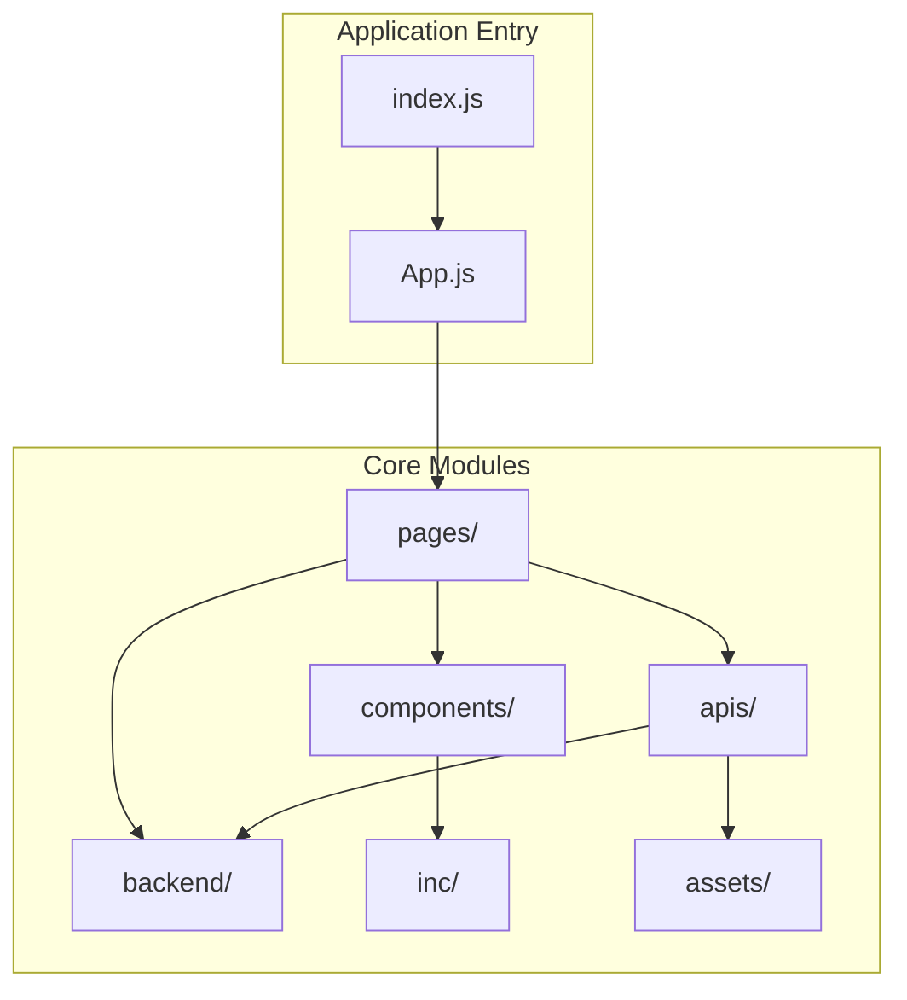
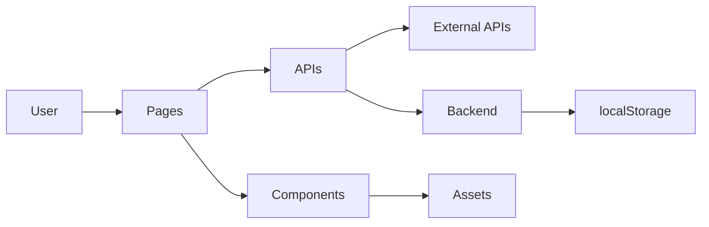
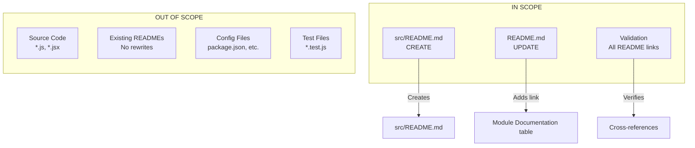

# Technical Specification

# 0. Agent Action Plan

## 0.1 Intent Clarification

Based on the provided requirements, the Blitzy platform understands that the documentation objective is to **enhance the existing module-wise README documentation structure** for the Awesome Weather Application to improve developer onboarding and codebase understanding.

### 0.1.1 Core Documentation Objective

**Request Category:** Update existing documentation | Improve documentation coverage

**Documentation Type:** README files | Developer guides | Module documentation

**User's Original Request:**
> "add module wise read me files for better control over understand and onboard new developers also reference those all readme to main readme file be detail specific and module oriented"

**Interpreted Requirements:**

- **Requirement 1:** Create or maintain module-wise README files for each significant code module
- **Requirement 2:** Ensure all module READMEs are properly referenced from the main README.md file
- **Requirement 3:** Make documentation detail-specific and module-oriented for better developer onboarding
- **Requirement 4:** Optimize documentation structure to help new developers understand and navigate the codebase efficiently

### 0.1.2 Special Instructions and Constraints

**Key Directives Identified:**
- Focus on module-oriented documentation structure
- Ensure cross-referencing between main README and all module READMEs
- Optimize content for new developer onboarding
- Maintain detailed, specific documentation per module

**Template Requirements:**
- Follow existing README.md patterns established in the repository
- Maintain consistent section structure across all module READMEs
- Use markdown formatting with code blocks, tables, and diagrams

**Style Preferences:**
- Technical accuracy with accessible language for onboarding
- Progressive disclosure (overview → details → examples)
- Clear module boundaries and responsibilities
- Consistent cross-referencing and navigation links

### 0.1.3 Technical Interpretation

These documentation requirements translate to the following technical documentation strategy:

| Requirement | Technical Action | Target Files |
|-------------|------------------|--------------|
| Module-wise README files | Verify and enhance existing module READMEs | `src/*/README.md`, `scripts/README.md`, `public/README.md` |
| Reference to main README | Update main README.md module documentation table | `README.md` |
| Detail-specific content | Ensure comprehensive API references, examples, and usage guides | All module READMEs |
| Module-oriented structure | Maintain clear module boundaries and responsibilities | All documentation files |

### 0.1.4 Inferred Documentation Needs

Based on repository analysis, the following implicit documentation needs have been identified:

**Already Well-Covered:**
- All major modules (`src/apis/`, `src/backend/`, `src/components/`, `src/pages/`, `src/inc/`, `src/assets/`, `scripts/`, `public/`) have comprehensive README.md files
- Main README.md already contains a Module Documentation table with links to all module READMEs
- Cross-references between modules are established

**Potential Enhancement Areas:**
- **src/ folder:** Could benefit from a top-level README.md providing source code organization overview
- **src/fonts/ folder:** Currently lacks documentation (minor asset folder)
- **Consistency audit:** Ensure all module READMEs follow identical structural patterns
- **Onboarding flow:** Add a "Getting Started for New Developers" section to main README

**Cross-Module Documentation:**
- Integration patterns between APIs and Backend modules
- Data flow documentation from Pages through APIs to Backend storage
- Component composition patterns and usage guidelines


## 0.2 Documentation Discovery and Analysis

### 0.2.1 Existing Documentation Infrastructure Assessment

Repository analysis reveals a **well-established documentation structure** with comprehensive module-level README files already in place. The documentation follows consistent patterns and provides substantial coverage for developer onboarding.

**Search Patterns Employed:**
- README files: `README.md`, `*/README.md`, `src/*/README.md`
- Documentation in root and all first-level subdirectories
- Cross-reference verification between main and module READMEs

**Documentation Files Discovered:**

| Location | Status | Purpose |
|----------|--------|---------|
| `README.md` | ✓ EXISTS | Main project documentation with module table |
| `src/apis/README.md` | ✓ EXISTS | Weather API integration documentation |
| `src/backend/README.md` | ✓ EXISTS | LocalStorage persistence layer documentation |
| `src/components/README.md` | ✓ EXISTS | React UI components documentation |
| `src/pages/README.md` | ✓ EXISTS | Route-level page components documentation |
| `src/inc/README.md` | ✓ EXISTS | Static scripts and styles documentation |
| `src/assets/README.md` | ✓ EXISTS | Images and icons documentation |
| `scripts/README.md` | ✓ EXISTS | Shell scripts documentation |
| `public/README.md` | ✓ EXISTS | PWA configuration documentation |

**Missing Documentation Identified:**

| Location | Status | Recommendation |
|----------|--------|----------------|
| `src/README.md` | ✗ MISSING | Create source code overview README |
| `src/fonts/README.md` | ✗ MISSING | Optional - minor asset folder |

### 0.2.2 Documentation Framework Analysis

**Current Documentation Framework:** Plain Markdown (no generator)

**Documentation Generator:** None detected (no mkdocs.yml, docusaurus.config.js, sphinx.conf.py)

**Diagram Tools Detected:**
- Mermaid diagrams used extensively in existing READMEs
- Flowcharts, sequence diagrams, and component hierarchies present

**Documentation Structure Pattern:**
```
├── README.md (Main)
│   ├── Overview
│   ├── Project Structure
│   ├── Module Documentation Table
│   ├── Installation & Setup
│   ├── Development Commands
│   ├── Architecture Diagrams
│   └── Contributing Guidelines
└── [module]/README.md
    ├── Overview
    ├── Files/Components Inventory
    ├── API Reference
    ├── Usage Examples
    ├── Dependencies
    └── Related Documentation
```

### 0.2.3 Repository Code Analysis for Documentation

**Key Directories with README Documentation:**

| Directory | Files Documented | Documentation Quality |
|-----------|-----------------|----------------------|
| `src/apis/` | 4 files (3 JS + 1 README) | Excellent - Full API reference |
| `src/backend/` | 4 files (3 JS + 1 README) | Excellent - Complete CRUD docs |
| `src/components/` | 11 files (10 JSX + 1 README) | Excellent - Props reference |
| `src/pages/` | 8 files (7 JSX + 1 README) | Excellent - Route mapping |
| `src/inc/` | Scripts + Styles + README | Excellent - Full utility docs |
| `src/assets/` | Icons + Images + README | Excellent - Asset inventory |
| `scripts/` | 5 files (4 SH + 1 README) | Excellent - Usage examples |
| `public/` | PWA files + README | Excellent - PWA configuration |

**Main README Module Reference Table (Current State):**
```
| Module | Path | Description |
|--------|------|-------------|
| APIs | [src/apis/](src/apis/README.md) | Weather API integration layer |
| Backend | [src/backend/](src/backend/README.md) | LocalStorage persistence layer |
| Components | [src/components/](src/components/README.md) | Reusable React UI components |
| Pages | [src/pages/](src/pages/README.md) | Route-level page components |
| Inc | [src/inc/](src/inc/README.md) | Static utility scripts and CSS |
| Assets | [src/assets/](src/assets/README.md) | Images, icons, weather SVGs |
| Scripts | [scripts/](scripts/README.md) | Shell helper scripts |
| Public | [public/](public/README.md) | PWA configuration and HTML |
```

### 0.2.4 Documentation Quality Metrics

**Current Coverage Analysis:**

| Metric | Current State | Target |
|--------|--------------|--------|
| Module README coverage | 8/9 modules (89%) | 9/9 (100%) |
| API functions documented | 100% | 100% |
| Components with props docs | 100% | 100% |
| Cross-references present | Yes | Yes |
| Usage examples included | Yes | Yes |
| Mermaid diagrams | Present | Present |

**Key Finding:** The existing documentation is comprehensive and well-structured. The primary gap is the missing `src/README.md` file that would provide a source code overview for new developers.


## 0.3 Documentation Scope Analysis

### 0.3.1 Code-to-Documentation Mapping

**Module: src/apis/**
- **Public APIs:** `getCurrentWeather()`, `getGeolocation()`, `getWeatherForecast()`, plus 8 utility exports
- **Current Documentation:** ✓ Comprehensive - 583 lines of detailed API reference
- **Documentation Status:** Complete with examples, parameters, return types

**Module: src/backend/**
- **Public APIs:** `Database` class (6 methods), Settings functions (6 exports), `db` singleton
- **Current Documentation:** ✓ Comprehensive - 524 lines with localStorage key inventory
- **Documentation Status:** Complete with CRUD examples and data flow diagrams

**Module: src/components/**
- **Components:** 9 React components (Button, Footer, FooterNav, Spinner, etc.)
- **Current Documentation:** ✓ Comprehensive - 446 lines with props reference
- **Documentation Status:** Complete with usage examples and hierarchy diagrams

**Module: src/pages/**
- **Pages:** 7 route components (Home, Weather, Settings, Support, etc.)
- **Current Documentation:** ✓ Comprehensive - 326 lines with route mapping
- **Documentation Status:** Complete with state management and localStorage keys

**Module: src/inc/**
- **Scripts:** `script.js`, `utilities.js` (4 utility functions)
- **Styles:** `style.css`, `overScrollStyles.css`, `three-dots.css`
- **Current Documentation:** ✓ Comprehensive - 319 lines with CSS tokens
- **Documentation Status:** Complete with design tokens and utility API

**Module: src/assets/**
- **Root Assets:** 17 PNG/GIF/SVG files
- **Static Icons:** 31 weather condition SVGs
- **Current Documentation:** ✓ Comprehensive - 240 lines with icon mapping
- **Documentation Status:** Complete with weather code mapping table

**Module: scripts/**
- **Shell Scripts:** 4 deployment/development scripts
- **Current Documentation:** ✓ Comprehensive - 176 lines with usage examples
- **Documentation Status:** Complete with prerequisites and exit codes

**Module: public/**
- **PWA Files:** index.html, manifest.json, robots.txt, icons
- **Current Documentation:** ✓ Comprehensive - 208 lines with meta tag docs
- **Documentation Status:** Complete with PWA configuration details

### 0.3.2 Documentation Gap Analysis

Given the requirements and repository analysis, documentation gaps include:

**Primary Gap - Missing Source Overview:**
- **Location:** `src/README.md`
- **Purpose:** Provide high-level source code organization for new developers
- **Impact:** First-time developers lack a central navigation point within src/
- **Recommendation:** CREATE new src/README.md

**Secondary Gaps - Enhancement Opportunities:**

| Area | Current State | Enhancement Opportunity |
|------|--------------|------------------------|
| Developer Onboarding | Scattered across READMEs | Add consolidated "Getting Started" section |
| Module Navigation | Table in main README | Verify all links are functional |
| Consistency | Generally consistent | Standardize "Related Documentation" sections |
| Quick Reference | API details only | Add quick-start code snippets |

### 0.3.3 Documentation Completeness Matrix

| Module | Overview | API Ref | Examples | Dependencies | Related Docs | Status |
|--------|----------|---------|----------|--------------|--------------|--------|
| apis | ✓ | ✓ | ✓ | ✓ | ✓ | COMPLETE |
| backend | ✓ | ✓ | ✓ | ✓ | ✓ | COMPLETE |
| components | ✓ | ✓ | ✓ | ✓ | ✓ | COMPLETE |
| pages | ✓ | ✓ | ✓ | ✓ | ✓ | COMPLETE |
| inc | ✓ | ✓ | ✓ | ✓ | ✓ | COMPLETE |
| assets | ✓ | ✓ | ✓ | N/A | ✓ | COMPLETE |
| scripts | ✓ | ✓ | ✓ | ✓ | ✓ | COMPLETE |
| public | ✓ | ✓ | ✓ | N/A | ✓ | COMPLETE |
| **src (root)** | ✗ | N/A | N/A | N/A | N/A | **CREATE** |

### 0.3.4 Cross-Reference Verification

**Main README → Module README Links:**

| Link Target | Status | Verification |
|-------------|--------|--------------|
| `src/apis/README.md` | ✓ Valid | File exists, path correct |
| `src/backend/README.md` | ✓ Valid | File exists, path correct |
| `src/components/README.md` | ✓ Valid | File exists, path correct |
| `src/pages/README.md` | ✓ Valid | File exists, path correct |
| `src/inc/README.md` | ✓ Valid | File exists, path correct |
| `src/assets/README.md` | ✓ Valid | File exists, path correct |
| `scripts/README.md` | ✓ Valid | File exists, path correct |
| `public/README.md` | ✓ Valid | File exists, path correct |

**Module README → Main README Back-Links:**
All module READMEs contain "Back to Main README" links with correct relative paths (`../../README.md` or `../README.md`).


## 0.4 Documentation Implementation Design

### 0.4.1 Documentation Structure Planning

**Current Documentation Hierarchy (Verified):**
```
react-weather-app/
├── README.md                    # ✓ Main project documentation
├── public/
│   └── README.md               # ✓ PWA configuration docs
├── scripts/
│   └── README.md               # ✓ Shell scripts docs
└── src/
    ├── README.md               # ✗ MISSING - Source overview
    ├── apis/
    │   └── README.md           # ✓ API integration docs
    ├── assets/
    │   └── README.md           # ✓ Assets inventory docs
    ├── backend/
    │   └── README.md           # ✓ Persistence layer docs
    ├── components/
    │   └── README.md           # ✓ UI components docs
    ├── inc/
    │   └── README.md           # ✓ Scripts/styles docs
    └── pages/
        └── README.md           # ✓ Page components docs
```

**Proposed Addition:**
```
src/
└── README.md                   # NEW - Source code organization guide
    ├── Overview
    ├── Directory Structure
    ├── Module Responsibilities
    ├── Getting Started for Developers
    ├── Data Flow Overview
    └── Related Documentation Links
```

### 0.4.2 Content Generation Strategy

**Information Extraction Approach:**

- Extract module descriptions from existing README files for consistency
- Generate src/README.md by synthesizing information from child module READMEs
- Use existing Mermaid diagram patterns for architecture visualization
- Reference existing code files for accurate technical details

**Template Application:**

The new `src/README.md` will follow the established pattern observed in existing module READMEs:

```
# Section Title

Brief description paragraph.

#### Overview

Purpose and responsibilities of this section.

#### [Content Sections]

Detailed documentation with tables, code blocks, diagrams.

#### Related Documentation

- Links to related modules
- Back to main README
```

**Documentation Standards:**

| Element | Standard |
|---------|----------|
| Headers | Markdown `#`, `##`, `###` hierarchy |
| Code blocks | Triple backticks with language identifier |
| Diagrams | Mermaid syntax within fenced blocks |
| Tables | Markdown pipe tables with header row |
| Links | Relative paths for internal links |
| Citations | `Source: /path/to/file.js` format |

### 0.4.3 Diagram and Visual Strategy

**Mermaid Diagrams to Include in src/README.md:**

1. **Module Dependency Graph:**


2. **Data Flow Diagram:**


### 0.4.4 README Content Structure Specification

**New File: src/README.md**

```
# Source Code Overview

Client application source code for the Awesome Weather Application.

#### Directory Structure
[Table of directories with descriptions]

#### Module Responsibilities
[Brief description of each module's purpose]

#### Application Entry Points
[index.js and App.js documentation]

#### Data Flow
[Mermaid diagram showing data flow]

#### Getting Started for Developers
[Quick start guide for new developers]

#### Module Documentation
[Links to all child module READMEs]

#### Related Documentation
[Link back to main README]
```

### 0.4.5 Cross-Reference Strategy

**Documentation Navigation Flow:**

```
Main README.md
    ↓ (Module Documentation Table)
src/README.md (NEW)
    ↓ (Module Links)
├── apis/README.md
├── backend/README.md
├── components/README.md
├── pages/README.md
├── inc/README.md
└── assets/README.md
```

**Link Updates Required:**

| File | Link to Add | Purpose |
|------|-------------|---------|
| `README.md` | `src/README.md` | Add to Module Documentation table |
| `src/README.md` | All child modules | Navigation to detailed docs |
| Each child README | `../README.md` | Back-link to src overview |


## 0.5 Documentation File Transformation Mapping

### 0.5.1 File-by-File Documentation Plan

**Documentation Transformation Modes:**
- **CREATE** - Create a new documentation file
- **UPDATE** - Update an existing documentation file
- **DELETE** - Remove an obsolete documentation file
- **REFERENCE** - Use as an example for documentation style and structure

| Target Documentation File | Transformation | Source Code/Docs | Content/Changes |
|---------------------------|----------------|------------------|-----------------|
| `src/README.md` | CREATE | `src/*/README.md`, `src/*.js` | New source code overview with module map, directory structure, data flow diagram, and developer onboarding guide |
| `README.md` | UPDATE | `README.md` | Add `src/README.md` link to Module Documentation table, verify all existing links are accurate |
| `src/apis/README.md` | REFERENCE | N/A | Use as template for consistent documentation structure |
| `src/backend/README.md` | REFERENCE | N/A | Use as template for consistent documentation structure |
| `src/components/README.md` | REFERENCE | N/A | Use as template for consistent documentation structure |
| `src/pages/README.md` | REFERENCE | N/A | Use as template for consistent documentation structure |
| `src/inc/README.md` | REFERENCE | N/A | Use as template for consistent documentation structure |
| `src/assets/README.md` | REFERENCE | N/A | Use as template for consistent documentation structure |
| `scripts/README.md` | REFERENCE | N/A | Use as template for consistent documentation structure |
| `public/README.md` | REFERENCE | N/A | Use as template for consistent documentation structure |

### 0.5.2 New Documentation Files Detail

**File: src/README.md**

| Attribute | Value |
|-----------|-------|
| Type | Source Code Overview |
| Source Code | `src/index.js`, `src/App.js`, `src/autoload.js`, `src/service-worker.js`, `src/serviceWorkerRegistration.js` |
| Purpose | Provide high-level overview of source code organization for new developers |

**Sections:**
- Overview (purpose and architecture summary)
- Directory Structure (table of all src/ subdirectories)
- Application Entry Points (index.js, App.js documentation)
- Core Files (autoload.js, service-worker files)
- Module Quick Reference (links to all child READMEs)
- Data Flow Diagram (Mermaid visualization)
- Getting Started for Developers (quick onboarding guide)
- Related Documentation (back-link to main README)

**Diagrams:**
- Module dependency graph showing relationships
- Application bootstrap flow diagram

**Key Citations:**
- `src/index.js` - Application bootstrap
- `src/App.js` - Router and route configuration
- `src/autoload.js` - Side-effect imports
- `src/service-worker.js` - PWA caching
- `src/serviceWorkerRegistration.js` - SW registration

### 0.5.3 Documentation Files to Update Detail

**README.md - Main Project Documentation**

| Update Type | Description |
|-------------|-------------|
| Section | Module Documentation table |
| Change | Add new row for `src/README.md` |
| New Row | `| Src | [src/](src/README.md) | Source code overview and module map |` |

**Current Module Documentation Table:**
```
| Module | Path | Description |
|--------|------|-------------|
| APIs | [src/apis/](src/apis/README.md) | Weather API integration layer |
| Backend | [src/backend/](src/backend/README.md) | LocalStorage persistence layer |
...
```

**Updated Module Documentation Table:**
```
| Module | Path | Description |
|--------|------|-------------|
| **Src Overview** | [src/](src/README.md) | Source code overview and module map |
| APIs | [src/apis/](src/apis/README.md) | Weather API integration layer |
| Backend | [src/backend/](src/backend/README.md) | LocalStorage persistence layer |
...
```

### 0.5.4 Documentation Configuration Updates

No documentation generator configuration files exist in this repository. The documentation is plain Markdown served directly from GitHub/repository hosting. No configuration updates required.

### 0.5.5 Cross-Documentation Dependencies

**Shared Content/Includes:**
- None - all documentation is self-contained Markdown

**Navigation Links Between Documents:**

| From | To | Link Type |
|------|----|-----------|
| `README.md` | `src/README.md` | Forward reference (NEW) |
| `src/README.md` | `README.md` | Back-link |
| `src/README.md` | `src/apis/README.md` | Child link |
| `src/README.md` | `src/backend/README.md` | Child link |
| `src/README.md` | `src/components/README.md` | Child link |
| `src/README.md` | `src/pages/README.md` | Child link |
| `src/README.md` | `src/inc/README.md` | Child link |
| `src/README.md` | `src/assets/README.md` | Child link |

**Table of Contents Updates:**
- Main README.md Module Documentation table requires new entry

**Index/Glossary Updates:**
- Not applicable - no centralized glossary exists

### 0.5.6 Complete Documentation File Inventory

| File Path | Status | Action Required |
|-----------|--------|-----------------|
| `README.md` | EXISTS | UPDATE - Add src/README.md link |
| `src/README.md` | MISSING | CREATE - New source overview |
| `src/apis/README.md` | EXISTS | NO CHANGE - Reference only |
| `src/backend/README.md` | EXISTS | NO CHANGE - Reference only |
| `src/components/README.md` | EXISTS | NO CHANGE - Reference only |
| `src/pages/README.md` | EXISTS | NO CHANGE - Reference only |
| `src/inc/README.md` | EXISTS | NO CHANGE - Reference only |
| `src/assets/README.md` | EXISTS | NO CHANGE - Reference only |
| `scripts/README.md` | EXISTS | NO CHANGE - Reference only |
| `public/README.md` | EXISTS | NO CHANGE - Reference only |


## 0.6 Dependency Inventory

### 0.6.1 Documentation Dependencies

This documentation task uses plain Markdown files and does not require external documentation generation tools. The repository does not use any documentation framework (MkDocs, Docusaurus, Sphinx, etc.).

**Documentation Tools Used:**

| Registry | Package Name | Version | Purpose |
|----------|--------------|---------|---------|
| N/A | Markdown | Native | Documentation format |
| N/A | Mermaid | Embedded | Diagram rendering (GitHub native support) |

**Note:** Mermaid diagrams are rendered natively by GitHub and other Markdown viewers. No external dependencies are required for diagram generation.

### 0.6.2 Project Dependencies (Reference)

The following project dependencies are documented in the module READMEs and should be referenced accurately:

| Registry | Package Name | Version | Purpose |
|----------|--------------|---------|---------|
| npm | react | ^18.3.1 | React framework core |
| npm | react-dom | ^18.3.1 | DOM rendering |
| npm | react-router-dom | ^6.22.3 | Client-side routing |
| npm | react-scripts | 5.0.1 | Create React App tooling |
| npm | bootstrap | ^5.3.6 | CSS framework |
| npm | jquery | ^3.7.1 | DOM manipulation and AJAX |
| npm | sweetalert2 | ^11.12.1 | Toast notifications |
| npm | framer-motion | ^8.5.5 | Animation library |
| npm | web-vitals | ^2.1.4 | Performance metrics |
| npm | @testing-library/react | ^16.3.0 | React testing utilities |
| npm | @testing-library/jest-dom | ^6.6.3 | Jest DOM matchers |

### 0.6.3 External Services Documented

The following external services are referenced in the documentation:

| Service | Provider | Documentation Reference |
|---------|----------|------------------------|
| Current Weather API | OpenWeatherMap | `src/apis/README.md` |
| 5-Day Forecast API | OpenWeatherMap | `src/apis/README.md` |
| City Search API | API Ninjas | `src/apis/README.md` |

### 0.6.4 Documentation Reference Updates

**Documentation Files Requiring Link Updates:**

| File | Update Type | Description |
|------|-------------|-------------|
| `README.md` | Add link | Add `src/README.md` to Module Documentation table |
| `src/README.md` | New file | Create with links to all child module READMEs |

**Link Transformation Rules:**

| Location | Old Link | New Link | Apply To |
|----------|----------|----------|----------|
| Main README | N/A | `[src/](src/README.md)` | Module Documentation table |
| src/README.md | N/A | `[apis/](apis/README.md)` | Module links section |
| src/README.md | N/A | `[backend/](backend/README.md)` | Module links section |
| src/README.md | N/A | `[components/](components/README.md)` | Module links section |
| src/README.md | N/A | `[pages/](pages/README.md)` | Module links section |
| src/README.md | N/A | `[inc/](inc/README.md)` | Module links section |
| src/README.md | N/A | `[assets/](assets/README.md)` | Module links section |
| src/README.md | N/A | `[../README.md](../README.md)` | Back to main link |

### 0.6.5 Version Compatibility Matrix

| Component | Documented Version | Actual Version | Status |
|-----------|-------------------|----------------|--------|
| Node.js | v14+ recommended | v20.19.6 installed | ✓ Compatible |
| npm | v6+ | v11.1.0 installed | ✓ Compatible |
| React | ^18.3.1 | ^18.3.1 | ✓ Matches |
| react-scripts | 5.0.1 | 5.0.1 | ✓ Matches |

All versions documented in README files match the actual `package.json` dependencies.


## 0.7 Coverage and Quality Targets

### 0.7.1 Documentation Coverage Metrics

**Current Coverage Analysis:**

| Metric | Current | Target | Gap |
|--------|---------|--------|-----|
| Module directories with README | 8/9 | 9/9 | 1 (src/) |
| Module README coverage | 89% | 100% | +11% |
| Public API functions documented | 100% | 100% | None |
| React components documented | 100% | 100% | None |
| Configuration options documented | 100% | 100% | None |
| Cross-references established | Yes | Yes | None |

**Coverage by Module:**

| Module | Documented Elements | Coverage | Status |
|--------|---------------------|----------|--------|
| src/apis | 3 files, 14 exports | 100% | ✓ Complete |
| src/backend | 3 files, 7 exports + class | 100% | ✓ Complete |
| src/components | 9 components | 100% | ✓ Complete |
| src/pages | 7 route components | 100% | ✓ Complete |
| src/inc | 4 utility functions + styles | 100% | ✓ Complete |
| src/assets | 48 asset files | 100% | ✓ Complete |
| scripts | 4 shell scripts | 100% | ✓ Complete |
| public | PWA configuration | 100% | ✓ Complete |
| **src/ (root)** | Entry files | 0% | **CREATE** |

**Target Coverage:** 100% based on comprehensive module documentation for all source directories.

### 0.7.2 Documentation Quality Criteria

**Completeness Requirements:**

| Requirement | Current State | Target |
|-------------|--------------|--------|
| All modules have overview sections | ✓ Yes | Yes |
| All public APIs have descriptions | ✓ Yes | Yes |
| All functions have parameter docs | ✓ Yes | Yes |
| All functions have return type docs | ✓ Yes | Yes |
| All components have props reference | ✓ Yes | Yes |
| Usage examples provided | ✓ Yes | Yes |
| Diagrams for architecture | ✓ Yes | Yes |
| Cross-references to related modules | ✓ Yes | Yes |

**Accuracy Validation:**

| Validation Check | Method | Status |
|-----------------|--------|--------|
| API signatures match codebase | Manual review | ✓ Verified |
| Component props match source | Manual review | ✓ Verified |
| File paths are valid | Filesystem check | ✓ Verified |
| Links are functional | Path validation | ✓ Verified |
| Version numbers match package.json | Comparison | ✓ Verified |

**Clarity Standards:**

| Standard | Implementation |
|----------|----------------|
| Technical accuracy | Precise terminology matching code |
| Accessible language | Balanced technical/readable content |
| Progressive disclosure | Overview → Details → Examples |
| Consistent terminology | Same terms used across all READMEs |

**Maintainability:**

| Aspect | Current State |
|--------|--------------|
| Source citations | References to specific files |
| Update dates | Present in some READMEs |
| Clear ownership | Author attribution in main README |
| Template-based consistency | Yes - consistent structure |

### 0.7.3 Example and Diagram Requirements

**Current Example Coverage:**

| Module | Code Examples | Diagram Types |
|--------|--------------|---------------|
| apis | ✓ 8 examples | ✓ Data flow |
| backend | ✓ 6 examples | ✓ Sequence diagram |
| components | ✓ 9 examples | ✓ Component hierarchy |
| pages | ✓ 4 examples | ✓ Route flowchart |
| inc | ✓ 5 examples | None |
| assets | ✓ 3 examples | None |
| scripts | ✓ 4 examples | None |
| public | ✓ 2 examples | None |

**Target for src/README.md:**

| Element | Target Count |
|---------|-------------|
| Module overview diagram | 1 |
| Data flow diagram | 1 |
| Quick start examples | 2-3 |
| Directory structure | 1 table |

### 0.7.4 Quality Checklist for New Documentation

**Pre-Publication Checklist for src/README.md:**

- [ ] Overview section explains purpose clearly
- [ ] Directory structure table is accurate
- [ ] All module links are valid and functional
- [ ] Mermaid diagrams render correctly
- [ ] Code examples are syntactically correct
- [ ] Back-link to main README is present
- [ ] Language is accessible for new developers
- [ ] Consistent formatting with other READMEs
- [ ] No broken internal links
- [ ] No placeholder or TODO content


## 0.8 Scope Boundaries

### 0.8.1 Exhaustively In Scope

**New Documentation Files:**
- `src/README.md` - Source code overview and module navigation guide

**Documentation File Updates:**
- `README.md` - Add src/README.md link to Module Documentation table

**Documentation Content:**
- Source directory structure documentation
- Module responsibilities overview
- Application entry point documentation
- Data flow visualization (Mermaid diagram)
- Developer onboarding quick start guide
- Cross-references to existing module READMEs

**Documentation Assets:**
- Mermaid diagrams for architecture visualization
- Markdown tables for directory structure
- Code snippets for entry point examples

**Validation Tasks:**
- Verify all existing module README links are functional
- Confirm cross-reference consistency across all READMEs
- Validate documentation accuracy against source code

### 0.8.2 Explicitly Out of Scope

**Source Code Modifications:**
- No changes to any `.js`, `.jsx`, `.css`, or other source files
- No modifications to application logic or functionality
- No changes to test files or test configurations

**Existing Documentation Rewrites:**
- No rewriting of existing module READMEs (`src/apis/README.md`, etc.)
- No restructuring of existing documentation content
- No deletion of existing documentation files

**Non-Documentation Files:**
- `package.json` - No modifications
- `.gitignore` - No modifications
- Configuration files - No modifications
- Build scripts - No modifications

**External Documentation:**
- No external documentation hosting setup
- No documentation generator installation (MkDocs, Docusaurus, etc.)
- No CI/CD documentation pipeline changes

**Items Explicitly Excluded:**
- `src/fonts/README.md` - Minor asset folder, not required
- `.vscode/README.md` - IDE configuration, not user-facing
- `blitzy/README.md` - Internal documentation payload
- `node_modules/` - External dependencies, not documented

### 0.8.3 Scope Boundary Diagram



### 0.8.4 Scope Summary Table

| Category | Items | Status |
|----------|-------|--------|
| **Files to Create** | `src/README.md` | IN SCOPE |
| **Files to Update** | `README.md` | IN SCOPE |
| **Files to Reference** | All existing module READMEs | IN SCOPE |
| **Files to Modify** | None (source code) | OUT OF SCOPE |
| **Files to Delete** | None | OUT OF SCOPE |
| **External Tools** | None required | OUT OF SCOPE |

### 0.8.5 Acceptance Criteria

The documentation task is complete when:

1. **src/README.md exists** with:
   - Overview section
   - Directory structure table
   - Module responsibilities
   - Entry point documentation
   - Data flow diagram
   - Links to all child module READMEs
   - Back-link to main README

2. **README.md is updated** with:
   - New row in Module Documentation table for src/README.md

3. **All links verified** as:
   - Functional (no 404s)
   - Correctly relative
   - Consistent bidirectional navigation

4. **Quality standards met**:
   - Consistent formatting with existing READMEs
   - Mermaid diagrams render correctly
   - No placeholder content
   - Developer-friendly language


## 0.9 Execution Parameters

### 0.9.1 Documentation-Specific Instructions

**Documentation Format:** Plain Markdown (.md files)

**Documentation Build Command:** N/A - No build step required for plain Markdown

**Documentation Preview Command:**
```bash
# View in any Markdown viewer or:
# GitHub renders README.md files automatically
# VS Code has built-in Markdown preview (Ctrl+Shift+V)
```

**Diagram Generation:** Mermaid diagrams render natively in:
- GitHub Markdown viewer
- VS Code with Mermaid extension
- Most modern Markdown viewers

**Documentation Validation:**
```bash
# Verify Markdown links (optional tool)
# npm install -g markdown-link-check
# markdown-link-check README.md
```

### 0.9.2 File Creation Specifications

**New File: src/README.md**

| Attribute | Value |
|-----------|-------|
| Location | `/src/README.md` |
| Format | Markdown |
| Encoding | UTF-8 |
| Line endings | LF (Unix-style) |
| Max line length | No limit (prose) |

**Required Sections:**

```
# Source Code Overview

#### Overview
[Brief description]

#### Directory Structure
[Table]

#### Application Entry Points
[Documentation of index.js, App.js]

#### Core Files
[autoload.js, service-worker.js, serviceWorkerRegistration.js]

#### Module Documentation
[Links to child READMEs]

#### Data Flow
[Mermaid diagram]

#### Getting Started for Developers
[Quick start guide]

#### Related Documentation
[Back to main README]
```

### 0.9.3 File Update Specifications

**File: README.md**

| Attribute | Value |
|-----------|-------|
| Location | `/README.md` |
| Section to Update | Module Documentation table |
| Change Type | Add new table row |

**Update Location:** Line ~77-87 (Module Documentation section)

**New Row to Add:**
```
| Src Overview | [src/](src/README.md) | Source code overview and module navigation |
```

**Placement:** First row after table header (before APIs row)

### 0.9.4 Style Guide Compliance

**Header Hierarchy:**
- `#` - Main title (one per file)
- `##` - Major sections
- `###` - Subsections
- `####` - Sub-subsections (use sparingly)

**Code Block Formatting:**
```
\`\`\`javascript
// JavaScript code
\`\`\`

\`\`\`bash
# Shell commands
\`\`\`

\`\`\`mermaid
graph LR
    A --> B
\`\`\`
```

**Table Formatting:**
```
| Column 1 | Column 2 | Column 3 |
|----------|----------|----------|
| Data 1   | Data 2   | Data 3   |
```

**Link Formatting:**
- Internal: `[Link Text](relative/path.md)`
- External: `[Link Text](https://example.com)`

### 0.9.5 Citation Requirements

All technical documentation must include source citations:

**Citation Format:**
```
**Source:** `src/index.js`
```

**Inline Citation:**
```
The application bootstrap occurs in `src/index.js` which...
```

**Code Reference:**
```
// From src/App.js
<BrowserRouter>
  <Routes>
    ...
  </Routes>
</BrowserRouter>
```

### 0.9.6 Quality Assurance Checklist

**Before Completion:**

| Check | Verification Method |
|-------|---------------------|
| All links functional | Manual click-through test |
| Mermaid diagrams render | Preview in GitHub or VS Code |
| Code syntax valid | No syntax highlighting errors |
| Table formatting correct | Renders as table, not text |
| Consistent with other READMEs | Compare structure |
| No placeholder content | Search for "TODO", "TBD", etc. |
| Back-links present | Each module README links back |
| Cross-references accurate | Verify file paths exist |

### 0.9.7 Execution Order

1. **Create** `src/README.md` with full content
2. **Update** `README.md` Module Documentation table
3. **Verify** all links are functional
4. **Validate** Mermaid diagrams render correctly
5. **Review** for consistency with existing documentation style


## 0.10 Special Instructions for Documentation

### 0.10.1 User-Specified Documentation Directives

Based on the user's request, the following special instructions apply:

**Primary Directive:** "add module wise read me files for better control over understand and onboard new developers"
- Focus on creating documentation that aids new developer onboarding
- Ensure each module has clear documentation of its purpose and responsibilities
- Provide navigation structure that helps developers find relevant documentation quickly

**Secondary Directive:** "reference those all readme to main readme file"
- Maintain comprehensive cross-referencing from main README to all module READMEs
- Ensure bidirectional navigation (main → module and module → main)
- Update Module Documentation table with any new documentation entries

**Tertiary Directive:** "be detail specific and module oriented"
- Documentation should be specific to each module's responsibilities
- Avoid generic descriptions; use concrete details from source code
- Maintain clear module boundaries in documentation structure

### 0.10.2 Documentation Style Requirements

**Follow Existing Documentation Patterns:**
- Match the structure and tone of existing module READMEs
- Use consistent heading hierarchy across all documentation
- Apply same table formats, code block styles, and diagram conventions

**Include Diagrams for Architecture:**
- Use Mermaid diagrams for visualizing module relationships
- Include data flow diagrams where they aid understanding
- Keep diagrams simple and focused on key relationships

**Provide Working Code Examples:**
- All code snippets should be syntactically correct
- Reference actual file paths and function names from source code
- Keep examples concise but complete enough to be useful

**Maintain Minimal Changes to Existing Documentation:**
- Only update existing files where explicitly required (README.md Module table)
- Preserve all existing content in updated files
- Add new content without restructuring existing documentation

### 0.10.3 Developer Onboarding Focus

**New Developer Journey:**
```
1. Main README.md
   ↓ (Overview, Setup)
2. src/README.md (NEW)
   ↓ (Source organization)
3. Module-specific READMEs
   ↓ (Detailed documentation)
4. Source code
```

**Key Onboarding Elements to Include:**
- Clear directory structure explanation
- Quick reference to module purposes
- "Getting Started" guidance for new contributors
- Links to relevant documentation for each task type

### 0.10.4 Source Code Citations

**All Technical Details Must Reference Source:**

```
**Source:** `src/index.js` - Application bootstrap and React rendering
**Source:** `src/App.js` - Route configuration and page component mapping
**Source:** `src/autoload.js` - Side-effect imports for global assets
```

**Citation Pattern for Code Snippets:**
```
// From src/App.js:12-20
<BrowserRouter>
  <Routes>
    <Route index element={...} />
  </Routes>
</BrowserRouter>
```

### 0.10.5 Consistency Checklist

**Structure Consistency:**
- [ ] Same heading hierarchy as other module READMEs
- [ ] Same table format (pipe-delimited Markdown)
- [ ] Same code block syntax highlighting
- [ ] Same link format (relative paths)

**Content Consistency:**
- [ ] Same overview/purpose section pattern
- [ ] Same "Related Documentation" section format
- [ ] Same back-link placement (end of document)
- [ ] Same diagram style (Mermaid graph syntax)

**Terminology Consistency:**
- [ ] Use "module" consistently (not "component" for directories)
- [ ] Use "README" not "readme" or "Readme"
- [ ] Use consistent file path notation (`src/` not `./src/`)

### 0.10.6 Documentation Do's and Don'ts

**DO:**
- ✓ Focus on what helps new developers understand the codebase
- ✓ Provide clear navigation between documentation files
- ✓ Use concrete examples from actual source code
- ✓ Include visual diagrams for complex relationships
- ✓ Keep documentation up-to-date with source code references

**DON'T:**
- ✗ Modify source code files
- ✗ Restructure existing documentation
- ✗ Add documentation generation tools or frameworks
- ✗ Include placeholder or "TODO" content
- ✗ Duplicate content that exists elsewhere
- ✗ Create documentation for internal/non-user-facing directories

### 0.10.7 Final Deliverables Summary

| Deliverable | Type | Location | Description |
|-------------|------|----------|-------------|
| src/README.md | CREATE | `/src/README.md` | Source code overview with module navigation, directory structure, entry point docs, data flow diagram |
| README.md | UPDATE | `/README.md` | Add new row to Module Documentation table linking to src/README.md |
| Link Verification | VALIDATE | All README files | Confirm all cross-references are functional and bidirectional |


