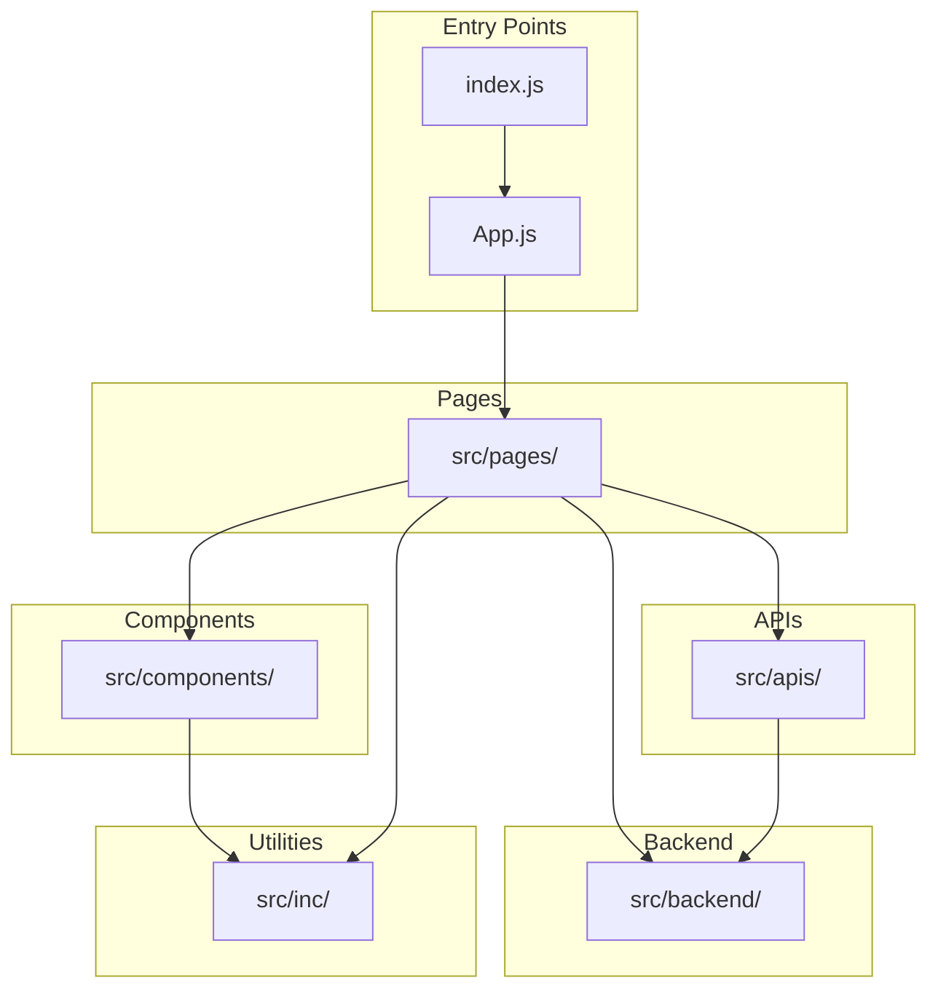

# Technical Specification

# 0. Agent Action Plan

## 0.1 Intent Clarification

### 0.1.1 Core Documentation Objective

Based on the provided requirements, the Blitzy platform understands that the documentation objective is to **enhance code documentation and create module-level README files** for the Awesome Weather Application. The user seeks to improve code maintainability, developer onboarding experience, and codebase comprehension through:

**Documentation Request Category**: Create new documentation | Update existing documentation

**Documentation Type**: Code comments (inline/JSDoc) | Module README files | Project README enhancement

**Specific Documentation Requirements**:

- **Add Comments Where Necessary**: Introduce inline code comments and JSDoc-style documentation blocks to explain complex logic, function purposes, parameters, return values, and important implementation details across all source files
- **Add READMEs for Module-Wise Structure**: Create individual README.md files for each major module directory (`src/apis/`, `src/backend/`, `src/components/`, `src/pages/`, `src/inc/`, `src/assets/`, `scripts/`) documenting the purpose, contents, and usage of each module
- **Reference to Main README**: Update the root `README.md` to include a comprehensive project structure section with navigation links to all module-level READMEs
- **Keep it Clear and Clean**: Ensure documentation follows a consistent style, uses concise language, and maintains readability without unnecessary verbosity

**Inferred Documentation Needs** (based on repository analysis):

- `src/apis/getCurrentWeather.js` contains complex weather code mapping logic (200-804 → 12 icon states) requiring detailed documentation
- `src/backend/database.js` implements a localStorage abstraction with validation patterns needing API documentation
- All 16 React components lack PropTypes documentation and usage examples
- Hard-coded API keys in source files should be documented with security warnings
- Service worker implementation (`src/service-worker.js`) requires explanation of Workbox caching strategies
- Shell scripts in `scripts/` need usage documentation and prerequisite explanations

### 0.1.2 Special Instructions and Constraints

**User-Specified Directives**:
- "add comments on where necessary" → Add documentation only where it adds value, avoiding redundant comments
- "add readmes for module wise structure" → Create structured README files for each module directory
- "reference it to the main readme files" → Update root README.md with links to module documentation
- "keep it clear and clean" → Prioritize readability and conciseness

**Template Requirements**: None explicitly provided - will follow standard Markdown README conventions and JSDoc comment patterns consistent with React/JavaScript ecosystem best practices.

**Style Preferences**:
- Tone: Technical but accessible
- Structure: Hierarchical with clear sections
- Depth: Sufficient for developer onboarding
- Format: Markdown for READMEs, JSDoc for code comments

### 0.1.3 Technical Interpretation

These documentation requirements translate to the following technical documentation strategy:

| Requirement | Technical Action | Target Files/Directories |
|-------------|-----------------|--------------------------|
| Add comments where necessary | Insert JSDoc function documentation, inline explanatory comments for complex logic | `src/**/*.js`, `src/**/*.jsx`, `scripts/*.sh` |
| Add module READMEs | Create README.md files with module overview, file inventory, usage patterns | `src/apis/`, `src/backend/`, `src/components/`, `src/pages/`, `src/inc/`, `src/assets/`, `scripts/` |
| Reference to main README | Update project structure section with hyperlinks to module READMEs | `README.md` |
| Keep it clear and clean | Apply consistent formatting, use concise language, avoid over-documentation | All documentation files |

**Implementation Approach**:
- To document the API integration layer, we will add JSDoc blocks to `src/apis/getCurrentWeather.js`, `src/apis/getGeolocation.js`, and `src/apis/getWeatherForecast.js` explaining each exported function
- To document the persistence layer, we will add JSDoc blocks to `src/backend/database.js` and `src/backend/settings.js` with full API documentation
- To document React components, we will add JSDoc blocks with @param annotations for props and @returns documentation
- To create module READMEs, we will generate README.md files in each module directory with standardized sections: Overview, Files, Usage, Dependencies
- To update the main README, we will add a Project Structure section with navigation table linking to all module READMEs


## 0.2 Documentation Discovery and Analysis

### 0.2.1 Existing Documentation Infrastructure Assessment

**Repository Documentation Analysis Summary**: Repository analysis reveals **minimal documentation infrastructure** with a single root-level README.md and sparse inline code comments. No module-level READMEs exist, no documentation generator (JSDoc, TypeDoc, Storybook) is configured, and code comments are present only in `src/backend/database.js` as a brief header.

**Search Patterns Employed**:
- Documentation files: `README*`, `*.md`, `docs/**` → Found only `README.md` at root
- Documentation generators: `jsdoc.json`, `.storybook/`, `typedoc.json` → None found
- Existing inline documentation: JSDoc blocks (`/** */`) → Minimal (1 file)
- Style guides: `CONTRIBUTING.md`, `STYLEGUIDE.md` → None found

**Current Documentation Framework**: None configured

| Documentation Aspect | Current State | Assessment |
|---------------------|---------------|------------|
| Project README | `README.md` exists (34 lines) | Basic - lacks project structure, setup details, architecture |
| Module READMEs | None | Missing - no module-level documentation exists |
| Code Comments | Minimal | Only `src/backend/database.js` has header comment (4 lines) |
| API Documentation | None | No JSDoc, TypeDoc, or API reference docs |
| Diagram Tools | None | No Mermaid, PlantUML configs detected |
| Documentation Hosting | N/A | Static README only |

**Existing README.md Analysis** (`README.md`):

```
Current Content Structure:
├── Title: "Awesome Weather Application"
├── Subtitle tagline
├── Section: "Application Features" (9 bullet points)
├── Section: "Technologies Used" (3 technologies)
├── Section: "Live Link"
└── Section: "Support" (GitHub profile link)

Missing Elements:
├── Project Structure overview
├── Installation instructions
├── Development setup guide
├── Module documentation links
├── Architecture overview
├── API/Environment configuration
└── Contributing guidelines
```

### 0.2.2 Repository Code Analysis for Documentation

**Search Patterns Used for Code Analysis**:
- Public APIs: `src/**/*.js` containing function definitions → 8 core files with exportable functions
- Module interfaces: `src/*/index.js` or entry files → `src/App.js`, `src/index.js`
- Configuration options: `package.json`, `public/manifest.json` → Build configuration present
- React components: `src/**/*.jsx` → 9 component files, 7 page files

**Key Directories Requiring Documentation**:

| Directory | Purpose | Files | Documentation Status |
|-----------|---------|-------|---------------------|
| `src/apis/` | Weather API integration layer | 3 JS files | No README, minimal comments |
| `src/backend/` | LocalStorage persistence layer | 3 JS files | No README, 1 file has header comment |
| `src/components/` | Reusable React UI components | 9 JSX files | No README, no PropTypes |
| `src/pages/` | Route-level page components | 7 JSX files | No README, no comments |
| `src/inc/` | Static scripts and styles | 2 JS + 3 CSS files | No README |
| `src/assets/` | Image and icon assets | 19 files + static/ subfolder | No README |
| `src/fonts/` | Custom font files | 2 TTF files | No README |
| `scripts/` | Shell helper scripts | 4 SH files | No README, inline comments only |
| `public/` | PWA manifest and static assets | 3 files | No README |

**Related Documentation Found**: None - this is a greenfield documentation effort.

### 0.2.3 Web Search Research Requirements

**Best Practices Research Needed**:
- JSDoc conventions for React functional components with hooks
- README.md best practices for JavaScript/React project modules
- Documentation standards for localStorage abstraction layers
- Service worker documentation patterns for PWA applications

**Documentation Structure Conventions**:
- React component documentation standards (props tables, usage examples)
- API module documentation patterns (function signatures, parameters, return values)
- Shell script documentation conventions (usage, prerequisites, exit codes)

### 0.2.4 Code Files Requiring Documentation Enhancement

**Files with Complex Logic Requiring Comments**:

| File | Complexity | Documentation Priority | Key Areas to Document |
|------|-----------|----------------------|----------------------|
| `src/apis/getCurrentWeather.js` | High | Critical | Weather code mapping (12 states), DOM selectors, API flow |
| `src/apis/getGeolocation.js` | Medium | High | Geolocation watcher pattern, error handling |
| `src/apis/getWeatherForecast.js` | Medium | High | Forecast data slicing (5-day × 8 intervals) |
| `src/backend/database.js` | Medium | High | CRUD operations, validation patterns, localStorage behavior |
| `src/backend/settings.js` | Medium | High | Settings persistence keys, UI integration |
| `src/service-worker.js` | High | Critical | Workbox strategies, caching rules, app shell routing |
| `src/serviceWorkerRegistration.js` | Medium | High | Registration flow, update detection |
| `src/pages/Weather.jsx` | High | High | State management, API integration, conditional rendering |
| `src/pages/ForecastWeather.jsx` | High | High | Day mapping functions, data transformation |
| `src/inc/scripts/utilities.js` | Medium | Medium | Date formatting, navigation utilities |
| `scripts/deploy-for-production.sh` | Medium | Medium | CI/CD integration, process management |


## 0.3 Documentation Scope Analysis

### 0.3.1 Code-to-Documentation Mapping

**Modules Requiring README Documentation**:

**Module: `src/apis/`**
- Files: `getCurrentWeather.js`, `getGeolocation.js`, `getWeatherForecast.js`
- Current Documentation: None (no README, no JSDoc)
- Documentation Needed:
  - README.md with module overview and API reference
  - JSDoc blocks for all exported functions
  - Weather code mapping table documentation
  - API endpoint and key configuration notes

**Module: `src/backend/`**
- Files: `database.js`, `app_backend.js`, `settings.js`
- Current Documentation: Partial (database.js has 4-line header)
- Documentation Needed:
  - README.md with persistence layer overview
  - JSDoc blocks for Database class methods
  - localStorage key inventory table
  - Settings function documentation

**Module: `src/components/`**
- Files: `button.jsx`, `footer.jsx`, `footerNav.jsx`, `forecastWeatherComponent.jsx`, `forecastWeatherItems.jsx`, `futureWeatherComponent.jsx`, `nextWeekComponent.jsx`, `spinner.jsx`, `utilityFooterComponet.jsx`
- Current Documentation: None
- Documentation Needed:
  - README.md with component library overview
  - JSDoc blocks with @param props documentation
  - Usage examples for each component
  - Props table for each component

**Module: `src/pages/`**
- Files: `404.jsx`, `ForecastWeather.jsx`, `Home.jsx`, `Settings.jsx`, `Support.jsx`, `Weather.jsx`, `WeatherMain.jsx`
- Current Documentation: None
- Documentation Needed:
  - README.md with routing structure overview
  - Route-to-component mapping table
  - Page component responsibilities documentation

**Module: `src/inc/`**
- Files: `scripts/script.js`, `scripts/utilities.js`, `styles/style.css`, `styles/overScrollStyles.css`, `styles/three-dots.css`
- Current Documentation: None
- Documentation Needed:
  - README.md explaining static assets organization
  - JSDoc for utility functions
  - CSS custom properties documentation

**Module: `src/assets/`**
- Files: 19 image/SVG files + `static/` subfolder with 30 weather icons
- Current Documentation: None
- Documentation Needed:
  - README.md with asset inventory
  - Weather icon naming convention documentation

**Module: `scripts/`**
- Files: `deliver-for-development.sh`, `deploy-for-production.sh`, `kill.sh`, `test.sh`
- Current Documentation: Inline comments in scripts
- Documentation Needed:
  - README.md with script usage guide
  - Prerequisites and environment requirements
  - Exit codes and error handling

### 0.3.2 Configuration Options Requiring Documentation

| Config File | Current Documentation | Gaps |
|-------------|----------------------|------|
| `package.json` | Self-documenting | Scripts section could use README explanation |
| `public/manifest.json` | None | PWA configuration explanation needed |
| `.vscode/settings.json` | None | Editor settings purpose explanation |

### 0.3.3 Documentation Gap Analysis

Given the requirements and repository analysis, documentation gaps include:

**Undocumented Public APIs**:
- `getCurrentWeather.js`: 11 exported symbols (`closeUtilityComponent`, `API_KEY`, `WEATHER_UNIT`, `scrollToElement`, `checkWeatherUnitDeg`, `handleWeatherForm`, `findCity`, `weatherSvg`, `checkWeatherCode`, `updateReactDom`, `getCurrentWeather`)
- `getGeolocation.js`: 1 default export (`getGeolocation`)
- `getWeatherForecast.js`: 1 named export (`getWeatherForecast`)
- `database.js`: 1 class with 6 methods (`create`, `update`, `get`, `delete`, `countItems`, `destroy`)
- `settings.js`: 6 exported functions
- `utilities.js`: 4 exported functions (`getCurrentDate`, `convertTo12Hour`, `getTimeFromDateString`, `navigate`)

**Missing User Guides**:
- Developer setup guide (beyond npm install)
- Architecture overview
- Environment configuration guide (API keys)
- Contributing guidelines

**Incomplete Architecture Documentation**:
- No component hierarchy diagram
- No data flow documentation
- No localStorage schema documentation
- No service worker behavior explanation

**Outdated/Missing Documentation**:
- Root README lacks project structure section
- No module-level documentation exists
- Hard-coded API key has no security warning

### 0.3.4 Source Files Requiring Comment Enhancement

**Critical Priority (Complex Logic)**:

| File | Lines | Functions to Document | Key Comments Needed |
|------|-------|----------------------|---------------------|
| `src/apis/getCurrentWeather.js` | ~200 | 11 exports | Weather code mapping, DOM selector explanations, API response handling |
| `src/service-worker.js` | ~70 | Workbox config | Caching strategy explanations, route handling logic |
| `src/pages/ForecastWeather.jsx` | ~300 | mapFirstDayData through mapFifthDayData | Data slicing logic, index calculations |
| `src/pages/Weather.jsx` | ~250 | State initialization, effects | localStorage read patterns, conditional rendering |

**High Priority (Module Entry Points)**:

| File | Functions to Document | Comment Focus |
|------|----------------------|---------------|
| `src/backend/database.js` | Database class (6 methods) | CRUD operations, validation, error conditions |
| `src/backend/settings.js` | 6 exported functions | localStorage keys, UI integration |
| `src/apis/getGeolocation.js` | getGeolocation | Watcher pattern, error handling, security |
| `src/inc/scripts/utilities.js` | 4 exports | Date formatting, navigation behavior |

**Medium Priority (React Components)**:

| File | Documentation Needed |
|------|---------------------|
| `src/components/button.jsx` | Props: style, className, onClick, text |
| `src/components/footer.jsx` | Props: utilityTags, onClick |
| `src/components/footerNav.jsx` | Props: onClick; internal navigation handlers |
| `src/components/forecastWeatherComponent.jsx` | Props: title, onClick, time, weatherUnit |
| `src/components/forecastWeatherItems.jsx` | Props: name, icon, weatherUnit |
| `src/components/futureWeatherComponent.jsx` | Props: onClick, time, weatherUnit |
| `src/components/nextWeekComponent.jsx` | Props: day, firstUnit, secondUnit, icon |
| `src/components/spinner.jsx` | No props - loader component |
| `src/components/utilityFooterComponet.jsx` | Props: tags; jQuery integration warning |


## 0.4 Documentation Implementation Design

### 0.4.1 Documentation Structure Planning

**Proposed Documentation Hierarchy**:

```
react-weather-app/
├── README.md                           # Enhanced with project structure & module links
├── scripts/
│   └── README.md                       # NEW: Shell scripts usage guide
├── src/
│   ├── apis/
│   │   └── README.md                   # NEW: API integration layer docs
│   ├── assets/
│   │   └── README.md                   # NEW: Asset inventory and conventions
│   ├── backend/
│   │   └── README.md                   # NEW: Data persistence layer docs
│   ├── components/
│   │   └── README.md                   # NEW: Component library reference
│   ├── inc/
│   │   └── README.md                   # NEW: Static scripts/styles docs
│   └── pages/
│       └── README.md                   # NEW: Page components & routing docs
└── public/
    └── README.md                       # NEW: PWA configuration docs
```

**Total New README Files**: 8 module-level READMEs

### 0.4.2 Content Generation Strategy

**Information Extraction Approach**:

- Extract function signatures from `src/apis/*.js` using JSDoc pattern analysis
- Generate component props documentation from prop access patterns in JSX files
- Create API reference tables by mapping exported symbols
- Build localStorage key inventory from db.get/db.create calls across codebase
- Document weather icon mapping from `checkWeatherCode()` switch statement

**Documentation Standards**:

**JSDoc Comment Format**:
```javascript
/**
 * Brief description of function purpose.
 *
 * @param {string} paramName - Description of parameter
 * @returns {ReturnType} Description of return value
 * @throws {Error} Conditions that cause errors
 * @example
 * // Brief usage example
 * functionName('value');
 */
```

**README.md Template Structure**:
```
# Module Name

Brief description of module purpose and responsibilities.

#### Overview
What this module does and why it exists.

#### Files
| File | Purpose | Exports |
|------|---------|---------|
| file.js | Description | export1, export2 |

#### Usage
Code examples showing how to import and use module exports.

#### Dependencies
Internal and external dependencies this module requires.

#### Related Documentation
Links to related modules and main README.
```

### 0.4.3 Diagram and Visual Strategy

**Mermaid Diagrams to Create**:

| Diagram Type | Location | Purpose |
|-------------|----------|---------|
| Module Dependency Graph | Root README.md | Show relationships between modules |
| Component Hierarchy | `src/components/README.md` | Visual component tree |
| Data Flow Diagram | `src/backend/README.md` | localStorage read/write patterns |
| Routing Flowchart | `src/pages/README.md` | Route → Component mapping |

**Module Dependency Diagram** (for root README):



### 0.4.4 Code Comment Strategy

**Comment Placement Guidelines**:

| Location | Comment Type | When to Use |
|----------|-------------|-------------|
| File header | Block comment | Every JS/JSX file - describe purpose and exports |
| Function/Method | JSDoc block | All exported functions and class methods |
| Complex logic | Inline comment | Weather code mapping, date calculations, regex patterns |
| Magic values | Inline comment | Hard-coded selectors, API endpoints, cache limits |
| TODO/Warning | Inline annotation | Security concerns (API keys), deprecated patterns |

**Files Requiring Block Comments (File Headers)**:

- All files in `src/apis/` - describe API purpose and external services used
- All files in `src/backend/` - describe persistence responsibilities
- All files in `src/pages/` - describe route path and page functionality
- All files in `src/components/` - describe component purpose and props
- `src/service-worker.js` - describe caching strategies
- `src/serviceWorkerRegistration.js` - describe registration flow

**Inline Comment Focus Areas**:

| File | Line Range | Logic to Document |
|------|------------|-------------------|
| `src/apis/getCurrentWeather.js` | checkWeatherCode() | Weather code ranges (200-804) to icon mapping |
| `src/apis/getCurrentWeather.js` | DOM selectors | Explain which DOM elements are targeted |
| `src/backend/database.js` | All methods | Validation logic and localStorage behavior |
| `src/service-worker.js` | registerRoute calls | Caching strategy rationale |
| `src/pages/ForecastWeather.jsx` | mapXDayData functions | Array slicing index calculations |


## 0.5 Documentation File Transformation Mapping

### 0.5.1 File-by-File Documentation Plan

**Documentation Transformation Modes**:
- **CREATE** - Create a new documentation file
- **UPDATE** - Update an existing documentation file  
- **COMMENT** - Add code comments to existing source file (no structural changes)

**Complete Documentation Transformation Table**:

| Target Documentation File | Transformation | Source/Reference | Content/Changes |
|---------------------------|----------------|------------------|-----------------|
| `README.md` | UPDATE | `README.md` | Add Project Structure section with module links, enhance installation/setup instructions, add architecture overview diagram |
| `src/apis/README.md` | CREATE | `src/apis/*.js` | API integration layer documentation with function reference table, weather code mapping, API endpoints |
| `src/backend/README.md` | CREATE | `src/backend/*.js` | Data persistence layer documentation with Database class API, localStorage key inventory, settings functions |
| `src/components/README.md` | CREATE | `src/components/*.jsx` | Component library reference with props tables, usage examples, component hierarchy diagram |
| `src/pages/README.md` | CREATE | `src/pages/*.jsx` | Page components documentation with route mapping table, page responsibilities, state management overview |
| `src/inc/README.md` | CREATE | `src/inc/**/*` | Static assets documentation with utility functions reference, CSS custom properties, script purposes |
| `src/assets/README.md` | CREATE | `src/assets/**/*` | Asset inventory documentation with weather icon naming convention, file categorization |
| `scripts/README.md` | CREATE | `scripts/*.sh` | Shell scripts usage guide with prerequisites, execution examples, exit codes |
| `public/README.md` | CREATE | `public/*` | PWA configuration documentation with manifest explanation, deployment notes |
| `src/apis/getCurrentWeather.js` | COMMENT | N/A | Add JSDoc blocks to 11 exported functions, inline comments for weather code mapping |
| `src/apis/getGeolocation.js` | COMMENT | N/A | Add JSDoc to getGeolocation function, document watcher pattern and security considerations |
| `src/apis/getWeatherForecast.js` | COMMENT | N/A | Add JSDoc to getWeatherForecast function, document API endpoint and response handling |
| `src/backend/database.js` | COMMENT | N/A | Enhance existing header, add JSDoc to all 6 Database class methods |
| `src/backend/app_backend.js` | COMMENT | N/A | Add file header comment explaining singleton pattern |
| `src/backend/settings.js` | COMMENT | N/A | Add JSDoc to all 6 exported functions with localStorage key documentation |
| `src/components/button.jsx` | COMMENT | N/A | Add file header and JSDoc with @param for props (style, className, onClick, text) |
| `src/components/footer.jsx` | COMMENT | N/A | Add file header and JSDoc with @param for props (utilityTags, onClick) |
| `src/components/footerNav.jsx` | COMMENT | N/A | Add file header and JSDoc, document internal navigation handlers |
| `src/components/forecastWeatherComponent.jsx` | COMMENT | N/A | Add file header and JSDoc with @param for props (title, onClick, time, weatherUnit) |
| `src/components/forecastWeatherItems.jsx` | COMMENT | N/A | Add file header and JSDoc with @param for props (name, icon, weatherUnit) |
| `src/components/futureWeatherComponent.jsx` | COMMENT | N/A | Add file header and JSDoc with @param for props (onClick, time, weatherUnit) |
| `src/components/nextWeekComponent.jsx` | COMMENT | N/A | Add file header and JSDoc with @param for props (day, firstUnit, secondUnit, icon) |
| `src/components/spinner.jsx` | COMMENT | N/A | Add file header comment (no props to document) |
| `src/components/utilityFooterComponet.jsx` | COMMENT | N/A | Add file header, JSDoc, and warning comment about jQuery DOM manipulation |
| `src/pages/404.jsx` | COMMENT | N/A | Add file header explaining 404 route handler |
| `src/pages/ForecastWeather.jsx` | COMMENT | N/A | Add file header, JSDoc to mapping functions, inline comments for array slicing |
| `src/pages/Home.jsx` | COMMENT | N/A | Add file header explaining onboarding flow |
| `src/pages/Settings.jsx` | COMMENT | N/A | Add file header documenting settings persistence |
| `src/pages/Support.jsx` | COMMENT | N/A | Add file header documenting support page |
| `src/pages/Weather.jsx` | COMMENT | N/A | Add file header, document state initialization and localStorage reads |
| `src/pages/WeatherMain.jsx` | COMMENT | N/A | Add file header documenting detailed weather view |
| `src/service-worker.js` | COMMENT | N/A | Add file header, inline comments explaining each Workbox strategy |
| `src/serviceWorkerRegistration.js` | COMMENT | N/A | Add file header explaining registration flow and update detection |
| `src/App.js` | COMMENT | N/A | Add file header explaining routing configuration |
| `src/index.js` | COMMENT | N/A | Add file header explaining application entry point |
| `src/autoload.js` | COMMENT | N/A | Add file header explaining side-effect imports |
| `src/reportWebVitals.js` | COMMENT | N/A | Add file header explaining web vitals reporting |
| `src/inc/scripts/script.js` | COMMENT | N/A | Add file header explaining DOM-ready behavior |
| `src/inc/scripts/utilities.js` | COMMENT | N/A | Add JSDoc to all 4 exported functions |

### 0.5.2 New Documentation Files Detail

**File: `src/apis/README.md`**
- Type: Module README
- Source Code: `src/apis/getCurrentWeather.js`, `src/apis/getGeolocation.js`, `src/apis/getWeatherForecast.js`
- Sections:
  - Overview (API integration layer purpose)
  - Files inventory table with exports
  - Weather API Functions reference
  - Weather Code Mapping table (200-804 → icons)
  - Geolocation Functions reference
  - External APIs Used (OpenWeatherMap, API Ninjas)
  - Security Notes (API key handling)
- Key Citations: `src/apis/getCurrentWeather.js`, `src/apis/getGeolocation.js`, `src/apis/getWeatherForecast.js`

**File: `src/backend/README.md`**
- Type: Module README
- Source Code: `src/backend/database.js`, `src/backend/app_backend.js`, `src/backend/settings.js`
- Sections:
  - Overview (localStorage persistence layer)
  - Database Class API reference
  - localStorage Key Inventory table (45+ keys)
  - Settings Functions reference
  - Usage Examples
- Key Citations: `src/backend/database.js`, `src/backend/settings.js`

**File: `src/components/README.md`**
- Type: Module README
- Source Code: All 9 JSX files in `src/components/`
- Sections:
  - Overview (reusable UI components)
  - Component Inventory table
  - Props Reference for each component
  - Component Hierarchy diagram
  - Usage Examples
- Key Citations: All `src/components/*.jsx` files

**File: `src/pages/README.md`**
- Type: Module README
- Source Code: All 7 JSX files in `src/pages/`
- Sections:
  - Overview (route-level page components)
  - Route Mapping table (path → component)
  - Page Responsibilities table
  - State Management overview
- Key Citations: All `src/pages/*.jsx` files, `src/App.js`

**File: `src/inc/README.md`**
- Type: Module README
- Source Code: `src/inc/scripts/*.js`, `src/inc/styles/*.css`
- Sections:
  - Overview (static assets organization)
  - Scripts reference (utilities.js functions)
  - Styles reference (CSS custom properties)
- Key Citations: `src/inc/scripts/utilities.js`, `src/inc/styles/style.css`

**File: `src/assets/README.md`**
- Type: Asset README
- Source: All files in `src/assets/` and `src/assets/static/`
- Sections:
  - Overview (image and icon assets)
  - Asset Inventory table
  - Weather Icon Naming Convention
  - Icon to Weather Code Mapping
- Key Citations: `src/assets/static/*.svg`

**File: `scripts/README.md`**
- Type: Module README
- Source Code: `scripts/*.sh`
- Sections:
  - Overview (development and deployment scripts)
  - Script Inventory table
  - Prerequisites
  - Usage Examples with commands
  - Exit Codes
- Key Citations: All `scripts/*.sh` files

**File: `public/README.md`**
- Type: Module README
- Source Code: `public/index.html`, `public/manifest.json`, `public/robots.txt`
- Sections:
  - Overview (PWA static assets)
  - Files Description
  - Manifest Configuration explanation
  - Meta Tags documentation
- Key Citations: `public/manifest.json`, `public/index.html`

### 0.5.3 Root README Enhancement Detail

**File: `README.md` - Enhancement Plan**

**New Sections to Add**:
- Project Structure (with module links)
- Installation & Setup (enhanced)
- Development Commands
- Architecture Overview (with Mermaid diagram)
- Module Documentation Links table
- Environment Configuration (API keys)
- Contributing section

**Updated Content Outline**:
```
# Awesome Weather Application
[Existing tagline and features preserved]

#### Project Structure
[NEW: Directory tree with descriptions]

#### Module Documentation
[NEW: Links to all module READMEs]

#### Installation & Setup
[ENHANCED: Detailed setup instructions]

#### Development
[NEW: Development commands and workflow]

#### Architecture
[NEW: Module dependency diagram]

#### Technologies Used
[Existing content preserved]

#### Live Link
[Existing content preserved]

#### Contributing
[NEW: Basic contribution guidelines]

#### Support
[Existing content preserved]
```

### 0.5.4 Cross-Documentation Dependencies

**Shared Content Requirements**:
- Module link table appears in root README and links to each module README
- Each module README includes "Related Documentation" section linking back to root README
- Weather code mapping table appears in both `src/apis/README.md` and `src/assets/README.md`

**Navigation Links Required**:

| From | To | Link Type |
|------|-----|-----------|
| `README.md` | `src/apis/README.md` | Direct link |
| `README.md` | `src/backend/README.md` | Direct link |
| `README.md` | `src/components/README.md` | Direct link |
| `README.md` | `src/pages/README.md` | Direct link |
| `README.md` | `src/inc/README.md` | Direct link |
| `README.md` | `src/assets/README.md` | Direct link |
| `README.md` | `scripts/README.md` | Direct link |
| `README.md` | `public/README.md` | Direct link |
| All module READMEs | `README.md` | Back link |


## 0.6 Dependency Inventory

### 0.6.1 Documentation Dependencies

**Documentation Tools and Packages** (already present in project):

| Registry | Package Name | Version | Purpose |
|----------|--------------|---------|---------|
| npm | react | 18.3.1 | Core framework - components require props documentation |
| npm | react-scripts | 5.0.1 | Build toolchain - enables JSDoc processing |

**No Additional Documentation Tooling Required**: This documentation effort focuses on:
- Native Markdown README files (no generator needed)
- Inline JSDoc comments (native JavaScript, no additional tooling)
- Mermaid diagrams embedded in Markdown (GitHub/GitLab native rendering)

**External Documentation Standards Referenced**:

| Standard | Version | Usage |
|----------|---------|-------|
| JSDoc | 3.x conventions | Function and class documentation syntax |
| CommonMark | Current | Markdown formatting |
| Mermaid | Latest | Diagram syntax in README files |

### 0.6.2 Project Runtime Dependencies (Reference)

These dependencies are documented in the project and affect documentation content:

| Registry | Package Name | Version | Relevance to Documentation |
|----------|--------------|---------|---------------------------|
| npm | react | 18.3.1 | Component props documentation patterns |
| npm | react-dom | 18.3.1 | Rendering documentation |
| npm | react-router-dom | 6.22.3 | Route documentation in pages README |
| npm | jquery | 3.7.1 | jQuery patterns need documentation warnings |
| npm | sweetalert2 | 11.12.1 | Modal usage documentation |
| npm | bootstrap | 5.3.6 | CSS class usage documentation |
| npm | framer-motion | 8.5.5 | Animation usage notes |
| npm | workbox-* | (bundled) | Service worker documentation |

### 0.6.3 Documentation Reference Updates

**Module README Cross-References**:

| Module README | References To | Reference Type |
|---------------|---------------|----------------|
| `src/apis/README.md` | `src/backend/README.md` | "See backend module for db usage" |
| `src/apis/README.md` | `src/inc/README.md` | "See inc module for utilities" |
| `src/backend/README.md` | `src/apis/README.md` | "Used by API layer" |
| `src/components/README.md` | `src/pages/README.md` | "Used by page components" |
| `src/pages/README.md` | `src/components/README.md` | "Uses shared components" |
| `src/pages/README.md` | `src/apis/README.md` | "Uses API layer" |
| `src/pages/README.md` | `src/backend/README.md` | "Uses persistence layer" |

**Root README Module Links**:

```
| Module | Path | Description |
|--------|------|-------------|
| APIs | [src/apis/](src/apis/README.md) | Weather API integration layer |
| Backend | [src/backend/](src/backend/README.md) | LocalStorage persistence layer |
| Components | [src/components/](src/components/README.md) | Reusable UI components |
| Pages | [src/pages/](src/pages/README.md) | Route-level page components |
| Inc | [src/inc/](src/inc/README.md) | Static scripts and styles |
| Assets | [src/assets/](src/assets/README.md) | Images and icons |
| Scripts | [scripts/](scripts/README.md) | Shell helper scripts |
| Public | [public/](public/README.md) | PWA configuration |
```

### 0.6.4 External API Documentation References

**APIs Used by Application** (to be documented in `src/apis/README.md`):

| API | Provider | Documentation URL | Usage |
|-----|----------|------------------|-------|
| Current Weather | OpenWeatherMap | https://openweathermap.org/current | Real-time weather data |
| 5-Day Forecast | OpenWeatherMap | https://openweathermap.org/forecast5 | Weather predictions |
| City Search | API Ninjas | https://api-ninjas.com/api/city | City name lookup |

**Security Note**: API keys are currently hard-coded in source files. Documentation must include warnings about this pattern and recommendations for environment variables.


## 0.7 Coverage and Quality Targets

### 0.7.1 Documentation Coverage Metrics

**Current Coverage Analysis**:

| Category | Total Items | Currently Documented | Coverage |
|----------|-------------|---------------------|----------|
| Module READMEs | 8 modules | 0 | 0% |
| Exported Functions (JSDoc) | 28 functions | 0 | 0% |
| React Components (JSDoc) | 16 components | 0 | 0% |
| Class Methods (JSDoc) | 6 methods | 0 | 0% |
| File Headers | 37 source files | 1 (partial) | 2.7% |
| Root README Sections | 8 expected | 4 present | 50% |

**Target Coverage**: 100% for all documentation categories

**Coverage Goals by Category**:

| Category | Current | Target | Files Affected |
|----------|---------|--------|----------------|
| Module READMEs | 0% | 100% | 8 new README.md files |
| API Layer JSDoc | 0% | 100% | 3 files in `src/apis/` |
| Backend Layer JSDoc | 0% | 100% | 3 files in `src/backend/` |
| Components JSDoc | 0% | 100% | 9 files in `src/components/` |
| Pages JSDoc | 0% | 100% | 7 files in `src/pages/` |
| Core Files JSDoc | 0% | 100% | 6 files (`App.js`, `index.js`, etc.) |
| Utilities JSDoc | 0% | 100% | 2 files in `src/inc/scripts/` |
| Service Worker Comments | 0% | 100% | 2 files |
| Root README Enhancement | 50% | 100% | `README.md` |

### 0.7.2 Documentation Quality Criteria

**Completeness Requirements**:

- All exported functions have JSDoc with @param, @returns, @throws annotations
- All React components have props documented with types and descriptions
- All module READMEs have: Overview, Files table, Usage examples, Related links
- Root README has: Project structure, Module links, Setup guide, Architecture diagram
- Complex logic has inline comments explaining purpose and algorithm

**Accuracy Validation**:

| Validation Check | Method | Pass Criteria |
|-----------------|--------|---------------|
| JSDoc syntax | Manual review | Valid JSDoc 3.x format |
| Props documentation | Compare to JSX usage | All accessed props documented |
| Function signatures | Compare to code | Parameters and returns match implementation |
| Module links | Test navigation | All links resolve correctly |
| Code examples | Visual inspection | Syntax correct and representative |

**Clarity Standards**:

- Technical terminology explained for developer onboarding
- Consistent heading hierarchy (H1 → H2 → H3)
- Tables for structured data (props, functions, files)
- Code examples for every documented function/component
- No orphaned or broken internal links

**Maintainability Requirements**:

- Source file citations in README content
- Consistent formatting across all READMEs
- Template-based structure for easy updates
- Clear module boundaries documented

### 0.7.3 Example and Diagram Requirements

**Documentation Examples Required**:

| Documentation File | Examples Required |
|-------------------|-------------------|
| `src/apis/README.md` | API call examples for each weather function |
| `src/backend/README.md` | CRUD operation examples using Database class |
| `src/components/README.md` | JSX usage examples for each component |
| `src/pages/README.md` | Route configuration example |
| `src/inc/README.md` | Utility function usage examples |
| `scripts/README.md` | Command execution examples |

**Diagram Requirements**:

| Diagram | Location | Type | Purpose |
|---------|----------|------|---------|
| Module Dependency Graph | `README.md` | Mermaid flowchart | Show module relationships |
| Component Hierarchy | `src/components/README.md` | Mermaid flowchart | Show component tree |
| Routing Flow | `src/pages/README.md` | Mermaid flowchart | Show route → component mapping |
| Data Flow | `src/backend/README.md` | Mermaid sequence | Show localStorage patterns |

### 0.7.4 JSDoc Coverage Targets

**Functions Requiring JSDoc**:

**`src/apis/getCurrentWeather.js`** (11 exports):
- `closeUtilityComponent()` - Close utility panel
- `scrollToElement(elementId)` - Scroll to DOM element
- `checkWeatherUnitDeg()` - Get temperature unit symbol
- `handleWeatherForm(e, search)` - Handle search form submission
- `findCity(searchTerm, updateDataArray)` - City lookup via API Ninjas
- `checkWeatherCode(code)` - Map weather code to icon
- `updateReactDom(result)` - Update DOM with weather data
- `getCurrentWeather(city)` - Fetch current weather

**`src/apis/getGeolocation.js`** (1 export):
- `getGeolocation()` - Start geolocation tracking

**`src/apis/getWeatherForecast.js`** (1 export):
- `getWeatherForecast()` - Fetch 5-day forecast

**`src/backend/database.js`** (6 class methods):
- `create(key, value)` - Store key-value pair
- `get(key)` - Retrieve value by key
- `update(key, value)` - Update existing key
- `delete(key)` - Remove key
- `countItems()` - Count localStorage entries
- `destroy()` - Clear all localStorage

**`src/backend/settings.js`** (6 exports):
- `saveLocation(e)` - Persist default location
- `getDefaultLocation()` - Get saved location
- `restoreFactorySettings()` - Reset all settings
- `trackSavedLocationWeather()` - Toggle tracking
- `checkTrackedLocation()` - Check tracking status
- `changeWeatherUnit(e)` - Update temperature unit

**`src/inc/scripts/utilities.js`** (4 exports):
- `getCurrentDate()` - Format current date
- `convertTo12Hour(time)` - Convert to 12-hour format
- `getTimeFromDateString(datetime)` - Extract time from datetime
- `navigate(page)` - Programmatic navigation


## 0.8 Scope Boundaries

### 0.8.1 Exhaustively In Scope

**New Documentation Files** (with trailing patterns):

| File Pattern | Count | Description |
|--------------|-------|-------------|
| `README.md` | 1 | Root README enhancement |
| `src/apis/README.md` | 1 | API layer documentation |
| `src/backend/README.md` | 1 | Backend layer documentation |
| `src/components/README.md` | 1 | Component library documentation |
| `src/pages/README.md` | 1 | Pages documentation |
| `src/inc/README.md` | 1 | Static assets documentation |
| `src/assets/README.md` | 1 | Assets inventory documentation |
| `scripts/README.md` | 1 | Shell scripts documentation |
| `public/README.md` | 1 | PWA configuration documentation |

**Source Files for Comment Enhancement**:

| File Pattern | Count | Documentation Type |
|--------------|-------|-------------------|
| `src/apis/*.js` | 3 | JSDoc + inline comments |
| `src/backend/*.js` | 3 | JSDoc + inline comments |
| `src/components/*.jsx` | 9 | JSDoc file headers + props |
| `src/pages/*.jsx` | 7 | JSDoc file headers |
| `src/App.js` | 1 | JSDoc file header |
| `src/index.js` | 1 | JSDoc file header |
| `src/autoload.js` | 1 | JSDoc file header |
| `src/reportWebVitals.js` | 1 | JSDoc file header |
| `src/service-worker.js` | 1 | JSDoc + inline comments |
| `src/serviceWorkerRegistration.js` | 1 | JSDoc + inline comments |
| `src/inc/scripts/*.js` | 2 | JSDoc file headers |

**Total Files In Scope**: 9 new READMEs + 30 source files for comments = **39 files**

### 0.8.2 Explicitly Out of Scope

**Source Code Modifications** (structural changes):
- Refactoring code logic or architecture
- Adding PropTypes or TypeScript types
- Modifying function signatures or behavior
- Adding new exports or imports (except for documentation)
- Fixing bugs or addressing technical debt

**Test Files**:
- `src/App.test.js` - No documentation changes
- `src/setupTests.js` - No documentation changes

**Configuration Files** (no documentation added):
- `package.json` - No modification
- `package-lock.json` - No modification
- `.gitignore` - No modification
- `.vscode/*` - No modification
- `Dokerfile` - No modification
- `Jenkinsfile` - No modification

**Static Assets** (non-documentation):
- `src/assets/*.png`, `*.gif`, `*.svg` - No modification
- `src/assets/static/*.svg` - No modification
- `src/fonts/*.ttf` - No modification
- `src/inc/styles/*.css` - No modification (CSS files don't get README)
- `public/*.html`, `*.json`, `*.txt`, `*.ico`, `*.png` - No modification to files themselves

**Files Excluded by Nature**:
- Binary files (images, fonts)
- Lock files
- Build outputs (`/build/`)
- Node modules (`/node_modules/`)

### 0.8.3 Scope Validation Checklist

| Scope Item | In Scope | Out of Scope | Notes |
|-----------|----------|--------------|-------|
| Root README.md | ✓ | | Enhancement with module links |
| Module README files | ✓ | | 8 new files |
| JSDoc comments in source | ✓ | | 30 source files |
| Inline code comments | ✓ | | Complex logic areas |
| PropTypes additions | | ✓ | Code modification - excluded |
| TypeScript migration | | ✓ | Not requested |
| API key relocation | | ✓ | Code modification - excluded |
| Test file documentation | | ✓ | Test files excluded |
| CSS file comments | | ✓ | CSS comments not requested |
| Build configuration docs | | ✓ | Not requested |
| Deployment documentation | | ✓ | Beyond current scope |

### 0.8.4 Boundary Clarifications

**Documentation Comment Scope**:
- Add JSDoc blocks: YES (function/class documentation)
- Add inline comments: YES (complex logic explanation)
- Modify code logic: NO
- Add type annotations: NO
- Add runtime assertions: NO

**README Content Scope**:
- Module overview: YES
- File inventory tables: YES
- Usage examples: YES
- Architecture diagrams: YES (Mermaid)
- API reference tables: YES
- External API documentation: NO (link only)
- Deployment guides: NO
- Contributing guidelines: YES (basic in root README)

**Cross-Module Documentation**:
- Inter-module links: YES
- Shared terminology: YES
- Redundant content: MINIMIZE
- Centralized glossary: NO (not requested)


## 0.9 Execution Parameters

### 0.9.1 Documentation-Specific Instructions

**Build and Validation Commands**:

| Purpose | Command | Notes |
|---------|---------|-------|
| Install dependencies | `npm i --legacy-peer-deps` | User-specified, required for build |
| Development server | `npm run start` | Verify application still works after changes |
| Production build | `npm run build` | Ensure JSDoc comments don't break build |
| Run tests | `npm run test` | Verify no test failures introduced |

**Documentation Validation** (manual):
- Verify all README links resolve correctly
- Check JSDoc syntax is valid
- Ensure Mermaid diagrams render in GitHub/GitLab

### 0.9.2 Default Formatting Standards

**Markdown Formatting**:
- Use ATX-style headers (`#`, `##`, `###`)
- Tables with header row and alignment pipes
- Fenced code blocks with language specifiers
- Mermaid diagrams in `mermaid` code blocks
- Relative links for internal navigation

**JSDoc Formatting**:
```javascript
/**
 * Brief description ending with period.
 *
 * @param {Type} paramName - Parameter description
 * @returns {Type} Return value description
 * @throws {ErrorType} Condition causing error
 * @example
 * // Usage example
 * functionName(arg);
 */
```

**File Header Format**:
```javascript
/**
 * filename.js
 * Brief description of file purpose.
 *
 * @module moduleName
 * @description Detailed module description
 */
```

### 0.9.3 Citation Requirements

**Source Code Citations in READMEs**:
- Reference source files when documenting functions
- Use relative paths from repository root
- Format: `Source: src/apis/getCurrentWeather.js`

**JSDoc Source Citations**:
- Use @see tags for related functions
- Use @link for external references
- Format: `@see {@link ./otherFile.js}`

### 0.9.4 Style Guide Alignment

**Consistency with Existing Patterns**:
- Match existing `database.js` header comment style
- Use same terminology as existing README (e.g., "Weather App", "PWA")
- Follow Bootstrap class naming in UI documentation
- Preserve existing code formatting when adding comments

**Documentation Tone**:
- Technical but accessible
- Third person ("The function returns...")
- Active voice preferred
- Concise without sacrificing clarity

### 0.9.5 Comment Insertion Guidelines

**Where to Add Comments**:

| Location | Add Comment | Type |
|----------|-------------|------|
| Before function declaration | YES | JSDoc block |
| Complex conditional logic | YES | Inline comment |
| Magic numbers/strings | YES | Inline comment |
| API endpoints | YES | Inline comment |
| DOM selectors | YES | Inline comment |
| Error handling blocks | YES | Inline comment |
| Simple assignments | NO | Self-explanatory |
| Standard imports | NO | Self-explanatory |
| Return statements | SOMETIMES | Only if logic is complex |

**Comment Density Guidelines**:
- API files (`src/apis/`): High density - document all exports and complex logic
- Backend files (`src/backend/`): High density - document all methods and keys
- Components (`src/components/`): Medium density - document props and purpose
- Pages (`src/pages/`): Medium density - document purpose and state
- Core files (`src/*.js`): Low-medium density - file headers and key logic


## 0.10 Special Instructions for Documentation

### 0.10.1 User-Specified Documentation Requirements

The user has emphasized the following documentation directives:

**"Add comments on where necessary"**
- Interpretation: Add documentation only where it provides value
- Action: Focus on exported functions, complex logic, and non-obvious code patterns
- Avoid: Over-commenting simple code, redundant descriptions

**"Add readmes for module wise structure"**
- Interpretation: Create README.md files for each logical module directory
- Action: Create 8 module-level READMEs with consistent structure
- Include: Overview, file inventory, usage examples, dependencies

**"Reference it to the main readme files"**
- Interpretation: Update root README.md with navigation to all module READMEs
- Action: Add Project Structure section with hyperlinked table to all module docs
- Ensure: Bidirectional linking (root ↔ modules)

**"Keep it clear and clean"**
- Interpretation: Prioritize readability and avoid verbose documentation
- Action: Use concise language, structured tables, and consistent formatting
- Avoid: Redundant content, overly technical jargon, unnecessary sections

### 0.10.2 Security Documentation Requirements

**API Key Documentation Warning**:
The following files contain hard-coded API keys that MUST be documented with security warnings:

| File | API Key | Required Documentation |
|------|---------|----------------------|
| `src/apis/getCurrentWeather.js` | OpenWeatherMap API key | Warning comment recommending environment variables |
| `src/apis/getWeatherForecast.js` | OpenWeatherMap API key | Warning comment recommending environment variables |
| `src/apis/getGeolocation.js` | References API_KEY from getCurrentWeather | Cross-reference to security note |

**Security Warning Comment Template**:
```javascript
/**
 * WARNING: This API key is hard-coded for development convenience.
 * For production deployment, move this to environment variables:
 * - Create .env file with REACT_APP_OPENWEATHER_API_KEY=your_key
 * - Access via process.env.REACT_APP_OPENWEATHER_API_KEY
 * - Never commit API keys to version control
 */
```

### 0.10.3 jQuery Integration Warnings

**Files with jQuery DOM Manipulation**:
Components and pages that use jQuery alongside React require warning documentation:

| File | jQuery Usage | Required Documentation |
|------|-------------|----------------------|
| `src/components/utilityFooterComponet.jsx` | `$().addClass()`, `$().removeClass()` | Warning about React reconciliation bypass |
| `src/apis/getCurrentWeather.js` | DOM updates via jQuery selectors | Note about mixing paradigms |
| `src/pages/Weather.jsx` | jQuery form handling | Document React/jQuery interaction |

**jQuery Warning Comment Template**:
```javascript
/**
 * NOTE: This component uses jQuery for DOM manipulation.
 * jQuery DOM changes bypass React's reconciliation and may cause
 * inconsistencies between React state and actual DOM.
 * Consider migrating to React refs or state for future maintenance.
 */
```

### 0.10.4 Consistency Requirements

**Terminology Consistency**:

| Term | Use | Avoid |
|------|-----|-------|
| Weather App | ✓ | weather app, WeatherApp |
| localStorage | ✓ | local storage, LocalStorage |
| OpenWeatherMap | ✓ | Open Weather Map, OWM |
| API | ✓ | api, Api |
| PWA | ✓ | pwa, P.W.A. |
| React | ✓ | react, ReactJS |

**Heading Consistency**:
- Module READMEs: H1 for title, H2 for main sections, H3 for subsections
- JSDoc: Use standard tags (@param, @returns, @throws, @example)
- Inline comments: Start with capital letter, end with period

### 0.10.5 Documentation Completeness Checklist

Before marking documentation complete, verify:

- [ ] All 8 module READMEs created with consistent structure
- [ ] Root README updated with Project Structure and module links
- [ ] All 28+ exported functions have JSDoc blocks
- [ ] All 16 React components have file headers
- [ ] Complex logic has inline explanatory comments
- [ ] Security warnings added for hard-coded API keys
- [ ] jQuery usage warnings added where applicable
- [ ] All internal links tested and working
- [ ] Mermaid diagrams render correctly
- [ ] No broken references between documents
- [ ] Consistent terminology throughout
- [ ] Code examples are syntactically correct

### 0.10.6 Module README Template

**Standard Template for All Module READMEs**:

```
# Module Name

Brief description of module purpose.

#### Overview

Detailed explanation of what this module does, its responsibilities,
and how it fits into the overall application architecture.

#### Files

| File | Purpose | Exports |
|------|---------|---------|
| file.js | Description | function1, function2 |

#### API Reference

#### functionName(param)

Description of function.

**Parameters:**
- `param` (Type): Description

**Returns:** Type - Description

**Example:**
```javascript
// Usage example
```

#### Dependencies

- **Internal**: List internal module dependencies
- **External**: List npm package dependencies

#### Related Documentation

- [Back to Main README](../README.md)
- [Related Module](./related/README.md)
```

### 0.10.7 Priority Order for Documentation

**Implementation Priority**:

1. **Critical** - Module READMEs (8 files)
   - Creates structural documentation foundation
   - Enables navigation from root README

2. **High** - API and Backend JSDoc (6 files)
   - Documents core application logic
   - Most complex code requiring explanation

3. **High** - Root README Enhancement (1 file)
   - Provides project entry point
   - Links to all module documentation

4. **Medium** - Component JSDoc (9 files)
   - Documents reusable UI elements
   - Props documentation for future developers

5. **Medium** - Page JSDoc (7 files)
   - Documents route-level components
   - State and lifecycle documentation

6. **Lower** - Core file headers (6 files)
   - Entry points and utilities
   - Less complex, more boilerplate


