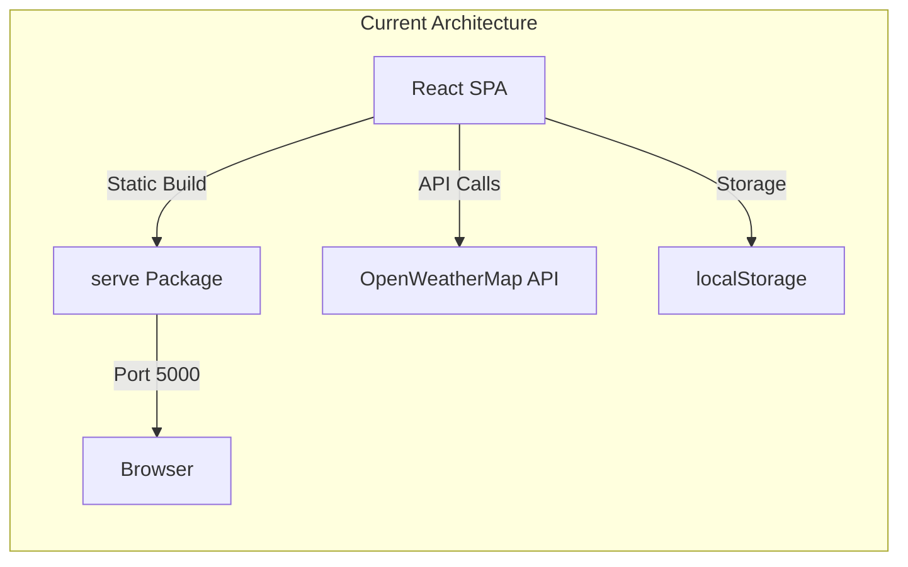
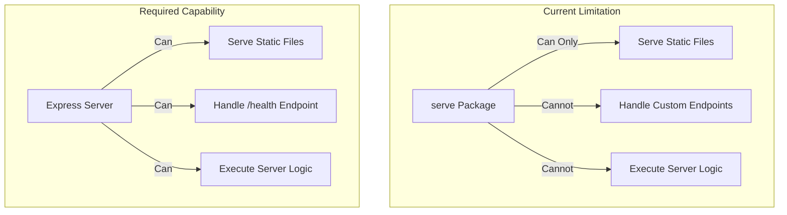
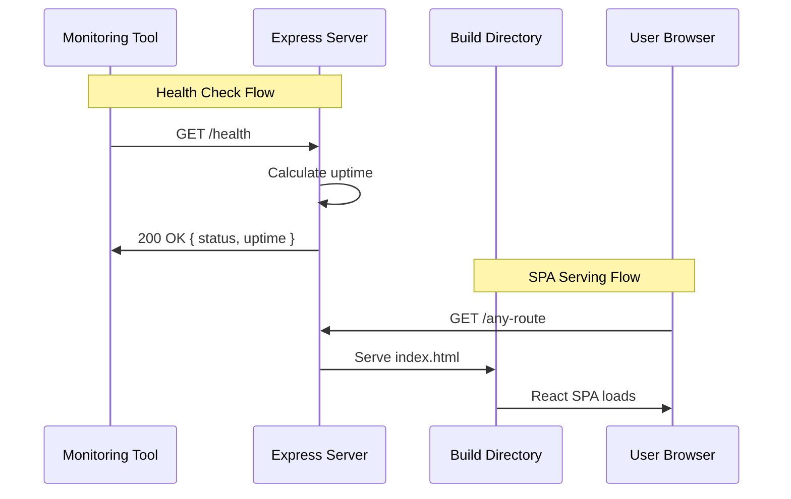

# Technical Specification

# 0. Agent Action Plan

## 0.1 Executive Summary

Based on the provided requirements, the Blitzy platform understands that the user requests the addition of a health check endpoint to the React Weather Application to enable service availability verification. This is a **feature addition** task that transforms the application from a purely static-served SPA to one with a lightweight server component capable of responding to health monitoring requests.

### 0.1.1 Change Classification

| Aspect | Classification |
|--------|----------------|
| **Change Type** | Feature Addition |
| **Scope** | Infrastructure / Server Layer |
| **Complexity** | Low-Medium |
| **Risk Level** | Low |
| **Breaking Changes** | None |

### 0.1.2 Core Objective

The primary objective is to create a server-side health check endpoint (`/health` or `/health_check`) that:
- Returns HTTP 200 status code when the service is operational
- Provides JSON payload with service health information (uptime, status, timestamp)
- Enables integration with monitoring tools, load balancers, and orchestration systems (Kubernetes, Jenkins)
- Maintains backward compatibility with the existing React SPA functionality

### 0.1.3 Technical Approach Summary

The implementation requires transitioning from the current `serve` static file server to a custom Express.js server that:
1. Serves the production React build as static files
2. Exposes a dedicated `/health` endpoint for health monitoring
3. Integrates seamlessly with the existing Jenkins CI/CD pipeline

### 0.1.4 Key Deliverables

| Deliverable | Type | Description |
|-------------|------|-------------|
| `server.js` | CREATE | Express server with health endpoint and static file serving |
| `package.json` | UPDATE | Add Express dependency |
| `scripts/deploy-for-production.sh` | UPDATE | Replace `serve` with custom server |
| Health endpoint documentation | CREATE | API documentation for `/health` endpoint |


## 0.2 Intent Clarification

### 0.2.1 User Requirement Statement

**Original Request:**
> "Could you please add a health_check endpoint to the project so that we can easily verify that the service is running correctly"

### 0.2.2 Interpreted Requirements

The Blitzy platform interprets this request as follows:

| Requirement ID | Interpreted Requirement | Confidence |
|----------------|------------------------|------------|
| REQ-001 | Create an HTTP endpoint that responds to health check requests | High |
| REQ-002 | Endpoint should return HTTP 200 when service is healthy | High |
| REQ-003 | Response should confirm the service is "running correctly" | High |
| REQ-004 | Endpoint must be easily accessible (simple path like `/health`) | Medium |
| REQ-005 | Should be usable for automated monitoring/verification | Inferred |

### 0.2.3 Implicit Requirements Discovered

Based on codebase analysis, the following implicit requirements have been identified:

- **Server Component Required**: The current architecture uses `serve` (a static file server) which cannot handle custom endpoints. An Express.js server must be introduced to fulfill this requirement.
- **Static File Serving Preservation**: The server must continue serving the React SPA production build from the `build/` directory.
- **Port Compatibility**: The current deployment uses port 5000; this must remain unchanged.
- **CI/CD Integration**: The deployment script `scripts/deploy-for-production.sh` must be updated to use the new server.
- **No Database Dependency**: Health check should not require database connectivity (localStorage is client-side only).

### 0.2.4 Requirement Clarifications

| Aspect | Assumed Interpretation | Rationale |
|--------|----------------------|-----------|
| Endpoint Path | `/health` (standard) | Industry standard; user said "health_check" but `/health` is conventional |
| Response Format | JSON | Best practice for programmatic consumption |
| Authentication | None required | Health endpoints are typically public for monitoring tools |
| Response Content | Status, uptime, timestamp | Standard health check payload components |


## 0.3 Technical Context Analysis

### 0.3.1 Current Architecture Assessment

Repository analysis reveals a **client-side-only Single Page Application (SPA)** with no existing backend server component.


```mermaid
graph LR
    subgraph "Current Architecture"
        A[React SPA] -->|Static Build| B[serve Package]
        B -->|Port 5000| C[Browser]
        A -->|API Calls| D[OpenWeatherMap API]
        A -->|Storage| E[localStorage]
    end
```

**Key Architectural Findings:**

| Component | Status | Location |
|-----------|--------|----------|
| Frontend Framework | React (CRA) | `src/` |
| Build Output | Static files | `build/` |
| Production Server | `serve` static server | `scripts/deploy-for-production.sh` |
| Backend Server | **NOT PRESENT** | N/A |
| API Layer | Client-side only | `src/apis/` |
| Data Persistence | localStorage | `src/backend/` |

### 0.3.2 Architectural Gap Analysis

The current `serve -s build -l 5000` deployment approach creates a fundamental limitation:


```mermaid
graph TB
    subgraph "Current Limitation"
        A[serve Package] -->|Can Only| B[Serve Static Files]
        A -->|Cannot| C[Handle Custom Endpoints]
        A -->|Cannot| D[Execute Server Logic]
    end
    
    subgraph "Required Capability"
        E[Express Server] -->|Can| F[Serve Static Files]
        E -->|Can| G[Handle /health Endpoint]
        E -->|Can| H[Execute Server Logic]
    end
```

**Gap Summary:**
- **Gap Identified**: No mechanism exists to respond to custom HTTP endpoints
- **Impact**: Health check endpoint cannot be implemented without server changes
- **Resolution**: Introduce Express.js server to replace `serve` package

### 0.3.3 Technology Stack Context

From `package.json` analysis:

| Dependency | Version | Relevance |
|------------|---------|-----------|
| react | ^17.0.2 | Frontend framework |
| react-scripts | 4.0.3 | Build tooling |
| serve | (implicit) | Current static server |
| express | **Not installed** | Required for health endpoint |

**CI/CD Context (from tech spec section 8.6):**
- Jenkins pipeline with `node:lts-alpine` Docker agent (Node 18.x)
- Shell script deployment via `scripts/` directory
- Production deployment uses `deploy-for-production.sh`

### 0.3.4 Monitoring Context

From tech spec section 6.5 (Monitoring and Observability):
> "Detailed Monitoring Architecture is NOT applicable to this project due to its client-side-only nature"

This health check endpoint implementation will:
- Enable server-side monitoring capability for the first time
- Provide integration points for Kubernetes liveness probes
- Support external uptime monitoring services


## 0.4 Implementation Design

### 0.4.1 Target Architecture

The implementation introduces a minimal Express.js server layer:

```mermaid
graph LR
    subgraph "New Architecture"
        A[React SPA] -->|Build| B[build/ Directory]
        C[Express Server] -->|Serves| B
        C -->|Exposes| D[/health Endpoint]
        C -->|Port 5000| E[Browser/Monitoring]
        A -->|API Calls| F[OpenWeatherMap API]
        A -->|Storage| G[localStorage]
    end
```

### 0.4.2 Health Endpoint Specification

**Endpoint Details:**

| Property | Value |
|----------|-------|
| Path | `/health` |
| Method | GET |
| Authentication | None |
| Content-Type | application/json |
| Success Status | 200 OK |
| Error Status | 503 Service Unavailable |

**Response Schema:**
```json
{
  "status": "ok",
  "uptime": 12345.67,
  "timestamp": "2024-01-15T10:30:00.000Z"
}
```

### 0.4.3 Server Implementation Strategy

The Express server will be implemented with the following design principles:

**Core Functionality:**
- Serve static files from `build/` directory
- Expose `/health` endpoint with JSON response
- Handle SPA routing by serving `index.html` for all unmatched routes
- Graceful error handling

**Implementation Pattern:**
```javascript
// server.js - Simplified structure
const express = require('express');
const app = express();
// Health endpoint + Static serving
```

### 0.4.4 Component Interaction Design


```mermaid
sequenceDiagram
    participant M as Monitoring Tool
    participant S as Express Server
    participant B as Build Directory
    participant U as User Browser
    
    Note over M,S: Health Check Flow
    M->>S: GET /health
    S->>S: Calculate uptime
    S->>M: 200 OK { status, uptime }
    
    Note over U,B: SPA Serving Flow
    U->>S: GET /any-route
    S->>B: Serve index.html
    B->>U: React SPA loads
```

### 0.4.5 Deployment Script Modification Strategy

**Current Flow:**
```
npm install serve → serve -s build -l 5000
```

**New Flow:**
```
npm install → node server.js
```

The deployment script transformation ensures:
- Express and its dependencies are installed
- The custom server starts instead of `serve`
- Port 5000 remains the listening port
- Process management remains unchanged


## 0.5 File Transformation Mapping

### 0.5.1 Exhaustive File Transformation Table

**Transformation Modes:**
- **CREATE** - Create a new file
- **UPDATE** - Modify an existing file
- **DELETE** - Remove an obsolete file
- **REFERENCE** - Use as a style/pattern reference

| Target File | Mode | Source Reference | Detailed Changes |
|-------------|------|------------------|------------------|
| `server.js` | CREATE | N/A | New Express server with health endpoint and static file serving |
| `package.json` | UPDATE | `package.json` | Add `express` dependency; update `start` script |
| `scripts/deploy-for-production.sh` | UPDATE | `scripts/deploy-for-production.sh` | Replace `serve` with `node server.js` |
| `README.md` | UPDATE | `README.md` | Add health endpoint documentation |

### 0.5.2 New File Specifications

## server.js (CREATE)

**Purpose:** Express server providing health endpoint and static file serving

**File Location:** Project root (`/server.js`)

**Key Sections:**
- Express application initialization
- Health check endpoint handler (`/health`)
- Static file middleware for `build/` directory
- SPA fallback routing for client-side routing support
- Server startup on port 5000

**Dependencies Required:**
- `express` (runtime dependency)
- `path` (Node.js built-in)

**Expected File Structure:**
```
server.js
├── Module imports (express, path)
├── App initialization
├── Health endpoint definition
├── Static file middleware
├── SPA fallback route
└── Server listen
```

### 0.5.3 Updated File Specifications

## package.json (UPDATE)

**Location:** Project root (`/package.json`)

**Changes Required:**

| Section | Current Value | New Value |
|---------|---------------|-----------|
| `dependencies.express` | Not present | `^4.21.2` |
| `scripts.start` | `react-scripts start` | No change (dev mode) |
| `scripts.serve` | Not present | `node server.js` |

**Rationale for Express 4.21.2:**
- Express 5.x requires Node 18+ (compatible with CI/CD)
- Express 4.21.x is the current stable LTS branch
- Widely documented and community-supported

## scripts/deploy-for-production.sh (UPDATE)

**Location:** `scripts/deploy-for-production.sh`

**Current Content (relevant section):**
```bash
npm install -g serve
serve -s build -l 5000
```

**New Content:**
```bash
npm install --production
node server.js
```

**Changes:**
- Remove `serve` global installation
- Use local dependencies via `npm install --production`
- Start custom Express server

## README.md (UPDATE)

**Location:** Project root (`/README.md`)

**New Section to Add:**
- Health Check Endpoint documentation
- Endpoint path, method, response format
- Usage examples with curl

### 0.5.4 Files NOT Modified (Out of Scope)

| File/Directory | Reason for Exclusion |
|----------------|---------------------|
| `src/**/*` | Frontend source - no changes required |
| `public/**/*` | Static assets - no changes required |
| `src/apis/**/*` | Client-side API calls - unaffected |
| `src/backend/**/*` | localStorage wrappers - unaffected |
| `scripts/run-tests.sh` | Test script - unaffected |
| `scripts/run-sonar-analysis.sh` | Analysis script - unaffected |
| `scripts/code-linter.sh` | Linter script - unaffected |


## 0.6 Dependency Inventory

### 0.6.1 New Dependencies Required

| Registry | Package Name | Version | Purpose | License |
|----------|--------------|---------|---------|---------|
| npm | express | ^4.21.2 | Web framework for health endpoint and static serving | MIT |

### 0.6.2 Dependency Rationale

**Express.js Selection:**
- Industry-standard Node.js web framework with extensive documentation
- Minimal footprint suitable for health endpoint + static serving use case
- Compatible with Node 18.x LTS used in CI/CD pipeline (`node:lts-alpine`)
- Well-maintained with regular security updates

**Version Selection (4.21.2):**
- Latest stable release in the 4.x LTS branch
- Express 5.x (5.2.1) is available but 4.x is more widely tested
- Maintains compatibility with existing ecosystem

### 0.6.3 Transitive Dependencies

Express 4.21.x brings the following key transitive dependencies (managed automatically):

| Package | Purpose |
|---------|---------|
| body-parser | Request body parsing |
| content-type | Content-Type header parsing |
| cookie | Cookie parsing |
| debug | Debug logging |
| depd | Deprecation warnings |
| finalhandler | Final response handler |
| fresh | HTTP cache validation |
| merge-descriptors | Object merging |
| methods | HTTP methods |
| on-finished | Request/response cleanup |
| parseurl | URL parsing |
| path-to-regexp | Route pattern matching |
| proxy-addr | Proxy address handling |
| qs | Query string parsing |
| range-parser | Range header parsing |
| send | Static file sending |
| serve-static | Static file middleware |
| statuses | HTTP status codes |
| type-is | Content type checking |
| utils-merge | Object utilities |
| vary | Vary header handling |

### 0.6.4 Removed Dependencies

| Package | Previous Purpose | Removal Rationale |
|---------|-----------------|-------------------|
| serve (global) | Static file serving | Replaced by Express with serve-static |

### 0.6.5 Compatibility Matrix

| Component | Required Version | Rationale |
|-----------|-----------------|-----------|
| Node.js | ≥14.x (18.x recommended) | Express 4.x compatibility; CI/CD uses node:lts-alpine |
| npm | ≥6.x | Package installation |
| Express | ^4.21.2 | Stable LTS with security patches |

### 0.6.6 Security Considerations

Express 4.21.2 includes:
- Protection against common web vulnerabilities when properly configured
- Regular security patches from the Express.js team
- Community-vetted middleware ecosystem

No additional security packages required for basic health endpoint functionality.


## 0.7 Scope Boundaries

### 0.7.1 Exhaustively In Scope

**Server Components:**
- `server.js` - New Express server file with health endpoint
- `/health` endpoint implementation
- Static file serving from `build/` directory
- SPA routing fallback to `index.html`

**Configuration Updates:**
- `package.json` - Express dependency addition
- `scripts/deploy-for-production.sh` - Deployment script modification

**Documentation Updates:**
- `README.md` - Health endpoint usage documentation

**Affected Patterns:**
- `server.js` - New file at project root
- `package.json` - Dependencies section
- `scripts/*.sh` - Deployment scripts only

### 0.7.2 Explicitly Out of Scope

**Frontend Source Code:**
- `src/**/*.js` - No React component modifications
- `src/**/*.css` - No styling changes
- `src/apis/**/*` - No client-side API modifications
- `src/backend/**/*` - No localStorage logic changes

**Build Configuration:**
- `public/**/*` - No static asset modifications
- CRA configuration - No ejection or customization

**Testing Infrastructure:**
- `scripts/run-tests.sh` - Unchanged
- Test files - No new server tests in this scope
- `scripts/run-sonar-analysis.sh` - Unchanged

**Other Scripts:**
- `scripts/code-linter.sh` - Unchanged
- `scripts/check-node-version.sh` - Unchanged

**External Integrations:**
- OpenWeatherMap API configuration - Unchanged
- Geolocation API usage - Unchanged

**Database/Storage:**
- localStorage implementation - Unchanged (no server-side storage introduced)

### 0.7.3 Boundary Justification

| Boundary | Rationale |
|----------|-----------|
| No frontend changes | Health endpoint is server-side only; React SPA continues unchanged |
| No test additions | Health endpoint testing can be done manually or in future iteration |
| No database | Application uses localStorage; no server-side persistence needed |
| No authentication | Health endpoints are conventionally public for monitoring integration |
| No HTTPS configuration | Handled by reverse proxy/load balancer in production |

### 0.7.4 Future Considerations (Not In Current Scope)

These items are intentionally excluded but may be addressed in future iterations:

| Item | Reason for Exclusion |
|------|---------------------|
| Comprehensive monitoring dashboard | Beyond minimal health check requirement |
| Health check authentication | Not specified in requirements |
| Kubernetes probe configuration | Infrastructure-specific; out of application scope |
| Server-side logging | Minimal implementation; future enhancement |
| Health check tests | Can be added in subsequent development cycle |
| Metrics endpoint (`/metrics`) | Not requested; future Prometheus integration |


## 0.8 Validation Criteria

### 0.8.1 Acceptance Criteria

The implementation will be considered successful when all of the following criteria are met:

| Criterion ID | Description | Verification Method |
|--------------|-------------|---------------------|
| AC-001 | `/health` endpoint returns HTTP 200 status | `curl -I http://localhost:5000/health` |
| AC-002 | Response body contains JSON with `status: "ok"` | `curl http://localhost:5000/health` |
| AC-003 | Response includes `uptime` in seconds | Parse JSON response |
| AC-004 | Response includes `timestamp` in ISO format | Parse JSON response |
| AC-005 | React SPA loads correctly at root path | Browser navigation to `http://localhost:5000/` |
| AC-006 | SPA client-side routing works | Navigate to `/settings`, `/saved-locations` |
| AC-007 | Server runs on port 5000 | `netstat -an \| grep 5000` |
| AC-008 | `npm install` succeeds without errors | Clean install in CI environment |

### 0.8.2 Health Endpoint Test Cases

**Test Case 1: Basic Health Check**
```bash
curl -X GET http://localhost:5000/health
```
Expected Response:
```json
{"status":"ok","uptime":123.45,"timestamp":"..."}
```
Expected Status: `200 OK`

**Test Case 2: Health Check Headers**
```bash
curl -I http://localhost:5000/health
```
Expected Headers:
- `Content-Type: application/json`
- `HTTP/1.1 200 OK`

**Test Case 3: Invalid Endpoint**
```bash
curl -X GET http://localhost:5000/nonexistent-api
```
Expected: Returns `index.html` (SPA fallback behavior)

### 0.8.3 SPA Functionality Validation

| Test | Action | Expected Result |
|------|--------|-----------------|
| Homepage | Navigate to `/` | Weather app loads |
| Settings | Navigate to `/settings` | Settings page renders |
| Saved Locations | Navigate to `/saved-locations` | Locations page renders |
| Deep Link | Direct access to `/settings` | SPA loads and navigates |
| Static Assets | Check CSS/JS loading | All assets load correctly |

### 0.8.4 Deployment Validation

| Validation Point | Command/Action | Success Criteria |
|------------------|----------------|------------------|
| Script Syntax | `bash -n scripts/deploy-for-production.sh` | No syntax errors |
| Dependencies Install | `npm install --production` | Exit code 0 |
| Server Start | `node server.js` | Server listening message |
| Port Binding | Process binds to 5000 | No EADDRINUSE error |

### 0.8.5 Performance Baseline

Health endpoint performance expectations:

| Metric | Target | Rationale |
|--------|--------|-----------|
| Response Time | < 10ms | No I/O operations in health check |
| Memory Impact | Negligible | Minimal Express footprint |
| CPU Impact | Negligible | Simple JSON response |


## 0.9 Execution Parameters

### 0.9.1 Build and Run Commands

**Development Mode (unchanged):**
```bash
npm start  # Runs react-scripts start on port 3000
```

**Production Build:**
```bash
npm run build  # Generates static files in build/
```

**Production Server:**
```bash
node server.js  # Runs Express server on port 5000
```

**Health Check Verification:**
```bash
curl http://localhost:5000/health
```

### 0.9.2 Environment Configuration

| Variable | Value | Purpose |
|----------|-------|---------|
| PORT | 5000 | Server listening port (default, configurable) |
| NODE_ENV | production | Runtime environment indicator |

### 0.9.3 CI/CD Integration Points

**Jenkins Pipeline Compatibility:**

The implementation maintains compatibility with the existing Jenkins pipeline:


```mermaid
graph LR
    A[Git Clone] --> B[npm install]
    B --> C[npm run build]
    C --> D[node server.js]
    D --> E[Health Check Verification]
```

**Docker Agent Compatibility:**
- Image: `node:lts-alpine` (Node 18.x)
- Working directory: `/app`
- No additional system dependencies required

### 0.9.4 Monitoring Integration

**Kubernetes Liveness Probe Example:**
```yaml
livenessProbe:
  httpGet:
    path: /health
    port: 5000
  initialDelaySeconds: 5
  periodSeconds: 10
```

**Load Balancer Health Check:**
- Path: `/health`
- Port: 5000
- Protocol: HTTP
- Expected Status: 200

### 0.9.5 Graceful Shutdown Handling

The server implementation should support graceful shutdown:

```javascript
process.on('SIGTERM', () => {
  server.close(() => process.exit(0));
});
```

This enables:
- Clean shutdown during deployments
- Proper connection draining
- Zero-downtime updates in orchestrated environments


## 0.10 Implementation Rules

### 0.10.1 Mandatory Implementation Rules

The following rules MUST be adhered to during implementation:

| Rule ID | Rule Description | Rationale |
|---------|------------------|-----------|
| RULE-001 | Health endpoint MUST return HTTP 200 for healthy state | Standard health check convention |
| RULE-002 | Health endpoint MUST return JSON content type | Programmatic parsing by monitoring tools |
| RULE-003 | Server MUST listen on port 5000 | Maintain backward compatibility with existing deployment |
| RULE-004 | Server MUST serve static files from `build/` directory | Preserve React SPA functionality |
| RULE-005 | All non-API routes MUST fall back to `index.html` | Enable SPA client-side routing |
| RULE-006 | Express version MUST be 4.21.x | Stability and LTS compatibility |
| RULE-007 | No frontend source code modifications | Health check is server-side only |
| RULE-008 | Deployment script MUST NOT use global npm installs | Use local dependencies for reproducibility |

### 0.10.2 Code Quality Standards

| Standard | Requirement |
|----------|-------------|
| Error Handling | Wrap endpoint logic in try-catch |
| Logging | Console log server startup message |
| Comments | Document endpoint purpose |
| Naming | Use lowercase with hyphens for routes (`/health`) |
| Response Format | Consistent JSON structure |

### 0.10.3 Security Rules

| Rule | Implementation |
|------|----------------|
| No sensitive data in health response | Only status, uptime, timestamp |
| No authentication required | Health endpoints should be accessible by monitoring systems |
| No request body processing | GET-only endpoint |
| Helmet middleware optional | Can be added for additional security headers |

### 0.10.4 Compatibility Rules

| Rule | Description |
|------|-------------|
| Node.js 14+ | Minimum supported version |
| Node.js 18.x | Recommended (matches CI/CD) |
| Express 4.x | Required version range |
| No TypeScript | Match existing JavaScript codebase |

### 0.10.5 Testing Rules

| Rule | Description |
|------|-------------|
| Manual verification required | Verify health endpoint after deployment |
| Automated tests optional | Can be added in future iteration |
| CI/CD health check | Add verification step to deployment |


## 0.11 References

### 0.11.1 Repository Files Analyzed

| File Path | Purpose | Key Findings |
|-----------|---------|--------------|
| `package.json` | Dependency manifest | React 17, react-scripts 4.0.3, no Express |
| `README.md` | Project documentation | Client-side-only SPA, no backend |
| `scripts/deploy-for-production.sh` | Production deployment | Uses `serve -s build -l 5000` |
| `src/App.js` | Main React component | React Router routes defined |
| `src/apis/getCurrentWeather.js` | Weather API client | Client-side fetch to OpenWeatherMap |
| `src/apis/getGeolocation.js` | Geolocation API | Browser Geolocation API usage |
| `src/apis/getWeatherForecast.js` | Forecast API client | Client-side fetch |
| `src/backend/app_backend.js` | Backend stub | localStorage wrapper functions |
| `src/backend/database.js` | Data persistence | localStorage implementation |
| `src/backend/settings.js` | Settings management | localStorage settings |
| `public/index.html` | HTML template | SPA entry point |
| `public/manifest.json` | PWA manifest | App metadata |

### 0.11.2 Technical Specification Sections Referenced

| Section | Content | Relevance |
|---------|---------|-----------|
| 5.1 High-Level Architecture | Client-side-only SPA design | Confirmed no existing backend |
| 6.5 Monitoring and Observability | Monitoring NOT applicable | Health endpoint enables monitoring |
| 8.2 Deployment Environment | Static hosting (Vercel) | Understanding deployment context |
| 8.6 CI/CD Pipeline | Jenkins with node:lts-alpine | Compatibility requirements |

### 0.11.3 External Resources Consulted

| Resource | URL | Information Retrieved |
|----------|-----|----------------------|
| Express.js npm | https://www.npmjs.com/package/express | Latest version: 5.2.1 (4.21.x recommended for stability) |
| Express Health Checks Guide | https://expressjs.com/en/advanced/healthcheck-graceful-shutdown.html | Official Express health check documentation |
| LogRocket Health Check Tutorial | https://blog.logrocket.com/how-to-implement-a-health-check-in-node-js/ | Health check implementation patterns |
| Hyperping Health Check Guide | https://hyperping.com/blog/how-to-add-a-nodejs-health-check-endpoint-using-express | Express health endpoint best practices |
| Red Hat Developer Guide | https://developers.redhat.com/learning/learn:openshift:develop-cloud-native-nodejs-applications-expressjs/resource/resources:add-health-checks-your-application | Kubernetes liveness probe integration |

### 0.11.4 Search Queries Executed

| Search Type | Query | Results Used |
|-------------|-------|--------------|
| Repository Search | Health check or status endpoint implementation | No existing implementation found |
| Repository Search | Server file for serving static files or handling HTTP requests | No server files found |
| Web Search | Express.js health check endpoint best practices 2024 | Implementation patterns |
| Web Search | express npm package latest version 2024 | Version 5.2.1 / 4.21.x |

### 0.11.5 Folder Structure Examined

```
/ (root)
├── .vscode/          # Editor configuration
├── public/           # Static assets (index.html, manifest.json)
├── scripts/          # CI/CD shell scripts
│   ├── check-node-version.sh
│   ├── code-linter.sh
│   ├── deploy-for-production.sh    ← Key file for modification
│   ├── run-sonar-analysis.sh
│   └── run-tests.sh
├── src/              # React source code
│   ├── apis/         # Client-side API calls
│   ├── backend/      # localStorage wrappers
│   ├── components/   # React components
│   ├── App.js        # Main application
│   └── service-worker.js
├── package.json      ← Key file for modification
└── README.md         ← Documentation update
```

### 0.11.6 Attachments and External Metadata

| Type | Item | Description |
|------|------|-------------|
| User Input | Original request | "Add health_check endpoint to verify service is running correctly" |
| Figma URLs | None provided | N/A |
| File Attachments | None provided | N/A |
| Environment Variables | None specified | N/A |
| Secrets | None specified | N/A |


