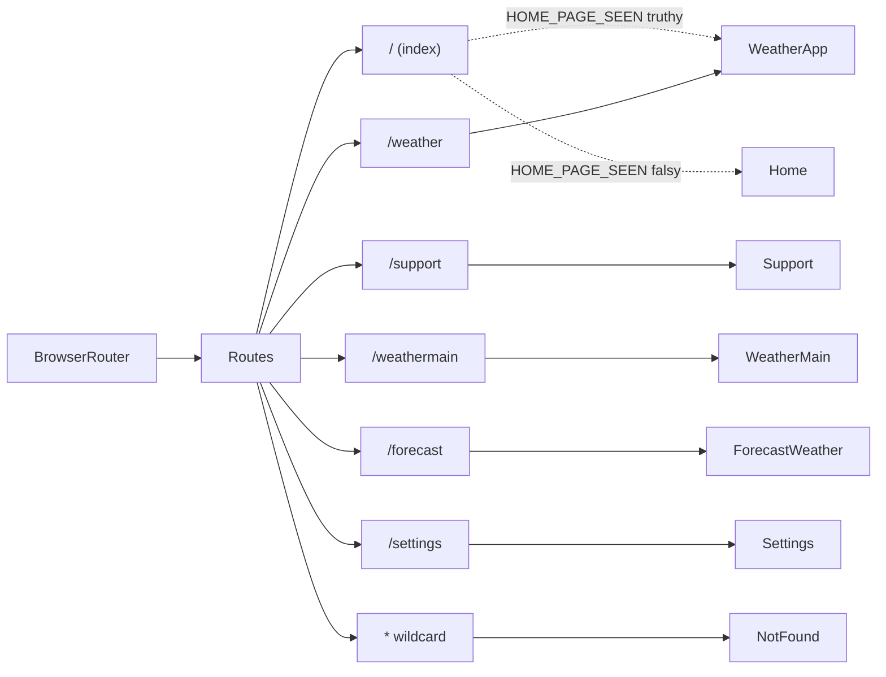

# Routing Documentation

> **Entry point and index for the React Weather Application's routing documentation set.**
>
> This document provides an at-a-glance overview of the application's routing surface, quick-lookup tables for the most common questions, a documentation map linking to every other file in the set, a compact Mermaid topology snapshot, and contributor-facing maintenance guidance.

---

## Table of Contents

1. [Overview](#1-overview)
2. [Quick Lookup — Routes Table](#2-quick-lookup--routes-table)
3. [Quick Lookup — Where Is Navigation Triggered?](#3-quick-lookup--where-is-navigation-triggered)
4. [Documentation Map](#4-documentation-map)
5. [Mermaid Topology Snapshot](#5-mermaid-topology-snapshot)
6. [How to Keep This Documentation Up to Date](#6-how-to-keep-this-documentation-up-to-date)
7. [Source Citations](#7-source-citations)

---

## 1. Overview

The React Weather Application is a single-page application (SPA) built on React 18.3.1 that uses **`react-router-dom` v6.22.3** for declarative client-side routing combined with a **custom imperative `navigate(page)` helper** for in-app page transitions. Routes are declared once in [`src/App.js`](../../src/App.js) using the `<BrowserRouter>` + `<Routes>` + `<Route>` JSX tree, and the application renders one of seven page components based on the current URL.

This is **not a typical React Router setup.** The codebase declares routes with `react-router-dom` primitives in `src/App.js`, but performs every in-app transition by calling a custom helper exported from [`src/inc/scripts/utilities.js`](../../src/inc/scripts/utilities.js). That helper assigns `window.location.href = ${page}` — a full browser page reload — rather than using React Router's `useNavigate` hook. As a result, every "redirect" in this codebase tears down the React tree and remounts it from scratch. This mixed approach has implications for both contributors (who need to understand which mechanism is in play at each call site) and users (who experience a brief reload at every navigation). The trade-offs are documented across the files in this folder.

This documentation set covers:

- The **route declarations** — 7 routes in `src/App.js`, including a conditional index route and a wildcard `*` 404
- The **21 internal/external/fallback navigation call sites** spread across pages, components, and the backend
- The **`HOME_PAGE_SEEN` flag** that drives the conditional index route
- The **imperative guards** at the top of `Weather.jsx` and `ForecastWeather.jsx`
- The **dual-mechanism navigation model** (declarative React Router + imperative helper + `window.location.href` fallback)

> **Why this folder exists:** Before this documentation was written, the routing surface was scattered across 11 source files with no consolidated reference. A new contributor had to read every page component to understand how a click on `Settings.jsx`'s back arrow propagated to `/weather`. This folder consolidates that knowledge into a single, navigable reference set.

---

## 2. Quick Lookup — Routes Table

The table below summarizes all seven routes declared in `src/App.js`. This is intentionally a compact, "at-a-glance" view — for the full table with column-by-column source citations and per-route prose, see [`routing-overview.md`](./routing-overview.md).

| Route Path     | Component                | File                                                   | Has Guard? | Conditional?                          | Detail                                                                                              |
| -------------- | ------------------------ | ------------------------------------------------------ | ---------- | ------------------------------------- | --------------------------------------------------------------------------------------------------- |
| `/` (index)    | `Home` or `WeatherApp`   | `src/pages/Home.jsx` or `src/pages/Weather.jsx`        | Indirect   | **Yes** — based on `HOME_PAGE_SEEN`   | [routing-overview.md §3](./routing-overview.md), [conditional-routing.md](./conditional-routing.md) |
| `/support`     | `Support`                | `src/pages/Support.jsx`                                | No         | No                                    | [routing-overview.md §3](./routing-overview.md)                                                     |
| `/weather`     | `WeatherApp`             | `src/pages/Weather.jsx`                                | **Yes**    | No                                    | [route-guards.md §3](./route-guards.md)                                                             |
| `/weathermain` | `WeatherMain`            | `src/pages/WeatherMain.jsx`                            | No         | No                                    | [routing-overview.md §3](./routing-overview.md)                                                     |
| `/forecast`    | `ForecastWeather`        | `src/pages/ForecastWeather.jsx`                        | **Yes**    | No                                    | [route-guards.md §4](./route-guards.md)                                                             |
| `/settings`    | `Settings`               | `src/pages/Settings.jsx`                               | No         | No                                    | [routing-overview.md §3](./routing-overview.md)                                                     |
| `*` (wildcard) | `NotFound`               | `src/pages/404.jsx`                                    | No         | No                                    | [routing-overview.md §6](./routing-overview.md)                                                     |

> **For the full table with all 8 columns and source citations,** see [`routing-overview.md §3`](./routing-overview.md). The conditional index-route logic is explained in detail in [`conditional-routing.md`](./conditional-routing.md), and the route guards are explained in [`route-guards.md`](./route-guards.md).

---

## 3. Quick Lookup — Where Is Navigation Triggered?

The table below answers the most frequently asked questions about navigation call sites. For the exhaustive Redirect Catalog containing every internal, external, and fallback navigation invocation, see [`page-redirects.md`](./page-redirects.md).

| Question                                              | Answer (with source)                                                                              |
| ----------------------------------------------------- | ------------------------------------------------------------------------------------------------- |
| Where is the post-onboarding redirect?                | `src/pages/Home.jsx:69` — `navigate("weather")`                                                   |
| Where are the route guards?                           | `src/pages/Weather.jsx:36-38` and `src/pages/ForecastWeather.jsx:44-46`                           |
| Where is the factory-reset redirect?                  | `src/backend/settings.js:98` — `navigate("/")` after `db.destroy()`                               |
| Where is the 404 "Home" button redirect?              | `src/pages/404.jsx:8` — `navigate("/weather")`                                                    |
| Where do the footer tabs navigate?                    | `src/components/footerNav.jsx:6, 10, 14` — App / Settings / Support                               |
| Where are external (GitHub) redirects?                | `src/pages/Support.jsx:12, 16` — both call `navigate(...)` with full HTTPS URLs                   |
| Where are the `window.location.href` fallbacks?       | `src/pages/Home.jsx:72` and `src/backend/settings.js:105`                                         |
| Where is the `navigate(page)` helper defined?         | `src/inc/scripts/utilities.js:3-5` — assigns `window.location.href = ${page}` (full page reload)  |

> **For the full Redirect Catalog with all 21 entries** (17 internal, 2 external, 2 fallback), see [`page-redirects.md`](./page-redirects.md). For an explanation of why this app uses a custom helper instead of React Router's `useNavigate`, see [`navigation-mechanisms.md`](./navigation-mechanisms.md).

---

## 4. Documentation Map

The routing documentation set is organized into five focused reference documents plus a visual appendix. Each document is self-contained but cross-links to the others.

| File                                                       | Purpose                                                                                                                                                                                         |
| ---------------------------------------------------------- | ----------------------------------------------------------------------------------------------------------------------------------------------------------------------------------------------- |
| **[routing-overview.md](./routing-overview.md)**           | Comprehensive route reference: route table, `BrowserRouter` setup, page component imports, conditional ternary, wildcard 404, and a route-topology Mermaid diagram                              |
| **[navigation-mechanisms.md](./navigation-mechanisms.md)** | Three-mechanism explainer: declarative React Router, imperative `navigate(page)` helper, `window.location.href` fallback; includes a decision-tree Mermaid diagram                              |
| **[page-redirects.md](./page-redirects.md)**               | Exhaustive Redirect Catalog: every internal, external, and fallback redirect with file, line, trigger, and destination; per-page incoming/outgoing tables; redirect-web Mermaid diagram         |
| **[conditional-routing.md](./conditional-routing.md)**     | The `HOME_PAGE_SEEN` flag explained: storage layer, ternary, first-time/returning user sequence diagrams, onboarding state machine, and the factory-reset cycle                                 |
| **[route-guards.md](./route-guards.md)**                   | Imperative guard pattern in `Weather.jsx` and `ForecastWeather.jsx`: code excerpts, sequence diagram, limitations, and a routes-without-guards table                                            |
| **[diagrams/README.md](./diagrams/README.md)**             | Visual reference appendix: all 7 Mermaid diagrams from the docs set aggregated into a single page for quick visual lookup                                                                       |

> **Recommended reading order for new contributors:**
>
> 1. This file (`docs/routing/README.md`) — overview and quick lookups
> 2. [`routing-overview.md`](./routing-overview.md) — *what* routes exist
> 3. [`navigation-mechanisms.md`](./navigation-mechanisms.md) — *how* navigation works
> 4. [`page-redirects.md`](./page-redirects.md) — *where* every redirect is triggered
> 5. [`conditional-routing.md`](./conditional-routing.md) — *why* the index route renders different components
> 6. [`route-guards.md`](./route-guards.md) — *which* pages enforce onboarding
> 7. [`diagrams/README.md`](./diagrams/README.md) — visual quick reference

The reading order moves from "what" → "how" → "where" → "why", which matches the typical contributor journey when investigating a routing issue.

---

## 5. Mermaid Topology Snapshot

The diagram below is a minimal left-to-right snapshot of the route declarations in `src/App.js`. It is intentionally compact — for the full topology with all annotations, source-code excerpts, and per-route detail, see [`routing-overview.md §7`](./routing-overview.md).

**Diagram legend:**

- Solid arrows (`-->`) represent unconditional route-to-component mappings declared in `src/App.js`
- Dashed arrows (`-.->`) represent the conditional index-route resolution driven by `db.get("HOME_PAGE_SEEN")` at the top of `App()`
- The two leaf nodes for the index route (`HomeCmp` and `WeatherCmp`) reflect the runtime branching in `src/App.js:13-17`

> The full topology diagram with annotations is in [`routing-overview.md §7`](./routing-overview.md). The redirect graph (which page redirects to which, with labeled arrows) is in [`page-redirects.md §7`](./page-redirects.md).

---

## 6. How to Keep This Documentation Up to Date

The routing docs in this folder are maintained alongside source code changes. **No automated documentation generator, link checker, or Markdown linter is configured for this repository.** Verification is manual: open each affected file, click every link, and visually confirm code excerpts match the cited line ranges before merging.

When making any of the following code changes, update the corresponding documentation file:

| Code Change                                                                          | File(s) to Update                                                                                                                                          |
| ------------------------------------------------------------------------------------ | ---------------------------------------------------------------------------------------------------------------------------------------------------------- |
| Add or remove a `<Route>` in `src/App.js`                                            | [`routing-overview.md`](./routing-overview.md) (route table + topology diagram), [`page-redirects.md`](./page-redirects.md) (per-page subsections), and this `README.md` (quick lookup table) |
| Change the `HOME_PAGE_SEEN` ternary or the index conditional                         | [`conditional-routing.md`](./conditional-routing.md) (sequence diagrams + state machine) and [`routing-overview.md`](./routing-overview.md) (§5)            |
| Add or remove a `navigate(...)` call in a page component                             | [`page-redirects.md`](./page-redirects.md) (Internal Redirect Catalog + per-page subsection)                                                               |
| Add a new page component file under `src/pages/`                                     | [`routing-overview.md`](./routing-overview.md) (route table + imports) AND a new per-page subsection in [`page-redirects.md`](./page-redirects.md)         |
| Change the `navigate(page)` helper itself in `src/inc/scripts/utilities.js`          | [`navigation-mechanisms.md`](./navigation-mechanisms.md) (§3) and [`routing-overview.md`](./routing-overview.md) (§4 imports table)                        |
| Add a guard to a page                                                                | [`route-guards.md`](./route-guards.md) (new §) and [`routing-overview.md`](./routing-overview.md) (Has Guard? column)                                      |
| Change line numbers cited anywhere                                                   | The corresponding citation in any documentation file (search the `docs/routing/` tree for the file path, e.g., `src/App.js:13-17`)                          |
| Bump the `react-router-dom` version in `package.json`                                | This `README.md` (§1) and [`routing-overview.md`](./routing-overview.md) (header)                                                                          |
| Replace the imperative `navigate(page)` helper with React Router's `useNavigate`     | The entire docs set — the dual-mechanism premise no longer holds; rewrite [`navigation-mechanisms.md`](./navigation-mechanisms.md) and update §1 here       |

> **No automated documentation linter is configured.** Verification is manual: open the file, click every link, and visually confirm code excerpts match the cited line ranges. The repository's `.vscode/extensions.json` recommends Prettier for Markdown formatting consistency.

**Citation format reminder.** When adding citations, use the inline pattern `Source: <repository-relative path>:<line range>` — for example, `Source: src/App.js:13-17`. Cross-document links must use **relative Markdown paths** (e.g., `./routing-overview.md`), never absolute URLs.

---

## 7. Source Citations

This README cites the most foundational source locations. For citations specific to each routing topic, see the respective documentation files linked in [§4 Documentation Map](#4-documentation-map).

- `Source: src/App.js:1-34` — Full `App.js` file: imports, `homePageSeen` ternary, `<BrowserRouter>` + `<Routes>` JSX tree
- `Source: src/App.js:13-17` — Conditional ternary that resolves `DEFAULT_ROUTE_PAGE` based on `db.get("HOME_PAGE_SEEN")`
- `Source: src/App.js:20-30` — `<BrowserRouter>` + `<Routes>` declarative routing block declaring all 7 routes
- `Source: src/inc/scripts/utilities.js:3-5` — `navigate(page)` imperative helper that assigns `window.location.href = ${page}` (full page reload)
- `Source: package.json` — Declares `react-router-dom@^6.22.3`, `react@^18.3.1`, and `react-dom@^18.3.1`

---

**Next:** Continue to [`routing-overview.md`](./routing-overview.md) for the comprehensive route reference, or jump to [`diagrams/README.md`](./diagrams/README.md) for the visual quick reference.
