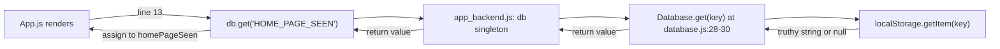
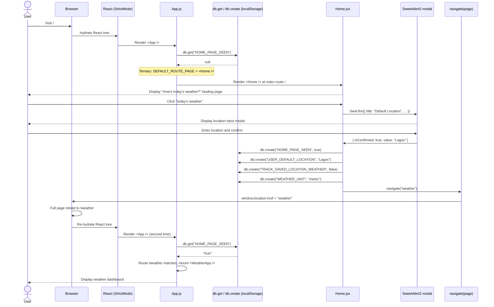
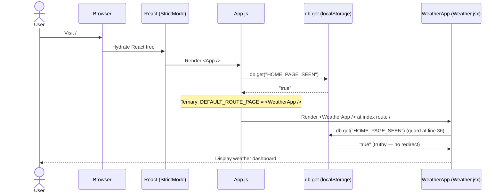
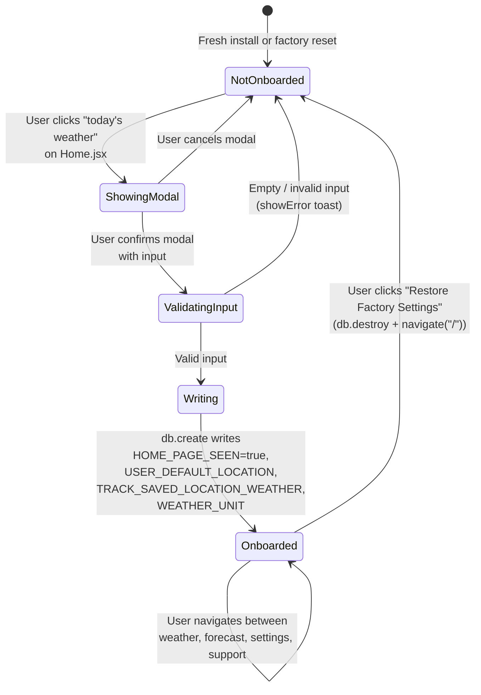

# Conditional Routing — `HOME_PAGE_SEEN` Logic

> **Conditional index-route reference for the React Weather Application.** This document explains how `src/App.js` reads the `HOME_PAGE_SEEN` flag from `localStorage` (via the `db` singleton) and renders either `<Home />` (first-time user) or `<WeatherApp />` (returning user) at the root path `/`. It documents the storage-layer call chain, the ternary that selects the index component, the first-time-user and returning-user request flows, the onboarding state machine, and the factory-reset cycle that returns a returning user to the first-time state.
>
> **See also:** [Routing Overview](./routing-overview.md) for the full route table that places this ternary in context; [Route Guards](./route-guards.md) for the same flag's use in the imperative guards on `Weather.jsx` and `ForecastWeather.jsx`; [Page Redirects](./page-redirects.md) for the post-onboarding redirect catalog entry that completes the first-time-user flow.

---

## Table of Contents

1. [Overview](#1-overview)
2. [The `HOME_PAGE_SEEN` Flag](#2-the-home_page_seen-flag)
3. [Storage Layer Path](#3-storage-layer-path)
4. [The Ternary in `App.js`](#4-the-ternary-in-appjs)
5. [First-Time User Flow](#5-first-time-user-flow)
6. [Returning User Flow](#6-returning-user-flow)
7. [Onboarding State Machine](#7-onboarding-state-machine)
8. [Factory Reset Cycle](#8-factory-reset-cycle)
9. [Source Citations](#9-source-citations)

---

## 1. Overview

The React Weather Application's index route (`/`) is **conditional**: instead of always mounting one component, `src/App.js` computes a `DEFAULT_ROUTE_PAGE` variable at render time, then passes that value to the `<Route index element={DEFAULT_ROUTE_PAGE} />` declaration. The choice between the two possible mounts is driven entirely by a single read of `db.get("HOME_PAGE_SEEN")` at `src/App.js:13`. Every other route in the table — `/support`, `/weather`, `/weathermain`, `/forecast`, `/settings`, and the wildcard `*` — is **unconditional**: each one is bound at compile time to a fixed page component. The `HOME_PAGE_SEEN` flag is therefore the **only piece of routing-relevant persistent state** in the application; remove it and the route table becomes purely static.

The two possible outcomes of the read are mutually exclusive and easy to enumerate:

- **Falsy** (`null`, returned when the flag has never been written or was destroyed by factory reset): `App.js` assigns `<Home />` to `DEFAULT_ROUTE_PAGE`. The user is treated as a first-time visitor and is shown the onboarding landing page that prompts them to enter a default location.
- **Truthy** (the literal string `"true"`, returned after a successful onboarding write): `App.js` assigns `<WeatherApp />` to `DEFAULT_ROUTE_PAGE`. The user is treated as a returning user and is shown the weather dashboard immediately, bypassing onboarding.

The flag is read in three places in the codebase. Its **canonical write site** is `Home.jsx:59` — `db.create("HOME_PAGE_SEEN", true)` — which fires immediately after the user successfully enters a default location in the onboarding modal. Its **canonical destruction** is `restoreFactorySettings` at `src/backend/settings.js:95-108`, which calls `db.destroy()` (a wrapper around `localStorage.clear()`) and then redirects to `/`. Beyond `App.js`, the flag is also consumed by **imperative guards** at `src/pages/Weather.jsx:36` and `src/pages/ForecastWeather.jsx:44`; those guards use the same flag for a related but distinct purpose — protecting deep-linked routes from being reached without onboarding — and are documented separately in [Route Guards](./route-guards.md).

> **Important distinction:** The ternary at `src/App.js:13-17` is the **only conditional logic in the route table itself**. The guards in `Weather.jsx` and `ForecastWeather.jsx` are *not* conditional routing — they are post-mount imperative redirects that fire *after* React has already mounted the page component. Conceptually, the route table mounts `<WeatherApp />` at `/weather`, and only then does the `WeatherApp` function body run a guard that may issue a `navigate("/")`. This distinction matters for contributors reasoning about render behavior; see [§5](#5-first-time-user-flow) and [§6](#6-returning-user-flow) for the full sequences.

---

## 2. The `HOME_PAGE_SEEN` Flag

This section describes the flag as a discrete entity — its key name, storage backend, type semantics, and lifecycle.

### 2.1 Flag Properties

| Property                         | Value                                                                                                                |
| -------------------------------- | -------------------------------------------------------------------------------------------------------------------- |
| Key name                         | `"HOME_PAGE_SEEN"`                                                                                                   |
| Storage backend                  | `localStorage` (via the `Database` class wrapper at `src/backend/database.js:6-40`)                                   |
| Type written to storage          | JavaScript `boolean` `true` (auto-stringified to `"true"` by `localStorage.setItem`)                                 |
| Type read from storage           | JavaScript `string` `"true"` (or `null` if absent)                                                                   |
| Truthy values that pass the gate | Any non-null, non-empty string — i.e., the literal `"true"` written by the codebase                                   |
| Falsy values that fail the gate  | `null` (the only realistic falsy value, returned when the key is absent)                                              |
| Created by                       | `src/pages/Home.jsx:59` — `db.create("HOME_PAGE_SEEN", true)`                                                         |
| Read by                          | `src/App.js:13` (route choice), `src/pages/Weather.jsx:36` (guard), `src/pages/ForecastWeather.jsx:44` (guard)        |
| Destroyed by                     | `src/backend/settings.js:97` — `db.destroy()` (factory reset clears all keys, including this one)                     |

### 2.2 Semantic Meaning

> The flag's name is intentionally past-tense: **"the home page has been seen"**. A truthy value means the user has already completed the one-time onboarding flow on `Home.jsx` (entered a default location, clicked "Save Location", and triggered the database writes at lines 59–62). A falsy value means the user is either a first-time visitor (the flag was never created) or a returning user who has just performed a factory reset (`db.destroy()` cleared all keys, including this one).

The naming choice is significant for two reasons. First, it encodes a **historical fact** about the user's prior interaction with the app rather than a setting they could toggle — there is no UI affordance to set or unset this flag explicitly. Second, the past-tense framing makes the route-selection logic read naturally: "if the home page has been seen, show the weather; otherwise show the home page". The ternary at `src/App.js:15-17` reads in exactly that order.

### 2.3 Lifecycle

The flag's lifecycle has four phases. Each is summarised below; the corresponding section of this document elaborates with sequence diagrams and source excerpts.

- **Created (lifecycle birth):** When a first-time user enters a valid location and confirms the onboarding modal in `Home.jsx`, line 59 writes `db.create("HOME_PAGE_SEEN", true)`. This is the **only write site for this flag in the codebase**. See [§5](#5-first-time-user-flow) for the full first-time-user flow that culminates in this write.
- **Read (every render):** Every render of `App.js` reads the flag at line 13. Every render of `Weather.jsx` and `ForecastWeather.jsx` also reads it via their guards (lines 36 and 44 respectively). The read is synchronous and runs at every component render; there is no memoization. See [§3](#3-storage-layer-path) for the full call chain.
- **Updated:** **The codebase contains no update path for this flag.** It is either created or destroyed; it is never explicitly set to `false`, and there is no other write site. This is a deliberate design choice: a "first-time user" is defined as someone for whom the flag does not exist, not someone for whom the flag is `false`.
- **Destroyed (lifecycle death):** When the user clicks "Restore Factory Settings" on `Settings.jsx`, the handler `settings.restoreFactorySettings` calls `db.destroy()` (which is `localStorage.clear()` per `src/backend/database.js:36-38`), wiping this flag along with every other key. The redirect to `/` after destruction triggers a full page reload, and the next read (in `App.js`) returns `null`, sending the user back to `Home.jsx`. See [§8](#8-factory-reset-cycle) for the full factory-reset cycle.

---

## 3. Storage Layer Path

This section traces the call chain from the user-visible read in `App.js` down to the browser's native `localStorage` API. The chain is intentionally short and synchronous — there is no IndexedDB, no IndexedDB-via-Promise wrapper, no asynchronous fetch, and no React `useEffect`-driven hydration. The read at `App.js:13` returns by the time the next line executes.

### 3.1 Numbered Call Chain

1. **`src/App.js:13`** — `let homePageSeen = db.get("HOME_PAGE_SEEN");` — calls the `get` method on the `db` singleton imported from `src/backend/app_backend.js`. The result is assigned to a local variable `homePageSeen` that is consumed exactly once, by the ternary on the next line.
2. **`src/backend/app_backend.js:3`** — `export let db = new Database();` — exports a single instance of the `Database` class for the entire application to share. Every file that needs `localStorage` access imports `db` from this module rather than instantiating its own `Database`. (Note: The variable is declared with `let` rather than `const`; this allows test rigs or hot-reload tooling to replace the singleton, but in production it is a stable, never-reassigned instance.)
3. **`src/backend/database.js:28-30`** — The `get` method on the `Database` instance:

   ```js
   this.get = key => {
     return localStorage.getItem(key);
   };
   ```

   This is a thin synchronous wrapper around the browser's native `localStorage.getItem(key)` API. There is no in-memory cache, no fallback for environments that lack `localStorage`, and no error handling — the wrapper exists primarily to provide a stable seam between the application code and the browser API so that the persistence layer can be swapped without touching call sites.
4. **Browser `localStorage`** — Returns the string value associated with `key`, or `null` if the key does not exist. Values persist across browser sessions until cleared by user action (e.g., browser dev tools), by `localStorage.clear()` (which `db.destroy()` invokes), or by domain expiration / quota policies (rare; `localStorage` is one of the most durable client storage mechanisms in modern browsers).

### 3.2 Mermaid: Call Chain Diagram



### 3.3 Why a String, Not a Boolean

The `db.create("HOME_PAGE_SEEN", true)` write at `Home.jsx:59` passes a JavaScript `boolean` `true` to `localStorage.setItem`. However, **`localStorage` only stores strings** — when given a non-string value, the browser auto-stringifies it. The literal `true` therefore becomes the string `"true"` when stored, and `db.get("HOME_PAGE_SEEN")` later returns the string `"true"` rather than the boolean `true`. The ternary in `App.js` and the guards in `Weather.jsx` / `ForecastWeather.jsx` work correctly because the string `"true"` is truthy in JavaScript, but this also means **the codebase cannot use strict-equality comparisons like `db.get("HOME_PAGE_SEEN") === true` or `db.get("HOME_PAGE_SEEN") === false`** — those comparisons would always be false. The only realistic comparison value is `null` (returned when the key is absent), and the codebase relies entirely on the truthy/falsy distinction rather than explicit value comparisons.

---

## 4. The Ternary in `App.js`

This section walks through the conditional logic at the heart of the index-route mount: the ternary at `src/App.js:13-17` and the JSX consumer at `src/App.js:22`.

### 4.1 Code Excerpt (Lines 12–17)

The following excerpt is reproduced verbatim from `src/App.js:12-17`:

```js
function App() {
  let homePageSeen = db.get("HOME_PAGE_SEEN");
  let DEFAULT_ROUTE_PAGE;
  homePageSeen
    ? (DEFAULT_ROUTE_PAGE = <WeatherApp />)
    : (DEFAULT_ROUTE_PAGE = <Home />);
```

### 4.2 Annotation

1. **Line 12:** Function component `App` declared. This is the top-level component for the entire React tree, mounted by `src/index.js` inside `<React.StrictMode>`.
2. **Line 13:** Synchronous read of `HOME_PAGE_SEEN` from `localStorage` via `db.get(...)`. The result is a string (`"true"`) for returning users, or `null` for first-time users. See [§3](#3-storage-layer-path) for the full call chain that produces this value.
3. **Line 14:** Hoisted-style declaration of `DEFAULT_ROUTE_PAGE` (intended to be assigned in the next statement). This declaration is intentionally separate from the assignment to avoid an `if/else` block — the next three lines are a ternary expression that performs the assignment in one of two side-effect branches.
4. **Lines 15–17:** A ternary expression with side-effect assignments in its branches. JavaScript evaluates the ternary as follows:
   - If `homePageSeen` is truthy (any non-empty string — in practice the literal `"true"`), assign `<WeatherApp />` to `DEFAULT_ROUTE_PAGE`.
   - Otherwise (falsy — i.e., `null`), assign `<Home />` to `DEFAULT_ROUTE_PAGE`.
5. The ternary expression's *return value* is discarded. The value of the ternary is the right-hand side of whichever branch ran (the JSX element that was just assigned), but the discard is intentional — only the side-effect assignments matter, and the ternary form is being used in lieu of an `if/else` purely for compactness.

### 4.3 Why a Ternary Instead of an `if/else`?

This is purely stylistic. The ternary form is more compact than the equivalent `if/else` block:

```js
if (homePageSeen) {
  DEFAULT_ROUTE_PAGE = <WeatherApp />;
} else {
  DEFAULT_ROUTE_PAGE = <Home />;
}
```

Both forms produce identical behavior. Future maintainers may convert from one form to the other for readability without changing semantics. The current ternary form has the (minor) downside that it is unusual to see a ternary used solely for side effects with its return value discarded; the `if/else` form is arguably more idiomatic for that scenario. Either way, the conditional logic itself is unchanged.

### 4.4 How `DEFAULT_ROUTE_PAGE` Is Used

Lines 19–32 of `src/App.js` are reproduced verbatim below:

```jsx
  return (
    <BrowserRouter>
      <Routes>
        <Route index element={DEFAULT_ROUTE_PAGE} />
        <Route path="support" element={<Support />} />
        <Route path="weather" element={<WeatherApp />} />
        <Route path="weathermain" element={<WeatherMain />} />
        <Route path="forecast" element={<ForecastWeather />} />
        <Route path="settings" element={<Settings />} />
        <Route path="*" element={<NotFound />} />
      </Routes>
    </BrowserRouter>
  );
}
```

The crucial line is **line 22**: `<Route index element={DEFAULT_ROUTE_PAGE} />`. The `index` prop tells `react-router-dom` v6 to use this route as the default child route of the parent `<Routes>` block — at the root of `BrowserRouter`'s base, that is the path `/`. Visiting `/` therefore mounts the JSX element stored in `DEFAULT_ROUTE_PAGE`, which is either `<Home />` or `<WeatherApp />` depending on what the ternary computed at lines 15–17.

**Note an important consequence of this pattern:** the `<WeatherApp />` element appears **twice** in the `<Routes>` tree — once as the truthy branch of the ternary that becomes `DEFAULT_ROUTE_PAGE` (consumed at line 22), and once explicitly at line 24 (`<Route path="weather" element={<WeatherApp />} />`). For a returning user, both `/` and `/weather` mount the `WeatherApp` component; the difference is that the `/weather` mount also runs the guard at `WeatherApp` lines 36–38, while the `/` mount via `DEFAULT_ROUTE_PAGE` reaches `WeatherApp` only because the `App.js` ternary already verified the flag. See [§6](#6-returning-user-flow) for the full sequence of both mounts and [Route Guards](./route-guards.md) for the guard mechanics.

---

## 5. First-Time User Flow

This section traces the complete journey of a first-time user from their initial visit to the application URL through the onboarding modal to the eventual landing on the weather dashboard.

### 5.1 Narrative

A first-time user opens the application URL (e.g., the Vercel deployment). Their browser loads `index.html`, which loads the bundled JavaScript, which mounts the React tree at `<App />`. `App.js` line 13 reads `db.get("HOME_PAGE_SEEN")` from the user's `localStorage`; because this is the first visit, the key is absent and `localStorage.getItem` returns `null`. The ternary on lines 15–17 picks the falsy branch and assigns `<Home />` to `DEFAULT_ROUTE_PAGE`. React Router matches the index route (line 22) and mounts `<Home />` at `/`. The user sees the onboarding "How's today's weather?" landing page with a single call-to-action button labelled "today's weather".

The user clicks "today's weather". The `click` handler in `Home.jsx` opens a SweetAlert2 modal that prompts for a default location. The user enters a location (e.g., "Lagos") and clicks "Save Location". The handler validates the input (rejecting empty or whitespace-only values via `showError`), then on success calls `showSuccess(...)` to display a toast and writes four database keys at lines 59–62: `HOME_PAGE_SEEN: true`, `USER_DEFAULT_LOCATION: <input>`, `TRACK_SAVED_LOCATION_WEATHER: false`, and `WEATHER_UNIT: "metric"`. After the writes complete, the handler calls `navigate("weather")` at line 69. This is the imperative `navigate(page)` helper from `src/inc/scripts/utilities.js:3-5`, which assigns `window.location.href = "weather"` and triggers a **full browser page reload** to `/weather`. On the next page load, the React tree is torn down and remounted from scratch: `App.js` runs again, line 13 re-reads `HOME_PAGE_SEEN` (now returning the string `"true"`), the ternary picks the truthy branch, and `DEFAULT_ROUTE_PAGE` is assigned `<WeatherApp />`. However, because the URL is now `/weather` (not `/`), React Router matches the `<Route path="weather" element={<WeatherApp />} />` declaration at line 24 directly and mounts `WeatherApp` from there. The user sees the weather dashboard.

### 5.2 Sequence Diagram



> **Note:** The post-onboarding redirect via `navigate("weather")` at `Home.jsx:69` is **catalogued in [Page Redirects](./page-redirects.md) §5.1 (Home.jsx outgoing)**. The fallback path in the catch block at `Home.jsx:72` (`window.location.href = "/weather"`) — which fires only if the call to `navigate(...)` itself throws — is documented in the same section. Note also that the bare-relative `"weather"` argument to `navigate(...)` resolves correctly because the user is at `/` when the helper runs; if the onboarding modal were ever moved to a deeper path, the bare-relative argument would resolve relative to the new path. See [Page Redirects](./page-redirects.md) for the full discussion of bare-relative vs. absolute navigation arguments.

### 5.3 Why the Reload Is Acceptable Here

A first-time user experiences exactly one full page reload during onboarding — the reload that `navigate("weather")` triggers at `Home.jsx:69`. This reload is acceptable for two reasons. First, it is the *only* moment in the user's session where the React tree must be re-evaluated from scratch with the newly written `localStorage` flag; without the reload, the in-memory `App.js` component instance has already finished its render cycle and would not re-read `HOME_PAGE_SEEN`. Second, the reload guarantees a clean state for the weather dashboard: any in-flight fetches, modal state, or DOM mutations from the onboarding flow are torn down and the dashboard mounts fresh. Once the user reaches `/weather`, all subsequent navigations also incur a full reload (because every internal call site uses the same `navigate(page)` helper), but those reloads do not change the route-mount decision — `HOME_PAGE_SEEN` is `"true"` from this point on.

---

## 6. Returning User Flow

This section traces the journey of a returning user — someone who has previously completed onboarding — from their visit to the application URL to the weather dashboard. The flow is much shorter than the first-time flow because no onboarding occurs.

### 6.1 Narrative

A returning user — identified by the presence of `HOME_PAGE_SEEN` in their `localStorage` — visits the application URL. Their browser loads `index.html`, mounts `<App />`, and `App.js` line 13 reads `db.get("HOME_PAGE_SEEN")`. The flag is `"true"` (still present in `localStorage` from a prior session). The ternary at lines 15–17 picks the truthy branch and assigns `<WeatherApp />` to `DEFAULT_ROUTE_PAGE`. React Router matches the index route (line 22) and mounts `<WeatherApp />` directly at `/`, bypassing the onboarding flow entirely. The user sees the weather dashboard immediately.

Inside `WeatherApp` itself, the function body runs the imperative guard at lines 36–38 (`if (!db.get("HOME_PAGE_SEEN")) { navigate("/"); }`). For a returning user, this guard is a **no-op**: the flag is already `"true"`, the `if` predicate is `false`, and the function continues to render the dashboard. The guard is *redundant* for the index-route mount because `App.js` already verified the flag before assigning `<WeatherApp />` to `DEFAULT_ROUTE_PAGE`; however, the guard is *essential* when `WeatherApp` is mounted at the explicit `/weather` route (e.g., via a footer-tab click, a deep link, or the post-onboarding redirect from `Home.jsx`). The guard ensures that any path leading to `<WeatherApp />` via the explicit `/weather` route (which has no conditional in `App.js`) also enforces the onboarding requirement. See [Route Guards](./route-guards.md) for the full guard semantics, including the synchronous-read caveat and the full-page-reload behavior.

### 6.2 Sequence Diagram



> **Note:** The guard read at `Weather.jsx:36` is redundant for the index-route mount (because `App.js` already verified the flag) but is **essential** when `WeatherApp` is mounted at the explicit `/weather` route — see [Route Guards](./route-guards.md) for details. The same guard pattern is also implemented at `ForecastWeather.jsx:44` to protect the `/forecast` route.

### 6.3 Why the Flag Is Read Twice

The double read — once at `App.js:13` and once at `Weather.jsx:36` — is intentional defense-in-depth. Without the `App.js` ternary, a returning user visiting `/` would first see `<Home />` (which would itself need to either auto-skip onboarding or redirect to `/weather`). Without the `Weather.jsx` guard, a first-time user who deep-links directly to `/weather` (or to `/forecast` for the same guard at `ForecastWeather.jsx:44`) would bypass onboarding entirely and reach the dashboard in an inconsistent state — `USER_DEFAULT_LOCATION`, `TRACK_SAVED_LOCATION_WEATHER`, and `WEATHER_UNIT` would all be unwritten, and the dashboard would render with default values that may not reflect the user's preferences. The two-tier check ensures both invariants: (a) the index route picks the right component, and (b) the named `/weather` and `/forecast` routes are reachable only after onboarding.

---

## 7. Onboarding State Machine

This section describes the lifecycle of the `HOME_PAGE_SEEN` flag from a state-machine perspective. The states are derived from the flag's presence/absence in `localStorage` and from transient UI states during the onboarding interaction in `Home.jsx`.

### 7.1 State Diagram



### 7.2 State Descriptions

- **NotOnboarded:** The `HOME_PAGE_SEEN` key is absent from `localStorage`. `App.js` reads `null` from `db.get("HOME_PAGE_SEEN")` and renders `<Home />` at `/`. Guards on `Weather.jsx:36-38` and `ForecastWeather.jsx:44-46` redirect any direct visits to those routes back to `/` — meaning the user *cannot* reach the weather dashboard without first transitioning through the modal flow. This is the entry state for fresh installs and the post-factory-reset state.
- **ShowingModal:** The user has clicked the "today's weather" button on `Home.jsx`, and a SweetAlert2 modal is open on the screen, waiting for the user to enter a default location. The modal is configured with `allowOutsideClick: false`, `allowEscapeKey: false`, and `allowEnterKey: false` (per `Home.jsx:38-40`), meaning the only ways out of this state are (a) confirming with input, which transitions to `ValidatingInput`, or (b) explicitly cancelling via the dialog's cancel affordance, which transitions back to `NotOnboarded`.
- **ValidatingInput:** The user has clicked "Save Location" and the modal has resolved with `{ isConfirmed: true, value: <input> }`. The `Home.jsx` handler at lines 47–50 reads the input value, trims it, and checks for emptiness. If the trimmed value is empty or undefined, the handler calls `showError("Please enter a valid location")` (line 52) and the state machine returns to `NotOnboarded` — the modal closes but the flag has not been written. If the trimmed value is non-empty, the state transitions to `Writing`.
- **Writing:** The four `db.create(...)` calls at `Home.jsx:59-62` are executing. These four writes are wrapped in a single try/catch block (lines 58–66); if any write throws, the handler shows an error toast but continues to the navigation step. In the happy path, all four writes succeed and the state transitions to `Onboarded`.
- **Onboarded:** All four keys are present in `localStorage` (`HOME_PAGE_SEEN`, `USER_DEFAULT_LOCATION`, `TRACK_SAVED_LOCATION_WEATHER`, `WEATHER_UNIT`). The user can navigate freely between `/weather`, `/forecast`, `/settings`, and `/support`; `App.js`, `Weather.jsx`, and `ForecastWeather.jsx` all see truthy `HOME_PAGE_SEEN` values on every render. This is the steady-state for normal use.

### 7.3 Self-Loop on `Onboarded`

The `Onboarded → Onboarded` self-loop in the state diagram represents normal in-app navigation: clicking the footer tabs, clicking the back arrow on `Settings.jsx` or `Support.jsx`, clicking through the forecast/weathermain/back-arrow chain on the dashboard, and so on. None of these navigations change the `HOME_PAGE_SEEN` flag — they only change which page is currently rendered. From the flag's perspective, the state machine sits in `Onboarded` for the entire duration of the user's session until either the user closes the browser tab (which preserves `localStorage`, so the next session also begins in `Onboarded`) or performs a factory reset (which transitions to `NotOnboarded` per [§8](#8-factory-reset-cycle)).

### 7.4 Asymmetry of the Diagram

Note the **asymmetry** of the state diagram: there are several edges leading from `NotOnboarded` toward `Onboarded` (through `ShowingModal`, `ValidatingInput`, and `Writing`), but **only one edge leading from `Onboarded` back to `NotOnboarded`** — the factory-reset edge. There is no UI in the application that allows a user to transition from `Onboarded` back to `NotOnboarded` without performing a destructive factory reset (which clears every other piece of user state, not just the onboarding flag). This asymmetry is documented further in [§8.4](#84-asymmetry-and-the-only-path-back).

---

## 8. Factory Reset Cycle

The factory-reset cycle is the only documented mechanism for transitioning a user from the `Onboarded` state back to the `NotOnboarded` state. This section documents the entire cycle: the source of the reset action, the sequence of operations, and the resulting state of the application.

### 8.1 Code Excerpt — `restoreFactorySettings`

The following excerpt is reproduced verbatim from `src/backend/settings.js:95-108`. Note that the source file uses **tabs** for indentation (not spaces).

```js
export const restoreFactorySettings = () => {
	try {
		db.destroy();
		navigate("/");
	} catch (error) {
		// Fallback: attempt navigation even if destroy fails
		try {
			navigate("/");
		} catch (navError) {
			// If navigation also fails, reload the page as last resort
			window.location.href = "/";
		}
	}
};
```

### 8.2 Annotation

1. **Line 95:** `restoreFactorySettings` is exported from `src/backend/settings.js`. It is invoked from the Settings page; specifically, the Settings UI binds it as the `onClick` handler of the "Restore Factory Settings" button (`onClick={settings.restoreFactorySettings}`).
2. **Lines 96–98:** The primary try block — call `db.destroy()` (which executes `localStorage.clear()` per `src/backend/database.js:36-38`, wiping every key including `HOME_PAGE_SEEN`, `USER_DEFAULT_LOCATION`, `TRACK_SAVED_LOCATION_WEATHER`, and `WEATHER_UNIT`), then call `navigate("/")` to redirect to the index route. The two operations execute synchronously and in order: first the storage is cleared, then the redirect is issued.
3. **Lines 99–107:** The multi-tier catch block. If anything in the primary try throws (e.g., `localStorage.clear` fails because the storage is locked, or `navigate` fails because the helper module did not load):
   - **First tier (lines 100–102):** Re-attempt `navigate("/")`. This is a defensive retry that handles the case where the first call to `navigate` threw between the (already-completed) `db.destroy()` and the actual `window.location.href` assignment. In practice this should never fire because `navigate` is a one-line wrapper, but the defensive layer is present for robustness.
   - **Second tier (lines 103–105):** Fall back to `window.location.href = "/"`. This is the **last-resort fallback**: it bypasses the `navigate(page)` helper entirely and assigns `window.location.href` directly. It fires only when even the retry of `navigate(...)` throws — for example, if `utilities.js` failed to load at all and the helper symbol is undefined.
4. **Line 108:** End of function. There is no return value; `restoreFactorySettings` is purely side-effectful.

### 8.3 What Happens Next

After `restoreFactorySettings` runs to completion (regardless of which tier of the catch chain is exercised), the browser begins loading `/`. From the user's perspective, this looks like a brief flash of white before the React tree reappears. From the application's perspective, the following sequence executes:

1. The browser begins loading `/`. The current React tree is fully torn down (because `window.location.href = "/"` triggers a full reload — see [Navigation Mechanisms](./navigation-mechanisms.md) for the full mechanism inventory).
2. The browser fetches `index.html`, the bundled JavaScript, and re-hydrates the React tree from scratch.
3. `App.js` runs again. Line 13 reads `db.get("HOME_PAGE_SEEN")` — but `localStorage` was just cleared by `db.destroy()`, so `localStorage.getItem("HOME_PAGE_SEEN")` returns `null`.
4. The ternary at lines 15–17 picks the falsy branch and assigns `<Home />` to `DEFAULT_ROUTE_PAGE`.
5. React Router matches the index route (line 22) and mounts `<Home />` at `/`. The user sees the onboarding "How's today's weather?" landing page again — back at the **NotOnboarded** state of the state machine.

### 8.4 Asymmetry and the Only Path Back

This is the **only documented path** from the `Onboarded` state back to the `NotOnboarded` state in the application. There is no other UI affordance, no settings toggle, no API call, and no in-app gesture that returns a returning user to the first-time-user experience. (Outside the application itself, a user could clear `localStorage` via the browser's developer tools or by clearing site data through the browser's privacy settings — but those are user-controlled actions external to the codebase, not application paths.) Future maintainers should be aware of this asymmetry: many transitions go from `NotOnboarded → Onboarded`, but only one — `restoreFactorySettings` — goes back. If a feature ever needs to allow the user to "re-onboard" without destroying their other settings, a new path would have to be added (e.g., a dedicated `clearHomeFlag` action that calls `db.delete("HOME_PAGE_SEEN")` rather than `db.destroy()`).

### 8.5 Why the Redirect Is Necessary

A subtle point worth noting: `db.destroy()` alone is **not sufficient** to return the user to the `NotOnboarded` state from the user's perspective. Without the subsequent `navigate("/")`, the React tree would continue rendering whatever component the user was viewing when they clicked "Restore Factory Settings" — typically `<Settings />` itself — and the next time `App.js` re-evaluates the ternary (which only happens on a full reload, since `App.js` is the root component) it would re-read `null` and assign `<Home />`. But that re-evaluation does not happen automatically. The `navigate("/")` call forces the reload that re-runs `App.js`, ensuring the user is shown the `Home` page rather than continuing to render `Settings` over a now-empty `localStorage`. The `window.location.href = "/"` last-resort fallback achieves the same effect through a more direct mechanism. See [Navigation Mechanisms](./navigation-mechanisms.md) for the full discussion of why a full reload is necessary to re-evaluate the index ternary.

---

## 9. Source Citations

The following lists every source file referenced by this document, with line ranges for the cited content. The citation format is `Source: <repository-relative path>:<line range>`.

- `Source: src/App.js:12-32` — Full `App` function: imports, ternary read of `HOME_PAGE_SEEN`, route table, conditional index mount (covered in [§4](#4-the-ternary-in-appjs))
- `Source: src/App.js:13` — `let homePageSeen = db.get("HOME_PAGE_SEEN");` (the synchronous read from `localStorage`; covered in [§3.1](#31-numbered-call-chain) and [§4.1](#41-code-excerpt-lines-1217))
- `Source: src/App.js:14` — `let DEFAULT_ROUTE_PAGE;` (hoisted-style declaration; covered in [§4.2](#42-annotation))
- `Source: src/App.js:15-17` — Ternary that assigns `<WeatherApp />` or `<Home />` to `DEFAULT_ROUTE_PAGE` (covered in [§4.1](#41-code-excerpt-lines-1217) and [§4.2](#42-annotation))
- `Source: src/App.js:19-32` — `<BrowserRouter>` + `<Routes>` JSX tree (covered in [§4.4](#44-how-default_route_page-is-used))
- `Source: src/App.js:22` — `<Route index element={DEFAULT_ROUTE_PAGE} />` — index route mount that consumes the ternary's output (covered in [§4.4](#44-how-default_route_page-is-used))
- `Source: src/App.js:24` — `<Route path="weather" element={<WeatherApp />} />` — explicit `/weather` route mount (referenced in [§4.4](#44-how-default_route_page-is-used) and [§5.1](#51-narrative))
- `Source: src/backend/database.js:6-40` — Full `Database` class definition (constructor body containing `create`, `delete`, `update`, `get`, `countItems`, `destroy`)
- `Source: src/backend/database.js:28-30` — `Database.get(key)` synchronous wrapper around `localStorage.getItem` (covered in [§3.1](#31-numbered-call-chain))
- `Source: src/backend/database.js:36-38` — `Database.destroy()` synchronous wrapper around `localStorage.clear` (referenced in [§2.3](#23-lifecycle), [§7.1](#71-state-diagram), and [§8.2](#82-annotation))
- `Source: src/backend/app_backend.js:1-3` — `db` singleton instantiation; the singleton is consumed by every routing read (covered in [§3.1](#31-numbered-call-chain))
- `Source: src/pages/Home.jsx:31-89` — Full `click` handler covering modal open, validation, `db.create` writes, and post-onboarding redirect
- `Source: src/pages/Home.jsx:38-40` — Modal options (`allowOutsideClick: false`, `allowEscapeKey: false`, `allowEnterKey: false`); referenced in [§7.2](#72-state-descriptions)
- `Source: src/pages/Home.jsx:47-50` — Input read and emptiness validation; referenced in [§7.2](#72-state-descriptions)
- `Source: src/pages/Home.jsx:59-62` — `db.create` writes for `HOME_PAGE_SEEN`, `USER_DEFAULT_LOCATION`, `TRACK_SAVED_LOCATION_WEATHER`, `WEATHER_UNIT` (covered in [§5.1](#51-narrative) and [§7.1](#71-state-diagram))
- `Source: src/pages/Home.jsx:69` — `navigate("weather")` post-onboarding redirect (covered in [§5.1](#51-narrative))
- `Source: src/pages/Home.jsx:72` — `window.location.href = "/weather"` catch-block fallback (referenced in the post-diagram note in [§5.2](#52-sequence-diagram))
- `Source: src/pages/Weather.jsx:34-38` — Function-component declaration plus the imperative guard at lines 36–38 (`if (!db.get("HOME_PAGE_SEEN")) { navigate("/"); }`); referenced in [§6.1](#61-narrative) and [§6.3](#63-why-the-flag-is-read-twice)
- `Source: src/pages/ForecastWeather.jsx:42-46` — Function-component declaration plus the imperative guard at lines 44–46 (`if (!db.get("HOME_PAGE_SEEN")) { navigate("/"); }`); referenced in [§6.3](#63-why-the-flag-is-read-twice) and [§7.2](#72-state-descriptions)
- `Source: src/backend/settings.js:95-108` — `restoreFactorySettings` function (factory reset cycle); covered in full in [§8.1](#81-code-excerpt--restorefactorysettings) and [§8.2](#82-annotation)
- `Source: src/inc/scripts/utilities.js:3-5` — `navigate(page)` helper definition (`window.location.href = ${page}` assignment); referenced throughout this document wherever an in-app redirect occurs

---

> **Document maintenance notice.** Any future change to `src/App.js` lines 12–32 (the ternary or the `<Routes>` tree), to `src/backend/database.js` lines 28–38 (the `get` and `destroy` methods), to `src/pages/Home.jsx` lines 59–72 (the onboarding writes and post-onboarding redirect), or to `src/backend/settings.js` lines 95–108 (the factory-reset function) requires a corresponding update to this file. The sequence diagrams and the state machine in particular must remain synchronized with the source. See [`docs/routing/README.md` §6](./README.md) for the full contributor-facing maintenance protocol that applies to every file in `docs/routing/`.
