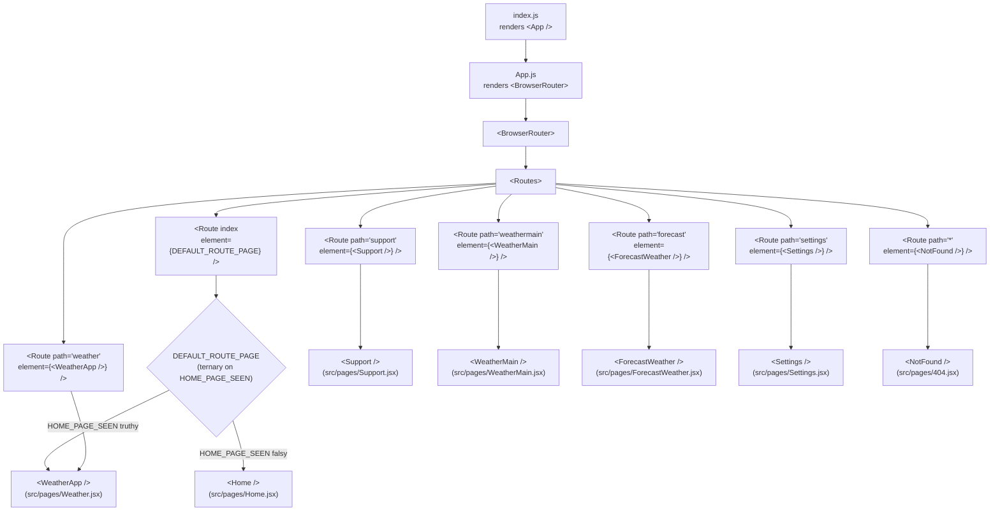
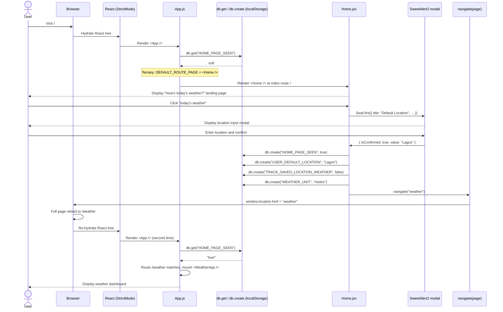
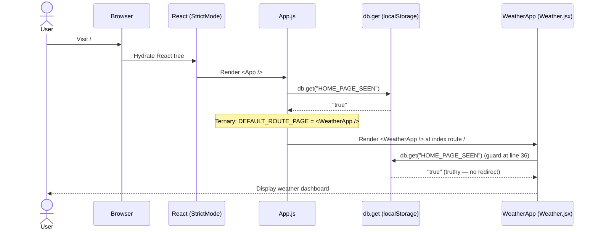
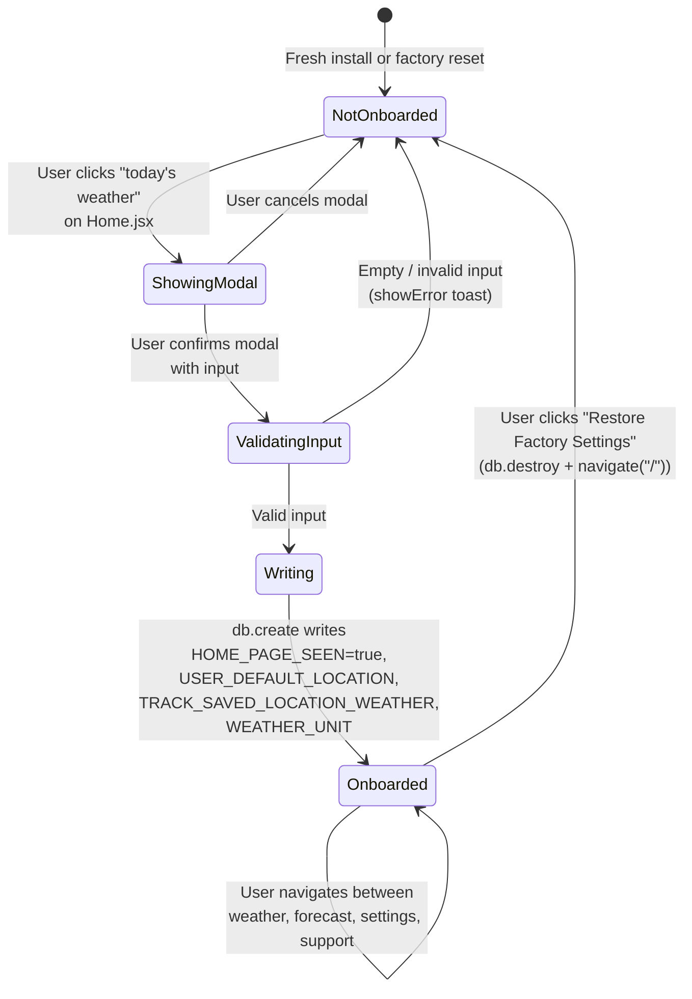
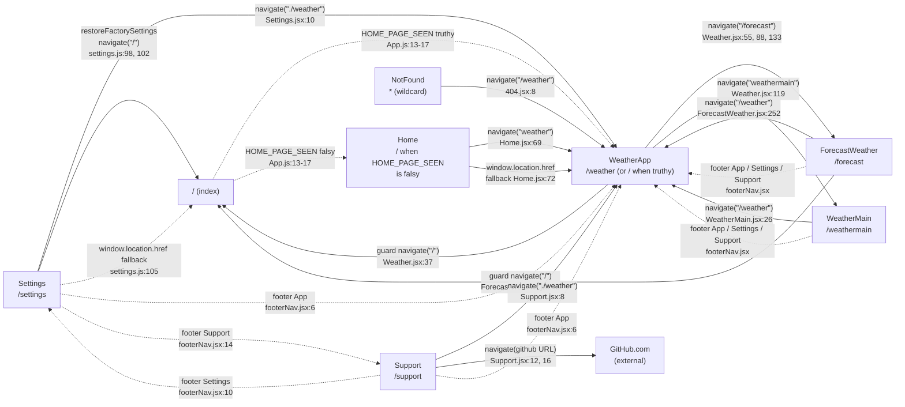
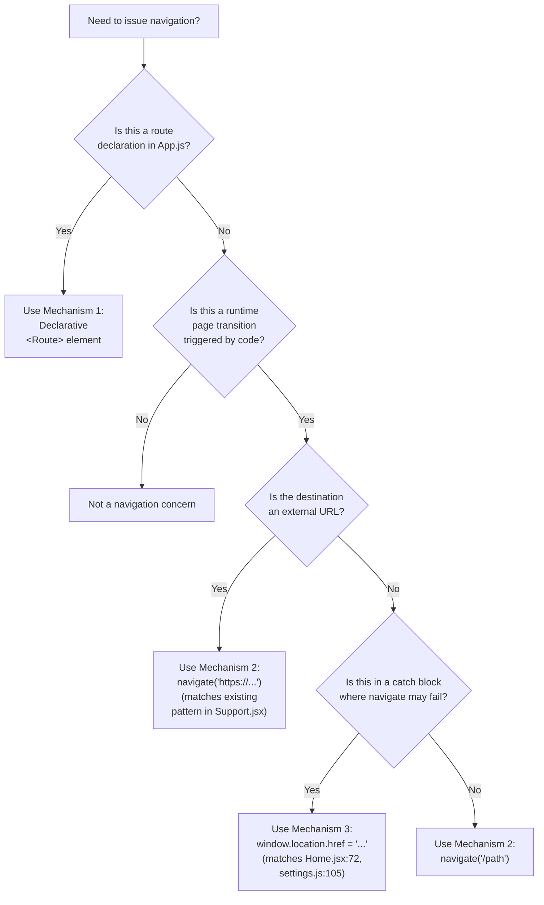
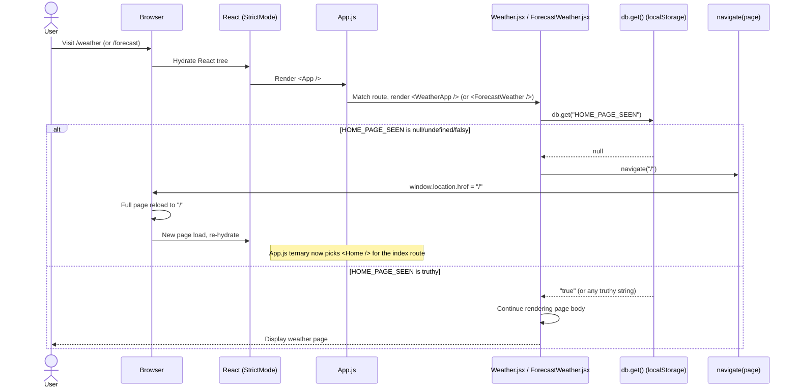

# Routing Diagrams — Visual Reference Appendix

> **Reading note:** This is a **visual quick-reference**. Each diagram below is reproduced from its canonical parent document. For full prose context, follow the "Source" link beneath each diagram. The canonical version of every diagram lives in the parent doc, NOT here. If a parent diagram changes, this file must be updated to match.
>
> See also: [`../README.md`](../README.md) — routing docs index.

This page aggregates all 7 Mermaid diagrams from the routing documentation set. Each section below contains the diagram itself plus a back-link to the parent document where the full prose explanation lives.

**Diagrams in this appendix:**

1. [Route Topology](#1-route-topology) — `flowchart TD` of the 7 declarative routes from `src/App.js`
2. [First-Time User Flow](#2-first-time-user-flow) — `sequenceDiagram` of the onboarding redirect chain
3. [Returning User Flow](#3-returning-user-flow) — `sequenceDiagram` of the truthy-flag short-circuit
4. [Onboarding State Machine](#4-onboarding-state-machine) — `stateDiagram-v2` for the `HOME_PAGE_SEEN` lifecycle
5. [Redirect Web](#5-redirect-web) — `flowchart LR` of every page-to-page redirect edge
6. [Navigation Mechanism Decision Tree](#6-navigation-mechanism-decision-tree) — `flowchart TD` for choosing a redirect mechanism
7. [Route Guard Sequence](#7-route-guard-sequence) — `sequenceDiagram` for the imperative guard pattern

---

## 1. Route Topology

A top-down view of the React tree mounting the seven `<Route>` declarations from `src/App.js:22-28`, including the conditional ternary that selects between `<WeatherApp />` and `<Home />` for the index route.

**Source:** [`../routing-overview.md` §7 (Route Topology Diagram)](../routing-overview.md)

---

## 2. First-Time User Flow

A sequence diagram tracing the request from the browser to `index.js`, `App.js`, the falsy `db.get("HOME_PAGE_SEEN")`, the `Home` onboarding modal, the four `db.create` writes, and the post-onboarding `navigate("weather")` redirect (a full page reload).

**Source:** [`../conditional-routing.md` §5 (First-Time User Flow)](../conditional-routing.md)

---

## 3. Returning User Flow

A sequence diagram showing the abbreviated path for a returning user: `App.js` reads a truthy `HOME_PAGE_SEEN`, the ternary picks `<WeatherApp />`, the `Weather.jsx` guard re-reads the flag (still truthy), and the dashboard renders without onboarding.

**Source:** [`../conditional-routing.md` §6 (Returning User Flow)](../conditional-routing.md)

---

## 4. Onboarding State Machine

A `stateDiagram-v2` modeling the lifecycle of the `HOME_PAGE_SEEN` flag: from `NotOnboarded` through `ShowingModal`, `ValidatingInput`, `Writing`, into `Onboarded`; and the factory-reset edge that returns to `NotOnboarded`.

**Source:** [`../conditional-routing.md` §7 (Onboarding State Machine)](../conditional-routing.md)

---

## 5. Redirect Web

A `flowchart LR` showing every page node connected by labeled arrows representing `navigate(...)` redirects, including the GitHub external node and the footer's multi-source dotted edges. Solid arrows are direct redirects from page handlers; dotted arrows are indirect redirects (the index conditional, footer-strip multiplexed redirects, and `window.location.href` fallbacks).

**Source:** [`../page-redirects.md` §7 (Redirect Web Diagram)](../page-redirects.md)

---

## 6. Navigation Mechanism Decision Tree

A `flowchart TD` decision tree for contributors choosing how to issue a navigation: declarative `<Route>` (Mechanism 1), imperative `navigate(...)` helper (Mechanism 2), or `window.location.href` direct assignment (Mechanism 3).

**Source:** [`../navigation-mechanisms.md` §5 (Decision Tree)](../navigation-mechanisms.md)

---

## 7. Route Guard Sequence

A `sequenceDiagram` tracing the imperative guard at the top of `Weather.jsx` (line 36-38) and `ForecastWeather.jsx` (line 44-46): the synchronous `db.get("HOME_PAGE_SEEN")` read, the alt-block branching on truthy/falsy, and the `navigate("/")` redirect that triggers a full page reload.

**Source:** [`../route-guards.md` §6 (Guard Execution Sequence Diagram)](../route-guards.md)

---

## See Also

- [Routing Documentation Index](../README.md) — start here for the full routing docs set
- [Routing Overview](../routing-overview.md) — route table and `BrowserRouter` setup
- [Navigation Mechanisms](../navigation-mechanisms.md) — three-mechanism explainer
- [Page Redirects](../page-redirects.md) — exhaustive Redirect Catalog (21 entries)
- [Conditional Routing](../conditional-routing.md) — `HOME_PAGE_SEEN` lifecycle
- [Route Guards](../route-guards.md) — imperative guard pattern

> **Maintenance note:** When any parent diagram changes, the corresponding section in this file MUST be updated to match. The diagrams here are aggregated copies, NOT canonical. The canonical version of every diagram lives in its parent document.
