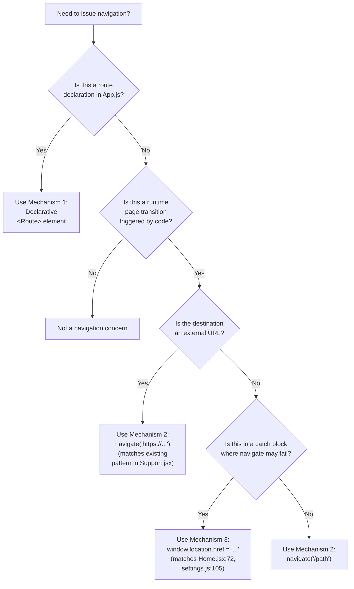

# Navigation Mechanisms

> **Three-mechanism navigation reference for the React Weather Application.** This document explains the three distinct mechanisms by which page transitions are issued in this codebase, contrasts them, and provides a decision tree for future contributors choosing how to issue navigation in new code.
>
> **See also:** [Routing Overview](./routing-overview.md) for the full route table that Mechanism 1 declares; [Page Redirects](./page-redirects.md) for the exhaustive catalog of every Mechanism 2 and Mechanism 3 call site; [Route Guards](./route-guards.md) for the imperative guard pattern that uses Mechanism 2.

---

## Table of Contents

1. [Overview](#1-overview)
2. [Mechanism 1 — Declarative React Router](#2-mechanism-1--declarative-react-router)
3. [Mechanism 2 — Imperative `navigate(page)` Helper](#3-mechanism-2--imperative-navigatepage-helper)
4. [Mechanism 3 — `window.location.href` Fallbacks](#4-mechanism-3--windowlocationhref-fallbacks)
5. [Decision Tree: When to Use Which](#5-decision-tree-when-to-use-which)
6. [Why This App Uses All Three](#6-why-this-app-uses-all-three)
7. [Summary Comparison Table](#7-summary-comparison-table)
8. [Source Citations](#8-source-citations)

---

## 1. Overview

The React Weather Application uses **three distinct navigation mechanisms**, all of which coexist in the same codebase. This is unusual for a typical React Router application; most React applications use only React Router's declarative routing (`<BrowserRouter>` + `<Routes>` + `<Route>`) for URL-to-component matching, plus React Router's `useNavigate` hook for imperative in-app navigation. This codebase deliberately departs from that pattern.

The **dominant mechanism in this codebase is Mechanism 2** — the custom `navigate(page)` helper exported from `src/inc/scripts/utilities.js`. Every page transition that follows a user click in `src/pages/*.jsx`, `src/components/footerNav.jsx`, and `src/backend/settings.js` flows through this helper. The helper is **NOT** React Router's `useNavigate` hook — it is a one-line wrapper around `window.location.href = ${page}` (see `src/inc/scripts/utilities.js:3-5`) that triggers a **full browser page reload** rather than a React Router state change. This distinction is the single most important fact about the codebase's navigation behavior, and Section [3.3](#33-critical-note) covers it in detail.

**Mechanism 1 (declarative routing) is what makes URL-to-component matching work** — the `<BrowserRouter>` + `<Routes>` + `<Route>` JSX tree at `src/App.js:19-31` is the canonical declaration of every URL pattern the application recognises. Without Mechanism 1, the page reloads triggered by Mechanisms 2 and 3 would not resolve to the correct components: each reload returns the `index.html` shell, which then re-bootstraps `App.js`, which then mounts the `<BrowserRouter>` tree, which then matches the URL to a route. Mechanism 1 is therefore required infrastructure even though most in-app transitions bypass its in-page navigation behavior.

**Mechanism 3 (direct `window.location.href` assignment) is a defensive last-resort fallback** for two specific catch blocks in the application — one in `src/pages/Home.jsx:72` (post-onboarding redirect) and one in `src/backend/settings.js:105` (factory-reset redirect). Mechanism 3 is **not** the primary navigation pattern; it executes only when the surrounding `try` block calling Mechanism 2 throws an exception. In practice, neither fallback is expected to fire in normal operation, but their presence guarantees that critical user flows complete even in pathological environments where the helper itself might fail.

---

## 2. Mechanism 1 — Declarative React Router

### 2.1 Where It Is Used

- **Sole location:** `src/App.js` lines 19–31 — the `<BrowserRouter>` + `<Routes>` + `<Route>` JSX tree
- **Library:** `react-router-dom` v6.22.3 (declared in `package.json` at line 21: `"react-router-dom": "^6.22.3"`)
- **Imports** at `src/App.js:3`:

  ```js
  import { Routes, Route, BrowserRouter } from "react-router-dom";
  ```

No other file in the codebase imports `BrowserRouter`, `Routes`, `Route`, `Link`, `NavLink`, `useNavigate`, `useLocation`, `useParams`, or any other primitive from `react-router-dom`. The entire declarative routing surface is contained in a single file: `src/App.js`.

### 2.2 Code Excerpt

The `<BrowserRouter>` JSX tree is reproduced verbatim from `src/App.js:19-31`:

```jsx
  return (
    <BrowserRouter>
      <Routes>
        <Route index element={DEFAULT_ROUTE_PAGE} />
        <Route path="support" element={<Support />} />
        <Route path="weather" element={<WeatherApp />} />
        <Route path="weathermain" element={<WeatherMain />} />
        <Route path="forecast" element={<ForecastWeather />} />
        <Route path="settings" element={<Settings />} />
        <Route path="*" element={<NotFound />} />
      </Routes>
    </BrowserRouter>
  );
```

The full route table — including each route's mounted component, conditional status, and guard status — is documented in [Routing Overview §3](./routing-overview.md). This document focuses on the **mechanism**, not the route inventory.

### 2.3 Behavior Contract

The following behavior contract applies to React Router v6.22.3's declarative primitives as they are used in this codebase:

- **`<BrowserRouter>`** uses the HTML5 History API (`pushState` / `replaceState` / `popstate`). When in-app navigation occurs through React Router primitives (e.g., `<Link>`, `<NavLink>`, or `useNavigate`), `BrowserRouter` updates the URL via `pushState` and re-renders only the React tree under `<Routes>` — without a browser reload. **However, this codebase does not use any of those primitives**, so `BrowserRouter`'s in-page navigation behavior is effectively unused. `BrowserRouter` still listens for `popstate` events (back/forward buttons) and synchronizes the React view with the URL on initial mount and after each full reload triggered by Mechanism 2 or 3.
- **`<Routes>`** is the v6 replacement for v5's `<Switch>`. It examines its children, picks the **best matching** route based on the current URL pathname, and renders that route's `element` prop. Unlike v5's `<Switch>`, `<Routes>` performs ranked matching so that more specific paths take precedence regardless of declaration order.
- **`<Route index element={...} />`** is shorthand for "the default child route at the parent's base path". With `<BrowserRouter>` mounted at the document root and no `basename` configured, the index route matches the URL pathname `/`.
- **`<Route path="..." element={...} />`** declares a non-index named route that matches when the URL pathname segment equals the path string. Path strings without a leading slash are treated as relative to the parent route — in this codebase, all routes are top-level, so `"weather"` matches `/weather`, `"settings"` matches `/settings`, and so on.
- **`<Route path="*" element={...} />`** is the wildcard that catches any URL not matched by an earlier route. The wildcard is the canonical v6 pattern for 404 handling. See [Routing Overview §6](./routing-overview.md) for the wildcard handler's behavior and the unusual choice to redirect from `/*` to `/weather` rather than to `/`.
- **No `useNavigate` hook is imported anywhere in the codebase.** This was confirmed by exhaustive grep across `src/`. Mechanism 1 is therefore touched **only** in `src/App.js:1-34`; every other file relies on Mechanism 2 or Mechanism 3 for runtime navigation.

### 2.4 What Happens When a User Visits a URL

When the user enters `/weather` directly into the browser address bar (or follows a hard link to `/weather`):

1. **The deployment infrastructure serves `index.html`.** The live Vercel deployment is configured to serve the SPA shell for any unknown URL, so a request to `/weather` returns the same `index.html` that a request to `/` would.
2. **The React bundle bootstraps.** The browser executes `bundle.js`, which runs `src/index.js` and renders `<App />` inside `<React.StrictMode>`.
3. **`App()` runs.** It reads `db.get("HOME_PAGE_SEEN")` from `localStorage` and computes `DEFAULT_ROUTE_PAGE` (see [Conditional Routing](./conditional-routing.md) for the ternary).
4. **`<BrowserRouter>` mounts.** It reads `window.location.pathname` (`/weather`).
5. **`<Routes>` performs ranked matching.** It evaluates each `<Route>` child and finds `<Route path="weather" element={<WeatherApp />} />` as the best match.
6. **React mounts `<WeatherApp />`.** The matched element becomes the visible page.
7. **The user's browser does NOT reload further.** This is the key feature of React Router — only the React tree under `<Routes>` re-renders for subsequent in-app navigations through React Router primitives.

However, because **almost no in-app navigation goes through Mechanism 1** in this codebase (the codebase imports neither `<Link>` nor `<NavLink>` nor `useNavigate`), every page transition triggered by a user click goes through Mechanism 2, which **does** trigger a full browser reload. As a result, Mechanism 1 effectively only handles:

- **Initial URL resolution** when the user first loads the application.
- **Deep-link matching** when the user enters a URL directly into the address bar.
- **Back/forward button handling** via the `popstate` listener inside `<BrowserRouter>`.
- **Re-resolution after every full reload** triggered by Mechanism 2 or Mechanism 3 — every internal redirect in this codebase causes the React tree to be torn down and re-bootstrapped, at which point Mechanism 1 re-matches the new URL to a route.

> **Source:** `src/App.js:1-34`, `src/App.js:3`, `src/App.js:19-31`, `package.json:21`

---


## 3. Mechanism 2 — Imperative `navigate(page)` Helper

### 3.1 Definition

The custom helper is defined at the top of `src/inc/scripts/utilities.js`. Lines 1–5 are reproduced verbatim:

```js
import jQuery from "jquery";

export function navigate(page) {
	window.location.href = `${page}`;
}
```

The helper is also re-exported as the default export at `src/inc/scripts/utilities.js:137`:

```js
export default navigate;
```

That dual export pattern — both a named `export function navigate` and a `export default navigate` — means consumers may import the helper as either a named or a default symbol. In practice, **every consumer in the codebase uses the default-import form** (see [§3.4](#34-imports-of-the-helper) for the full inventory).

### 3.2 Behavior Contract

The following behavior contract applies to the `navigate(page)` helper:

- The function takes a single argument `page` (a string).
- It sets `window.location.href` to a template-literal-expanded version of the argument.
- The template literal `` `${page}` `` performs no transformation — for any string input it produces the same string. (The body is therefore equivalent to `window.location.href = page;` — the template-literal form is a stylistic choice, not a semantic one.)
- **Result:** The browser interprets the assignment as a navigation request:
  - If `page` is a **bare relative URL** (e.g., `"weather"`), the browser resolves it against the current document's base URL. From the index path `/`, this resolves to `/weather`. From a sibling top-level path like `/settings`, this would also resolve to `/weather` because the bare segment replaces the last path segment.
  - If `page` is a **path with a leading slash** (e.g., `"/forecast"`), the browser resolves it from the document origin's root regardless of the current pathname. This is the most robust form.
  - If `page` is an **explicit current-directory relative URL** (e.g., `"./weather"`), the browser resolves it as a sibling of the current pathname. From `/settings` or `/support` this resolves to `/weather`.
  - If `page` is an **absolute URL with an external origin** (e.g., `"https://github.com/Adedoyin-Emmanuel"`), the browser navigates to that external location, leaving the application entirely.
- **The browser performs a full page reload** in every case where the destination is not the same URL the user is already at. The current React tree is torn down, the new URL is fetched, the JavaScript bundle re-evaluates, and the React tree is re-hydrated from `index.html`. This is fundamentally different from React Router's `useNavigate` behavior.

### 3.3 Critical Note

> ### ⚠️ This is **NOT** React Router's `useNavigate` hook
>
> `react-router-dom` v6 exposes a `useNavigate` hook that returns a function which performs in-app routing transitions **without** reloading the browser. The hook updates the URL via `pushState` (or `replaceState`) and triggers a re-render of only the React tree under `<Routes>`.
>
> This codebase's `navigate(page)` helper is **unrelated** to `useNavigate`. It is a manually written wrapper around `window.location.href` assignment that performs a **full browser reload** every time it is called.
>
> The naming collision is unfortunate — a contributor familiar with React Router v6 will see `import navigate from "../inc/scripts/utilities"` followed by `navigate("/weather")` and reasonably assume it is the destructured `useNavigate` return value (the conventional name in v6 tutorials is also `navigate`). It is not. Section [3.1](#31-definition) shows the actual definition: a single `window.location.href = ${page};` line.
>
> A future migration to `useNavigate` would change the user-perceived behavior: instead of a full reload, the URL would update via `pushState` and only the React tree under `<Routes>` would re-render. State preserved in the React tree (e.g., search overlays, in-flight API requests, in-memory caches) would survive the transition. The trade-off is that current React state would NOT survive — a deliberate architectural choice that is currently relied on (the `Weather.jsx` and `ForecastWeather.jsx` guards are simple synchronous reads at the top of the component body, which works precisely because every navigation reloads the React tree). **Performing this migration is OUT OF SCOPE for the current documentation task.**

### 3.4 Imports of the Helper

The helper has both a named export (`export function navigate(page)`) and a default export (`export default navigate;`). The codebase consistently uses the default-import form. Two valid import styles for consumers:

```js
// Default import (used everywhere in this codebase):
import navigate from "./../inc/scripts/utilities";  // (path varies by file location)

// Named import (also valid; not used in this codebase):
import { navigate } from "./../inc/scripts/utilities";
```

The default-import form is used in the following files. The line cited is the `import` statement itself:

| #  | File                              | Import Line | Statement                                            |
| -- | --------------------------------- | ----------- | ---------------------------------------------------- |
| 1  | `src/pages/Home.jsx`              | 15          | `import navigate from "./../inc/scripts/utilities";` |
| 2  | `src/pages/Weather.jsx`           | 9           | `import navigate from "../inc/scripts/utilities";`   |
| 3  | `src/pages/WeatherMain.jsx`       | 3           | `import navigate from "../inc/scripts/utilities";`   |
| 4  | `src/pages/ForecastWeather.jsx`   | 13          | `import navigate from "../inc/scripts/utilities";`   |
| 5  | `src/pages/Settings.jsx`          | 3           | `import navigate from "../inc/scripts/utilities";`   |
| 6  | `src/pages/Support.jsx`           | 3           | `import navigate from "../inc/scripts/utilities";`   |
| 7  | `src/pages/404.jsx`               | 3           | `import navigate from "../inc/scripts/utilities";`   |
| 8  | `src/components/footerNav.jsx`    | 2           | `import navigate from "./../inc/scripts/utilities";` |
| 9  | `src/backend/settings.js`         | 19          | `import navigate from "../inc/scripts/utilities";`   |

> **Note on relative path differences.** Some imports use `"./../inc/scripts/utilities"` (with the explicit `./`) and others use `"../inc/scripts/utilities"`. Both resolve to the same file under Node's module resolution — the `./` prefix is redundant when the next segment is `..`. The mixed convention reflects historical evolution rather than a deliberate distinction.
>
> **Note on `ForecastWeather.jsx`'s second import.** `src/pages/ForecastWeather.jsx` includes a second import from the same utilities module at line 20: `import * as utilis from "./../inc/scripts/utilities";`. The namespace-import alias `utilis` (note the spelling) is used inside the component for the unrelated date/time utilities (`getCurrentDate`, `convertTo12Hour`, `getTimeFromDateString`) — **not** for the `navigate` helper. The `navigate` helper itself is imported as the default at line 13. This double import of the same module is a code smell but does not affect routing behavior.

### 3.5 Common Argument Forms

The helper is called with several argument shapes throughout the codebase. Each form has a different resolution behavior under `window.location.href` assignment:

```js
// Bare relative — resolves against the current document's base URL.
// In this codebase, these are called from / (Home or Weather index)
// or from a top-level sibling path, so they resolve to /weather, /settings, etc.
navigate("weather");                // Home.jsx:69; footerNav.jsx:6
navigate("settings");               // footerNav.jsx:10
navigate("support");                // footerNav.jsx:14
navigate("weathermain");            // Weather.jsx:119

// Leading-slash absolute — resolves from the origin root regardless of
// the current pathname. This is the most robust form.
navigate("/weather");               // 404.jsx:8; WeatherMain.jsx:26;
                                    // ForecastWeather.jsx:252
navigate("/forecast");              // Weather.jsx:55, 88, 133
navigate("/");                      // Weather.jsx:37 (guard);
                                    // ForecastWeather.jsx:45 (guard);
                                    // settings.js:98, 102

// Explicit current-directory relative — resolves as a sibling of the
// current pathname. Used by back-arrow handlers on /settings and /support.
navigate("./weather");              // Settings.jsx:10; Support.jsx:8

// External absolute URL — leaves the SPA entirely.
navigate("https://github.com/Adedoyin-Emmanuel/react-weather-app");
                                    // Support.jsx:12
navigate("https://github.com/Adedoyin-Emmanuel");
                                    // Support.jsx:16
```

Summary of conventions observed in the codebase:

- **Leading-slash forms** (`"/weather"`, `"/forecast"`, `"/"`) are the dominant pattern in code outside the footer and the Home onboarding handler. They are robust to the current URL.
- **Bare relative forms** (`"weather"`, `"settings"`, `"support"`, `"weathermain"`) appear in `Home.jsx:69`, the footer (`footerNav.jsx:6, 10, 14`), and `Weather.jsx:119`. These work because the call site executes when the user is at `/`, `/weather`, or another top-level path — making the bare segment resolve to the expected destination. **If the codebase were extended to mount the footer at a deeper path (e.g., `/dashboard/weather`), these bare-relative arguments would resolve incorrectly.** See [Page Redirects §2](./page-redirects.md) for the catalog observation about this.
- **`./relative` forms** appear in `Settings.jsx:10` and `Support.jsx:8`. Functionally equivalent to bare relative forms; the explicit `./` adds emphasis that the path is relative.
- **External URLs** appear only in `Support.jsx:12` and `Support.jsx:16` for redirecting to GitHub destinations. This is enabled by the helper's unrestricted `window.location.href = ${page}` body — any string the browser can interpret as a URL is a valid argument.

For an exhaustive catalog of every `navigate(...)` call site (file, line, trigger event, argument, resolved destination), see [Page Redirects](./page-redirects.md).

> **Source:** `src/inc/scripts/utilities.js:1-5`, `src/inc/scripts/utilities.js:137`, `src/pages/Home.jsx:15, 69`, `src/pages/Weather.jsx:9, 37, 55, 88, 119, 133`, `src/pages/WeatherMain.jsx:3, 26`, `src/pages/ForecastWeather.jsx:13, 20, 45, 252`, `src/pages/Settings.jsx:3, 10`, `src/pages/Support.jsx:3, 8, 12, 16`, `src/pages/404.jsx:3, 8`, `src/components/footerNav.jsx:2, 6, 10, 14`, `src/backend/settings.js:19, 98, 102`

---


## 4. Mechanism 3 — `window.location.href` Fallbacks

### 4.1 Where It Is Used

The codebase has **two** call sites that perform direct `window.location.href` assignment as a defensive fallback after a `navigate(...)` call has failed. Both live in `catch` blocks of `try/catch` constructs that wrap the primary `navigate(...)` invocation.

| # | File                       | Line | Context                                                                                            |
| - | -------------------------- | ---- | -------------------------------------------------------------------------------------------------- |
| 1 | `src/pages/Home.jsx`       | 72   | Catch block after `navigate("weather")` throws on the post-onboarding redirect                     |
| 2 | `src/backend/settings.js`  | 105  | Inner catch block in `restoreFactorySettings` after both nested `navigate("/")` attempts fail      |

> **Note on the third occurrence.** A third occurrence of `window.location.href = ...` exists at `src/inc/scripts/utilities.js:4`, but that line is **the implementation of Mechanism 2** — the body of the `navigate(page)` helper itself. It is not a Mechanism 3 fallback. Every Mechanism 2 redirect flows through that line at runtime, but the helper definition is a single point of indirection rather than an additional fallback assignment. See [§3.1](#31-definition) for the helper definition. See [Page Redirects §4](./page-redirects.md) for the same observation in the Fallback Redirect Catalog.

### 4.2 Code Excerpt — Home.jsx

The relevant block at `src/pages/Home.jsx:68-73` is reproduced verbatim:

```jsx
                  try {
                    navigate("weather");
                  } catch (navError) {
                    // Fallback navigation
                    window.location.href = "/weather";
                  }
```

Annotations:

- **Outer context:** This `try/catch` is nested deep inside the `click` handler that fires when the user clicks the "today's weather" button on the Home page. The outer code path runs after the SweetAlert2 onboarding modal has been confirmed and the user has provided a non-empty default location. The four `db.create(...)` writes (at `src/pages/Home.jsx:59-62` — `HOME_PAGE_SEEN`, `USER_DEFAULT_LOCATION`, `TRACK_SAVED_LOCATION_WEATHER`, `WEATHER_UNIT`) precede this `try` block.
- **Line 69 — primary attempt:** `navigate("weather")` invokes the Mechanism 2 helper with the bare-relative argument `"weather"`. Because the Home page is mounted at `/`, the browser resolves `"weather"` to `/weather` and the assignment to `window.location.href` triggers a full page reload to that URL. **In normal operation, this attempt succeeds.**
- **Line 70 — catch declaration:** If the call on line 69 throws (for example, if the `utilities.js` import resolved to `undefined` due to a bundle error, or a hostile browser extension intercepted `window.location` and threw), control transfers to the catch block.
- **Line 71 — comment:** The literal source comment `// Fallback navigation` documents the intent.
- **Line 72 — Mechanism 3 assignment:** `window.location.href = "/weather"` is identical in **effect** to a successful `navigate("/weather")` would have been, but it bypasses the helper entirely. The argument is the leading-slash form `"/weather"` — robust to the current URL — so even if the original `navigate("weather")` had failed because the helper was unavailable, the fallback uses a more conservative path.
- **Line 73 — closing brace:** End of the inner `try/catch`. Execution continues normally (effectively, the navigation has been issued and the page is about to reload).

### 4.3 Code Excerpt — settings.js

The full `restoreFactorySettings` function at `src/backend/settings.js:95-108` is reproduced verbatim:

```js
export const restoreFactorySettings = () => {
	try {
		db.destroy();
		navigate("/");
	} catch (error) {
		// Fallback: attempt navigation even if destroy fails
		try {
			navigate("/");
		} catch (navError) {
			// If navigation also fails, reload the page as last resort
			window.location.href = "/";
		}
	}
};
```

Annotations:

- **Outer context:** The function `restoreFactorySettings` is invoked when the user clicks the "restore settings" button on the Settings page. The button is declared at `src/pages/Settings.jsx:115-119` with `onClick={settings.restoreFactorySettings}` (line 118). Because `restoreFactorySettings` is passed by reference (not as an arrow function wrapping a call), the user's click directly invokes this function — there are no intermediate handlers.
- **Lines 96–98 — outer try block:** The primary path. Call `db.destroy()` to clear all `localStorage` keys (including `HOME_PAGE_SEEN`, `USER_DEFAULT_LOCATION`, `TRACK_SAVED_LOCATION_WEATHER`, and `WEATHER_UNIT`), then call `navigate("/")` to redirect the user to the index route. After the page reloads, `App()` runs again, re-reads `db.get("HOME_PAGE_SEEN")` (now falsy because `db.destroy()` cleared it), and the index ternary mounts `<Home />` for first-time onboarding.
- **Lines 99–107 — outer catch block:** Execution arrives here if **either** `db.destroy()` **or** the inner `navigate("/")` throws. In the unlikely case that `db.destroy()` succeeded but the navigation failed, the user is now on the Settings page with a cleared database — a state the application cannot reasonably display since most components assume the database is populated. The catch block exists to ensure the user reaches `/` (Home) regardless of which step failed.
- **Lines 100–102 — nested re-attempt:** A second `navigate("/")` call is wrapped in its own `try/catch`. This is a minor redundancy — if `navigate` failed on line 98 because the `utilities.js` import is broken or `window.location` is intercepted, it is unlikely to succeed on line 102. But the call is cheap and the defensive style is intentional.
- **Lines 103–106 — final fallback:** If even the nested `navigate("/")` throws, the code falls through to the **direct `window.location.href = "/"` assignment** on line 105. This is the Mechanism 3 fallback — the same effective behavior as Mechanism 2 would have had, but bypassing the helper entirely. The argument `"/"` resolves to the document origin's root, which is the index route.
- **Line 108 — closing brace:** End of `restoreFactorySettings`. By the time control returns to the caller (the React `onClick` handler), one of three things has happened: (a) the primary path succeeded and the page is about to reload to `/`; (b) the primary path failed but the nested re-attempt succeeded; or (c) all three attempts failed and the Mechanism 3 fallback issued the reload directly. In all three cases, the user ends up at `/`.

### 4.4 Why This Mechanism Exists

The fallback exists because the codebase's `navigate(page)` helper performs a `window.location.href = ${page}` assignment, which **can fail** in certain pathological environments. The most plausible failure modes are:

- **The helper file fails to import.** If the bundle is corrupted or the dynamic import resolution returns `undefined`, calling `navigate(...)` would throw `TypeError: navigate is not a function` at the call site. This is rare in production but possible during development if the build pipeline fails partway through.
- **A browser sandbox or extension interferes with the `window.location` setter.** Some content-security policies and some hostile browser extensions can intercept assignments to `window.location.href` and either throw or silently no-op. If the extension throws, the surrounding `try` block catches it; if it silently no-ops, neither Mechanism 2 nor Mechanism 3 will produce a navigation, but at least the catch block does not introduce additional failure modes.
- **A test harness mocks `window.location` in a way that throws.** Some Jest/Jsdom configurations mock `window.location` to be read-only and throw on assignment. This is uncommon in production but relevant to anyone running the application in an unusual test harness.

In all three cases, the Mechanism 3 catch-block assignment is functionally identical to the Mechanism 2 helper's body — the **only** practical difference is that the catch path bypasses the import-resolved helper and goes directly to the native `window.location.href` setter. In environments where the issue is at the helper's import resolution (case 1), Mechanism 3 succeeds where Mechanism 2 would have thrown. In environments where the issue is at the `window.location.href` setter itself (cases 2 and 3), Mechanism 3 fails the same way Mechanism 2 would have — but the fallback chain still allows the surrounding caller to learn that no navigation happened, since the Mechanism 3 assignment would also throw and propagate.

In practice, neither fallback is expected to fire during normal application use. The fallbacks exist as defense-in-depth: they guarantee that two critical user flows — the post-onboarding redirect from Home and the factory-reset redirect from Settings — complete in pathological environments where the helper itself might fail.

> **Source:** `src/pages/Home.jsx:68-73`, `src/backend/settings.js:95-108`, `src/inc/scripts/utilities.js:3-5` (helper body for comparison), `src/pages/Settings.jsx:115-119` (button binding for `restoreFactorySettings`)

---

## 5. Decision Tree: When to Use Which

The following Mermaid `flowchart TD` (top-down decision tree) summarises which mechanism to use when issuing navigation in new code. The tree is meant to be read by future contributors deciding how to add a new redirect; it codifies the codebase's existing conventions.



**Reading the tree:**

1. **Q1 — Route declaration?** If the contributor is adding a new URL pattern that should map to a React component, the answer is Mechanism 1: add a new `<Route>` element to the `<Routes>` block in `src/App.js`. Every route declaration in the application lives there and only there.
2. **Q2 — Runtime navigation?** If the new code is not a route declaration but also does not perform a programmatic transition (e.g., it is a styling change, a `console.log`, or a `useState` update), the contributor is not dealing with navigation at all — they should ignore this tree.
3. **Q3 — External URL?** If the destination is an absolute URL outside the application (`https://github.com/...`, `https://twitter.com/...`, `mailto:...`), use Mechanism 2 with the absolute URL as the argument. The pattern is established in `src/pages/Support.jsx:12, 16`. Note that Mechanism 1 (`<Route>`) cannot route to external URLs, and using Mechanism 3 directly would also work but bypasses the established codebase convention.
4. **Q4 — Catch-block fallback?** If the new code is inside a `catch` block whose `try` block already called `navigate(...)`, use Mechanism 3 (`window.location.href = "..."`) to ensure the navigation happens even if the helper failed. The pattern is established in `src/pages/Home.jsx:72` and `src/backend/settings.js:105`. **Do not use Mechanism 3 outside catch blocks** — the codebase reserves Mechanism 3 for fallbacks, and using it elsewhere would obscure the intent.
5. **Default (Q4 → No) — Internal redirect:** Use Mechanism 2 with a leading-slash absolute path as the argument. The leading-slash form is the most robust pattern; it works regardless of the current URL. Bare-relative and `./relative` forms are present in the codebase (see [§3.5](#35-common-argument-forms)) but are not the recommended pattern for new code.

> **Rule of thumb for new code:** Match the surrounding patterns. The codebase consistently uses Mechanism 2 (`navigate(...)`) for in-app and external transitions, with Mechanism 3 reserved for catch-block fallbacks. Mechanism 1 (`<Route>`) is touched only in `src/App.js`.
>
> **Note on a hypothetical migration to `useNavigate`.** A migration to React Router's `useNavigate` would replace Mechanism 2 across all 19 call sites and would change the user-perceived behavior (no full reload). Such a migration is **out of scope** for the current documentation task but is the standard upgrade path for similar codebases. If undertaken, the migration would also need to revisit the two route guards in `Weather.jsx:36-38` and `ForecastWeather.jsx:44-46` (see [Route Guards](./route-guards.md)) — they currently work because `navigate("/")` triggers a full reload, which causes the page to be torn down before the rest of the component renders.

---


## 6. Why This App Uses All Three

The coexistence of three navigation mechanisms in a single React Router application is unusual and merits explanation. Each mechanism serves a distinct purpose, and removing any one of them would break observable behavior.

### 6.1 Mechanism 1 Is Required Infrastructure

Without `<BrowserRouter>` and `<Routes>`, the URL pathname would not be matched to a React component — the application would render the same component (whatever `App` returns) regardless of whether the user is at `/`, `/weather`, `/settings`, or any other path. Even if every in-app transition went through Mechanism 2 (which always triggers a full page reload), the post-reload page **still** needs Mechanism 1 to resolve the new URL to the correct page component. The browser fetches `index.html`, the bundle bootstraps `App.js`, `App.js` mounts `<BrowserRouter>`, `<BrowserRouter>` reads `window.location.pathname`, and `<Routes>` picks the correct `<Route>` to mount. **Mechanism 1 is the URL-to-component plumbing that every reload depends on.**

### 6.2 Mechanism 2 Is the Established Convention

The codebase appears to predate any team-wide adoption of React Router's `useNavigate` hook — or, equivalently, simply chose not to use it. **Every** page-transition handler in the application imports the custom `navigate` helper and calls it. The pattern is consistent across **all 19 `navigate(...)` call sites in the application** (17 internal + 2 external), spanning seven page components, one shared footer component, and one backend module.

This consistency has two practical consequences:

- **Onboarding new contributors is faster** for the helper-based pattern than it would be for a mixture of `useNavigate` (in functional components) and direct `window.location.href` assignments (everywhere else). The single helper has a single import path and a single behavior contract; new contributors learn it once and recognise it across the codebase.
- **Refactoring is centralized.** A future migration to `useNavigate` (or to any other navigation API) requires changing one file — `src/inc/scripts/utilities.js` — for the body, plus 19 call sites for the call signature. The single point of indirection makes the refactor tractable. (The exact migration is out of scope for the current documentation task; the point here is that the helper-based pattern enables a cleaner future migration than scattered direct assignments would.)

### 6.3 Mechanism 3 Is Defensive

The two catch-block uses of Mechanism 3 are written to be tolerant of the helper itself failing. They guarantee that two specific critical flows complete even in pathological environments:

- **Post-onboarding redirect from `Home.jsx`** (line 72 fallback). If the `navigate("weather")` call on line 69 throws, the user has already saved their default location and the four `db.create` writes have completed. **The user must not be left on the Home page** with a stale modal — the only path forward is to redirect them to `/weather`, which the Mechanism 3 fallback ensures.
- **Factory-reset redirect from `restoreFactorySettings`** (line 105 fallback in `settings.js`). If both nested `navigate("/")` calls throw, the user's database has already been destroyed by `db.destroy()` on line 97. **The user must not be left on the Settings page** with a cleared database — every component would render with `undefined` state. The Mechanism 3 fallback ensures the user reaches `/`, where the index ternary mounts `<Home />` for first-time onboarding (because `db.destroy()` cleared `HOME_PAGE_SEEN`).

In both cases, the cost of the fallback is one extra line of code; the benefit is that the user is never stranded in an inconsistent state.

### 6.4 Why Not Just Use Mechanism 3 Everywhere?

A reasonable contributor reading this document might ask: "If Mechanism 2 is just a one-line wrapper around `window.location.href = ${page}`, why not eliminate the helper and use Mechanism 3 directly at every call site?" Three reasons:

1. **Mechanism 2 provides a single point of indirection.** Replacing the helper's body is a one-line change; replacing 19 inlined `window.location.href = ...` assignments is a 19-site change. The helper is the canonical refactoring seam — for example, a future migration to `useNavigate` only needs to change the helper.
2. **Mechanism 2 is testable in isolation.** A unit test can mock the imported `navigate` to assert that a click handler invoked it with the expected argument, without mocking the global `window.location` setter (which is harder to mock cleanly in JSDOM).
3. **The conventions are already established.** Reversing the convention to "Mechanism 3 everywhere" would require auditing every redirect call site, would lose the indirection benefit above, and would not reduce code volume measurably (each call site is still one line either way).

This three-mechanism pattern is **not the recommended idiom for new React Router v6 apps** (which would idiomatically use `<BrowserRouter>` plus `useNavigate` plus no fallbacks), but it is the established pattern of this codebase. Documentation should describe the actual state, not prescribe a refactor.

---

## 7. Summary Comparison Table

The table below summarises the three mechanisms across the properties most relevant to a contributor making implementation choices.

| Property                          | Mechanism 1 (Declarative)                                | Mechanism 2 (`navigate(page)`)                                                    | Mechanism 3 (`window.location.href`)                                            |
| --------------------------------- | -------------------------------------------------------- | --------------------------------------------------------------------------------- | ------------------------------------------------------------------------------- |
| **Library**                       | `react-router-dom` v6.22.3 (named imports in `App.js:3`) | Custom helper (`src/inc/scripts/utilities.js:3-5`)                                | Native browser API (`window.location.href` setter)                              |
| **Definition site**               | `src/App.js:19-31` (only)                                | `src/inc/scripts/utilities.js:3-5` (function body); line 137 (default export)     | Built-in browser API; no source definition in this codebase                     |
| **Trigger**                       | Initial page load + `<BrowserRouter>` history change     | User-initiated click handlers + post-onboarding logic + factory-reset action      | Catch-block fallback (only) — fires when surrounding `navigate(...)` throws     |
| **Reloads browser?**              | No (SPA navigation when used through React Router prims) | **Yes** (full page reload — assigns `window.location.href` directly)              | **Yes** (full page reload — same setter as Mechanism 2)                         |
| **Uses React Router state?**      | Yes — updates `<BrowserRouter>` history stack             | No — bypasses React Router and reloads the entire page                            | No — bypasses React Router and the helper alike                                 |
| **Where in code**                 | `src/App.js:19-31` only                                  | 19 call sites across pages, components, and backend (17 internal + 2 external)    | 2 call sites: `src/pages/Home.jsx:72`, `src/backend/settings.js:105`            |
| **Argument format**               | `path` prop (string) or `index` prop (boolean)           | `page` (string) — relative, leading-slash, `./` relative, or absolute URL         | URL string (any form `window.location.href` accepts)                            |
| **Recommended for new code?**     | Yes — idiomatic React Router for adding new routes       | Match existing pattern; would be replaced by `useNavigate` in a refactor          | Only as defensive fallback after a failed `navigate(...)`                       |
| **Testability**                   | Tested via `MemoryRouter` + `Routes` rendering           | Mockable by replacing the imported `navigate` symbol                              | Hard to test cleanly — requires mocking the global `window.location` setter     |
| **Cross-document reference**      | [Routing Overview](./routing-overview.md)                | [Page Redirects](./page-redirects.md), [Route Guards](./route-guards.md)          | [Page Redirects §4](./page-redirects.md)                                        |

---

## 8. Source Citations

The following citations support every claim made in this document. Each citation gives the repository-relative path and an inclusive line range.

- `Source: src/App.js:1-34` — Full `App.js` file: imports (lines 1–10), conditional ternary (lines 12–17), and the route table (lines 19–31)
- `Source: src/App.js:3` — `import { Routes, Route, BrowserRouter } from "react-router-dom";`
- `Source: src/App.js:19-31` — JSX tree of declarative routing (Mechanism 1)
- `Source: src/inc/scripts/utilities.js:1-5` — Imports and definition of the `navigate(page)` helper (Mechanism 2): `import jQuery from "jquery";` followed by `export function navigate(page) { window.location.href = ${page}; }`
- `Source: src/inc/scripts/utilities.js:137` — `export default navigate;`
- `Source: src/pages/Home.jsx:15` — `import navigate from "./../inc/scripts/utilities";`
- `Source: src/pages/Home.jsx:59-62` — Four `db.create(...)` writes that precede the post-onboarding `navigate("weather")` redirect
- `Source: src/pages/Home.jsx:68-73` — `navigate("weather")` post-onboarding redirect with `window.location.href = "/weather"` Mechanism 3 fallback
- `Source: src/pages/Weather.jsx:9, 37, 55, 88, 119, 133` — `navigate` import and the five Mechanism 2 call sites in `Weather.jsx`
- `Source: src/pages/WeatherMain.jsx:3, 26` — `navigate` import and the back-arrow Mechanism 2 call site
- `Source: src/pages/ForecastWeather.jsx:13, 20, 45, 252` — `navigate` default import (line 13), `utilis` namespace import (line 20), guard call site (line 45), back-arrow call site (line 252)
- `Source: src/pages/Settings.jsx:3, 10` — `navigate` import and the back-arrow Mechanism 2 call site
- `Source: src/pages/Settings.jsx:115-119` — `<Button onClick={settings.restoreFactorySettings} />` button binding that triggers the factory-reset chain
- `Source: src/pages/Support.jsx:3, 8, 12, 16` — `navigate` import (line 3), back-arrow internal redirect (line 8), and two external GitHub Mechanism 2 call sites (lines 12, 16)
- `Source: src/pages/404.jsx:3, 8` — `navigate` import and the "Home" button Mechanism 2 call site that redirects to `/weather`
- `Source: src/components/footerNav.jsx:2, 6, 10, 14` — `navigate` import and the three internal Mechanism 2 call sites for the App / Settings / Support footer tabs
- `Source: src/backend/settings.js:19, 95-108` — `navigate` import (line 19) and the `restoreFactorySettings` function with two nested `navigate("/")` attempts and the `window.location.href = "/"` Mechanism 3 fallback (lines 95–108)
- `Source: package.json:21` — Declares `"react-router-dom": "^6.22.3"`

### 8.1 Cross-References to Sibling Documentation

- [Routing Overview](./routing-overview.md) — full route table for Mechanism 1; includes the route topology Mermaid diagram
- [Page Redirects](./page-redirects.md) — exhaustive catalog of every Mechanism 2 and Mechanism 3 call site, with file, line, trigger, argument, and resolved destination
- [Route Guards](./route-guards.md) — coverage of the imperative guards in `Weather.jsx:36-38` and `ForecastWeather.jsx:44-46` that use Mechanism 2 to redirect non-onboarded users to `/`
- [Conditional Routing](./conditional-routing.md) — the `HOME_PAGE_SEEN` flag and onboarding flow that drives the index-route conditional rendering at `App.js:13-17`
- [Routing README](./README.md) — entry point for the routing documentation set

### 8.2 External References

- **React Router v6.22.3 official documentation** — for the API reference of `BrowserRouter`, `Routes`, `Route`, the `index` prop, and the wildcard `*` path. Cited in [§2.3](#23-behavior-contract).
- **MDN documentation for `Window.location.href`** — for the full-page-reload semantics of assigning a URL to `window.location.href`. Cited in [§3.2](#32-behavior-contract) and [§4.4](#44-why-this-mechanism-exists).

---

> **End of Navigation Mechanisms.** For the next document in the recommended reading order (per the routing [README](./README.md)), continue to [Page Redirects](./page-redirects.md) for the exhaustive catalog of every `navigate(...)` call site and `window.location.href` fallback in the codebase.

