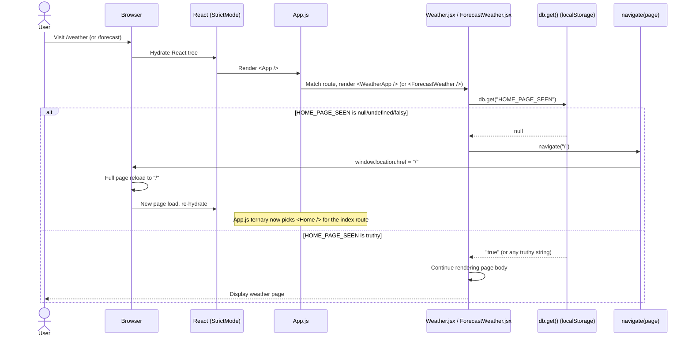

# Route Guards

> **Imperative route-guard reference for the React Weather Application.** This document explains the guard pattern used at the top of the function body of `src/pages/Weather.jsx` and `src/pages/ForecastWeather.jsx`. Each guard is a synchronous read of `db.get("HOME_PAGE_SEEN")` from `localStorage` followed by an unconditional `navigate("/")` redirect when the flag is falsy. The redirect target — the index route `/` — is itself conditional and resolves to either `<Home />` (first-time user) or `<WeatherApp />` (returning user) based on the same flag re-read after a full page reload.
>
> **See also:** [Conditional Routing](./conditional-routing.md) for the origin and lifecycle of the `HOME_PAGE_SEEN` flag, including the canonical write site at `Home.jsx:59` and the destruction site at `settings.js:95-108`. [Navigation Mechanisms](./navigation-mechanisms.md) for the behavior contract of the `navigate(page)` helper invoked by guards (full page reload via `window.location.href`).

---

## Table of Contents

1. [Overview](#1-overview)
2. [Guard Pattern Used in This Codebase](#2-guard-pattern-used-in-this-codebase)
3. [Guard in `Weather.jsx`](#3-guard-in-weatherjsx)
4. [Guard in `ForecastWeather.jsx`](#4-guard-in-forecastweatherjsx)
5. [Routes Without Guards](#5-routes-without-guards)
6. [Guard Execution Sequence Diagram](#6-guard-execution-sequence-diagram)
7. [Limitations and Caveats](#7-limitations-and-caveats)
8. [Source Citations](#8-source-citations)

---

## 1. Overview

A **route guard** in this codebase is an imperative check placed at the top of a page component's function body that determines, on every render, whether the visitor is permitted to view the page. If the check fails, the guard issues a redirect by calling the custom `navigate(page)` helper imported from `src/inc/scripts/utilities.js`. The guard does not delay rendering, does not return JSX, and does not throw — it simply triggers a side effect (`window.location.href = ${page}`) that begins a full browser page reload while the rest of the function body continues to execute synchronously until the browser tears the page down. This is materially different from React Router v6's `loader` / `useLoaderData` pattern (which would block route resolution until data is available) and from React Router's `useNavigate` hook (which performs in-app history transitions without reloading). The guards used here predate that API surface in this codebase and are coded as plain JavaScript.

The codebase uses guards on **two of the seven routes** declared in `src/App.js`. The guarded pages are:

- **`Weather.jsx`** — mounted at the index route `/` when `HOME_PAGE_SEEN` is truthy (via the ternary at `src/App.js:13-17, 22`) and unconditionally at the named route `/weather` (`src/App.js:24`). Guard located at `src/pages/Weather.jsx:34-38`.
- **`ForecastWeather.jsx`** — mounted at the named route `/forecast` (`src/App.js:26`). Guard located at `src/pages/ForecastWeather.jsx:42-46`.

Both guards read the same `localStorage` key — `HOME_PAGE_SEEN` — through the `db` singleton imported from `src/backend/app_backend.js`. When the read returns `null` (the value `localStorage.getItem` yields when a key has never been written or has been cleared by `db.destroy()`), the guard calls `navigate("/")`. The redirect target is the application root, where `App.js` re-evaluates its conditional ternary against the same flag. Because the guard would only have fired if `HOME_PAGE_SEEN` were already falsy, the post-reload index route renders `<Home />` (the onboarding landing page), where the user can complete the modal that writes `db.create("HOME_PAGE_SEEN", true)` and proceed normally. This closes the loop between unauthorized deep links and the onboarding entry point.

> **Important distinction:** The guards documented in this file are **NOT React Router's `loader` / `useLoaderData` pattern**, and they are **NOT** uses of React Router's `useNavigate` hook. They are synchronous imperative checks at the top of the function component body, and the redirect they issue is a **full browser page reload** via `window.location.href`. See [Navigation Mechanisms §3](./navigation-mechanisms.md) for the behavior contract of the helper they call, and [Conditional Routing §2](./conditional-routing.md) for the origin and lifecycle of the `HOME_PAGE_SEEN` flag they read.

---

## 2. Guard Pattern Used in This Codebase

### Pattern

Both guarded pages use an identical pattern at the very top of the function component body:

```jsx
const PageComponent = () => {
  // Redirect to home if user hasn't completed initial setup
  if (!db.get("HOME_PAGE_SEEN")) {
    navigate("/");
  }
  // ... rest of component
};
```

The pattern requires three imports — the `db` singleton (`import { db } from "../backend/app_backend";`), the `navigate` helper (`import navigate from "../inc/scripts/utilities";`), and React itself (for the function component) — all of which are already present in the source files of both guarded pages.

### Properties of This Pattern

- **Location.** The check appears at the top of the function component body, before any `useState`, `useEffect`, ref creation, or rendering logic. This placement guarantees the guard fires before any other side effect or state initialization that depends on onboarding-time data (e.g., `db.get("USER_DEFAULT_LOCATION")`).
- **Synchronous.** `db.get("HOME_PAGE_SEEN")` is a synchronous wrapper around `localStorage.getItem(...)` (`Source: src/backend/database.js:28-30`). There is no `async`, no `await`, no `Promise`, and no React Suspense boundary. The read returns immediately with either a string or `null`.
- **Imperative redirect.** The `navigate(page)` helper from `src/inc/scripts/utilities.js` performs `window.location.href = ${page}` (`Source: src/inc/scripts/utilities.js:3-5`), which triggers a **full page reload**. The browser navigates to the new URL, re-fetches `index.html`, and re-bootstraps the React tree from scratch. See [Navigation Mechanisms](./navigation-mechanisms.md) for full helper semantics and the rationale for using a full reload instead of `useNavigate`.
- **Runs every render.** The check is in the function body, not inside `useEffect`, so it executes on every component mount and every subsequent re-render. There is no dependency array gating its execution.
- **No memoization.** The check is not wrapped in a `useMemo`, not guarded by a `useRef`, and not gated by a state flag. Subsequent renders that follow a successful (truthy-flag) first render simply re-read `localStorage` and fall through. After a failed (falsy-flag) first render, the page is already navigating away, so subsequent renders do not occur — the React tree is torn down by the page reload.
- **Falsy-only.** The condition uses the JavaScript truthiness check `!db.get(...)`. Because `localStorage` stores all values as strings, the strings `"false"`, `"0"`, `"undefined"`, and `""` are treated as **truthy** by this check. The only true falsy result the guard can encounter is `null` — the value `localStorage.getItem` returns when the key is absent. The codebase only ever writes `db.create("HOME_PAGE_SEEN", true)` (auto-stringified to `"true"`), so the only realistic falsy value is `null` from a never-written or destroyed key.

---

## 3. Guard in `Weather.jsx`

### 3.1 Source

`Source: src/pages/Weather.jsx:34-38`

### 3.2 Code Excerpt

The guard is reproduced verbatim from `src/pages/Weather.jsx`, lines 34–38, preserving the original tab indentation:

```jsx
const WeatherApp = () => {
	//check if the user navigated from the home page
	if (!db.get("HOME_PAGE_SEEN")) {
		navigate("/");
	}
```

### 3.3 Annotation

1. **Line 34** — declaration of the function component `WeatherApp`. The component is the default export of `src/pages/Weather.jsx` and is imported by `src/App.js` as `WeatherApp` at line 4.
2. **Line 35** — inline comment in the source: `//check if the user navigated from the home page`. This comment captures the original author's intent: the guard is meant to detect whether the user reached `Weather` *via* the onboarding flow on `Home` (which writes `HOME_PAGE_SEEN`) versus directly from a deep link or bookmark.
3. **Line 36** — synchronous read of `HOME_PAGE_SEEN` from `localStorage` via the `db` singleton imported from `src/backend/app_backend.js`. The expression `db.get("HOME_PAGE_SEEN")` calls `Database.get(key)` (`Source: src/backend/database.js:28-30`), which is a one-line wrapper around `localStorage.getItem(key)`. The call returns either a string (when the flag has been written by onboarding) or `null` (when it has never been written or has been cleared by factory reset).
4. **Line 37** — when the flag is falsy, `navigate("/")` is invoked. The argument is the leading-slash form (`"/"`), which becomes `window.location.href = "/"` after the helper expands the template literal at `src/inc/scripts/utilities.js:4` — this triggers a full page reload to the application root.
5. **Line 38** — closing brace of the `if` block. After the redirect side-effect has been queued, JavaScript execution continues into the rest of the function body (the `useState` calls at lines 40–41, the `db.get("USER_DEFAULT_LOCATION")` call at line 44, and the rest of the rendering logic). Because the browser has begun reloading the page, the in-flight render is discarded — but the synchronous code that runs in the meantime is still executed once. See [Section 7 — Limitations and Caveats](#7-limitations-and-caveats) for why this is benign.

### 3.4 Why This Page Has a Guard

The `WeatherApp` page is mounted at two distinct routes:

- The index route `/` when `HOME_PAGE_SEEN` is truthy (via the conditional ternary at `src/App.js:13-17` and the index route declaration at `src/App.js:22`).
- The named route `/weather`, unconditionally (`src/App.js:24`).

A user who reaches `/weather` directly — for example via a bookmarked URL, a shared link, or after `localStorage` was cleared by a factory reset or by the browser's site-data tooling — would land on a page whose render path immediately calls `db.get("USER_DEFAULT_LOCATION")` (line 44) and depends on additional onboarding-time settings (`USER_LATITUDE`, `USER_LONGITUDE`, `WEATHER_UNIT`) that are written by the modal in `Home.jsx`. Without those settings, the page would render a partially populated UI that fetches weather for an empty location string and produces visible errors.

The guard prevents this broken state by redirecting any unauthorized deep link to `/`. At `/`, the conditional ternary in `App.js` re-reads the same flag. Because the guard would only have fired if the flag were falsy, the post-reload index route renders `<Home />` instead of `<WeatherApp />`. The user is shown the onboarding modal, completes it, and is then redirected by `Home.jsx:69` to `/weather` with the necessary state in place.

### 3.5 Routes That Mount This Component

| Route       | Conditional?                                                                |
| ----------- | --------------------------------------------------------------------------- |
| `/` (index) | Only when `HOME_PAGE_SEEN` is truthy (`Source: src/App.js:15-17, 22`)       |
| `/weather`  | Always (`Source: src/App.js:24`)                                            |

---

## 4. Guard in `ForecastWeather.jsx`

### 4.1 Source

`Source: src/pages/ForecastWeather.jsx:42-46`

### 4.2 Code Excerpt

The guard is reproduced verbatim from `src/pages/ForecastWeather.jsx`, lines 42–46, preserving the original tab indentation:

```jsx
const ForecastWeather = () => {
	// Redirect to home if user hasn't completed initial setup
	if (!db.get("HOME_PAGE_SEEN")) {
		navigate("/");
	}
```

### 4.3 Annotation

1. **Line 42** — declaration of the function component `ForecastWeather`. The component is the default export of `src/pages/ForecastWeather.jsx` and is imported by `src/App.js` as `ForecastWeather` at line 7.
2. **Line 43** — inline comment in the source: `// Redirect to home if user hasn't completed initial setup`. The comment is more explicit than the equivalent comment in `Weather.jsx` and explicitly names the redirect destination (`home`) and the trigger condition (`hasn't completed initial setup`).
3. **Line 44** — synchronous read of `HOME_PAGE_SEEN` from `localStorage` via the `db` singleton imported from `src/backend/app_backend.js`. The mechanics are identical to the read in `Weather.jsx:36`: the call `db.get("HOME_PAGE_SEEN")` resolves to `localStorage.getItem("HOME_PAGE_SEEN")` and returns a string or `null`.
4. **Line 45** — when the flag is falsy, `navigate("/")` is invoked. Behavior identical to `Weather.jsx:37` — the helper performs `window.location.href = "/"`, which triggers a full page reload to the application root. The redirect target is the same index route, which `App.js` resolves to `<Home />` because the same falsy flag also drives the ternary.
5. **Line 46** — closing brace of the `if` block. As with `Weather.jsx`, JavaScript execution continues into the rest of the function body after the redirect is issued. In `ForecastWeather.jsx` this means the `useState` calls at lines 49 and 51 and the `useEffect` at line 57 are queued, but the in-flight render is discarded by the page reload.

### 4.4 Why This Page Has a Guard

The `ForecastWeather` page renders the 5-day weather forecast and depends on the same onboarding-time state as `WeatherApp`. Specifically, the body of the component reads `db.get("USER_DEFAULT_LOCATION")`, `db.get("USER_LATITUDE")`, `db.get("USER_LONGITUDE")`, and `db.get("WEATHER_UNIT")` — all written during onboarding by the modal in `Home.jsx` (the `db.create(...)` calls at `Home.jsx:59-62` write `HOME_PAGE_SEEN`, `USER_DEFAULT_LOCATION`, `TRACK_SAVED_LOCATION_WEATHER`, and `WEATHER_UNIT` in a single block). A user reaching `/forecast` without onboarding state would see a forecast view that fetches data for an empty location string and renders an error or an empty list.

The guard avoids this by redirecting to `/` where the onboarding modal can be completed. After onboarding completes, the user is redirected to `/weather` (not back to `/forecast`); navigation to the forecast view from there is the responsibility of the user clicking a "tomorrow" tab, a future-weather card, or a "forecast weather" button on the `Weather` page (see [Page Redirects](./page-redirects.md) for the catalog of those triggers).

### 4.5 Routes That Mount This Component

| Route       | Conditional?                       |
| ----------- | ---------------------------------- |
| `/forecast` | Always (`Source: src/App.js:26`)   |

---

## 5. Routes Without Guards

The following table catalogs every route declared in `src/App.js:21-29` and reports whether each one carries an imperative guard at the top of its mounted component's function body. The two routes whose components carry a guard (`/weather` and `/forecast`) are highlighted; the remaining five routes are unguarded.

| Route                        | Component             | File                                                       | Has Guard?                                                          | Notes                                                                                                                                                                                                                            |
| ---------------------------- | --------------------- | ---------------------------------------------------------- | ------------------------------------------------------------------- | -------------------------------------------------------------------------------------------------------------------------------------------------------------------------------------------------------------------------------- |
| `/` (index, conditional)     | `Home` or `WeatherApp` | `src/pages/Home.jsx` or `src/pages/Weather.jsx`            | Indirect                                                            | The `WeatherApp` mount at the index is itself the consequence of the conditional ternary read; the `Home` mount is the unguarded "first-time" destination. `Source: src/App.js:13-17, 22`                                        |
| `/support`                   | `Support`             | `src/pages/Support.jsx`                                    | No                                                                  | Accessible without onboarding; reachable from the footer "Support" tab. The `Support` page does not depend on any onboarding-time `localStorage` keys. `Source: src/App.js:23`                                                   |
| `/weather`                   | `WeatherApp`          | `src/pages/Weather.jsx`                                    | **Yes** (`Source: src/pages/Weather.jsx:36-38`)                     | Redirects to `/` when `HOME_PAGE_SEEN` is falsy. Documented in [Section 3](#3-guard-in-weatherjsx).                                                                                                                               |
| `/weathermain`               | `WeatherMain`         | `src/pages/WeatherMain.jsx`                                | No                                                                  | Reachable in normal flow only via the "Show More Weather" button on `Weather.jsx` (`Source: src/pages/Weather.jsx:119`). A direct visit from a bookmarked URL would render the page without guard. `Source: src/App.js:25`        |
| `/forecast`                  | `ForecastWeather`     | `src/pages/ForecastWeather.jsx`                            | **Yes** (`Source: src/pages/ForecastWeather.jsx:44-46`)             | Redirects to `/` when `HOME_PAGE_SEEN` is falsy. Documented in [Section 4](#4-guard-in-forecastweatherjsx).                                                                                                                       |
| `/settings`                  | `Settings`            | `src/pages/Settings.jsx`                                   | No                                                                  | Reachable from the footer "Settings" tab (`Source: src/components/footerNav.jsx:10`). `Source: src/App.js:27`                                                                                                                    |
| `*` (wildcard)               | `NotFound`            | `src/pages/404.jsx`                                        | No                                                                  | Catches any unmatched URL; redirects to `/weather` on user click of the "Home" button. `Source: src/App.js:28`, `src/pages/404.jsx:7-9`                                                                                          |

> **Maintenance note.** The unguarded routes `/weathermain` and `/settings` rely on the assumption that they are only reached *after* `Weather` (which is guarded) has rendered successfully — at which point `HOME_PAGE_SEEN` is necessarily truthy and the onboarding-time location keys (`USER_DEFAULT_LOCATION`, `USER_LATITUDE`, `USER_LONGITUDE`, `WEATHER_UNIT`) have been written. A user navigating directly to these routes via a bookmark or address bar after `localStorage` has been cleared would see a partially populated UI because the location keys would be `null`. The codebase mitigates this risk only by ensuring that most navigation to these routes originates from `Weather` (via "Show More Weather" or the persistent footer); it does not rely on a guard.

---

## 6. Guard Execution Sequence Diagram

The following sequence diagram traces the guard execution path from an initial visit at `/weather` (or `/forecast`) through the `localStorage` read, the falsy-flag branch that triggers a full page reload, and the truthy-flag branch that allows the page to render. Both guarded pages exhibit identical sequence behavior; the diagram represents either page.



The participant names and labels above are intentionally consistent with the first-time-user and returning-user sequence diagrams in [Conditional Routing §5–§6](./conditional-routing.md), so a reader following the redirect chain across documents sees the same actors at every stage.

---

## 7. Limitations and Caveats

The guard pattern documented above is intentional and works correctly in the application's current form, but it carries trade-offs that contributors should understand before modifying it. Each item below identifies a property of the pattern, the consequence of that property, and the rationale for accepting it.

- **Synchronous `localStorage` read on every render.** The guard runs in the function component body, so it executes on every render including post-state-change re-renders. After a successful first render (truthy flag), subsequent re-renders within the same page life cycle re-read `localStorage` once each. This is acceptable for this app's small data volume and the sub-millisecond cost of `localStorage.getItem`, but it would become a performance concern at scale or if the read were replaced with a more expensive synchronous check.
- **Full page reload on redirect.** Because the guard uses the custom `navigate(page)` helper from `src/inc/scripts/utilities.js` (which performs full `window.location.href` assignment, `Source: src/inc/scripts/utilities.js:3-5`), any redirect issued by a guard is a **full browser page reload**, not a React Router state change. The React tree is fully torn down and re-hydrated against the new URL. This is intentional in this codebase but differs from idiomatic React Router patterns. See [Navigation Mechanisms §3.3](./navigation-mechanisms.md) for the rationale and the broader codebase pattern.
- **Continuation of execution after redirect.** When the guard fires `navigate("/")`, JavaScript continues executing the rest of the page body until the browser actually unloads the page. This means downstream code in the function body — `useState` calls (e.g., `Weather.jsx:40-41`), `db.get(...)` calls for other keys (`Weather.jsx:44`), and the eventual return-of-JSX — all execute once before the reload. This is benign for state setters and pure reads but should not be assumed-out for any side-effectful logic that follows the guard. Specifically, do not place network requests, `db.create()` writes, or DOM mutations between the guard and the next early return without a defensive check; they will fire once before the reload tears them down and may produce side effects on the server, in storage, or in the DOM that outlive the page.
- **`localStorage.getItem` returns `null` for missing keys, not `undefined`.** The guard's `!db.get("HOME_PAGE_SEEN")` correctly handles `null` (the result for an absent key) because `!null` evaluates to `true`. However, the value `"false"` returned by `localStorage` (as a string) is **truthy** in JavaScript — so the guard would *not* redirect a user whose `HOME_PAGE_SEEN` was somehow set to the string `"false"`. The codebase only writes the JavaScript boolean `true` (auto-stringified to `"true"` by `localStorage.setItem` at `src/backend/database.js:14`), so this is not an issue in practice. A future contributor adding a write that stores a string-encoded boolean must be aware of this asymmetry.
- **No guard for `/weathermain` or `/settings`.** A user who has cleared `localStorage` between visits and then navigates directly to `/weathermain` or `/settings` (e.g., via the browser back button or a bookmark) will see the page render without onboarding state. The location keys read by these pages will be `null`, producing a partially populated UI. This is an unguarded gap that the documentation calls out explicitly so future maintainers can decide whether to add guards (preserving symmetry with `Weather` and `ForecastWeather`) or accept the gap (preserving simplicity).
- **The guards are NOT React Router's `loader` API.** Contributors familiar with React Router v6.4+ may be tempted to "modernize" the guards by replacing them with `loader` functions or by using the `useNavigate` hook. Doing so would change the runtime behavior: a `loader`-based redirect would execute before the component mounts (saving a render pass), and a `useNavigate`-based redirect would not perform a full page reload (preserving in-app state). Both alternatives are out of scope for this documentation, but contributors considering them should also update [Navigation Mechanisms](./navigation-mechanisms.md) and [Conditional Routing](./conditional-routing.md) to reflect the new runtime model.
- **No race-condition risk between guard and ternary.** The guard fires only when `HOME_PAGE_SEEN` is falsy; the post-reload index route renders `<Home />` only when the same flag is falsy. If the flag were somehow written between the guard read and the post-reload App.js read (for example, by another browser tab using the same origin), the index would render `<WeatherApp />` and the user would be back where they started, looping. In practice this loop does not occur because (a) the guard only fires when the flag is falsy and (b) the flag isn't written between the guard read and the post-reload read in any code path the application controls. This invariant is relied upon by the design and should not be broken by future changes.

---

## 8. Source Citations

The claims and excerpts in this document derive from the following specific source-file locations. Each citation uses the format `Source: <repository-relative path>:<line range>`.

- `Source: src/pages/Weather.jsx:34-38` — `WeatherApp` function component declaration and the `HOME_PAGE_SEEN` guard, including the inline comment at line 35 and the `navigate("/")` call at line 37
- `Source: src/pages/ForecastWeather.jsx:42-46` — `ForecastWeather` function component declaration and the `HOME_PAGE_SEEN` guard, including the inline comment at line 43 and the `navigate("/")` call at line 45
- `Source: src/inc/scripts/utilities.js:3-5` — `navigate(page)` helper definition (`window.location.href = ${page}`); the function called by both guards to issue the redirect to `/`
- `Source: src/backend/database.js:28-30` — `Database.get(key)` method that wraps `localStorage.getItem(key)`; the storage-layer call invoked by `db.get("HOME_PAGE_SEEN")`
- `Source: src/backend/app_backend.js:1-3` — `db` singleton instantiation (`export let db = new Database();`) that exports the `Database` instance imported by both guarded pages and used by the read at the top of each function body
- `Source: src/App.js:13-17, 22-28` — the `homePageSeen` ternary that selects `DEFAULT_ROUTE_PAGE` for the index route and the route table that maps every URL pattern to its page component, including `/weather` and `/forecast` whose components carry the documented guards

