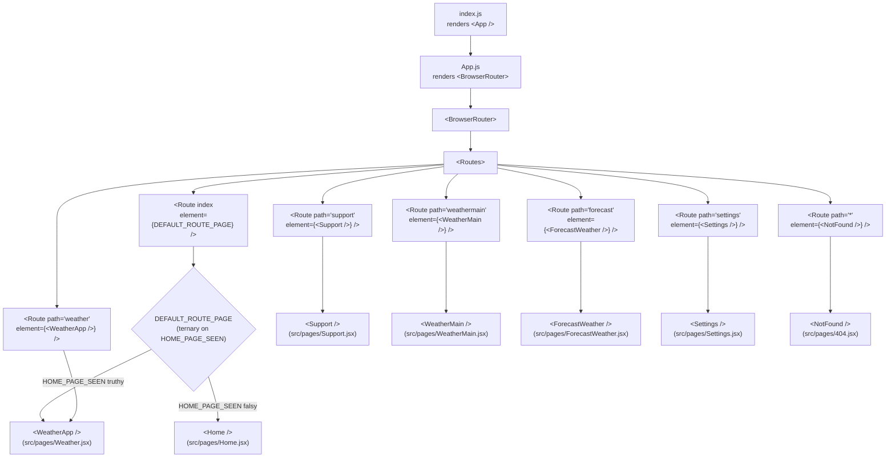

# Routing Overview

> **Comprehensive route reference for the React Weather Application.** This document is the first stop for contributors who want to understand "what routes exist in this app and which component handles each". It enumerates the seven routes declared in `src/App.js`, documents the `BrowserRouter` mount point and the page component imports, summarizes the conditional index-route ternary, explains the wildcard 404 catch-all, and includes a Mermaid `flowchart TD` of the route topology.
>
> **See also:** [Conditional Routing](./conditional-routing.md) for the index-route ternary; [Navigation Mechanisms](./navigation-mechanisms.md) for the helper that performs in-app redirects; [Route Guards](./route-guards.md) for guarded pages; [Page Redirects](./page-redirects.md) for the exhaustive redirect catalog.

---

## Table of Contents

1. [Overview](#1-overview)
2. [The BrowserRouter Mount Point](#2-the-browserrouter-mount-point)
3. [The Route Table](#3-the-route-table)
4. [Page Component Imports](#4-page-component-imports)
5. [Index Route Conditional](#5-index-route-conditional)
6. [Wildcard 404 Route](#6-wildcard-404-route)
7. [Route Topology Diagram](#7-route-topology-diagram)
8. [Source Citations](#8-source-citations)

---

## 1. Overview

The React Weather Application is a single-page application (SPA) built on **React 18.3.1** that uses **`react-router-dom` v6.22.3** for declarative client-side routing. Every URL pattern the application recognises maps to exactly one React page component, and that mapping is defined in a single, easy-to-audit location: `src/App.js`. There are **no nested `<Routes>` components, no route configuration objects, and no use of the `createBrowserRouter` data-router API** — the entire routing surface is the JSX tree at `src/App.js:19-31`.

At a high level the codebase declares **seven routes**:

- **One conditional index route** at `/` that mounts either `<Home />` (first-time users) or `<WeatherApp />` (returning users), depending on whether the `HOME_PAGE_SEEN` flag is present in `localStorage`. The branching logic is documented in detail in [Conditional Routing](./conditional-routing.md).
- **Five named routes** at `/support`, `/weather`, `/weathermain`, `/forecast`, and `/settings`, each mounting a single, fixed page component.
- **One wildcard `*` route** that mounts the `NotFound` component for any URL not matched by an earlier route. See [§6](#6-wildcard-404-route) for the (deliberately) unusual redirect destination of `/weather` rather than `/`.

The full table of routes lives in [§3 below](#3-the-route-table).

The React mount path is straightforward: `src/index.js` renders `<App />` inside `<React.StrictMode>`, and `App.js` mounts `<BrowserRouter>` containing the `<Routes>` block. There is no provider tree between `<App />` and `<BrowserRouter>` — the router context is the outermost wrapper around all rendered pages. See [§2](#2-the-browserrouter-mount-point) for the full mount chain.

> For the historical (system-level) view of the routing surface, see [Technical Specifications §7.6.1](../../blitzy/documentation/Technical%20Specifications.md). The present document is intended as the contributor-facing routing reference; the existing technical specification is referenced for context and **not duplicated** here.

---

## 2. The BrowserRouter Mount Point

This section documents where the `BrowserRouter` lives and how the React tree assembles around it.

### 2.1 React Mount Chain

The React tree mounts as follows:

1. **`src/index.js:7`** — `const root = ReactDOM.createRoot(document.getElementById('root'));` creates the React 18 concurrent root attached to the `#root` element in `public/index.html`.
2. **`src/index.js:8-12`** — renders `<App />` inside `<React.StrictMode>`:

   ```jsx
   root.render(
     <React.StrictMode>
       <App />
     </React.StrictMode>
   );
   ```

3. **`src/App.js:20`** — `App` returns `<BrowserRouter>` as the outermost element of its return statement (with `<Routes>` and the seven `<Route>` declarations nested inside).

There is no other provider, no Redux store, no React Context wrapper, and no theme provider between `<App />` and `<BrowserRouter>`. Anything that needs router context must live inside the `<Routes>` tree.

### 2.2 Why `BrowserRouter`

`react-router-dom` v6 ships several router types: `BrowserRouter`, `HashRouter`, `MemoryRouter`, and the data-router `createBrowserRouter`. This codebase uses `BrowserRouter`, which:

- **Uses the HTML5 History API** (`pushState` / `replaceState` / `popstate`) for in-app transitions when those transitions are routed through React Router. Note: this codebase performs most navigation via the custom `navigate(page)` helper, which assigns `window.location.href` and triggers a full page reload rather than using the History API. See [Navigation Mechanisms](./navigation-mechanisms.md) for the full mechanism inventory.
- **Produces clean URLs without hash fragments** (e.g., `/weather`, not `/#/weather`). This is an SEO-friendly format and works seamlessly with the production deployment.
- **Requires the deployed environment to serve `index.html` for all unknown URLs.** The live Vercel deployment is configured to do this, so a hard navigation to `/weather` returns the `index.html` shell which then bootstraps `App.js` and resolves the route in the React tree.

### 2.3 Code Excerpt

The `<BrowserRouter>` JSX tree is reproduced verbatim below from `src/App.js:19-31`:

```jsx
  return (
    <BrowserRouter>
      <Routes>
        <Route index element={DEFAULT_ROUTE_PAGE} />
        <Route path="support" element={<Support />} />
        <Route path="weather" element={<WeatherApp />} />
        <Route path="weathermain" element={<WeatherMain />} />
        <Route path="forecast" element={<ForecastWeather />} />
        <Route path="settings" element={<Settings />} />
        <Route path="*" element={<NotFound />} />
      </Routes>
    </BrowserRouter>
  );
}
```

Annotations:

- **`<BrowserRouter>`** is the outermost router context. It has no props in this codebase — it uses defaults (no custom `basename`, no custom `window`, no future flags).
- **`<Routes>`** is the v6 replacement for v5's `<Switch>`. It examines its children, picks the best matching route, and renders that route's `element`. Unlike v5's `<Switch>`, `<Routes>` does ranked matching so that a more specific path takes precedence over a less specific one regardless of declaration order — though in this codebase, the routes do not overlap, so order is not significant.
- **Each `<Route>`** element declares one URL pattern via the `path` prop (or the `index` prop for the index route) and the React element to mount when that URL matches via the `element` prop. None of the routes declare children; there is no nested routing.

> **Source:** `src/App.js:19-31`

---

## 3. The Route Table

The table below enumerates every route declared in `src/App.js`. The columns are: route number, route path, the component mounted when the route matches, the file that defines that component, the qualifier under which the component mounts, whether the index route is conditional, whether the route enforces a guard before rendering, and the source line(s) the route is declared on.

| #   | Route Path     | Mounted Component        | Component File                                  | Mounted As               | Conditional?                                | Has Guard?                                                                                          | Source                  |
| --- | -------------- | ------------------------ | ----------------------------------------------- | ------------------------ | ------------------------------------------- | --------------------------------------------------------------------------------------------------- | ----------------------- |
| 1   | `/` (index)    | `Home` or `WeatherApp`   | `src/pages/Home.jsx` or `src/pages/Weather.jsx` | Conditional via ternary  | **Yes** — based on `db.get("HOME_PAGE_SEEN")` | Indirect (renders `WeatherApp` only when the flag is truthy; `WeatherApp` itself has a guard)       | `src/App.js:13-17, 22`  |
| 2   | `/support`     | `Support`                | `src/pages/Support.jsx`                         | Always                   | No                                          | No                                                                                                  | `src/App.js:23`         |
| 3   | `/weather`     | `WeatherApp`             | `src/pages/Weather.jsx`                         | Always                   | No                                          | **Yes** — `src/pages/Weather.jsx:36-38`                                                             | `src/App.js:24`         |
| 4   | `/weathermain` | `WeatherMain`            | `src/pages/WeatherMain.jsx`                     | Always                   | No                                          | No                                                                                                  | `src/App.js:25`         |
| 5   | `/forecast`    | `ForecastWeather`        | `src/pages/ForecastWeather.jsx`                 | Always                   | No                                          | **Yes** — `src/pages/ForecastWeather.jsx:44-46`                                                     | `src/App.js:26`         |
| 6   | `/settings`    | `Settings`               | `src/pages/Settings.jsx`                        | Always                   | No                                          | No                                                                                                  | `src/App.js:27`         |
| 7   | `*` (wildcard) | `NotFound`               | `src/pages/404.jsx`                             | Always                   | No                                          | No                                                                                                  | `src/App.js:28`         |

> **Note on path formatting:** React Router v6 accepts path segments without leading slashes when nested inside a parent router. The paths in this codebase (`"support"`, `"weather"`, `"weathermain"`, `"forecast"`, `"settings"`) become `/support`, `/weather`, `/weathermain`, `/forecast`, `/settings`, respectively, when matched against the browser URL pathname. There is no `basename` configured on `<BrowserRouter>`, so the routes mount at the root of the URL.
>
> **Note on the `*` wildcard:** The `*` path matches any URL not matched by an earlier route. This is equivalent to v5's "no match" route. The wildcard catches both unknown URLs (e.g., a user typing `/random-path` directly into the browser) and intermediate paths the user might construct manually. See [§6](#6-wildcard-404-route) for the wildcard handler's behavior.
>
> **Note on the index conditional:** The route at row 1 mounts a precomputed JSX element (`DEFAULT_ROUTE_PAGE`) that is computed by a ternary on `homePageSeen` *before* the `<Routes>` tree is rendered. See [Conditional Routing](./conditional-routing.md) for the full ternary explanation, including the read path through `localStorage`, the first-time-vs-returning-user sequence diagrams, and the onboarding state machine.
>
> **Note on guards:** Routes 3 and 5 (`/weather` and `/forecast`) have an imperative guard at the top of the page component that calls `navigate("/")` if `HOME_PAGE_SEEN` is falsy. The guard is a synchronous `localStorage` read at the top of the component body, executed at every render. See [Route Guards](./route-guards.md) for the full guard pattern documentation.

---

## 4. Page Component Imports

The top of `src/App.js` imports every page component, the three required `react-router-dom` primitives, the `db` singleton (for the conditional ternary), and the side-effect autoload module. Lines 1–10 are reproduced verbatim:

```js
import Home from "./pages/Home";
import Support from "./pages/Support";
import { Routes, Route, BrowserRouter } from "react-router-dom";
import WeatherApp from "./pages/Weather";
import WeatherMain from "./pages/WeatherMain";
import NotFound from "./pages/404";
import ForecastWeather from "./pages/ForecastWeather";
import Settings from "./pages/Settings";
import { db } from "./backend/app_backend";
import "./autoload";
```

The table below maps each import to its routing role:

| Import                                | Source                       | Role                                                                                                                                                                                                                                |
| ------------------------------------- | ---------------------------- | ----------------------------------------------------------------------------------------------------------------------------------------------------------------------------------------------------------------------------------- |
| `Home`                                | `./pages/Home`               | Default-import of the function component used for the **falsy** branch of the index-route ternary (first-time-user landing page); not mounted by any other route                                                                    |
| `Support`                             | `./pages/Support`            | Default-import of the `Support` component mounted at `/support` (route 2). See the naming-quirk note below                                                                                                                          |
| `Routes`, `Route`, `BrowserRouter`    | `react-router-dom`           | Named imports of the three routing primitives used in the JSX tree at `src/App.js:19-31`                                                                                                                                            |
| `WeatherApp`                          | `./pages/Weather`            | Default-import of the function component used for **both** the truthy branch of the index-route ternary AND for the explicit `/weather` route (route 3)                                                                             |
| `WeatherMain`                         | `./pages/WeatherMain`        | Default-import of the component mounted at `/weathermain` (route 4)                                                                                                                                                                 |
| `NotFound`                            | `./pages/404`                | Default-import of the wildcard handler mounted at `*` (route 7)                                                                                                                                                                     |
| `ForecastWeather`                     | `./pages/ForecastWeather`    | Default-import of the component mounted at `/forecast` (route 5)                                                                                                                                                                    |
| `Settings`                            | `./pages/Settings`           | Default-import of the component mounted at `/settings` (route 6)                                                                                                                                                                    |
| `db`                                  | `./backend/app_backend`      | Named import of the `Database` singleton (an instance of `Database` from `src/backend/database.js`) used to read `HOME_PAGE_SEEN` for the conditional index route. See [Conditional Routing](./conditional-routing.md) for details. |
| `./autoload`                          | (side-effect import)         | Side-effect import that registers global asset autoloading; **not directly routing-related** but listed for completeness because it appears in the imports block of the routing file                                                |

> **Source:** `src/App.js:1-10`

### 4.1 Note on the Naming Quirk for `Support`

> **Note:** The file `src/pages/Support.jsx` default-exports a function component whose **internal variable name is `Settings`** (line 6: `const Settings = () => { ... }`; line 108: `export default Settings;`). Despite the misleading internal name, this default export is imported into `src/App.js:2` as `Support` (since default imports may be aliased to any name at the import site) and is mounted at `/support`. Routing works correctly because it relies on the import name in the consumer file (`App.js`), not the export's internal variable name in the source file (`Support.jsx`). This is a code smell that should not be "fixed" without auditing every downstream artifact (documentation, comments, error messages); for additional context see Technical Specifications §7.6.7 in [`blitzy/documentation/Technical Specifications.md`](../../blitzy/documentation/Technical%20Specifications.md).

---

## 5. Index Route Conditional

This section briefly summarizes the conditional ternary that governs the index route. The **canonical source** for this behaviour, including read-path tracing, sequence diagrams, and the onboarding state machine, is [Conditional Routing](./conditional-routing.md). The present section covers only the surface mechanics so contributors can read the route table in [§3](#3-the-route-table) without confusion.

### 5.1 Code Excerpt

Lines 12–17 of `src/App.js` are reproduced verbatim:

```js
function App() {
  let homePageSeen = db.get("HOME_PAGE_SEEN");
  let DEFAULT_ROUTE_PAGE;
  homePageSeen
    ? (DEFAULT_ROUTE_PAGE = <WeatherApp />)
    : (DEFAULT_ROUTE_PAGE = <Home />);
```

### 5.2 Behaviour Summary

In one short paragraph:

- The function component `App` reads `HOME_PAGE_SEEN` from `localStorage` via the `db` singleton (`src/backend/app_backend.js`, which exports `let db = new Database();`).
- A ternary expression assigns either `<WeatherApp />` (when `homePageSeen` is truthy) or `<Home />` (when it is falsy) to the local variable `DEFAULT_ROUTE_PAGE`.
- The index `<Route>` (`src/App.js:22`) consumes this variable as its `element` prop: `<Route index element={DEFAULT_ROUTE_PAGE} />`.
- The result: visiting `/` mounts a different component depending on the user's onboarding state at the moment `App()` runs.

Because `App()` runs every time the React tree re-mounts — and every internal navigation in this codebase is a full page reload (see [Navigation Mechanisms](./navigation-mechanisms.md)) — the `homePageSeen` value is re-read on every transition. This is implementation-relevant: a user who completes onboarding does **not** see a stale `<Home />` after their first redirect to `/weather`, because by that point the React tree has been fully re-mounted.

> **Source:** `src/App.js:12-17, 22`

### 5.3 Pointer

> See [Conditional Routing](./conditional-routing.md) for:
>
> - The complete read path from `localStorage.getItem` through `Database.get()` to `App.js:13`
> - First-time-user vs. returning-user sequence diagrams
> - The onboarding state machine (`NotOnboarded` → `ShowingModal` → `ValidatingInput` → `Writing` → `Onboarded`)
> - The factory-reset cycle that returns a user to the falsy branch (`db.destroy()` from `src/backend/settings.js` followed by a redirect to `/`)

---

## 6. Wildcard 404 Route

This section documents the wildcard `*` handler that catches any URL not matched by an earlier route.

### 6.1 Declaration

Line 28 of `src/App.js` declares the wildcard route:

```jsx
        <Route path="*" element={<NotFound />} />
```

### 6.2 Behaviour

- The path `*` matches **any URL not matched by an earlier route.** In a v6 `<Routes>` block, `*` acts as a catch-all and is the canonical pattern for 404 handling.
- The mounted component is `NotFound`, default-imported from `src/pages/404.jsx` (see [§4](#4-page-component-imports), row 6 of the import table).
- Because the React Router routes are ranked, the wildcard is only chosen when no other declaration matches — visiting `/weather` mounts `<WeatherApp />`, not `<NotFound />`, even though `*` would technically match `/weather` in isolation.

### 6.3 What `NotFound` Does

Lines 5–10 of `src/pages/404.jsx` are reproduced verbatim:

```jsx
const NotFound = ()=>{
    
    const returnHome = ()=>{
        navigate("/weather");
    }
    return (
```

Annotations:

- The component renders a **"not found!" message and a "Home" button** (the rendered JSX is at `src/pages/404.jsx:11-23`).
- When the user clicks the button, `navigate("/weather")` redirects to the weather dashboard (`Source: src/pages/404.jsx:7-9`).
- The `navigate` symbol is imported from `src/inc/scripts/utilities.js` (see `src/pages/404.jsx:3`: `import navigate from "../inc/scripts/utilities";`). This is the **custom imperative helper** that performs `window.location.href = ${page}`, **not** React Router's `useNavigate`. See [Navigation Mechanisms](./navigation-mechanisms.md) for the helper's contract.
- **Note the redirect destination:** the wildcard handler redirects to `/weather`, **not** to `/`. This bypasses the conditional onboarding flow at the index route. A user without `HOME_PAGE_SEEN` who reaches a 404 would be sent to `/weather`, where the route guard at `src/pages/Weather.jsx:36-38` would then redirect them to `/`. The effective behavior for a non-onboarded user is therefore `404 → /weather → / (Home)` — a two-hop chain that ultimately lands on the onboarding page. For full coverage of this redirect path see [Page Redirects §5.7](./page-redirects.md). For the guard that issues the second hop, see [Route Guards](./route-guards.md).

> **Source:** `src/App.js:28`, `src/pages/404.jsx:1-25`

---

## 7. Route Topology Diagram

The Mermaid `flowchart TD` (top-down) below shows the complete routing topology — from `index.js` through `App.js` to each of the seven `<Route>` declarations and their mounted page components. The conditional index route is shown explicitly as a decision diamond labelled `DEFAULT_ROUTE_PAGE`.



> **Diagram reading guide:**
>
> - The flow starts at `index.js` (top), which renders `<App />` inside `<React.StrictMode>`.
> - `<App />` mounts `<BrowserRouter>`, which mounts `<Routes>` containing the seven `<Route>` declarations.
> - The first `<Route>` (`index`) consumes the `DEFAULT_ROUTE_PAGE` variable, which is the result of the ternary on `HOME_PAGE_SEEN`. When the flag is truthy, the route mounts `<WeatherApp />`; otherwise it mounts `<Home />`.
> - The other six `<Route>` declarations always mount the same component as shown — there is no conditional logic on routes 2–7.
> - Note that `<WeatherApp />` is the target of two arrows: one from `R1` (via the truthy branch of `DRP`) and one from `R3` (the explicit `/weather` route). This reflects the fact that the same component is the index route's truthy branch *and* the named `/weather` route.
>
> **For the redirect graph (which page redirects to which other page),** see [Page Redirects](./page-redirects.md). The topology diagram here only shows declarative `route → component` bindings; it does not show the imperative `navigate(...)` redirects that wire pages together at runtime.

---

## 8. Source Citations

The following table lists every source file referenced by this document, with line ranges for the cited content. The citation format is `Source: <repository-relative path>:<line range>`.

- `Source: src/App.js:1-10` — Page component imports and `react-router-dom` import (covered in [§4](#4-page-component-imports))
- `Source: src/App.js:12-17` — `App` function declaration with conditional ternary (covered in [§5.1](#51-code-excerpt))
- `Source: src/App.js:19-31` — Full `<BrowserRouter>` + `<Routes>` JSX tree (covered in [§2.3](#23-code-excerpt))
- `Source: src/App.js:22-28` — Seven `<Route>` declarations (covered in [§3](#3-the-route-table))
- `Source: src/index.js:1-12` — React mount path: `ReactDOM.createRoot` and `<App />` render inside `<React.StrictMode>` (covered in [§2.1](#21-react-mount-chain))
- `Source: src/pages/Home.jsx:1-133` — Default-imported as `Home` for the index-falsy branch
- `Source: src/pages/Weather.jsx:1-425` — Default-imported as `WeatherApp` for the index-truthy branch and the `/weather` route (note: contains a guard at lines 36–38; see [Route Guards](./route-guards.md))
- `Source: src/pages/WeatherMain.jsx:1-148` — Default-imported as `WeatherMain` for `/weathermain`
- `Source: src/pages/ForecastWeather.jsx:1-372` — Default-imported as `ForecastWeather` for `/forecast` (note: contains a guard at lines 44–46; see [Route Guards](./route-guards.md))
- `Source: src/pages/Settings.jsx:1-159` — Default-imported as `Settings` for `/settings`
- `Source: src/pages/Support.jsx:1-108` — Default-imported as `Support` for `/support` (note: file's internal variable name is `Settings`, but routing relies on the import name; see [§4.1](#41-note-on-the-naming-quirk-for-support))
- `Source: src/pages/404.jsx:1-25` — Default-imported as `NotFound` for the wildcard `*` route (covered in [§6](#6-wildcard-404-route))
- `Source: src/backend/app_backend.js:1-3` — `db` singleton imported by `App.js` for the conditional ternary
- `Source: package.json:21` — Declares `react-router-dom@^6.22.3`

### 8.1 Cross-References to Sibling Documentation

- [Conditional Routing](./conditional-routing.md) — full coverage of the `HOME_PAGE_SEEN` ternary and the onboarding flow (referenced from [§3](#3-the-route-table) and [§5](#5-index-route-conditional))
- [Navigation Mechanisms](./navigation-mechanisms.md) — explanation of the `navigate(page)` helper that performs `window.location.href` assignment (referenced from [§2.2](#22-why-browserrouter), [§5.2](#52-behaviour-summary), and [§6.3](#63-what-notfound-does))
- [Route Guards](./route-guards.md) — coverage of the imperative guards in `Weather.jsx:36-38` and `ForecastWeather.jsx:44-46` (referenced from [§3](#3-the-route-table) and [§6.3](#63-what-notfound-does))
- [Page Redirects](./page-redirects.md) — exhaustive catalog of every internal, external, and fallback redirect (referenced from [§6.3](#63-what-notfound-does) and [§7](#7-route-topology-diagram))
- [Routing README](./README.md) — entry point for the routing documentation set

### 8.2 Cross-Reference to External Technical Specification

- [Technical Specifications §7.6.1](../../blitzy/documentation/Technical%20Specifications.md) — historical (system-level) view of the routing surface; referenced for context, **not duplicated** here
- [Technical Specifications §7.6.7](../../blitzy/documentation/Technical%20Specifications.md) — additional context on the `Support.jsx` naming quirk; referenced from [§4.1](#41-note-on-the-naming-quirk-for-support)
- [Technical Specifications §7.11](../../blitzy/documentation/Technical%20Specifications.md) — existing user-flow diagrams; the diagrams here are routing-specific and complement (rather than replace) the existing user-flow material

---

> **End of Routing Overview.** For the next document in the recommended reading order (per the routing [README](./README.md)), continue to [Navigation Mechanisms](./navigation-mechanisms.md).
