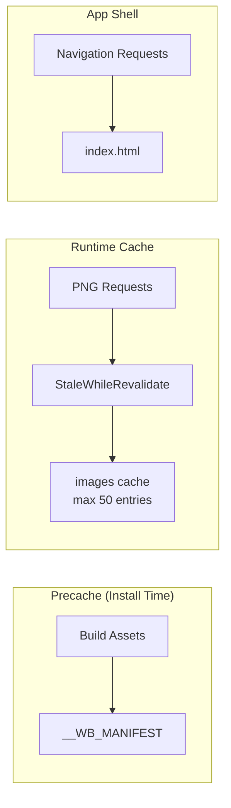
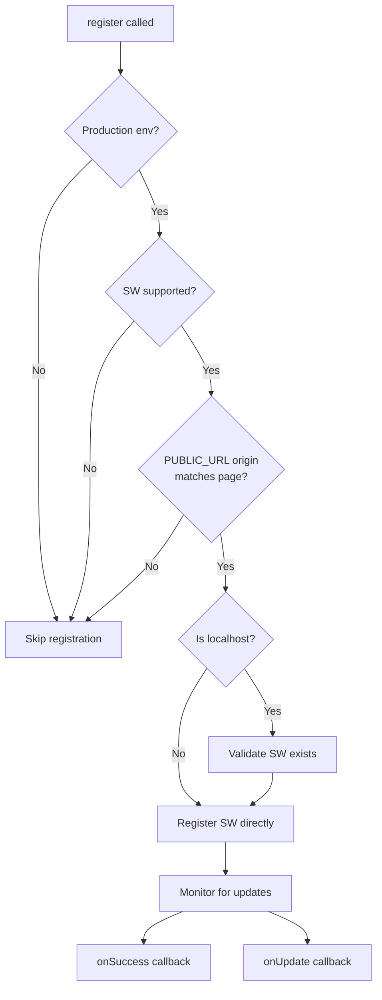
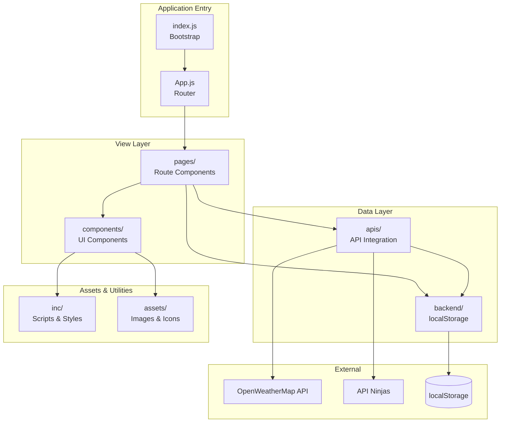

# Source Code Overview

Client application source code for the Awesome Weather Application - a Progressive Web App (PWA) built with React.

## Overview

The `src/` directory contains all client-side source code for the weather application. This React-based Single Page Application (SPA) provides:

- **Real-time Weather Data**: Current conditions and 5-day forecasts via OpenWeatherMap API
- **City Search**: Location search with autocomplete via API Ninjas
- **Browser Geolocation**: Automatic location detection
- **Offline Support**: PWA with service worker caching
- **Persistent Settings**: LocalStorage-based user preferences

**Architecture Pattern**: React functional components with hooks, jQuery for DOM manipulation, Bootstrap for styling, and a localStorage-based persistence layer.

---

## Directory Structure

| Directory | Purpose | Key Exports |
|-----------|---------|-------------|
| [`apis/`](apis/README.md) | Weather API integration layer | `getCurrentWeather`, `getGeolocation`, `getWeatherForecast`, API utilities |
| [`assets/`](assets/README.md) | Images, icons, and weather condition SVGs | Static image assets, 31 weather condition SVG icons |
| [`backend/`](backend/README.md) | LocalStorage persistence layer | `Database` class, `db` singleton, settings functions |
| [`components/`](components/README.md) | Reusable React UI components | `Button`, `Footer`, `FooterNav`, `Spinner`, weather cards |
| `fonts/` | Custom font files | Poppins regular (400) and bold (700) TTF fonts |
| [`inc/`](inc/README.md) | Static scripts and CSS styles | Date utilities, DOM init, CSS design tokens, animations |
| [`pages/`](pages/README.md) | Route-level page components | `Home`, `Weather`, `WeatherMain`, `ForecastWeather`, `Settings`, `Support`, `NotFound` |

---

## Application Entry Points

### index.js

**Purpose**: Application bootstrap and React root initialization.

**Source:** `src/index.js`

**Key Responsibilities:**
- Creates React root using `ReactDOM.createRoot()` targeting `#root` element
- Wraps the application in `React.StrictMode` for development warnings
- Configures and registers the service worker for PWA functionality
- Initializes web vitals performance monitoring

**Service Worker Configuration:**

```javascript
const config = {
  scope: "/",
  registerOptions: {
    updateViaCache: "none"  // Always fetch fresh SW script
  },
  onSuccess: (registration) => {
    console.log("Service worker registration successful:", registration);
  },
  onUpdate: (registration) => {
    console.log("Service worker update available:", registration);
  },
};
```

| Config Option | Value | Description |
|---------------|-------|-------------|
| `scope` | `"/"` | Service worker controls all routes from root |
| `updateViaCache` | `"none"` | Bypass cache when fetching SW script updates |
| `onSuccess` | Callback | Triggered on first-time SW installation |
| `onUpdate` | Callback | Triggered when new SW version is available |

---

### App.js

**Purpose**: Root application component with React Router configuration.

**Source:** `src/App.js`

**Key Responsibilities:**
- Configures client-side routing using `BrowserRouter` and `Routes`
- Implements conditional landing page logic based on onboarding state
- Imports `autoload.js` for global asset loading

**Landing Page Logic:**

The application checks the `HOME_PAGE_SEEN` localStorage key via the `db` singleton:
- **First-time visitors**: Show `Home` component (onboarding)
- **Returning users**: Show `WeatherApp` component directly

```javascript
let homePageSeen = db.get("HOME_PAGE_SEEN");
let DEFAULT_ROUTE_PAGE;
homePageSeen
  ? (DEFAULT_ROUTE_PAGE = <WeatherApp />)
  : (DEFAULT_ROUTE_PAGE = <Home />);
```

**Route Configuration:**

| Route | Component | Description |
|-------|-----------|-------------|
| `/` (index) | `Home` or `WeatherApp` | Dynamic based on `HOME_PAGE_SEEN` flag |
| `/support` | `Support` | Developer info and about page |
| `/weather` | `WeatherApp` | Main weather display dashboard |
| `/weathermain` | `WeatherMain` | Detailed weather metrics view |
| `/forecast` | `ForecastWeather` | 5-day weather forecast |
| `/settings` | `Settings` | User preferences management |
| `/*` (catch-all) | `NotFound` | 404 error page |

---

## Core Files

### autoload.js

**Purpose**: Side-effect import aggregator for global styles and scripts.

**Source:** `src/autoload.js`

This module serves as a central import point for assets needed application-wide. It is imported once in `App.js` to ensure all global resources are bundled.

**Imports:**

| Category | Asset | Description |
|----------|-------|-------------|
| External | `bootstrap/dist/css/bootstrap.min.css` | Bootstrap CSS framework |
| External | `bootstrap/dist/js/bootstrap.js` | Bootstrap JavaScript bundle |
| Internal | `./inc/styles/style.css` | Custom CSS properties, font definitions, theming |
| Internal | `./inc/scripts/script.js` | jQuery DOM init (spinner hiding) |
| Internal | `./inc/styles/three-dots.css` | CSS loading spinner animation |

---

### service-worker.js

**Purpose**: Workbox-powered Service Worker for PWA offline functionality.

**Source:** `src/service-worker.js`

**Key Features:**

| Feature | Implementation | Description |
|---------|----------------|-------------|
| Precaching | `precacheAndRoute(self.__WB_MANIFEST)` | Caches build assets at install time |
| App Shell | `registerRoute()` with navigation handler | Serves `index.html` for SPA routing |
| Image Caching | `StaleWhileRevalidate` strategy | Runtime caching for PNG images |
| Skip Waiting | `message` event listener | Force-activate waiting service worker |

**Caching Strategies:**



**App Shell Routing Logic:**
- Only handles `navigate` mode requests (page navigations)
- Excludes paths starting with `/_` (reserved for API routes)
- Excludes requests with file extensions (static assets)
- Returns `index.html` for all other navigations (SPA routing)

---

### serviceWorkerRegistration.js

**Purpose**: Service Worker registration and lifecycle management.

**Source:** `src/serviceWorkerRegistration.js`

**Exports:**

| Export | Type | Description |
|--------|------|-------------|
| `register(config)` | Function | Registers SW with optional callbacks |
| `unregister()` | Function | Unregisters the active service worker |

**Registration Flow:**



**Key Behaviors:**
- **Production-only**: Skipped in development environment
- **Localhost detection**: Supports `localhost`, `[::1]`, and `127.x.x.x` addresses
- **Origin validation**: Prevents CDN conflicts by checking PUBLIC_URL origin
- **Update detection**: Triggers callbacks when new SW versions are available

---

## Module Documentation

Detailed documentation for each source module:

| Module | Documentation | Description |
|--------|---------------|-------------|
| APIs | [apis/README.md](apis/README.md) | Weather API integration (OpenWeatherMap, API Ninjas) |
| Backend | [backend/README.md](backend/README.md) | LocalStorage persistence layer and Database class |
| Components | [components/README.md](components/README.md) | Reusable React UI components library |
| Pages | [pages/README.md](pages/README.md) | Route-level page components |
| Inc | [inc/README.md](inc/README.md) | Static utility scripts and CSS stylesheets |
| Assets | [assets/README.md](assets/README.md) | Images, icons, and weather condition SVGs |

---

## Data Flow

The following diagram illustrates how data flows through the application modules:



**Data Flow Summary:**

1. **User Navigation**: `App.js` routes to appropriate page component
2. **Page Rendering**: Pages compose UI using shared components
3. **API Calls**: Pages trigger API functions for weather data
4. **Data Persistence**: API results cached to localStorage via backend
5. **Offline Access**: Cached data served when offline via backend module

---

## Getting Started for Developers

### Prerequisites

- **Node.js**: v14 or higher recommended (v20+ for latest features)
- **npm**: v6 or higher

### Installation

```bash
# Clone the repository
git clone https://github.com/VickyKoblinski/react-weather-app.git
cd react-weather-app

# Install dependencies (use --legacy-peer-deps for React 18 compatibility)
npm install --legacy-peer-deps
```

### Development Server

```bash
# Start development server (typically runs on http://localhost:3000)
npm run start
```

### Key Files to Explore First

For new developers, we recommend exploring files in this order:

| Order | File | Why |
|-------|------|-----|
| 1 | `src/App.js` | Understand routing and application structure |
| 2 | `src/pages/Weather.jsx` | Main weather display, see component composition |
| 3 | `src/apis/getCurrentWeather.js` | Core API integration patterns |
| 4 | `src/backend/database.js` | Data persistence abstraction |
| 5 | `src/components/footer.jsx` | Component composition patterns |

### Module Navigation Guide

| If you want to... | Go to... |
|-------------------|----------|
| Add a new API endpoint | `src/apis/` - follow patterns in `getCurrentWeather.js` |
| Create a new page/route | `src/pages/` - add component and route in `App.js` |
| Build a reusable component | `src/components/` - stateless functional components |
| Store/retrieve user data | `src/backend/` - use `db` singleton from `app_backend.js` |
| Add global styles | `src/inc/styles/` - add to `style.css` or create new file |
| Add utility functions | `src/inc/scripts/utilities.js` |

### Common Development Tasks

**Adding a new localStorage key:**

```javascript
// In your page or API file
import { db } from "../backend/app_backend";

// Store data
db.create("MY_NEW_KEY", "value");

// Retrieve data
const value = db.get("MY_NEW_KEY");

// Update data
db.update("MY_NEW_KEY", "new value");

// Delete data
db.delete("MY_NEW_KEY");
```

**Fetching weather data:**

```javascript
import { getCurrentWeather } from "../apis/getCurrentWeather";

// Fetch weather for a city
getCurrentWeather("London");
```

**Using shared components:**

```javascript
import Button from "../components/button";
import Footer from "../components/footer";

function MyPage() {
  return (
    <div>
      <Button text="Click Me" onClick={() => console.log("clicked")} />
      <Footer />
    </div>
  );
}
```

---

## Related Documentation

- [Back to Main README](../README.md) - Project overview, installation, and full documentation index
- [Public Assets](../public/README.md) - PWA configuration and static HTML
- [Shell Scripts](../scripts/README.md) - Development and deployment scripts
