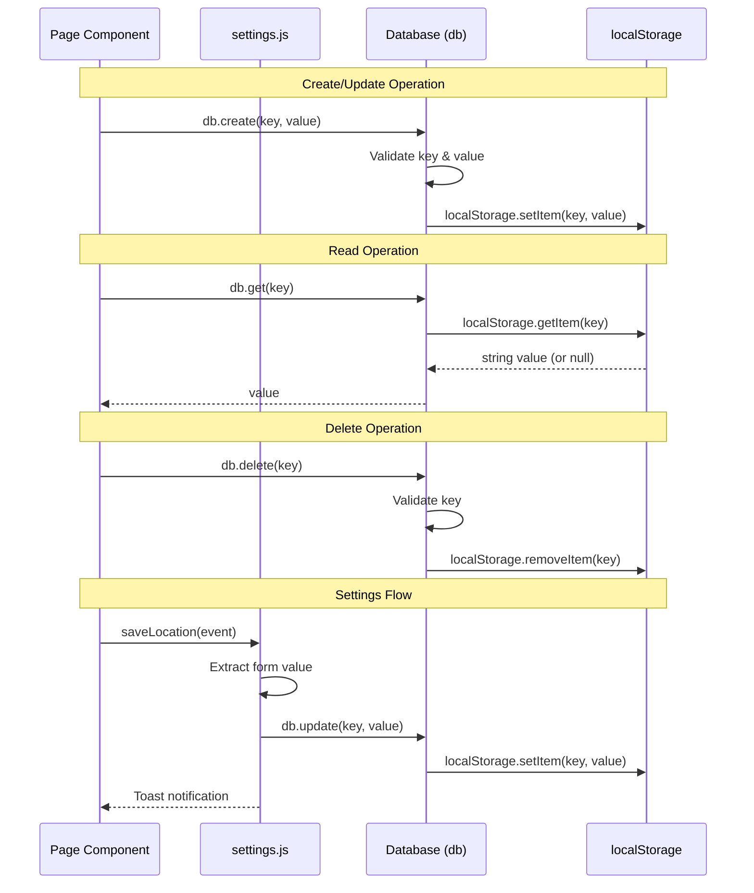

# Backend Module

LocalStorage-based persistence layer for the Awesome Weather Application.

## Overview

The backend module provides a lightweight data persistence layer that abstracts the browser's `localStorage` API. This module enables the application to:

- Cache weather data for offline access
- Store user preferences and settings
- Track onboarding state and default locations
- Persist geolocation coordinates

### Architecture Pattern

The module implements a **Singleton pattern** through `app_backend.js`, which exports a single shared `Database` instance (`db`). All components throughout the application import and use this same instance, ensuring consistent data access.

```
┌─────────────────┐     ┌─────────────────┐     ┌─────────────────┐
│   database.js   │────▶│  app_backend.js │────▶│   settings.js   │
│  (Class Def)    │     │   (Singleton)   │     │   (Functions)   │
└─────────────────┘     └─────────────────┘     └─────────────────┘
                               │
                               ▼
                        ┌─────────────────┐
                        │   localStorage  │
                        └─────────────────┘
```

## Files

| File | Purpose | Exports |
|------|---------|---------|
| `database.js` | Database class with CRUD operations over localStorage | `Database` (default) |
| `app_backend.js` | Singleton Database instance for application-wide use | `db` |
| `settings.js` | User settings management functions | `saveLocation`, `getDefaultLocation`, `restoreFactorySettings`, `trackSavedLocationWeather`, `checkTrackedLocation`, `changeWeatherUnit` |

---

## Database Class API Reference

The `Database` class provides a clean abstraction over the browser's `localStorage` API with validation and error handling.

### Constructor

```javascript
const db = new Database();
```

Creates a new Database instance with `dbName` set to `"weather-app"`.

### Methods

| Method | Parameters | Returns | Description |
|--------|------------|---------|-------------|
| `create(key, value)` | `key`: string, `value`: any | `void` | Stores a key-value pair in localStorage. Throws `Error` if key or value is undefined. |
| `get(key)` | `key`: string | `string \| null` | Retrieves value by key. Returns `null` if key doesn't exist. |
| `update(key, value)` | `key`: string, `value`: any | `void` | Updates existing key (implements upsert behavior by calling `create`). |
| `delete(key)` | `key`: string | `void` | Removes a key from localStorage. Throws `Error` if key is undefined. |
| `countItems()` | none | `number` | Returns the total count of items stored in localStorage. |
| `destroy()` | none | `void` | Clears all data from localStorage (factory reset). |

### Method Details

#### create(key, value)

Stores a key-value pair in localStorage.

**Parameters:**
- `key` (string): The storage key identifier
- `value` (any): The value to store (will be converted to string)

**Throws:** `Error` if key or value is undefined

**Example:**
```javascript
db.create('USER_NAME', 'John Doe');
db.create('WEATHER_CODE', 800);
```

#### get(key)

Retrieves a value from localStorage by its key.

**Parameters:**
- `key` (string): The storage key identifier

**Returns:** `string | null` - The stored value or null if not found

**Example:**
```javascript
const location = db.get('USER_DEFAULT_LOCATION');
if (location) {
  console.log(`Default location: ${location}`);
}
```

#### update(key, value)

Updates an existing key's value. Internally calls `create()`, implementing upsert behavior.

**Parameters:**
- `key` (string): The storage key identifier
- `value` (any): The new value to store

**Example:**
```javascript
db.update('WEATHER_UNIT', 'imperial');
```

#### delete(key)

Removes a key-value pair from localStorage.

**Parameters:**
- `key` (string): The storage key identifier

**Throws:** `Error` if key is undefined

**Example:**
```javascript
db.delete('WEATHER_FORECAST_LIST');
```

#### countItems()

Returns the total number of items stored in localStorage.

**Returns:** `number` - Count of stored items

**Example:**
```javascript
console.log(`Total stored items: ${db.countItems()}`);
```

#### destroy()

Clears all data from localStorage. Use with caution as this removes all application data.

**Example:**
```javascript
// Factory reset - removes all stored data
db.destroy();
```

---

## Settings Functions Reference

The `settings.js` module provides high-level functions for managing user preferences.

| Function | Parameters | Returns | Description |
|----------|------------|---------|-------------|
| `saveLocation(e)` | `e`: Event | `void` | Persists default location from form input with ID `#defaultLocation` |
| `getDefaultLocation()` | none | `string \| null` | Retrieves the saved default location |
| `restoreFactorySettings()` | none | `void` | Clears all localStorage and navigates to home page |
| `trackSavedLocationWeather()` | none | `void` | Toggles the location tracking preference based on checkbox state |
| `checkTrackedLocation()` | none | `boolean` | Returns whether location tracking is enabled |
| `changeWeatherUnit(e)` | `e`: Event | `void` | Updates temperature unit preference from select input |

### Function Details

#### saveLocation(e)

Saves the user's default location from a form submission.

**Parameters:**
- `e` (Event): Form submit event

**Side Effects:**
- Reads value from `#defaultLocation` input
- Stores value in `USER_DEFAULT_LOCATION` key
- Shows SweetAlert2 toast notifications

**Example:**
```jsx
<form onSubmit={saveLocation}>
  <input type="text" id="defaultLocation" placeholder="Enter city" />
  <button type="submit">Save</button>
</form>
```

#### getDefaultLocation()

Retrieves the user's saved default location.

**Returns:** `string | null` - The saved location or null

**Example:**
```javascript
const location = getDefaultLocation();
if (location) {
  getCurrentWeather(location);
}
```

#### restoreFactorySettings()

Performs a complete reset of the application by clearing all localStorage data and redirecting to the home page.

**Side Effects:**
- Calls `db.destroy()` to clear all data
- Navigates to `/` (home page)

**Example:**
```jsx
<button onClick={restoreFactorySettings}>Reset All Settings</button>
```

#### trackSavedLocationWeather()

Toggles the automatic weather tracking for saved location based on a checkbox state.

**Side Effects:**
- Reads state from `#flexSwitchCheckDefault` checkbox
- Updates `TRACK_SAVED_LOCATION_WEATHER` key
- Shows SweetAlert2 toast notifications

**Example:**
```jsx
<input 
  type="checkbox" 
  id="flexSwitchCheckDefault" 
  onChange={trackSavedLocationWeather}
/>
```

#### checkTrackedLocation()

Checks if location tracking is currently enabled.

**Returns:** `boolean` - `true` if tracking is enabled, `false` otherwise

**Example:**
```javascript
if (checkTrackedLocation()) {
  getGeolocation();
}
```

#### changeWeatherUnit(e)

Updates the temperature unit preference based on select input value.

**Parameters:**
- `e` (Event): Change event from select element

**Unit Mapping:**
- `"0"` → `"metric"` (Celsius)
- `"1"` → `"default"` (Kelvin)
- `"2"` → `"imperial"` (Fahrenheit)

**Example:**
```jsx
<select id="weatherUnitContainer" onChange={changeWeatherUnit}>
  <option value="0">Celsius (°C)</option>
  <option value="1">Kelvin (K)</option>
  <option value="2">Fahrenheit (°F)</option>
</select>
```

---

## localStorage Key Inventory

The following keys are used throughout the application for data persistence:

### User Preferences

| Key | Type | Purpose | Set By |
|-----|------|---------|--------|
| `HOME_PAGE_SEEN` | boolean | Tracks if user completed onboarding | `Home.jsx` |
| `USER_DEFAULT_LOCATION` | string | User's preferred default location | `Home.jsx`, `settings.js` |
| `TRACK_SAVED_LOCATION_WEATHER` | boolean | Enable auto-track for saved location | `Home.jsx`, `settings.js` |
| `WEATHER_UNIT` | string | Temperature unit (`metric`, `default`, `imperial`) | `Home.jsx`, `settings.js` |

### Current Weather Cache

| Key | Type | Purpose | Set By |
|-----|------|---------|--------|
| `WEATHER_LOCATION` | string | Current weather location display name | `getCurrentWeather.js` |
| `WEATHER_DEG` | number | Current temperature value | `getCurrentWeather.js` |
| `WEATHER_DESCRIPTION` | string | Weather condition description | `getCurrentWeather.js` |
| `WEATHER_CODE` | number | Weather condition code (200-804) | `getCurrentWeather.js` |
| `SUB_WEATHER_WIND_VALUE` | string | Wind speed with unit (e.g., "5.2 m/s") | `getCurrentWeather.js` |
| `SUB_WEATHER_HUMIDITY_VALUE` | string | Humidity percentage (e.g., "75 %") | `getCurrentWeather.js` |
| `SUB_WEATHER_PRESSURE_VALUE` | string | Atmospheric pressure (e.g., "1013 hPa") | `getCurrentWeather.js` |

### Geolocation Data

| Key | Type | Purpose | Set By |
|-----|------|---------|--------|
| `USER_LONGITUDE` | number | User's longitude coordinate | `getGeolocation.js` |
| `USER_LATITUDE` | number | User's latitude coordinate | `getGeolocation.js` |

### Forecast Cache (Indexed)

| Key Pattern | Type | Purpose | Set By |
|-------------|------|---------|--------|
| `WEATHER_FORECAST_TIME_{i}` | string | Forecast time for index i (0-7) | `Weather.jsx` |
| `WEATHER_FORECAST_ICON_{i}` | string | Weather code for index i (0-7) | `Weather.jsx` |
| `WEATHER_FORECAST_UNIT_{i}` | string | Temperature for index i (0-7) | `Weather.jsx` |

> **Note:** The forecast cache uses indexed keys where `{i}` ranges from 0 to 7, representing 8 forecast intervals.

---

## Data Flow Diagram



---

## Usage Examples

### Basic CRUD Operations

```javascript
import { db } from './backend/app_backend';

// Create - Store a new value
db.create('USER_NAME', 'John Doe');
db.create('WEATHER_CODE', 800);

// Read - Retrieve a value
const userName = db.get('USER_NAME');
console.log(userName); // 'John Doe'

// Update - Modify existing value
db.update('USER_NAME', 'Jane Doe');

// Delete - Remove a specific key
db.delete('USER_NAME');

// Check storage count
console.log(`Items stored: ${db.countItems()}`);

// Factory reset - Clear all data
db.destroy();
```

### Working with Settings

```javascript
import { 
  saveLocation, 
  getDefaultLocation,
  changeWeatherUnit,
  checkTrackedLocation,
  restoreFactorySettings
} from './backend/settings';

// Get saved location for initial weather load
const location = getDefaultLocation();
if (location) {
  loadWeatherFor(location);
}

// Check if location tracking is enabled
if (checkTrackedLocation()) {
  startGeolocationTracking();
}
```

### React Component Integration

```jsx
import React from 'react';
import { db } from '../backend/app_backend';
import { saveLocation, changeWeatherUnit } from '../backend/settings';

const SettingsPage = () => {
  // Check onboarding status
  const hasSeenHome = db.get('HOME_PAGE_SEEN');
  
  // Get current weather unit
  const currentUnit = db.get('WEATHER_UNIT') || 'metric';

  return (
    <div>
      {/* Location Form */}
      <form onSubmit={saveLocation}>
        <input 
          type="text" 
          id="defaultLocation" 
          defaultValue={db.get('USER_DEFAULT_LOCATION') || ''}
          placeholder="Enter default location"
        />
        <button type="submit">Save Location</button>
      </form>

      {/* Weather Unit Selector */}
      <select 
        id="weatherUnitContainer" 
        onChange={changeWeatherUnit}
        defaultValue={currentUnit === 'metric' ? '0' : currentUnit === 'imperial' ? '2' : '1'}
      >
        <option value="0">Celsius (°C)</option>
        <option value="1">Kelvin (K)</option>
        <option value="2">Fahrenheit (°F)</option>
      </select>
    </div>
  );
};

export default SettingsPage;
```

### Caching Weather Data

```javascript
import { db } from './backend/app_backend';

// Cache current weather response
const cacheWeatherData = (weatherResponse) => {
  db.create('WEATHER_LOCATION', `${weatherResponse.name} ${weatherResponse.sys.country}`);
  db.create('WEATHER_DEG', weatherResponse.main.temp);
  db.create('WEATHER_DESCRIPTION', weatherResponse.weather[0].description);
  db.create('WEATHER_CODE', weatherResponse.weather[0].id);
  db.create('SUB_WEATHER_WIND_VALUE', `${weatherResponse.wind.speed} m/s`);
  db.create('SUB_WEATHER_HUMIDITY_VALUE', `${weatherResponse.main.humidity} %`);
  db.create('SUB_WEATHER_PRESSURE_VALUE', `${weatherResponse.main.pressure} hPa`);
};

// Retrieve cached data for offline display
const getCachedWeather = () => ({
  location: db.get('WEATHER_LOCATION'),
  temperature: db.get('WEATHER_DEG'),
  description: db.get('WEATHER_DESCRIPTION'),
  code: db.get('WEATHER_CODE'),
  wind: db.get('SUB_WEATHER_WIND_VALUE'),
  humidity: db.get('SUB_WEATHER_HUMIDITY_VALUE'),
  pressure: db.get('SUB_WEATHER_PRESSURE_VALUE')
});
```

---

## Dependencies

### Internal Dependencies

None - This is a foundational module that other modules depend on.

### External Dependencies

| Package | Version | Usage |
|---------|---------|-------|
| `jquery` | ^3.7.1 | DOM manipulation in settings functions |
| `sweetalert2` | ^11.12.1 | Toast notifications for user feedback |

### Dependent Modules

The following modules import from the backend module:

- `src/apis/getCurrentWeather.js` - Weather data caching
- `src/apis/getGeolocation.js` - Coordinate storage
- `src/apis/getWeatherForecast.js` - Forecast caching
- `src/pages/Home.jsx` - Onboarding state
- `src/pages/Weather.jsx` - Weather display and caching
- `src/pages/Settings.jsx` - User preferences

---

## Related Documentation

- [Back to Main README](../../README.md)
- [API Layer Documentation](../apis/README.md) - Uses database for caching weather data
- [Pages Documentation](../pages/README.md) - Uses settings and database for persistence
- [Components Documentation](../components/README.md) - UI components that display persisted data

---

## Notes

### localStorage Limitations

- **Storage Limit:** ~5-10MB depending on browser
- **Data Type:** All values are stored as strings
- **Synchronous:** Operations block the main thread
- **Same Origin:** Data is isolated per domain

### Best Practices

1. **Check for null values** when reading from storage
2. **Parse numeric values** - `parseInt(db.get('WEATHER_CODE'))`
3. **Handle JSON data** - Use `JSON.parse()`/`JSON.stringify()` for objects
4. **Validate before storing** to prevent undefined values

### Security Considerations

- localStorage is accessible to any JavaScript on the same origin
- Do not store sensitive data (passwords, tokens, API keys)
- Data persists until explicitly cleared or browser data is deleted
