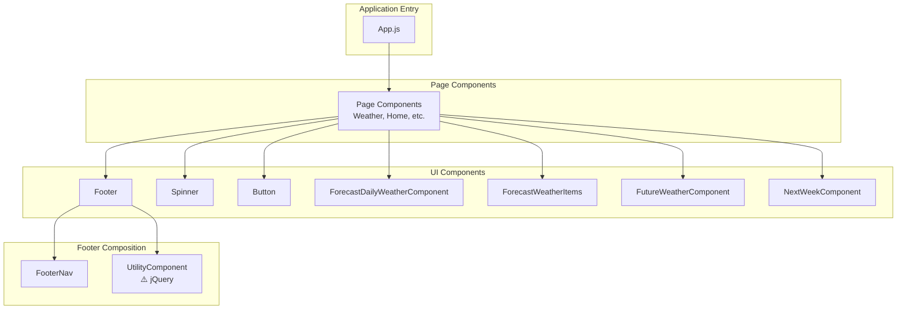

# Components

Reusable React UI components for the Awesome Weather Application.

## Overview

This module contains reusable, presentational React functional components that form the building blocks of the Weather Application's user interface.

**Key Characteristics:**
- **Pattern**: Stateless/presentational components (except UtilityComponent which uses jQuery for DOM manipulation)
- **Styling**: Bootstrap 5 utility classes combined with custom CSS from `src/inc/styles/`
- **Type Safety**: No PropTypes or TypeScript typings - relies on correct prop shapes from consumers
- **Exports**: Each file exports a single default React functional component

## Component Inventory

| Component | File | Purpose | Has Props |
|-----------|------|---------|-----------|
| Button | `button.jsx` | Reusable button element with customizable styling | Yes |
| Footer | `footer.jsx` | Main footer containing navigation and utility sections | Yes |
| FooterNav | `footerNav.jsx` | Bottom navigation bar with App/Search/Settings/Support links | Yes |
| ForecastDailyWeatherComponent | `forecastWeatherComponent.jsx` | Weather forecast card for daily view | Yes |
| ForecastWeatherItems | `forecastWeatherItems.jsx` | Individual forecast item displaying weather details | Yes |
| FutureWeatherComponent | `futureWeatherComponent.jsx` | Clickable weather preview card with time display | Yes |
| NextWeekComponent | `nextWeekComponent.jsx` | Weekly forecast row showing high/low temperatures | Yes |
| Spinner | `spinner.jsx` | Loading spinner indicator animation | No |
| UtilityComponent | `utilityFooterComponet.jsx` | Utility footer panel with expandable content | Yes |

## Props Reference

### Button

A customizable button element for user interactions.

| Prop | Type | Required | Description |
|------|------|----------|-------------|
| `style` | `Object` | No | Inline styles object for custom styling |
| `className` | `string` | No | CSS class names to apply |
| `onClick` | `Function` | No | Click handler function |
| `text` | `string` | Yes | Button label text displayed inside the button |

**Source:** `src/components/button.jsx`

---

### Footer

Main footer component that composes the navigation bar and utility panel.

| Prop | Type | Required | Description |
|------|------|----------|-------------|
| `utilityTags` | `string \| JSX` | No | Content to display in the utility section |
| `onClick` | `Function` | No | Click handler passed to FooterNav for search functionality |

**Source:** `src/components/footer.jsx`

---

### FooterNav

Bottom navigation bar providing access to main application sections.

| Prop | Type | Required | Description |
|------|------|----------|-------------|
| `onClick` | `Function` | No | Click handler for the Search button |

**Internal Navigation:**
- **App** → Navigates to `/weather` route
- **Search** → Triggers `onClick` prop handler
- **Settings** → Navigates to `/settings` route
- **Support** → Navigates to `/support` route

**Source:** `src/components/footerNav.jsx`

---

### ForecastDailyWeatherComponent

Weather forecast card component for displaying daily weather information.

| Prop | Type | Required | Description |
|------|------|----------|-------------|
| `title` | `string` | Yes | Card title (rendered as HTML title attribute for tooltip) |
| `onClick` | `Function` | No | Card click handler for navigation or interactions |
| `time` | `string` | Yes | Time display string (e.g., "3 PM", "12:00") |
| `icon` | `string` | Yes | Path to weather icon image |
| `weatherUnit` | `string` | Yes | Temperature value to display |

**Source:** `src/components/forecastWeatherComponent.jsx`

---

### ForecastWeatherItems

Individual forecast item component for weather detail displays.

| Prop | Type | Required | Description |
|------|------|----------|-------------|
| `name` | `string` | Yes | Weather description or label text |
| `icon` | `string` | Yes | Path to weather icon image |
| `weatherUnit` | `string` | Yes | Temperature value to display |

**Source:** `src/components/forecastWeatherItems.jsx`

---

### FutureWeatherComponent

Clickable weather preview card with interactive functionality.

| Prop | Type | Required | Description |
|------|------|----------|-------------|
| `onClick` | `Function` | No | Click handler for card interaction |
| `time` | `string` | Yes | Time display string |
| `icon` | `string` | Yes | Path to weather icon image |
| `weatherUnit` | `string` | Yes | Temperature value to display |

**Source:** `src/components/futureWeatherComponent.jsx`

---

### NextWeekComponent

Weekly forecast row displaying day name with high/low temperatures.

| Prop | Type | Required | Description |
|------|------|----------|-------------|
| `day` | `string` | Yes | Day name (e.g., "Monday", "Tuesday") |
| `firstUnit` | `string` | Yes | High temperature value |
| `secondUnit` | `string` | Yes | Low temperature value |
| `icon` | `string` | Yes | Path to weather icon image |

**Source:** `src/components/nextWeekComponent.jsx`

---

### Spinner

Loading spinner indicator - purely presentational with no props.

**Props:** None - this is a self-contained loading indicator component.

**Source:** `src/components/spinner.jsx`

---

### UtilityComponent

Expandable utility footer panel for additional content display.

| Prop | Type | Required | Description |
|------|------|----------|-------------|
| `tags` | `string \| JSX` | Yes | Content to render inside the utility section |

⚠️ **Warning:** This component uses jQuery for DOM manipulation which bypasses React's reconciliation process.

**Source:** `src/components/utilityFooterComponet.jsx`

---

## Component Hierarchy

The following diagram illustrates how components are composed within the application:



## Usage Examples

### Button

```jsx
import Button from '../components/button';

// Basic usage
<Button text="Get Weather" />

// With styling and click handler
<Button
  text="Search"
  className="brand-btn"
  onClick={handleSearch}
  style={{ marginTop: '10px' }}
/>

// Secondary button style
<Button
  text="Cancel"
  className="brand-btn-2"
  onClick={handleCancel}
/>
```

### Footer

```jsx
import Footer from '../components/footer';

// Basic footer
<Footer />

// With utility content and search handler
<Footer
  utilityTags={<div className="utility-content">Custom utility content</div>}
  onClick={handleSearchClick}
/>
```

### FooterNav

```jsx
import FooterNav from '../components/footerNav';

// With search click handler
<FooterNav onClick={openSearchModal} />
```

### ForecastDailyWeatherComponent

```jsx
import ForecastDailyWeatherComponent from '../components/forecastWeatherComponent';

<ForecastDailyWeatherComponent
  title="Weather forecast for Monday"
  time="3 PM"
  icon="/assets/static/sunny.svg"
  weatherUnit="25"
  onClick={() => navigateToDetails('monday')}
/>
```

### ForecastWeatherItems

```jsx
import ForecastWeatherItems from '../components/forecastWeatherItems';

<ForecastWeatherItems
  name="Sunny"
  icon="/assets/static/sunny.svg"
  weatherUnit="28"
/>
```

### FutureWeatherComponent

```jsx
import FutureWeatherComponent from '../components/futureWeatherComponent';

<FutureWeatherComponent
  time="6 PM"
  icon="/assets/static/cloudy.svg"
  weatherUnit="22"
  onClick={() => showDetailedForecast()}
/>
```

### NextWeekComponent

```jsx
import NextWeekComponent from '../components/nextWeekComponent';

<NextWeekComponent
  day="Monday"
  firstUnit="28"
  secondUnit="22"
  icon="/assets/static/sunny.svg"
/>
```

### Spinner

```jsx
import Spinner from '../components/spinner';

// Show spinner while loading
{isLoading && <Spinner />}

// Conditional rendering
{data ? <WeatherDisplay data={data} /> : <Spinner />}
```

### UtilityComponent

```jsx
import UtilityComponent from '../components/utilityFooterComponet';

<UtilityComponent
  tags={
    <div className="cmp">
      <p>Additional weather information</p>
      <button>View Details</button>
    </div>
  }
/>
```

## Styling

Components use a combination of styling approaches:

### Bootstrap 5 Utility Classes

- Layout: `d-flex`, `align-items-center`, `justify-content-center`, `flex-column`, `flex-row`
- Spacing: `m-auto`, `mx-2`, `my-2`, `p-4`, `px-4`, `py-1`
- Typography: `text-center`, `text-start`, `fw-bold`, `text-capitalize`, `text-light`, `text-muted`, `text-dark`
- Components: `rounded-3`, `shadow`, `shadow-sm`, `shadow-lg`

### Brand-Specific CSS Classes

Defined in `src/inc/styles/style.css`:

| Class | Purpose |
|-------|---------|
| `.brand-btn` | Primary button styling |
| `.brand-btn-2` | Secondary button styling |
| `.brand-btn-3` | Tertiary button styling |
| `.brand-text-mute` | Muted text color for inactive states |
| `.brand-small-text` | Small typography style |
| `.brand-small-text-2` | Alternative small typography |
| `.brand-bg-white` | White background color |
| `.brand-gradient` | Gradient background effect |
| `.footer-nav` | Footer navigation container |
| `.footer-nav-container` | Footer navigation wrapper |
| `.utility-component` | Utility panel container |
| `.future-weather-container` | Weather card container |
| `.next-week-component` | Weekly forecast row styling |

### Spinner Animation

The Spinner component uses the `dot-windmill` animation class from `src/inc/styles/three-dots.css`.

### Inline Styles

Some components apply inline styles for specific behaviors:

```javascript
// Scroll behavior in weather components
const customStyle = {
  overscrollX: "scroll",
  scrollbarWidth: "none"
};

// Z-index in Footer
const customFooterStyle = {
  zIndex: "10"
};
```

## Dependencies

### Internal Dependencies

| Dependency | Used By | Purpose |
|------------|---------|---------|
| `src/inc/scripts/utilities.js` | FooterNav | `navigate()` function for page routing |

### External Dependencies (npm)

| Package | Version | Used By | Purpose |
|---------|---------|---------|---------|
| `react` | ^18.3.1 | All components | React framework |
| `jquery` | ^3.7.1 | UtilityComponent | DOM manipulation |

## Notes and Warnings

### jQuery DOM Manipulation

⚠️ **Important:** `UtilityComponent` (`utilityFooterComponet.jsx`) uses jQuery for direct DOM manipulation:

```javascript
jQuery(($) => {
  $.noConflict();
  $(".cmp").addClass("d-none");
  $(".utility-component").removeClass("add-utility-component-height");
});
```

**Implications:**
- Calls `$.noConflict()` which affects the global `$` alias
- Manipulates DOM classes directly, bypassing React's reconciliation
- May cause inconsistencies between React state and actual DOM state
- Consider migrating to React refs (`useRef`) for future maintenance

### Accessibility Considerations

- `FooterNav` uses `role="button"` on clickable sections but lacks keyboard event handlers (`onKeyDown`, `onKeyPress`)
- SVG icons use fixed `fill="#ffffff"` colors which may not adapt to different themes
- Consider adding ARIA labels for screen readers to improve accessibility
- Weather icon `alt` attributes use generic text ("sub-weather-icon", "weather-icons")

### File Naming Notes

- `utilityFooterComponet.jsx` contains a typo ("Componet" instead of "Component")
- `nextWeekComponent.jsx` line 11 has a className typo: `brand-small-textd-block` (missing space between `text` and `d-block`)

### Temperature Display

All weather components display temperature with a superscript degree symbol:
```jsx
<p>{props.weatherUnit}<sup>o</sup></p>
```

Note: Uses the letter "o" instead of the degree symbol (°).

## Related Documentation

- [Back to Main README](../../README.md) - Project overview and setup
- [Pages Module](../pages/README.md) - Page components that consume these UI components
- [Inc Module](../inc/README.md) - Styles and utility scripts
- [Assets Module](../assets/README.md) - Weather icons and images
- [APIs Module](../apis/README.md) - Weather data fetching functions
