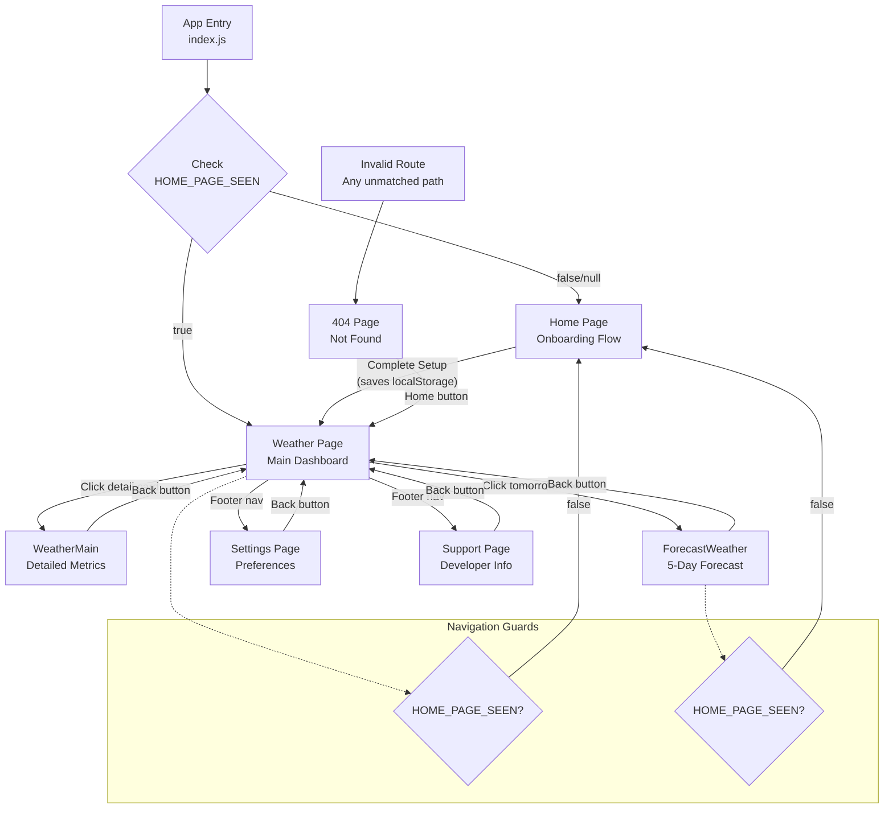

# Pages Module

Route-level page components for the Awesome Weather Application. This module contains all top-level React components that are mounted by the router to render different views of the application.

## Overview

The pages module provides the core view layer of the Weather Application, implementing:

- **Route-level Components**: Each file represents a distinct route/view in the application
- **State Management**: Components use React hooks (`useState`, `useEffect`) for local state
- **Data Persistence**: Integration with localStorage via the `../backend/app_backend` database abstraction
- **API Integration**: Weather data fetching from OpenWeatherMap API
- **Navigation Guards**: Redirect logic to ensure proper user flow (onboarding → main app)

All pages are React functional components that leverage:
- React Router DOM for navigation (configured in `App.js`)
- jQuery for DOM manipulation (mixed paradigm - see notes)
- SweetAlert2 for toast notifications and modals
- Shared UI components from `../components/`

## Route Mapping

The application routing is configured in `src/App.js` using React Router DOM v6.

| Route | Component | File | Description |
|-------|-----------|------|-------------|
| `/` | `Home` or `WeatherApp` | `Home.jsx` / `Weather.jsx` | Dynamic based on `HOME_PAGE_SEEN` localStorage flag |
| `/weather` | `WeatherApp` | `Weather.jsx` | Main weather display with current conditions |
| `/weathermain` | `WeatherMain` | `WeatherMain.jsx` | Detailed weather metrics view |
| `/forecast` | `ForecastWeather` | `ForecastWeather.jsx` | 5-day weather forecast with hourly data |
| `/settings` | `Settings` | `Settings.jsx` | Application settings and preferences |
| `/support` | `Settings`* | `Support.jsx` | Developer support and about page |
| `/*` | `NotFound` | `404.jsx` | Catch-all 404 error page |

> **Note**: `Support.jsx` exports a component named `Settings` (naming inconsistency in source code). This does not conflict with `Settings.jsx` as they are imported with different aliases in `App.js`.

### Route Configuration Example

```javascript
// From src/App.js
<BrowserRouter>
  <Routes>
    <Route index element={DEFAULT_ROUTE_PAGE} />
    <Route path="support" element={<Support />} />
    <Route path="weather" element={<WeatherApp />} />
    <Route path="weathermain" element={<WeatherMain />} />
    <Route path="forecast" element={<ForecastWeather />} />
    <Route path="settings" element={<Settings />} />
    <Route path="*" element={<NotFound />} />
  </Routes>
</BrowserRouter>
```

## Page Responsibilities

| Page | Primary Responsibilities |
|------|-------------------------|
| **Home** | First-time user onboarding, default location input via SweetAlert2 modal, initializes core localStorage keys (`HOME_PAGE_SEEN`, `USER_DEFAULT_LOCATION`, `TRACK_SAVED_LOCATION_WEATHER`, `WEATHER_UNIT`) |
| **Weather** | Main weather dashboard displaying current conditions, city search with autocomplete (API Ninjas), geolocation integration, 8-slot forecast preview, navigation hub to other pages |
| **WeatherMain** | Detailed weather metrics display (wind speed, humidity, pressure), reads cached data from localStorage, no direct API calls |
| **ForecastWeather** | 5-day weather forecast with 3-hour intervals (40 data points), day-by-day mapping functions (`mapFirstDayData` through `mapFifthDayData`), caches first day forecast data to localStorage for Weather page preview |
| **Settings** | User preference management: default location, temperature unit selection (Celsius/Kelvin/Fahrenheit), tracked location toggle, factory reset functionality |
| **Support** | Developer information, GitHub profile link, repository link, sponsorship information |
| **404 (NotFound)** | Error page for invalid routes, provides navigation back to weather page |

## State Management

### Pattern

The application uses a hybrid state management approach:
- **Local Component State**: React `useState` hooks for UI state
- **Persistent Storage**: localStorage via the `Database` class from `../backend/app_backend`
- **No Global State**: Each page manages its own state independently

### localStorage Keys by Page

#### Home.jsx (Writes on Setup)

| Key | Type | Description |
|-----|------|-------------|
| `HOME_PAGE_SEEN` | `boolean` | Flag indicating onboarding completion |
| `USER_DEFAULT_LOCATION` | `string` | User's preferred default city/location |
| `TRACK_SAVED_LOCATION_WEATHER` | `boolean` | Auto-track saved location preference |
| `WEATHER_UNIT` | `string` | Temperature unit (`"metric"` = Celsius) |

#### Weather.jsx (Reads)

| Key | Type | Description |
|-----|------|-------------|
| `HOME_PAGE_SEEN` | `boolean` | Used for navigation guard |
| `USER_DEFAULT_LOCATION` | `string` | Default location for "track saved location" button |
| `WEATHER_LOCATION` | `string` | Currently displayed location name |
| `WEATHER_DEG` | `number` | Current temperature value |
| `WEATHER_DESCRIPTION` | `string` | Weather condition description |
| `WEATHER_CODE` | `number` | Weather condition code for icon mapping |
| `SUB_WEATHER_WIND_VALUE` | `string` | Wind speed with unit |
| `SUB_WEATHER_HUMIDITY_VALUE` | `string` | Humidity percentage |
| `SUB_WEATHER_PRESSURE_VALUE` | `string` | Atmospheric pressure with unit |
| `WEATHER_FORECAST_TIME_0` through `_7` | `string` | Forecast time slots (8 items) |
| `WEATHER_FORECAST_ICON_0` through `_7` | `string` | Weather codes for icons (8 items) |
| `WEATHER_FORECAST_UNIT_0` through `_7` | `string` | Temperature values (8 items) |

#### WeatherMain.jsx (Reads)

| Key | Type | Description |
|-----|------|-------------|
| `WEATHER_LOCATION` | `string` | Location name for header |
| `WEATHER_DEG` | `number` | Temperature for main display |
| `WEATHER_DESCRIPTION` | `string` | Weather condition text |
| `SUB_WEATHER_WIND_VALUE` | `string` | Wind speed metric |
| `SUB_WEATHER_HUMIDITY_VALUE` | `string` | Humidity metric |
| `SUB_WEATHER_PRESSURE_VALUE` | `string` | Pressure metric |

#### ForecastWeather.jsx (Reads/Writes)

**Reads:**
| Key | Type | Description |
|-----|------|-------------|
| `HOME_PAGE_SEEN` | `boolean` | Navigation guard check |
| `USER_DEFAULT_LOCATION` | `string` | Location for API query |
| `USER_LATITUDE` | `number` | Latitude for geolocation-based query |
| `USER_LONGITUDE` | `number` | Longitude for geolocation-based query |
| `WEATHER_UNIT` | `string` | Temperature unit for API request |
| `WEATHER_LOCATION` | `string` | Display location in header |

**Writes (caches first day forecast for Weather page):**
| Key | Type | Description |
|-----|------|-------------|
| `WEATHER_FORECAST_TIME_0` through `_7` | `string` | Time slots for 8 forecast intervals |
| `WEATHER_FORECAST_ICON_0` through `_7` | `string` | Weather codes for 8 intervals |
| `WEATHER_FORECAST_UNIT_0` through `_7` | `string` | Temperature for 8 intervals |
| `WEATHER_FORECAST_TITLE_0` through `_7` | `string` | Weather descriptions for 8 intervals |

#### Settings.jsx (Reads/Writes via settings module)

| Key | Type | Access | Description |
|-----|------|--------|-------------|
| `USER_DEFAULT_LOCATION` | `string` | Read/Write | Default location preference |
| `TRACK_SAVED_LOCATION_WEATHER` | `string` | Read/Write | Auto-track toggle (stored as string) |
| `WEATHER_UNIT` | `string` | Write | Temperature unit selection |

## Routing Flow Diagram



## Page Files Inventory

| File | Lines | Component Export | Navigation Guard | API Calls | State Hooks |
|------|-------|------------------|------------------|-----------|-------------|
| `404.jsx` | ~26 | `NotFound` | No | No | No |
| `Home.jsx` | ~110 | `Home` | No | No | No |
| `Support.jsx` | ~108 | `Settings`* | No | No | `useState` |
| `Settings.jsx` | ~160 | `Settings` | No | No | `useState` |
| `WeatherMain.jsx` | ~148 | `WeatherMain` | No | No | No |
| `Weather.jsx` | ~425 | `WeatherApp` | Yes (`HOME_PAGE_SEEN`) | `getCurrentWeather`, `getGeolocation`, `findCity` | `useState`, `useRef`, `useEffect` |
| `ForecastWeather.jsx` | ~550 | `ForecastWeather` | Yes (`HOME_PAGE_SEEN`) | OpenWeatherMap Forecast API (direct jQuery AJAX) | `useState`, `useEffect` |

> **Note**: `Support.jsx` exports the component as `Settings` - this is a naming inconsistency in the source code.

## Common Patterns

### Navigation Guard Pattern

Pages that require onboarding completion implement a redirect guard at the component top level:

```javascript
// Weather.jsx, ForecastWeather.jsx
if (!db.get("HOME_PAGE_SEEN")) {
    navigate("/");
}
```

This pattern ensures users complete the initial setup before accessing the main application.

### jQuery DOM Manipulation

Several pages use jQuery alongside React for DOM class toggling. This is a mixed paradigm approach:

```javascript
// Weather.jsx, ForecastWeather.jsx
const addUtilityComponentHeight = () => {
    jQuery(($) => {
        $.noConflict();
        $(".cmp").removeClass("d-none");
        $(".utility-component").toggleClass("add-utility-component-height");
    });
};
```

> **Warning**: jQuery DOM changes bypass React's virtual DOM reconciliation. This can cause inconsistencies between React state and actual DOM state. Consider migrating to React refs or CSS-in-JS solutions for future maintenance.

### SweetAlert2 Toast Notifications

All user feedback uses SweetAlert2 toast notifications:

```javascript
// Common pattern across all pages
Swal.fire({
    toast: true,
    text: "Message text",
    icon: "success", // or "error", "warning", "info"
    position: "top",
    timer: 3000,
    showConfirmButton: false
});
```

### Weather Data Template Class

`ForecastWeather.jsx` uses a template class for structured weather data:

```javascript
class WeatherTemplate {
    constructor(id, time, icon, unit, title) {
        this.id = id;
        this.time = time;
        this.icon = icon;
        this.unit = unit;
        this.title = title;
    }
}
```

### Day Mapping Functions (ForecastWeather.jsx)

The forecast page maps 40 API data points (5 days × 8 intervals per day) using dedicated functions:

| Function | Array Range | Day |
|----------|-------------|-----|
| `mapFirstDayData()` | `result.list[0-7]` | Day 1 (Today) |
| `mapSecondDayData()` | `result.list[8-15]` | Day 2 |
| `mapThirdDayData()` | `result.list[16-23]` | Day 3 |
| `mapFourthDayData()` | `result.list[24-31]` | Day 4 |
| `mapFifthDayData()` | `result.list[32-39]` | Day 5 |

Each function creates `WeatherTemplate` instances and returns an array of `ForecastDailyWeatherComponent` elements.

## Dependencies

### Internal Dependencies

| Module | Import Path | Usage |
|--------|-------------|-------|
| Button | `../components/button` | Action buttons throughout pages |
| Footer | `../components/footer` | Page footer with navigation |
| FooterNav | `../components/footerNav` | Footer navigation component |
| Spinner | `../components/spinner` | Loading indicator |
| FutureWeatherComponent | `../components/futureWeatherComponent` | Weather forecast cards |
| ForecastWeatherItems | `../components/forecastWeatherItems` | Forecast list items |
| ForecastDailyWeatherComponent | `../components/forecastWeatherComponent` | Daily forecast display |
| db (Database) | `../backend/app_backend` | localStorage abstraction |
| settings module | `../backend/settings` | Settings management functions |
| getCurrentWeather module | `../apis/getCurrentWeather` | Weather API integration, icon mapping |
| getGeolocation | `../apis/getGeolocation` | Browser geolocation API |
| navigate, getCurrentDate, etc. | `../inc/scripts/utilities` | Navigation and date utilities |

### External Dependencies (npm)

| Package | Version | Usage |
|---------|---------|-------|
| `react` | ^18.3.1 | React framework core |
| `react-dom` | ^18.3.1 | DOM rendering |
| `react-router-dom` | ^6.22.3 | Client-side routing |
| `jquery` | ^3.7.1 | DOM manipulation (mixed with React) |
| `sweetalert2` | ^11.12.1 | Modal dialogs and toast notifications |

### Asset Dependencies

Pages import various SVG and PNG assets for weather icons:

```javascript
// Weather icon imports (Weather.jsx, WeatherMain.jsx, ForecastWeather.jsx)
import Thunder from "./../assets/static/thunder.svg";
import Day from "./../assets/static/day.svg";
import Drizzle from "./../assets/static/rainy-5.svg";
import Rainy from "./../assets/static/rainy-7.svg";
import Snowy from "./../assets/static/snowy-6.svg";
import FreezingRain from "./../assets/static/freezing-rain.svg";
import Misty from "./../assets/static/mist.svg";
import BrokenClouds from "./../assets/static/broken-clouds.svg";
import OvercastClouds from "./../assets/static/overcast-clouds.svg";
import ScatteredClouds from "./../assets/static/scattered-clouds.svg";
import FewClouds from "./../assets/static/few-clouds.svg";
import Haze from "./../assets/static/haze.svg";
```

## Related Documentation

- [Back to Main README](../../README.md) - Project overview and setup
- [Components Module](../components/README.md) - Reusable UI components used by pages
- [APIs Module](../apis/README.md) - Weather API integration layer
- [Backend Module](../backend/README.md) - Data persistence and settings management
- [Inc Module](../inc/README.md) - Utility functions and styles
- [Assets Module](../assets/README.md) - Images and weather icons
